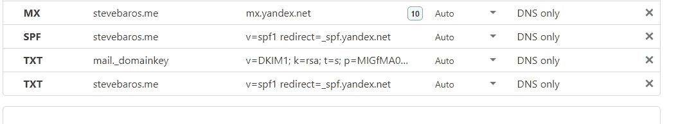
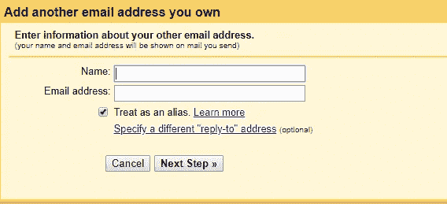

# 自由职业者 0 美元免费电子邮件存储黑客！是的，静态网站所有者也是受欢迎的。

> 原文：<https://medium.datadriveninvestor.com/0-free-mail-storage-hack-for-freelancers-yes-static-website-owners-are-welcome-as-well-9d2d8f787235?source=collection_archive---------5----------------------->

让我们在这一点上达成一致，拥有一个简单无缝但灵活的电子邮件托管计划是 b**t 中的一大痛苦，对于像我这样运营静态网站的人来说，在 GitHub 免费托管上有一个 0 美元的托管计划，为我的域名建立一个电子邮件计划总是会是一个没有几个出口的迷宫。但是等等，我已经解决了这个问题，现在我不用在邮件上花一分钱了。

Photo by [Matthias Goetzke](https://unsplash.com/@mgoetzke?utm_source=unsplash&utm_medium=referral&utm_content=creditCopyText) on [Unsplash](https://unsplash.com/s/photos/hyena?utm_source=unsplash&utm_medium=referral&utm_content=creditCopyText)

# **担忧**

## 邮件服务器(托管)

要为你的域名托管电子邮件，要么你必须建立并运行自己的服务器，这需要承担很大的责任，包括安全性、正常运行时间、可靠性、可伸缩性，并不断检查 https://www.mail-tester.com/的 T4，以确保你的通信不会一直停留在垃圾邮件箱中。

或者，你可以购买一个托管邮件解决方案，比如 Gsuite、Rackspace、Microsoft Mail online、[等](https://www.pcmag.com/roundup/360593/the-best-hosted-email-providers)。

但是，如果你是一个自由职业者(在任何工作领域)，后者不适合你的口袋，但你还没有成熟到足以承担自己的邮件托管责任。

## 邮件客户端(阅读和撰写邮件的应用程序)

在这个时代，用丰富的编辑控件和干净的界面来撰写电子邮件是每个人都想要的。你还需要一个邮件客户端，既可以用于网络通信，也可以用于移动通信，最好是桌面通信。

大多数免费电子邮件客户端只服务于一个单一的利基，如圆立方，这是只适用于网络。现在的人们想在旅途中做任何事情，所以没有移动版本是不可原谅的。

## 垃圾邮件/垃圾邮件过滤技术

如果你之前已经设置了邮件服务器，现在你可能已经知道了，让你的邮件到达你预定的收件人的收件箱就像是一个奇迹。这是因为 Gmail、Outlook 等顶级邮件提供商设定了很高的垃圾邮件标准。门槛高到你要把所有的框都勾上，至少 9/10 的高口碑。

# 解决方案

## Yandex 邮件—服务器

截至 2019 年，科技巨头之一 Yandex 正在提供几种互联网产品，为您的域名提供免费电子邮件托管服务**就是其中之一。Yandex 提供无限的存储空间和强大的垃圾邮件过滤器，前往[https://connect.yandex.com/mail](https://connect.yandex.com/mail)通过创建 Yandex 邮件帐户开始，稍后从导航中您将导航到[添加您的域](https://yandex.com/support/domain/setting/connect.html)链接，其中包含有关如何设置您的免费电子邮件存储域的详细文档。**

在确认您的域的所有权后，您将获得签名和密钥/记录，如 SPF、MX、DMARC 和 DKIM，您需要将它们添加到您的域 DNS 管理器中，我们将在下一步中进行讨论。但是首先，请确保您在这一步从控制面板创建了所有电子邮件帐户，并在这一步创建了电子邮件组。

## Yourdomain.com——桥

一旦你成功地在 Yandex 中添加了你的域名。现在转向你的域名的 DNS 管理系统，例如，Cloudflare，GoDaddy 等等，无论你用什么来管理你的域名的 DNS 记录。

转到 **DNS 设置**，然后添加一个新的**记录**，如下图所示。

sample DNS records obtained from Yandex

## Gmail.com——客户

在忙碌了一天设置邮件之后，最后一件事就是一个丑陋的客户端(用来阅读和撰写邮件的应用程序)。

你听说过谷歌吗？我的猜测是肯定的，我还猜测你已经使用了谷歌产品，如 Android，日历，地图，照片等！现在我假设你拥有一个由谷歌发布的电子邮件。

从[https://mail.google.com](https://mail.google.com)登录到您的电子邮件，导航到设置/帐户和导入或访问[此链接](https://mail.google.com/mail/u/0/#settings/accounts)向下滚动一点以添加另一个地址，并添加您的电子邮件，如 steve@mydomain.com、其用户名和密码。

按照这个小过程，你应该在 3 分钟内完成。

经过这一切，我认为一切顺利，果汁是值得挤压。现在，您将获得免费的电子邮件存储空间、整洁时尚且直观的布局来管理您的电子邮件。

*收发愉快收件箱见*