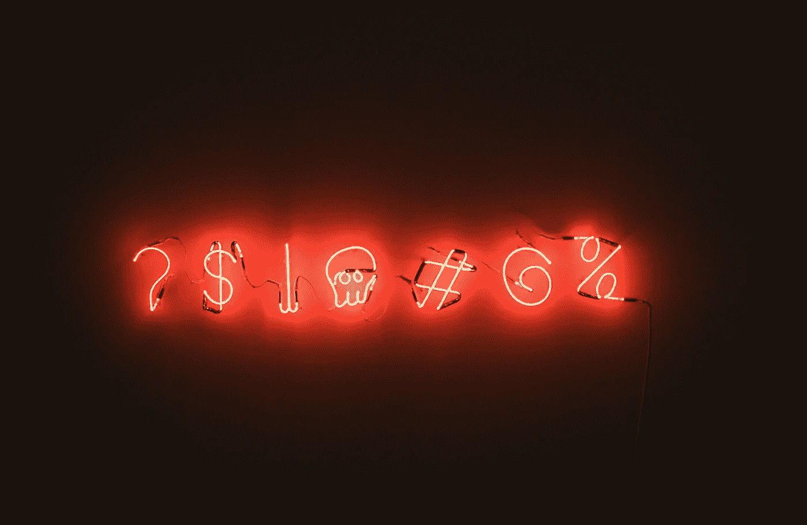

# 0 —我是如何发现自己的声音的

> 原文：<https://medium.datadriveninvestor.com/0-how-i-discovered-my-voice-ea278b69839c?source=collection_archive---------12----------------------->

我注意到我有一个信息需要分享。我对科技和创业公司有着不同寻常的观点。我有一个独特的声音需要被听到。我正在把这个故事分成几个部分:这是第一部分。

Photo by [Matthias Wagner](https://unsplash.com/photos/QrqeusbpFMM?utm_source=unsplash&utm_medium=referral&utm_content=creditCopyText) on [Unsplash](https://unsplash.com/search/photos/sound?utm_source=unsplash&utm_medium=referral&utm_content=creditCopyText)

我孤独、害怕、逃避这个世界，步入成年。

我有一些不良的童年经历，包括欺凌，这使我相信与人的关系不值得被辜负和攻击的风险。我隐藏了真实的自己。我开始了隐身的实践。我非常害羞和害羞。

回顾过去，我看到我给世界留下了一个开口，那就是通过舞蹈。我选择从事表演艺术。你可能会问自己，一个人如何在害羞和害羞的情况下跳舞？正如你所料。我总是退缩。我不能尽可能快地学习，因为我总是担心自己的外表。我更喜欢并专注于芭蕾，因为它的技术性。

不知何故，我能够跳得足够好，以继续接受专业前水平的训练。我的舞蹈训练是一种无意识的自我保护行为。这让我没有完全迷失和封闭。高中毕业后，我搬到了纽约，在艾利学校上学。911 袭击后不久，我在第一学期离开了舞蹈学校。从那以后，我再也没有全职跳过舞。

我可以把我的个性隐藏在技能背后的想法成了我生活中反复出现的主题。我也在电脑上试过。我有一个想法，如果我能发展足够的技术技能，我就能拥有一份不会强迫我面对他人和取悦他人的职业。我认为，在某个时候，我的技能和工作会自己说话，没有人可以从我身上拿走这些成就。

我全都错了。我错误地认为没有和人的亲密关系我会快乐。我错误地认为我的工作会为我说话。我是个受气包。我变得很擅长隐形。人们经常谈论我，忽视我和我的贡献。

# 在我生气之前，一切都没有改变。

我一直讨厌团队项目。记住，我是一个受气包，人们也相应地对待我。我一直是队里最弱的人。我允许更大的声音接管并把我推向他们为我决定的角色。我在 Web 开发人员证书所需的最后一门课上获得了 C 级。这打破了我在社区大学连续获得 A 的记录，因为我没有足够的自信来支持我的期末项目。这让我很生气，但还没气到要改变的地步。

在我的第一个创业周末之后，我有足够的愤怒去改变。我当时正在学习 iOS 开发，想在一个真实的项目中实践我的开发技能。我实际上没有在一个周末内编写一个应用程序，但我为我们的创业公司设计了一个漂亮的交互原型。当评委宣布我的团队获胜时，他们甚至对我们陈述的这一部分进行了评论。我努力工作，并为我对球队的贡献感到骄傲。

创业周末之后，为我们的创业出主意的人决定她是 CEO，她让我们其他人离开。她试图为自己接受我们的团队奖，并与一位新的联合创始人一起展示我们的团队成果。

最后，我愤怒到站出来为自己辩护。我放弃了我的周末，离开了我的两个年幼的孩子，并为这个想法和演示做出了卓越的贡献。那场胜利我也有份。我不会静静地让它从我身边被夺走。

Photo by [Matthew Brodeur](https://unsplash.com/photos/zEFyM4sulJ8?utm_source=unsplash&utm_medium=referral&utm_content=creditCopyText) on [Unsplash](https://unsplash.com/search/photos/angry?utm_source=unsplash&utm_medium=referral&utm_content=creditCopyText)

我终于站了起来。有什么东西同时啪嗒啪嗒响了起来。我联系了创业周末组织者，我们的团队最终被取消了资格。幸运的是，我们能够保留一些可以单独使用的奖品。我会继续利用它们中的每一个。

这件事让我走上了创业之路。这一经历证明了我需要知道我有一个值得倾听的声音。就在这一刻，我开始收回我的个人权力，培养我的声音。

多年的回避和恐惧不会在一瞬间消失。使用我的声音并被看到仍然很难。我已经对自己承诺抓住每一个机会讲话。我不得不承认这变得容易多了。我期待着它变得容易的那一天。