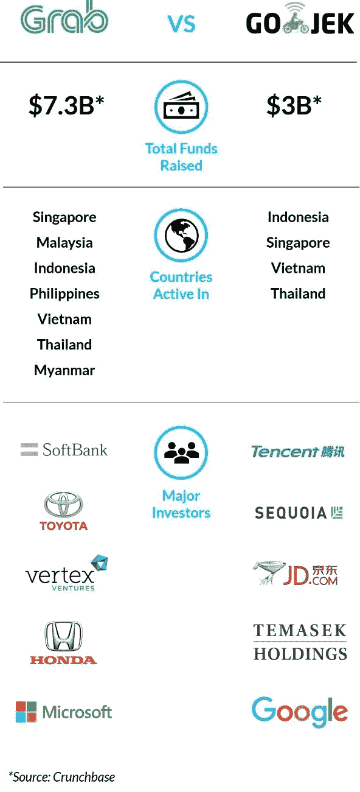

# 01 科技笔记| Grab VS . Go-Jek:迷你计划的核军备竞赛

> 原文：<https://medium.datadriveninvestor.com/01-tech-notes-grab-vs-go-jek-nuclear-arms-race-for-mini-programs-864c82265c58?source=collection_archive---------4----------------------->

[](http://www.track.datadriveninvestor.com/1B9E)

**Grab VS . Go-Jek——迷你程序将决定最终的赢家**

*-文森特·费南多&零一车队*

在 Grab 收购了优步的东南亚业务后，该公司的存在在整个地区变得无处不在。然而，有人可能会说，Go-Jek 已经在印度尼西亚取得了“超级应用”的地位——这是 Grab 在他们所在的任何国家都没有实现的。

Grab 在更广泛的地理范围内提供运输、食品、支付和物流服务，而印度尼西亚的 Go-Jek 则提供额外的服务，如一个名为 Go-Shop 的市场，供人们通过应用程序进行买卖，以及其他生活服务，如购票、按摩、汽车护理等。Go-Jek 更成功地“深入”一个国家，而 Grab 更成功地“走向区域”。如下图所示，两家公司都筹集了数十亿美元资金，在各自的领域都有强大的股东。



**尽管有所发展，Grab 和 Go-Jek 仍远未成为“真正的超级应用”**

Grab 和 Go-Jek 都已经从打车的起源走了很长一段路，并打算开始向用户提供金融服务。据 Grab Financial 董事总经理鲁本·赖(Reuben Lai)称，Grab 已与金融科技公司 OVO 合作，为印尼带来“全方位的金融服务，包括小额贷款、保险和储蓄”。Go-Jek 也在扩大其财务能力，例如通过最近收购 Coins.ph

然而，尽管他们努力建立越来越多的服务，两家公司仍然缺乏我们认为微信最重要和开创性的功能——迷你程序。

微信迷你程序于 2017 年 1 月推出，基本上是轻量级的第三方应用程序，可以在微信中运行。需要微信之外的另一个应用程序的服务的微信用户可以运行该应用程序的迷你程序，而不是退出微信并下载完整的应用程序。这使得微信从单纯的服务融合转变为一个真正的应用生态系统，第三方公司通过微信推出新服务。微信在 Android 和 iOS 的操作系统中，成为了自己的迷你操作系统。

截至去年 11 月，微信上的迷你程序超过 100 万个，已经是当时苹果应用商店规模的一半左右。如今，新的中国科技公司必须通过微信推出自己，就像它们必须通过 Android 和 iOS 向世界其他地方推出一样。

因此，我们认为 Go-Jek 或 Grab 的超级应用的胜利不仅仅在于提供像企业集团一样的服务组合，而是成为第三方应用和服务在其应用中存在的生态系统。据报道，两家公司都在为这一目标而努力，我们认为这类似于一场核军备竞赛，在我们看来，第一个达到这一微信里程碑的人可能会成为东南亚的最终赢家。

下图显示了我们的超级应用竞争者的排名情况:


**“超级应用”的自然进化会成为成熟的操作系统吗？**

微信的普通中国用户几乎不需要使用手机的原生应用商店，因为他们有微信及其迷你程序提供他们所需的大部分服务。没有“抽嬉皮士烟斗”，人们可以想象腾讯有一天会基于微信平台提供自己的手机操作系统。普通中国智能手机用户使用微信的时间已经超过了他们使用安卓或 iOS 的时间。

回到 Grab and Go-Jek，除非它们有一天成为第三方服务的真正生态系统，否则我们认为它们可能会像传统行业中的企业集团一样陷入停滞。我想到了“百事通”和“无所不能大师”，凭借激光聚焦和创新速度，它们将被专注于单一垂直领域的初创企业分崩离析。一天结束时，虽然有一个统一的钱包和登录有点酷，但如果有更好的服务，在我的手机上打开一个单独的应用程序也不是很难。**如果要保持长期竞争力，打卡和外卖网站必须不仅仅是服务的混合体。**

你觉得怎么样？

**谁最有可能成为东南亚第一个“超级 app”？**

```
[Dude, I think Anthony Tan and Grab are gonna crush it »](https://goo.us6.list-manage.com/poll/vote?u=66863d2248b04e54699288962&c=f24701ca98&e=bd6b0eb507&p=777b5e39e3&v=abb62f9946)[No way bro/brozella, I think Naidem and Go-Jek will win »](https://goo.us6.list-manage.com/poll/vote?u=66863d2248b04e54699288962&c=f24701ca98&e=bd6b0eb507&p=777b5e39e3&v=6c96cd253d)
```