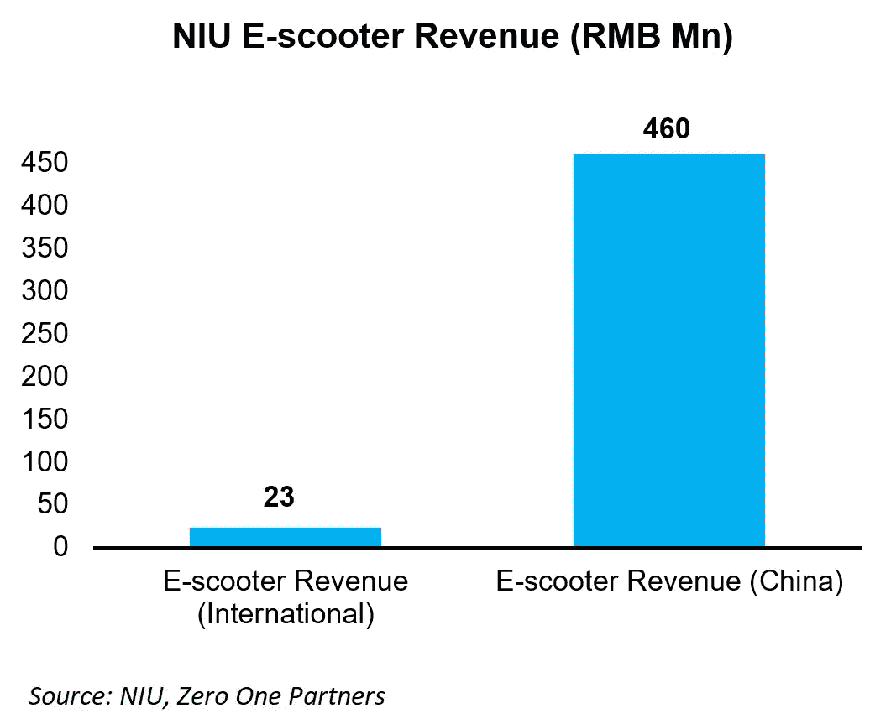
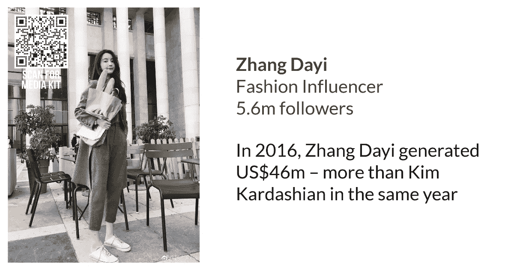
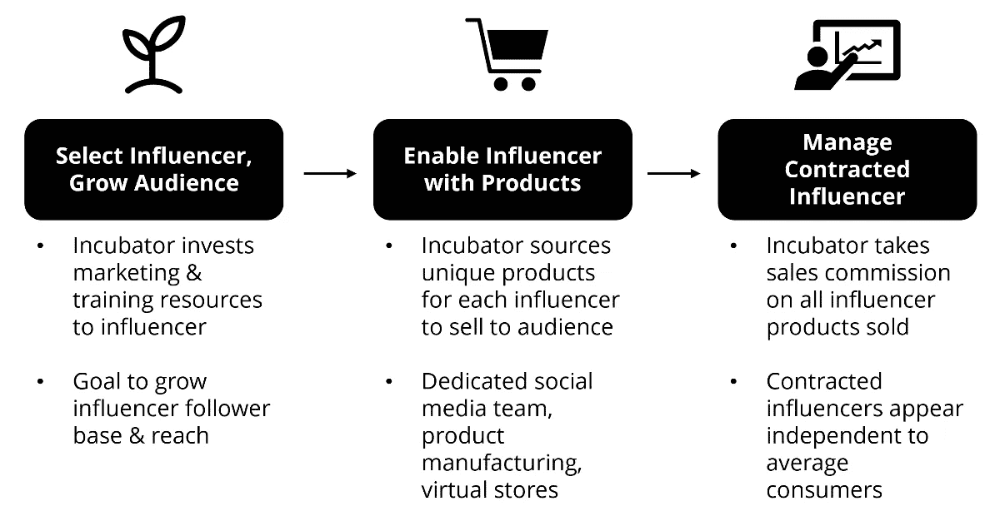
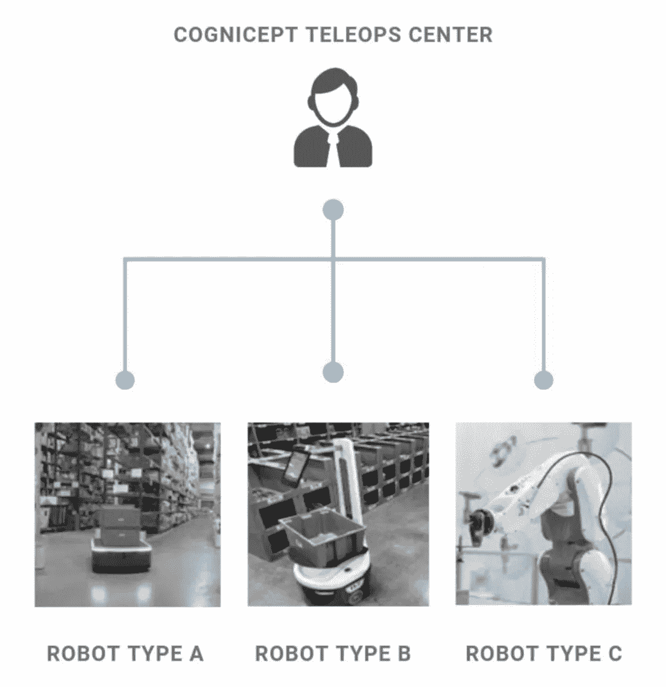
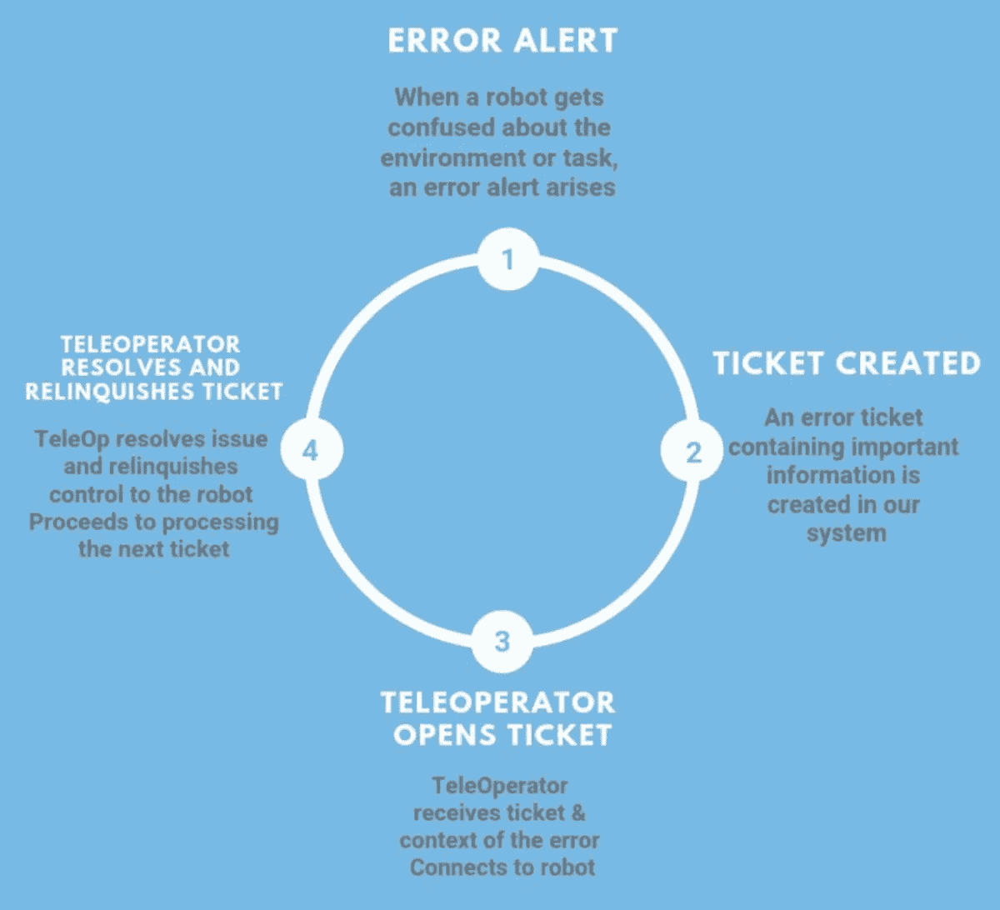

# 01 科技笔记|影响者孵化器、人类击败人工智能、电动摩托车

> 原文：<https://medium.datadriveninvestor.com/01-tech-notes-influencer-incubators-humans-beating-ai-ev-motorcycles-d47b3c9fdaf5?source=collection_archive---------6----------------------->

**Happy Chinese New Year! 恭喜发财!**

下面是我们发表的关于彭博码头的最新研究摘要。

—文斯·费尔南多，特许金融分析师

纳斯达克上市的牛怎么能 10 倍…亚洲的每辆摩托车不都应该是电动的吗？

世界上绝大部分的摩托车还是很脏的内燃机车，这真的说不通。正如在纳斯达克上市的中国领先电动摩托车制造商牛(NIU)等新的电动摩托车公司所显示的那样，电动摩托车已经足以在广泛的用途上取代汽油摩托车。

根据牛最近的 2018 年第三季度业绩，这家市值 5 亿美元的公司正在经历巨大的增长，收入同比飙升 86%(2018 年第三季度为 7180 万美元)。增长主要是由中国对电动滑板车的需求推动的，但有趣的是，该公司还报告称，其新生的国际业务增长了一倍多。

牛的强劲增长不仅是该公司的好消息，也是全球所有电动摩托车玩家的好消息，因为这是电动摩托车即将在你附近的影院颠覆的迹象。

四个关键因素将推动全球两轮车从汽油转向电动汽车:

1.  **电动摩托车的生产成本正在大幅下降，**电动摩托车解决方案首先在低端市场占据份额，现在转向更高性能的两轮摩托车。
2.  **电动摩托车的性能一直在提高**，一辆设计精良的电动摩托车现在可以在许多方面超越汽油摩托车。
3.  随着排放标准的提高，生产传统汽油动力摩托车的成本将会上升，特别是在发展中国家，那里的标准仍然远远落后于发达国家。像印度和中国这样的国家正在引领这一潮流，其他国家将很快跟进。
4.  **空气污染已经成为世界上大多数主要城市的主要健康危害**，汽车排放是主要原因。鉴于电动汽车技术的现状，消费者和选民会越来越清楚，摩托车污染是没有借口的。

**如果妞妞的电动汽车市场份额达到 10%,它的收入可以翻 10 倍**

牛声称其较高价位的电动滑板车子市场(不是整个中国电动汽车销售)在中国电动滑板车市场占有 26%的市场份额；和 11%的欧盟电动滑板车市场。与此同时，据大观研究公司预测，到 2025 年，全球电动滑板车市场将达到 286 亿美元。

如果我们假设，随着市场走向全球化，牛仍将是一个重要的电动汽车厂商，并且仅在 2025 年**之前保持至少 10%的电动汽车全球市场份额，那么这将意味着到那时牛的收入可能会增长 10 倍**(2025 年牛的收入为 29 亿美元，而今天的年化运营率约为 2.9 亿美元)。对于股票市场上 5 亿美元的公司来说，目标市场份额很低，很难找到这样的增长潜力。这表明，对于像牛这样的公司来说，电动汽车目前面临着巨大的机遇。

我们上面的图表显示了牛 2018 年第三季度国内电动滑板车市场收入与其海外收入之间的 20 倍差距。中国电动滑板车市场与世界其他地区之间的差距表明，中国在电动汽车领域处于世界领先地位，我们相信，随着电动汽车技术的进步和全球污染问题的增加，两轮车的电动汽车转变将在全球范围内扩展。我们没有把国际销售看作是牛的一个小市场，而是看到了相反的情况；在中国之外，电动汽车有着巨大增长潜力。

【阅读全文】牛零一报道> >

**影响者营销是 2017 年的热门话题，现在它完全是关于影响者商业和孵化器**

作为中国在技术趋势方面领先的另一个例子，只需看看电子商务颠覆的最新迭代之一:“**影响者商业”**，我们认为这是传统影响者营销与直接面向消费者(D2C)商业模式的融合。聪明的影响者不再只是做产品植入，他们直接向他们的粉丝销售产品。

随着“**影响者孵化器**”的出现，中国在这方面更进了一步。从本质上说，中国有影响力的人正在通过开发自有品牌产品或紧密结合的产品作为品牌大使来赚钱，并扰乱中国 1.1 万亿美元的庞大电子商务产业。**在阿里巴巴 2017 年光棍节期间，六个有影响力的品牌跻身女性服装店 30 强**，其中四个单日销售总额超过 1 亿元人民币(约 1470 万美元)。

然而，影响者商务的一个缺点是，影响者需要在产品成功之前发展强大的追随者，而以前大多数人都是以相对业余的方式在预算有限的情况下这样做的。解决方案可以说首先在中国出现，是让专业的有影响力的孵化器加速这一过程，就像孵化初创公司创始人一样。影响者孵化器的商业模式如下，如下图所示:

中国可能在这一领域享有优势，这使其能够先于其他国家发展这一商业模式，这些优势包括:

*   许多有影响力的人都在杭州江干，这是中国最大的服装批发市场之一，可以节省物流成本，并直接与工厂联系，为有影响力的人采购产品。
*   由于阿里巴巴聚集了制造商和物流合作伙伴，中国的影响者可以很容易地找到产品合作伙伴。
*   **最重要的是:**中国社交媒体平台(如微信、陶伟、微博)与电子商务的紧密结合已经有一段时间了，这使得有影响力的人可以在一个应用生态系统中与粉丝交流和销售。脸书和 Instagram 等平台在这方面适应缓慢。

**然而，西方也看到了这一趋势。**

例如，凯莉·詹娜成为世界上最年轻的亿万富翁归功于她的品牌凯莉化妆品。Kylie Cosmetics 成功背后的一家名不见经传的公司是 Seed Beauty，这是一家美容品牌孵化器，帮助从零开始建立有影响力的品牌。其他主要影响者也推出了自己的产品，据报道，Instagram 正计划推出一款名为“IG Shopping”的独立购物应用程序，允许用户直接在应用程序内浏览和购买，类似于中国的社交媒体平台。Conde Naste Italia 也在去年 10 月启动了一个[影响者孵化器](https://aseanedge.us6.list-manage.com/track/click?u=66863d2248b04e54699288962&id=c025733640&e=768d0184ba)，尽管我们认为他们仍然没有像 Ruhan 等中国公司那样纳入产品采购影响者商务 D2C 角度。

在社交商务世界中，拥有最终消费者的影响者正在获得越来越大的附加值份额。

[**在这里阅读我们的全影响者孵化器零一报告> >**](https://aseanedge.us6.list-manage.com/track/click?u=66863d2248b04e54699288962&id=2d59e9f01f&e=768d0184ba)

**为了提高人工智能的效率，你不需要更好的人工智能，只需要增加更多老式的人类**

我们发现了一个非常有趣的商业模式，新加坡的初创公司[cogn cept](https://aseanedge.us6.list-manage.com/track/click?u=66863d2248b04e54699288962&id=104fafb9c5&e=768d0184ba)正在为人类远程操作者提供一项服务，以监督工业和服务机器人。

解决方案非常简单——机器人和人工智能在 99%的时间里都很棒，但它们在 1%的时间里会惊人地失败，但要消除这 1%的错误率，可能需要 10 倍于人工智能的复杂性。因此，与其尝试解决问题，为什么不在机器人卡住的那 1%的时间里，让人类来接管控制呢？这就是 Cognicept 正在做的事情，我们相信这是一个解决人工智能/机器人问题的非常棒的反直觉的解决方案。

Cognicept 的解决方案适用于服务行业、仓储、配送甚至医疗保健行业的各种机器人。下面是认知概念操作模型的快速分解。

你只需支付机器人保险，或者只是安心地认为，当机器人无法解决问题时，一个老式的人脑将接管，为机器人执行所需的动作，然后在完成后将控制权归还给机器人。

虽然 Cognicept 是一家相当新的公司，但他们已经与 ABB 和 Konica Minolta 等公司合作，获得了一个重要的项目。

留意这个空间。我们意识到，有时“简单”的解决方案或改进是最可行和最有利可图的商机。作为一个企业，当有一个简单和成本有效的人类解决方案时，为什么要解决最困难的软件问题呢？

# DDI 特色数据科学课程:

*   [**用于数据科学的 Python**](http://go.datadriveninvestor.com/intro-python/mb)
*   [**Scikit-Learn**](http://go.datadriveninvestor.com/scikitlearn/mb)
*   [**深度学习**](http://go.datadriveninvestor.com/deeplearningpython/mb)

**DDI 可能会从这些链接中收取会员佣金。我们感谢你一直以来的支持。*