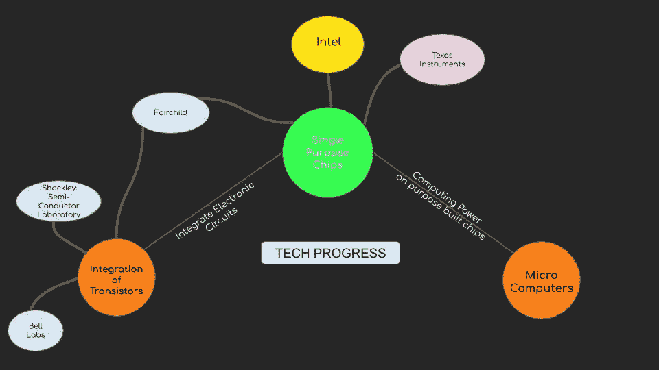
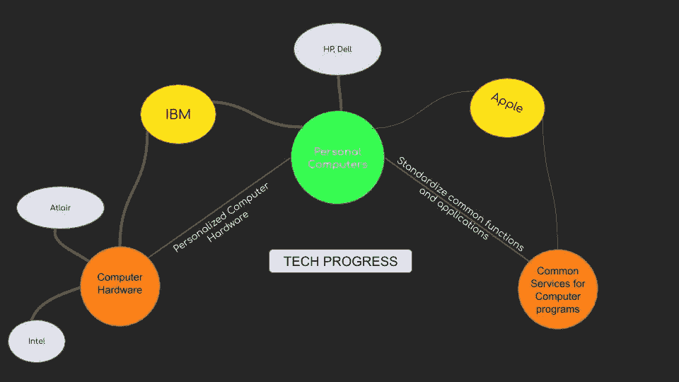
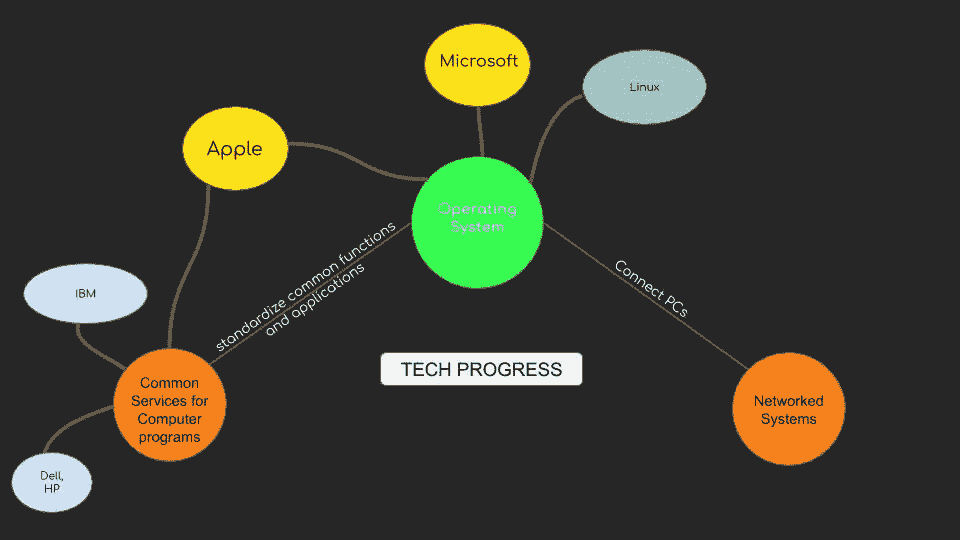
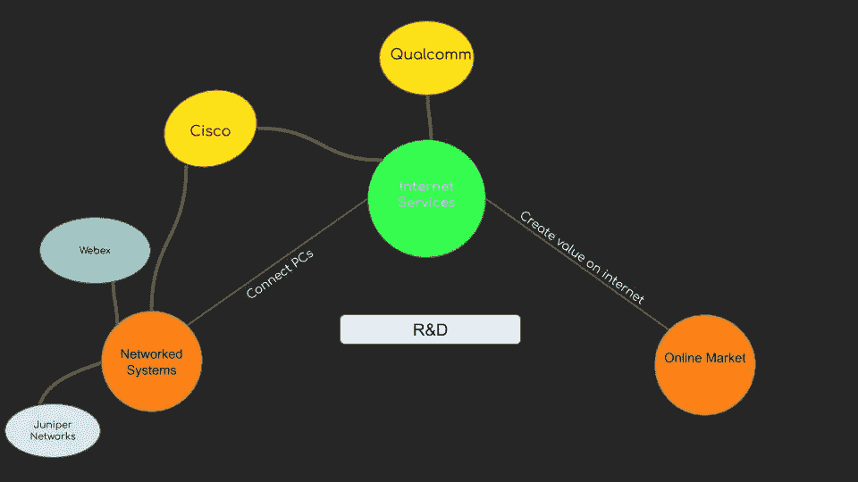
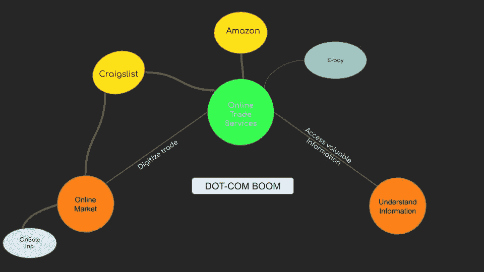
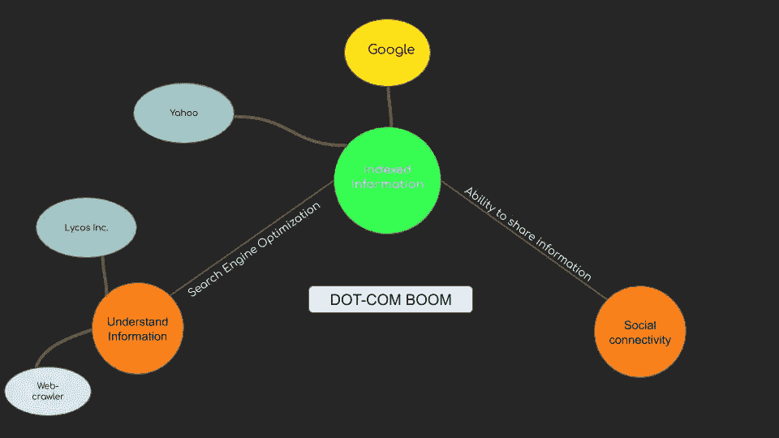
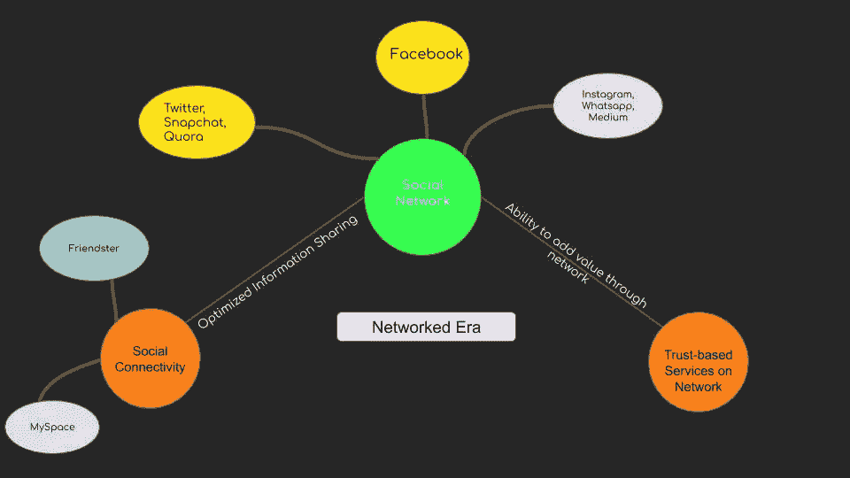
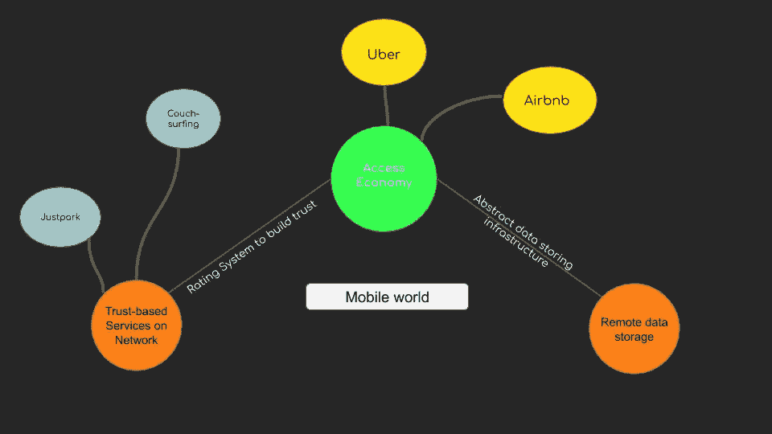
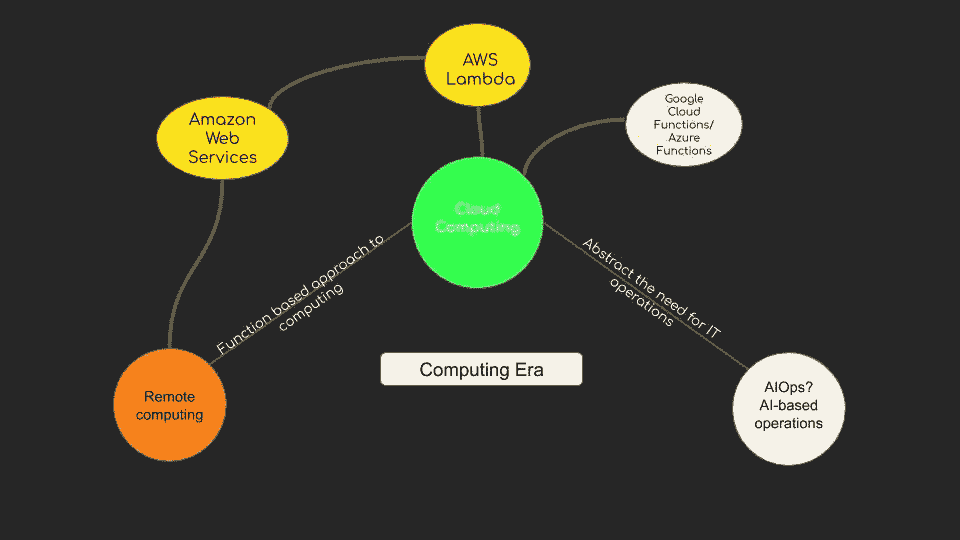

# 1.1 维度 1 —硅产业

> 原文：<https://medium.datadriveninvestor.com/1-1-dimension-1-silicon-industry-869acfd8e7f8?source=collection_archive---------16----------------------->

***回顾:*** *这是一个中型系列，着眼于在理解巨型科技独角兽如何形成中发挥作用的不同因素(以维度表示)。你可以在这里找到* [*简介*](https://medium.com/datadriveninvestor/intro-tech-startup-unicorns-be40ed9ff9c9) *。*

***维度回顾:*** *我们之前谈到了如何创造新的价值机会层(表示为* [*维度 1*](https://medium.com/datadriveninvestor/dimension-1-value-creation-opportunity-at-macro-level-b205a8f05561) *)。*

我们看到，在宏观层面上，通过提取稀缺的东西并使之丰富，创造价值的新机会就会出现。这篇文章将是一幅硅产业技术创新的线性化图片(不一定是现实中的线性时间线),以及价值创造的新机会形成的地方。

一些公司往往会在市场的正确时间，通过消除摩擦点来实现爆炸式增长。微软。

 [## 准备在 2019 年改变世界的技术-数据驱动的投资者

### 很难想象一项技术会像去年的区块链一样受到如此多的关注，但是……

www.datadriveninvestor.com](https://www.datadriveninvestor.com/2019/01/17/the-technologies-poised-to-change-the-world-in-2019/) 

而一些公司对市场来说太早，进入了创业失败的书籍，或者在市场上停留足够长的时间来利用它(例如:AWS，网飞)。我们将在第三维度中看到更多关于时间的角色。

**硅吊杆:**

硅时代最早的可扩展“价值创造机会”可以追溯到英特尔。为计算目的设计芯片的能力。

后来出现了可以将各种芯片集成到通用硬件上的公司。

**软件时代开始:**

软件时代的开端是由微软引领的，它看到了在任何给定的计算硬件上标准化通用功能和应用程序的未来。

历史上，人类是一个共享信息和交易的网络物种。新的稀缺层:建立一个连接计算机的系统的能力被思科和其他参与者抽象出来，导致了最终的网络时代。

**网络时代:**

人类在经济和新的稀缺层中茁壮成长，这一点在事后看来是清晰而明显的:将贸易数字化，或者换句话说，消除贸易中的地点和时间障碍。

随着网络上信息的丰富，一个新的理解信息的稀缺层诞生了。虽然市场上已经存在一些参与者，但索引信息的优化和算法方法为“谷歌”成为市场垄断者铺平了道路。

**网络化时代:**

一个新的稀缺层:将人类的身份扩展到虚拟空间，并实现社会联系。这是由社交媒体网络抽象出来的，社交媒体网络为个人提供了一个联系和分享信息的平台。

**接入经济:**

随着移动技术的出现，网络上一个新的稀缺的基于信任的服务层出现了。通过向客户提供廉价和即时的服务(交通/住宿)以及向主办方提供收入，摩擦点:随时随地服务被优步和 Airbnb 消除了。

**云计算:**

随着越来越多的数据积累，越来越多的服务需要计算能力，亚马逊网络服务(AWS)通过提供远程(云)存储和计算服务，从摩擦点:存储和计算基础设施中抽象出来。

***接下来:*** [*人工智能*](https://medium.com/datadriveninvestor/1-2-dimension-1-artificial-intelligence-c186c9417333)