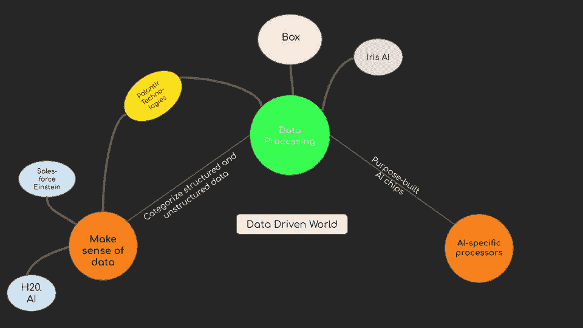
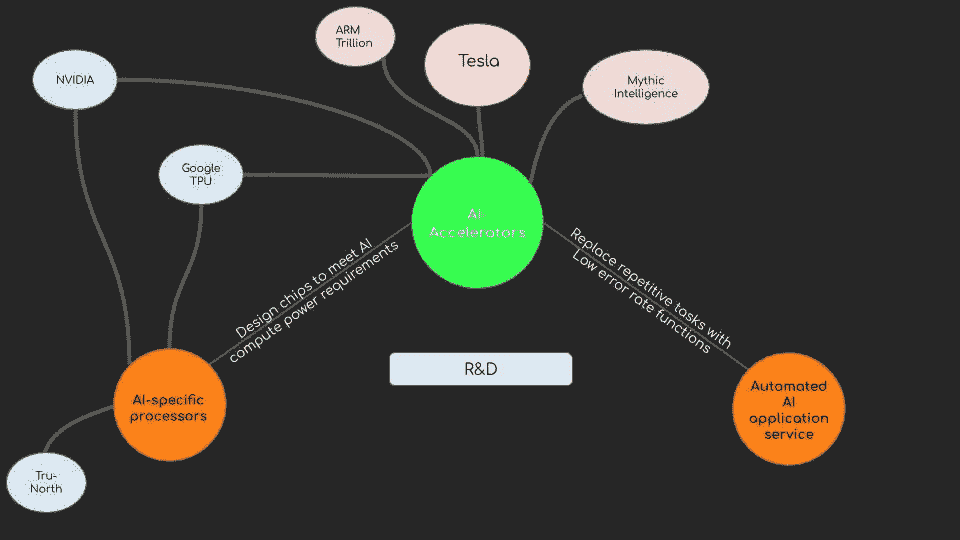
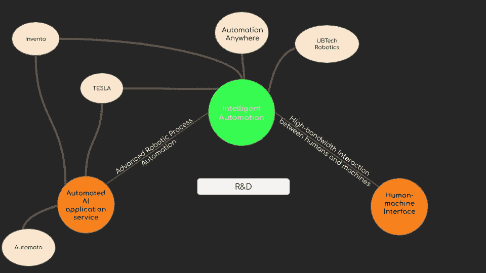
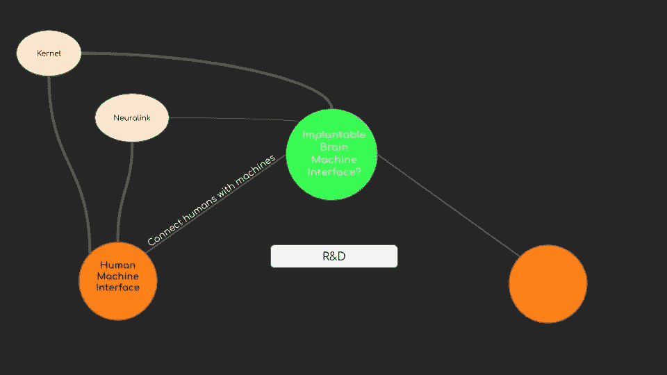

# 1.2 维度 1 —人工智能

> 原文：<https://medium.datadriveninvestor.com/1-2-dimension-1-artificial-intelligence-c186c9417333?source=collection_archive---------9----------------------->

***回顾:*** *这是一个中型系列，着眼于在理解巨型科技独角兽如何形成中发挥作用的不同因素(以维度表示)。你可以在这里找到* [*简介*](https://medium.com/datadriveninvestor/intro-tech-startup-unicorns-be40ed9ff9c9) *。*

***维度重述:*** *我们之前谈到了* [*硅业*](https://medium.com/datadriveninvestor/1-1-dimension-1-silicon-industry-869acfd8e7f8) *如何创造新的价值机会层(表示为* [*维度 1*](https://medium.com/datadriveninvestor/dimension-1-value-creation-opportunity-at-macro-level-b205a8f05561) *)。我们看到，在宏观层面上，通过提取稀缺的东西并使之丰富，创造价值的新机会就会出现。本帖就来说说* [*人工智能*](https://medium.com/datadriveninvestor/1-2-dimension-1-artificial-intelligence-c186c9417333) *领域的价值创造。*

信息世界已经从硅时代(以英特尔为首)到互联网时代(以微软、谷歌为首)，再到移动时代(以脸书、优步为首)，现在又到了人工智能时代。互联网服务和应用程序之间创建和共享的大量数据从根本上促进了这一点。

 [## 模式和机器人:一个复杂的现实数据驱动的投资者

### 哈耶克的名著《复杂现象理论》(哈耶克，1964)深入探讨了复杂性的话题，并断言…

www.datadriveninvestor.com](https://www.datadriveninvestor.com/2019/03/04/patterns-and-robotics-a-complex-reality/) 

注意:由于摩尔定律支持的计算设施的改进，人工智能行业相对较新。有一点可以肯定，人工智能将从根本上改变每个行业。这篇文章只是在一个非常肤浅的层面上收集了人工智能领域正在创造的新价值机会。

**数据驱动的世界:**

这导致有组织和无组织的数据分散在各处。

随着云存储和数据存储服务的普及，积累的数据量呈指数级增长。

稀缺层:数据应用程序—对结构化和非结构化数据进行分类和处理。人工智能公司有巨大的价值创造机会，可以消除摩擦点:处理数据(结构化/非结构化)的服务

随着数据量的增加以及人工智能应用程序(特别是人工神经网络、机器视觉和机器学习)对更快计算的要求，已经创建了一个称为人工智能加速器的人工智能专用微处理器的稀缺层。许多公司已经在开发这些芯片。也许，市场中有一个新的进入者或一个在位者将通过抽象稀缺元素而领先。

可以创造巨大价值的新的稀缺层是增强的自动化过程，可以充当软件机器人或 AI 工人。还不确定这是否可以跨行业推广，但这是一个潜在的市场空间。

一旦人工智能成为企业和个人日常活动的一部分，稀缺层可能会减少人类和机器之间的带宽，并有可能成为整合两者的一种方式。Kernel 和 Neuralink 等公司在研发方面领先。

***接下来:*** [*区块链*](https://medium.com/datadriveninvestor/1-3-dimension-1-blockchain-39d59552f173)