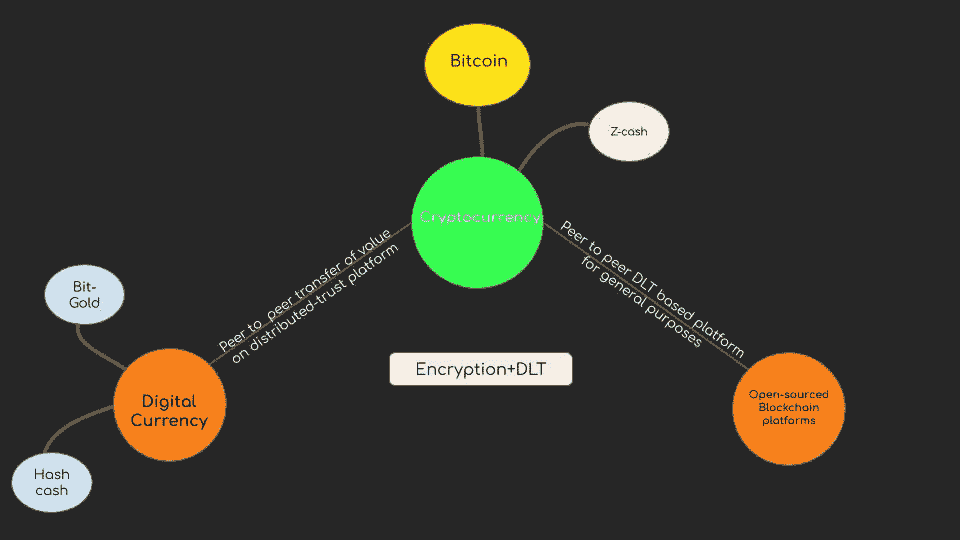
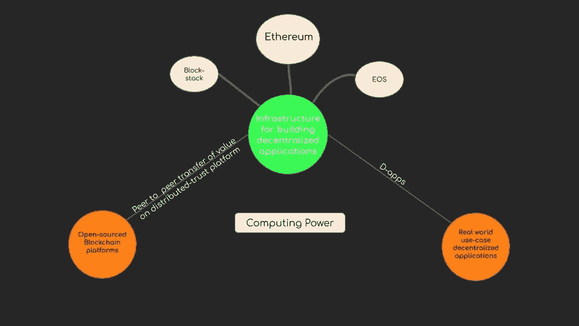
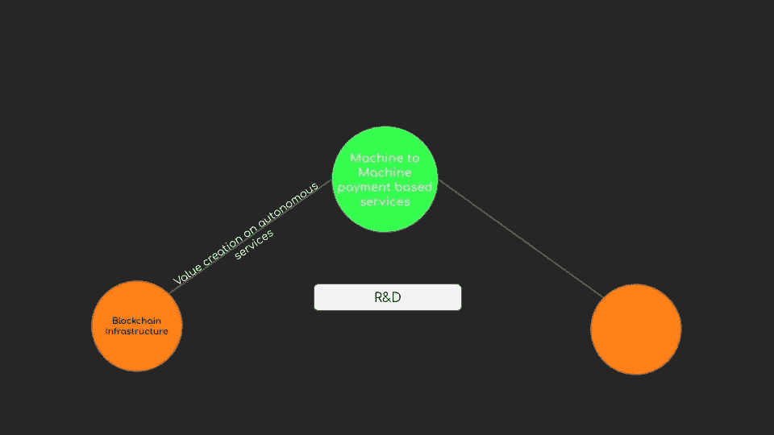

# 1.3 维度 1 —区块链

> 原文：<https://medium.datadriveninvestor.com/1-3-dimension-1-blockchain-39d59552f173?source=collection_archive---------6----------------------->

***回顾:*** *这是一个中型系列，着眼于在理解巨型科技独角兽如何形成中发挥作用的不同因素(以维度表示)。你可以在这里找到* [*简介*](https://medium.com/datadriveninvestor/intro-tech-startup-unicorns-be40ed9ff9c9) *。*

***维度重述:*** *我们之前谈到了在* [*硅业*](https://medium.com/datadriveninvestor/1-1-dimension-1-silicon-industry-869acfd8e7f8) *中如何创造新的价值机会层(表示为* [*维度 1*](https://medium.com/datadriveninvestor/dimension-1-value-creation-opportunity-at-macro-level-b205a8f05561) *)以及这些层可能在* [*人工智能*](https://medium.com/datadriveninvestor/1-2-dimension-1-artificial-intelligence-c186c9417333) *中的位置。* *本帖将谈谈区块链空间的价值创造。*

我们看到，在宏观层面上，通过提取稀缺的东西并使之丰富，创造价值的新机会就会出现。

[**金钱史**](https://medium.com/datadriveninvestor/3-what-is-mone-923ade1f41e8) **:**

最早的贸易围绕着物物交换体系。我有商品 X，你有商品 y。让我们交换彼此缺少的商品。事后看来，一个显而易见的因素是一种商品的价值与另一种商品大相径庭。因此，稀缺层是:在交易过程中估计价值。这导致了一个新层次的诞生:价值储存，从贵金属、黄金到充当中介的纸币。

 [## 2019 年成为主流的 7 大区块链挑战及更多...-数据驱动型投资者

### 教训是永远不要停止学习和成长。关于技术、金融、工作场所、生产力和…

www.datadriveninvestor.com](https://www.datadriveninvestor.com/2019/03/25/top-7-blockchain-challenges-to-go-mainstream-in-2019-more/) 

随着主权国家被帝国吞没，然后最终变成民族国家，需要一个中间人来管理和控制资金——银行和政府。

**数字货币:**

数字技术使得在网络上转账更快。贝宝和其他在线转账系统，仍然由中间人控制。另一个出现的稀缺层是建立在分布式账本技术上的匿名对等传输系统:

**智能合约:**

现在，资金可以在安全而廉价的分布式账本技术上转移(尽管还不够快……但是),一个新的稀缺层出现了，它可以在分布式技术上转移智能合同(概述关系的条款，通常是法律强制执行的条款),或者换句话说，一个基础设施平台，使开发人员能够构建分散的应用程序。

现在平台正在开发中，在这些基础设施上的实际应用程序的竞争已经开始。虽然，除了地穴猫收集和赌博之外，并没有太多有前途的 damps 乞求现实世界的效用。

Block stack 和其他分散公司正在做的事情是抽象出我们构建现代应用程序所需的构建模块类型。这将使应用程序专注于服务，而不是后端工作。

我们看到了给软件上的机器提供电话号码来交换(IP 地址)是如何引发信息革命的。随着自主服务每天越来越多地成为我们生活的一部分，如果机器能够为其服务支付和接收费用，未来可能会发生革命性的变化。

***接下来:*** [*生物科技*](https://medium.com/datadriveninvestor/1-4-dimension-1-biotechnology-94b94294e5be)