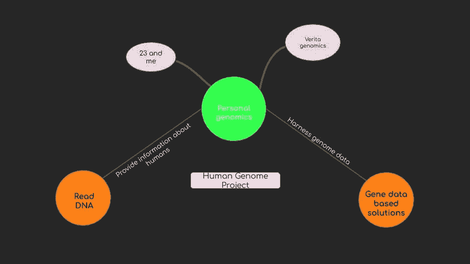
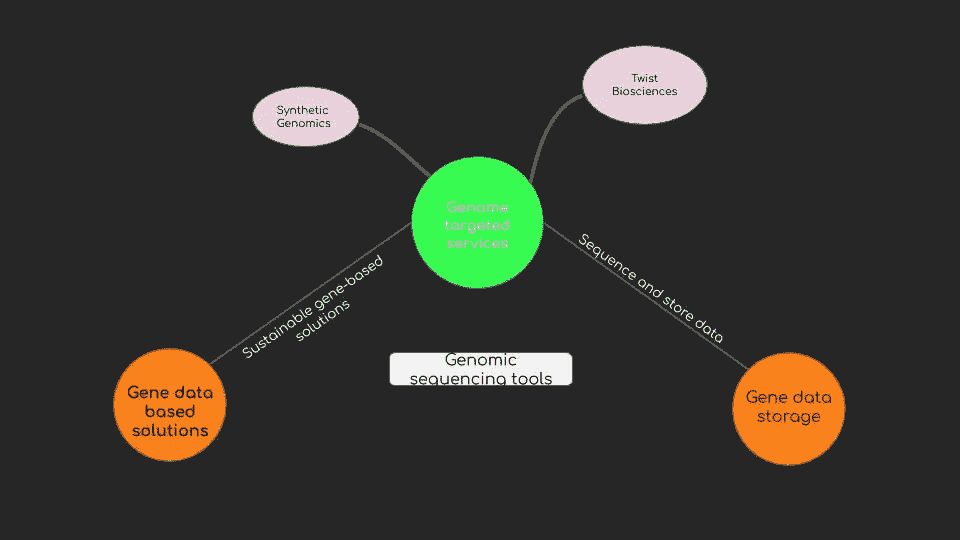
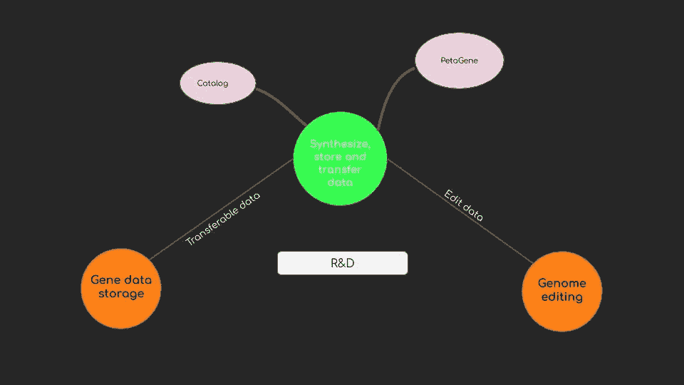
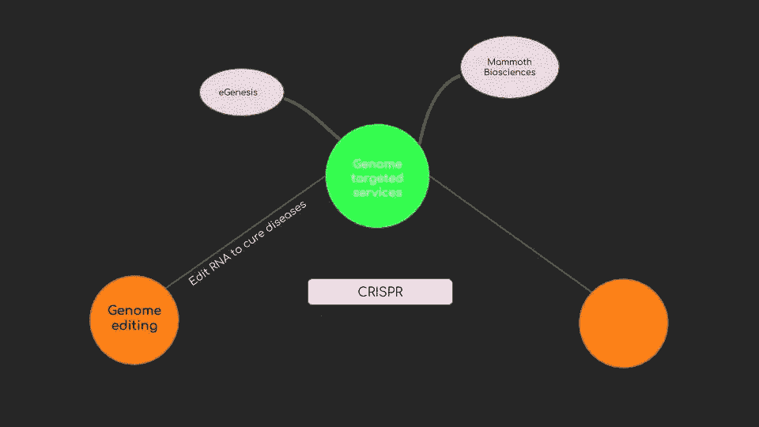
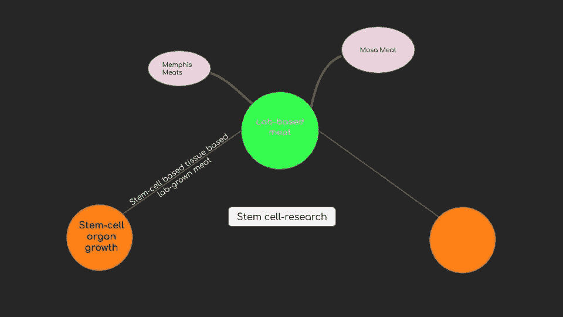

# 1.4 维度 1 —生物技术

> 原文：<https://medium.datadriveninvestor.com/1-4-dimension-1-biotechnology-94b94294e5be?source=collection_archive---------5----------------------->

***回顾:*** *这是一个中型系列，着眼于在理解巨型科技独角兽如何形成中发挥作用的不同因素(以维度表示)。你可以在这里找到* [*简介*](https://medium.com/datadriveninvestor/intro-tech-startup-unicorns-be40ed9ff9c9) *。*

***维度重述:*** *我们之前谈到了如何在* [*硅产业*](https://medium.com/datadriveninvestor/1-1-dimension-1-silicon-industry-869acfd8e7f8) *中创造新的价值机会层(表示为* [*维度 1*](https://medium.com/datadriveninvestor/dimension-1-value-creation-opportunity-at-macro-level-b205a8f05561) *)以及这些层可能在* [*人工智能*](https://medium.com/datadriveninvestor/1-2-dimension-1-artificial-intelligence-c186c9417333) *和* [*区块中的位置* *本帖将谈谈生物技术中的价值创造。*](https://medium.com/datadriveninvestor/1-3-dimension-1-blockchain-39d59552f173)

我们看到，在宏观层面上，通过提取稀缺的东西并使之丰富，创造价值的新机会就会出现。

**合成生物学:**

人类承担的最大项目之一是合成(读取)人类基因组，称为人类基因组计划。随着技术和 R&D 工作的进步，读取人类 DNA 所需的成本和时间已经大大降低。

这个领域的第一批公司开始为个人合成 DNA 并提供有价值的信息。

以更快的速度读取基因组数据的能力使新的稀缺层成为可能:提供基于基因的解决方案/产品来制造药物或生产生物燃料。

随着基因组测序工具的进步和基因合成成为一个出现的主题，被测序的基因组数据的数量一直在增加- DNA 是独特的和个性化的 RNA 治疗。这创造了一个新的稀缺层:在不丢失数据的情况下合成、存储和传输数据的能力。

在不到十年的时间里，合成生物学的进步——从基因合成到基因编辑——带来了一个新的市场(尽管需要严格的监管)

**食品行业:**

干细胞研究和潜力已经为人所知超过二十年，但是临床试验的进步已经创造了一个新的市场来创造实验室肉类。这将从根本上改变我们对待动物、自然资源和应对气候变化的方式。

a.屠宰

b.保护土地和水足迹

c.减少温室气体的排放量

 [## 机器学习|课程

### 机器学习是让计算机在没有明确编程的情况下行动的科学。在过去的十年里…

go.datadriveninvestor.com](http://go.datadriveninvestor.com/stanfordML) 

***接下来:*** [*能量*](https://medium.com/datadriveninvestor/1-5-energy-c8400581bde9)