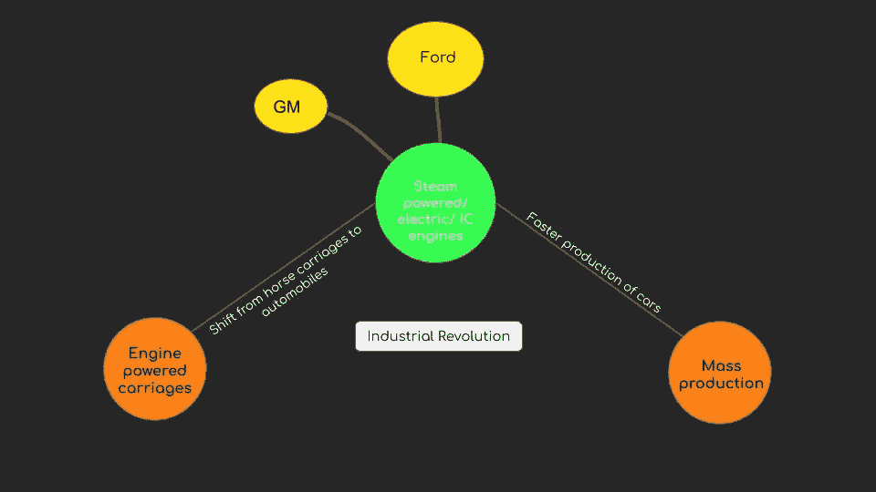
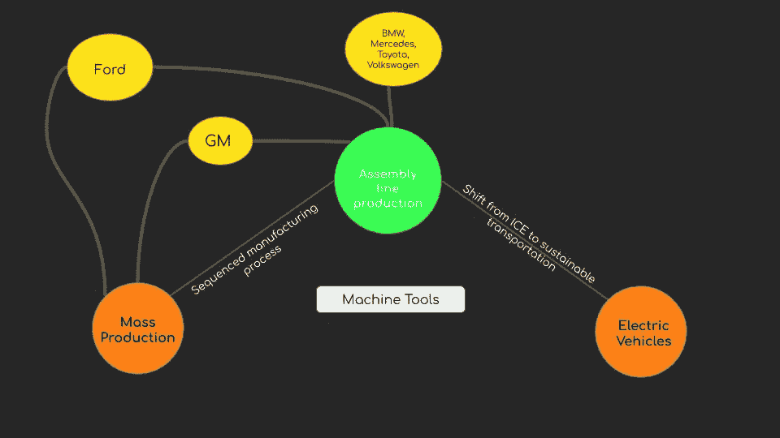
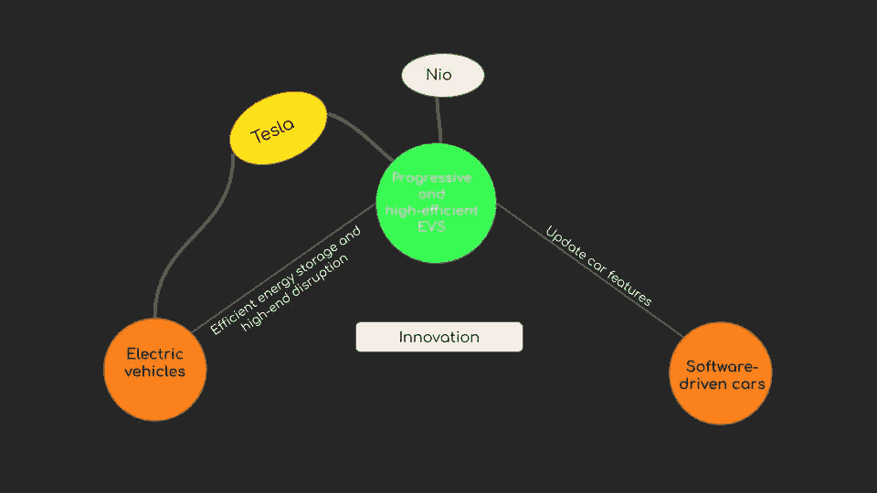
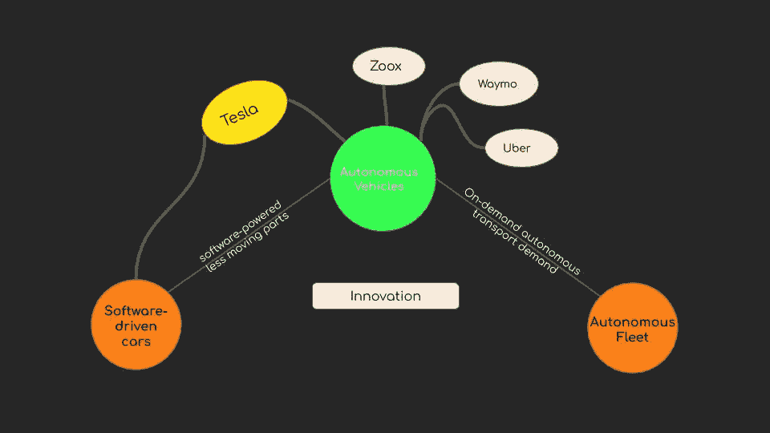

# 1.5 维度 1 —能源(汽车)

> 原文：<https://medium.datadriveninvestor.com/1-5-energy-c8400581bde9?source=collection_archive---------7----------------------->

***回顾:*** *这是一个中型系列，着眼于在理解巨型科技独角兽如何形成中发挥作用的不同因素(以维度表示)。你可以在这里找到* [*简介*](https://medium.com/datadriveninvestor/intro-tech-startup-unicorns-be40ed9ff9c9) *。*

***维度重述:*** *我们之前谈到了在* [*硅产业*](https://medium.com/datadriveninvestor/1-1-dimension-1-silicon-industry-869acfd8e7f8) *中如何创造新的价值机会层(表示为* [*维度 1*](https://medium.com/datadriveninvestor/dimension-1-value-creation-opportunity-at-macro-level-b205a8f05561) *)以及这些层可能在* [*人工智能*](https://medium.com/datadriveninvestor/1-2-dimension-1-artificial-intelligence-c186c9417333)*[*区块中的位置* *本帖将具体谈谈能源、汽车行业的价值创造。*](https://medium.com/datadriveninvestor/1-3-dimension-1-blockchain-39d59552f173)*

*虽然在 19 世纪马是主要的运输方式，但是不用马的马车已经在使用了。直到工业革命期间蒸汽机的引入，它们才在 19 世纪初慢慢取代了马。*

**

***装配线:***

*然而，对于一个完整的中断，稀缺层:可互换零件，以加快制造过程，必须丰富。*

* [## 在自动驾驶汽车发生事故的情况下，谁应该承担法律责任？-数据驱动型投资者

### 我仍然认为自动驾驶汽车是一种奢侈品，而不是必需品…

www.datadriveninvestor.com](https://www.datadriveninvestor.com/2018/11/02/who-is-legally-accountable-in-the-case-of-an-autonomous-vehicle-accident/) 

机床的发展为装配线提供了先决条件，使可互换零件成为现实。这是由福特大规模引进装配线制造而提炼出来的，后来被通用汽车等其他公司采用。

**EV 革命:**

电动汽车已经出现在市场上(也许始于 19 世纪)，但与内燃机相比，它们的效率很低。越来越有必要转向可持续运输。这里的稀缺层是:提高电池密度，或者换句话说，高效电池封装在电池内。关于特斯拉如何扰乱汽车市场的更多信息将在《维度 3 & 4》中讨论。

**自主革命:**

“软件吞噬世界”——马克·安德森

稀缺层:使软件能够添加新功能并增强现有功能。

随着软件慢慢融入每个行业，特斯拉通过无线软件更新改变了软件在汽车中使用的整个模式。

随着自主能力的增强，对司机的需求将大幅减少，而对服务的需求将保持不变，因此出现了一个新的稀缺层——自主服务需求。这将通过引入由特斯拉(Tesla)和 Zoox 等汽车制造商或优步、Lyft 等拼车公司或谷歌 Wagon 等自动驾驶技术开发公司驱动的自动驾驶汽车车队来实现。

***接下来:*** [*空间*](https://medium.com/datadriveninvestor/1-5-energy-c8400581bde9)*