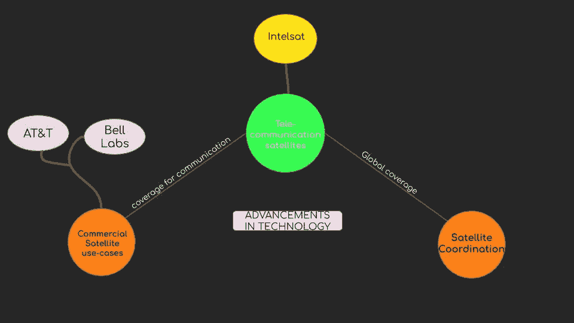
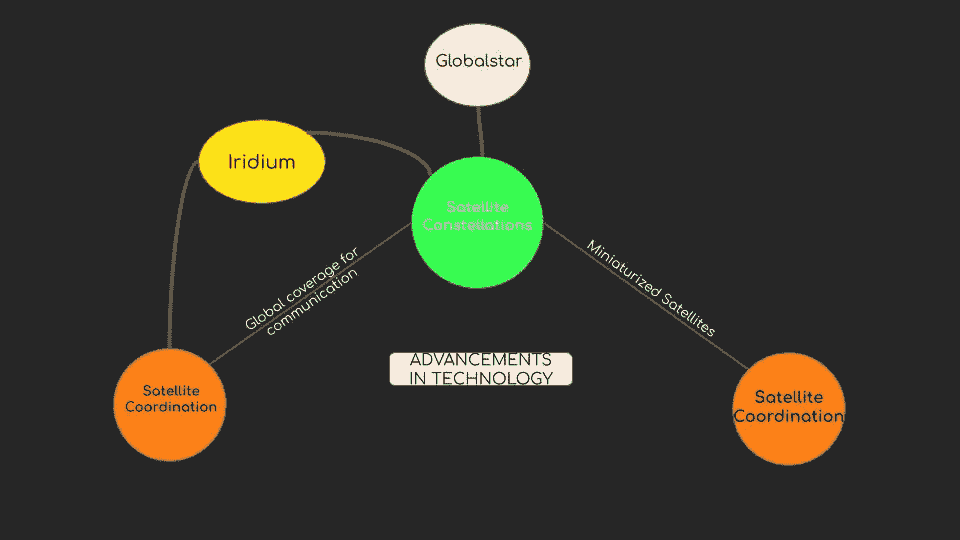
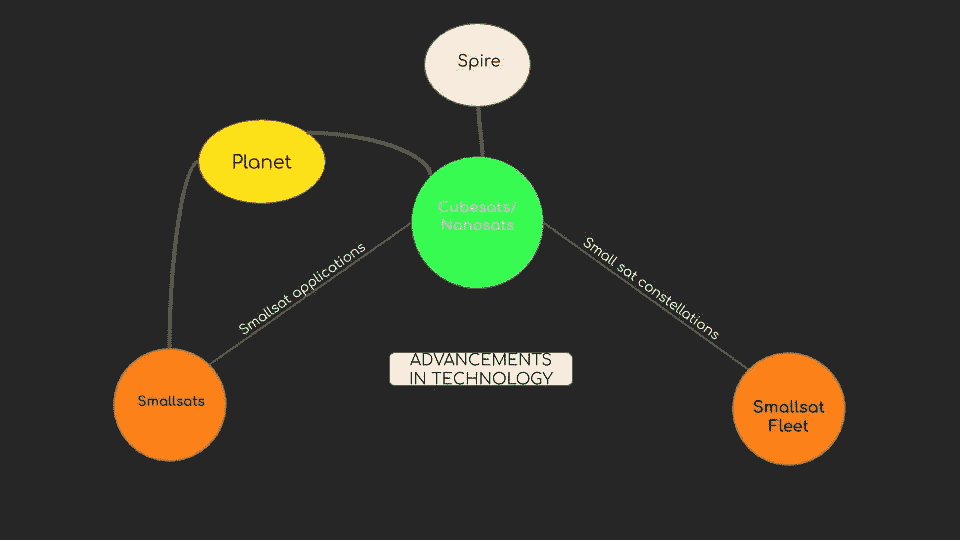
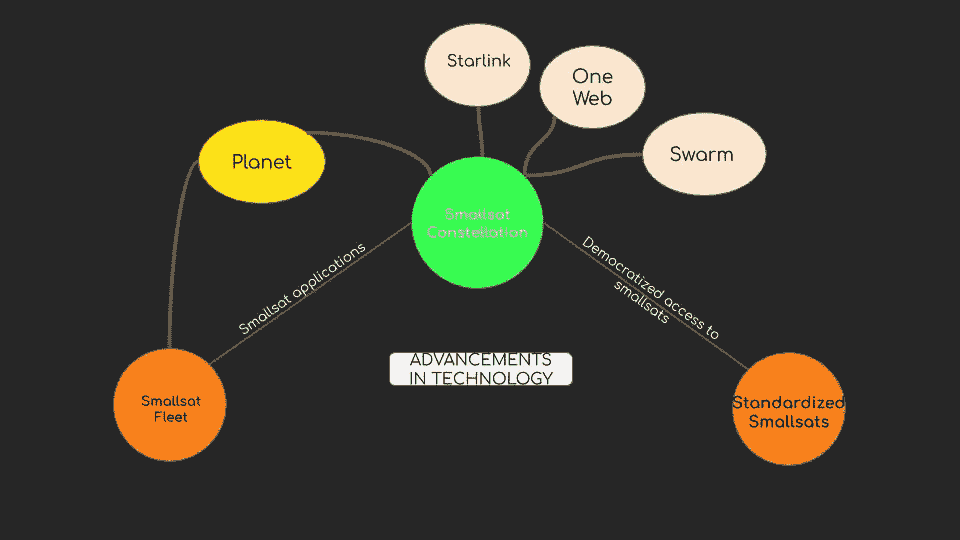
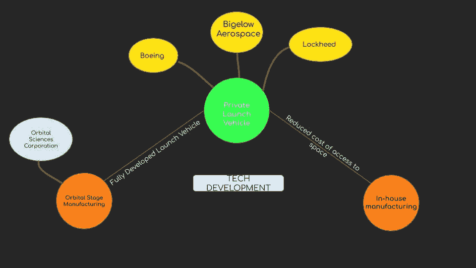
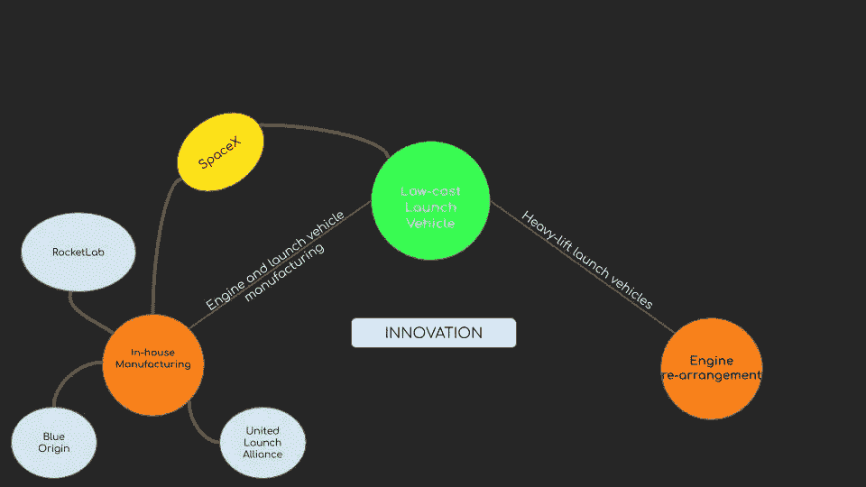
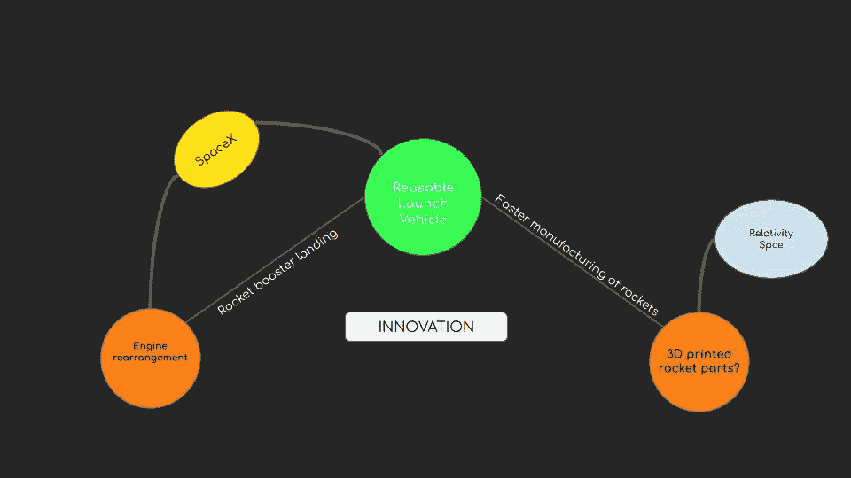

# 1.6 维度 1—空间

> 原文：<https://medium.datadriveninvestor.com/1-6-dimension-1-space-d3dbf0418ebc?source=collection_archive---------16----------------------->

***回顾:*** *这是一个中型系列，着眼于在理解巨型科技独角兽如何形成中发挥作用的不同因素(以维度表示)。你可以在这里找到* [*简介*](https://medium.com/datadriveninvestor/intro-tech-startup-unicorns-be40ed9ff9c9) *。*

***维度重述:*** *我们之前谈到了在* [*硅产业*](https://medium.com/datadriveninvestor/1-1-dimension-1-silicon-industry-869acfd8e7f8) *中如何创造新的价值机会层(表示为* [*维度 1*](https://medium.com/datadriveninvestor/dimension-1-value-creation-opportunity-at-macro-level-b205a8f05561) *)以及这些层可能在* [*人工智能*](https://medium.com/datadriveninvestor/1-2-dimension-1-artificial-intelligence-c186c9417333)*[*区块中的位置* *本帖将谈论航天领域的价值创造，包括卫星和运载火箭市场。*](https://medium.com/datadriveninvestor/1-3-dimension-1-blockchain-39d59552f173)*

* [## 准备在 2019 年改变世界的技术-数据驱动的投资者

### 很难想象一项技术会像去年的区块链一样受到如此多的关注，但是……

www.datadriveninvestor.com](https://www.datadriveninvestor.com/2019/01/17/the-technologies-poised-to-change-the-world-in-2019/) 

我们看到，在宏观层面上，通过提取稀缺的东西并使之丰富，创造价值的新机会就会出现。

**卫星市场:**

**太空竞赛:**

稀缺层:太空竞赛时代也需要太空服务来提供商业服务。通信是一个随时可以开发的市场，因为从空间进行长距离和广域通信已经成为可能。这种稀缺的资源被通信行业抽象化了。

**卫星星座:**

随着通信越来越多地从太空接入，一个新的稀缺层出现了:协调的地面覆盖，在共享控制下共同运作。铱星公司通过发射覆盖全球的卫星星座占领了通信卫星市场。

**小卫星革命:**

稀缺层:降低卫星发射和建造的大量经济成本。像 Planet 这样的公司看到了小卫星的优势，以及他们如何生产更小、更便宜、制造更快、可用于现实世界的卫星。

**太空舰队:**

稀缺层:使用卫星舰队提供全球服务。公司正在对这一稀缺层进行抽象，以绘制全球地图或提供全球互联网连接。

随着新空间革命扩大了私营工业的市场，对商业小卫星的需求也在增加。这就产生了一个新的恐惧层:标准化小卫星。OpenCosmos 正在通过建立一个小型卫星供应链来抽象出摩擦点，通过提供更便宜、更快和更小的卫星来部署，使进入太空民主化。

**运载火箭市场:**

早期的太空时代是美国和苏联之间的竞赛，他们外包了午餐车的某些阶段。出现的恐惧层:建造完全开发的运载火箭。波音、毕格罗宇航等公司抽象出这一层，为 NASA 生产火箭。

几十年来，发射火箭的价格一直在大幅上涨，直到埃隆·马斯克(Elon Musk)预见到稀缺层:运载火箭的低成本制造。Space-X 能够通过内部制造整个火箭并大幅降低发射成本来实现这一目标。

**可重复使用的运载火箭:**

SpaceX 继续改革该行业，因为他们抽象出了一个新的稀缺层:通过使火箭助推器能够在地球上着陆，使火箭可重复使用。

***接下来:*** [*量子计算*](https://medium.com/@arvindvairavan/1-7-dimension-1-quantum-computing-6e80943560e6)*