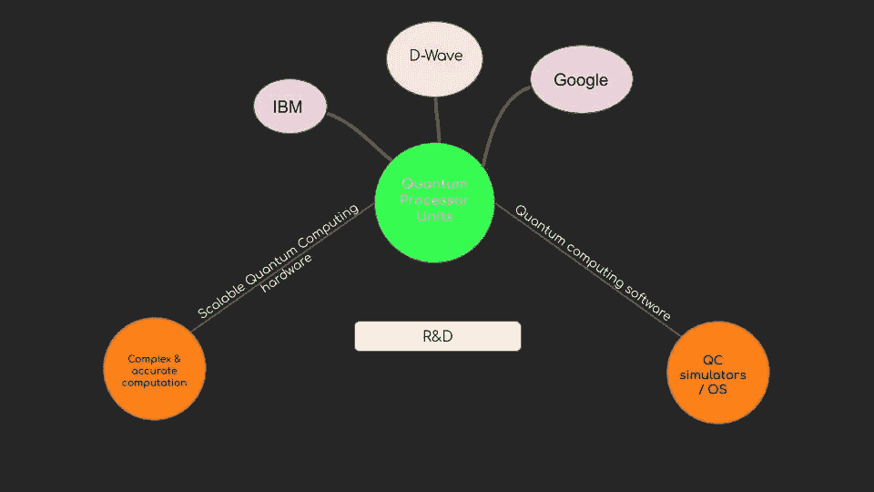
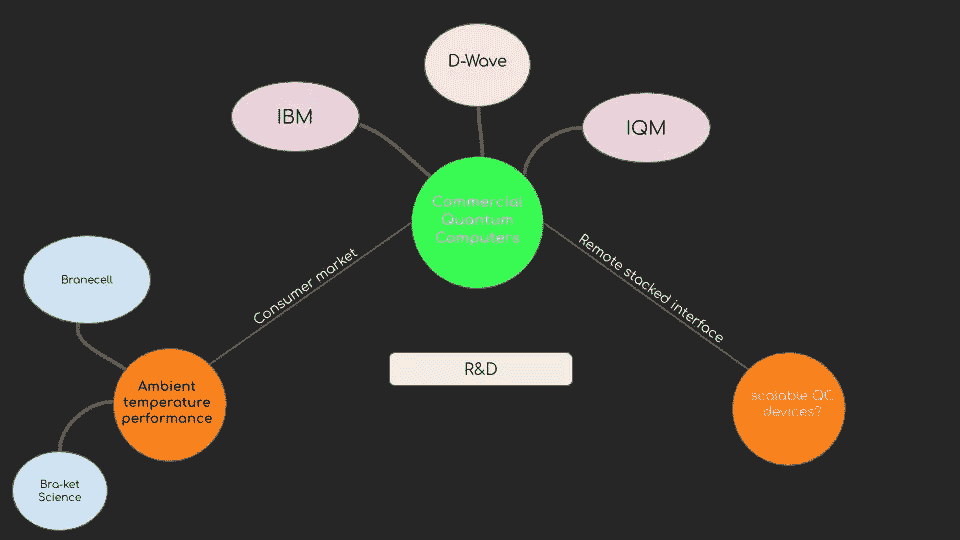

# 1.7 维度 1 —量子计算

> 原文：<https://medium.datadriveninvestor.com/1-7-dimension-1-quantum-computing-6e80943560e6?source=collection_archive---------15----------------------->

***回顾:*** *这是一个中型系列，着眼于在理解巨型科技独角兽如何形成中发挥作用的不同因素(以维度表示)。你可以在这里找到* [*简介*](https://medium.com/datadriveninvestor/intro-tech-startup-unicorns-be40ed9ff9c9) *。*

***维度重述:*** *我们之前谈到了在* [*硅业*](https://medium.com/datadriveninvestor/1-1-dimension-1-silicon-industry-869acfd8e7f8) *中如何创造新的价值机会层(表示为* [*维度*](https://medium.com/datadriveninvestor/dimension-1-value-creation-opportunity-at-macro-level-b205a8f05561) *1)以及这些层可能在* [*人工智能*](https://medium.com/datadriveninvestor/1-2-dimension-1-artificial-intelligence-c186c9417333)*[*区块链中的位置本帖将谈谈量子计算中的价值创造。*](https://medium.com/datadriveninvestor/1-3-dimension-1-blockchain-39d59552f173)*

* [## 金融科技初创公司正在扰乱世界各地的银行业-数据驱动的投资者

### 传统的实体银行从未真正从金融危机后遭受的重大挫折中恢复过来…

www.datadriveninvestor.com](https://www.datadriveninvestor.com/2018/10/20/fintech-startups-are-disrupting-the-banking-industry-around-the-world/) 

我们看到，在宏观层面上，通过提取稀缺的东西并使之丰富，创造价值的新机会就会出现。

目前的计算机处理单个比特，以二进制 0 和 1 状态存储信息。数百万比特按顺序工作来处理和显示信息。这需要巨大的计算资源量子计算机利用不同的物理现象——叠加、纠缠和干涉——来操纵信息，并以 0 到 1 之间的概率存储信息，同时执行数百万次操作。

稀缺层:建造比现代计算机快得多(一百万或更多倍)的处理器，以实现量子计算。这是一个极其复杂的挑战。近 20 年来，各公司一直在努力制造这种处理器。

由于系统提供支持以维持环境温度，量子计算硬件的尺寸非常大。一个从硅产业借来的新的稀缺层应运而生:构建一个可以远程访问的软件工具。像 Rigetti Computing 这样的公司正在提供模拟器和云服务来抽象目前的这个摩擦点。

随着技术的进步，建造比现代计算机更强大的可扩展商业量子计算机的公司将创造巨大的价值。

***接下来:*** 你可以阅读微观层面的颠覆性机会和成长性机会是如何发生的(表示为[维度 2](https://medium.com/datadriveninvestor/dimension-2-disruption-opportunity-at-micro-level-and-growth-e37f078544eb) )。)*