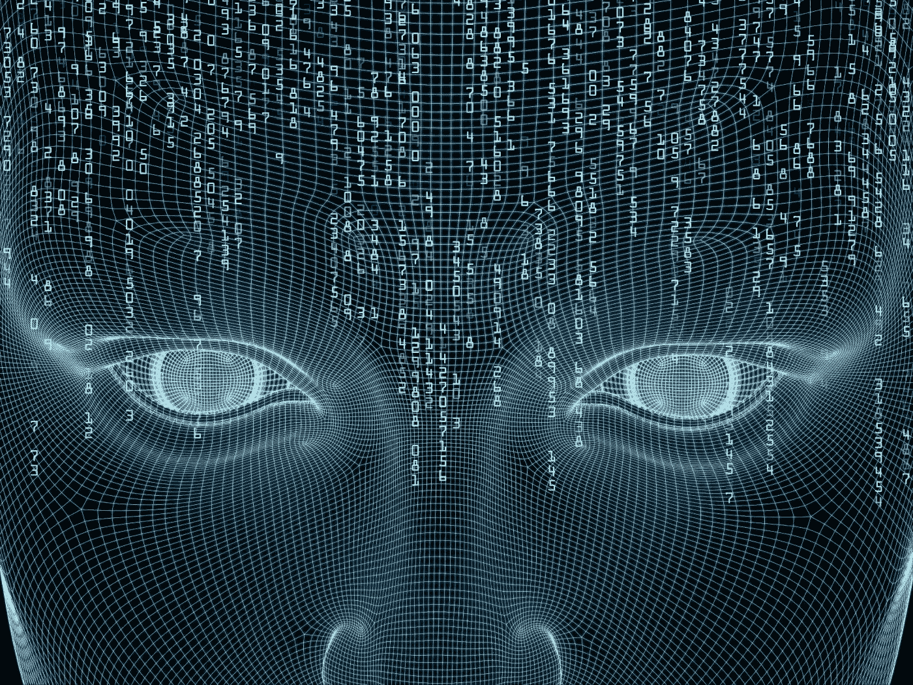
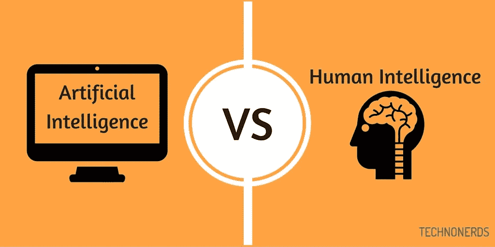
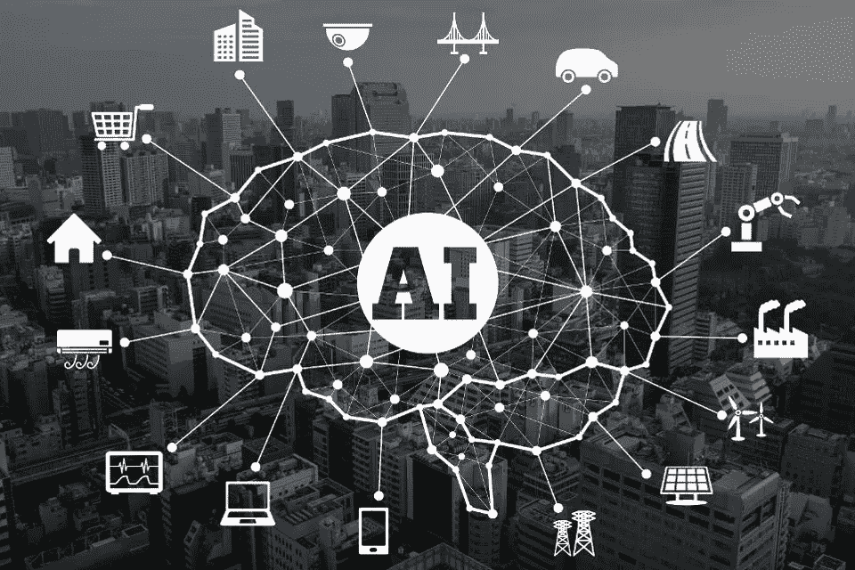
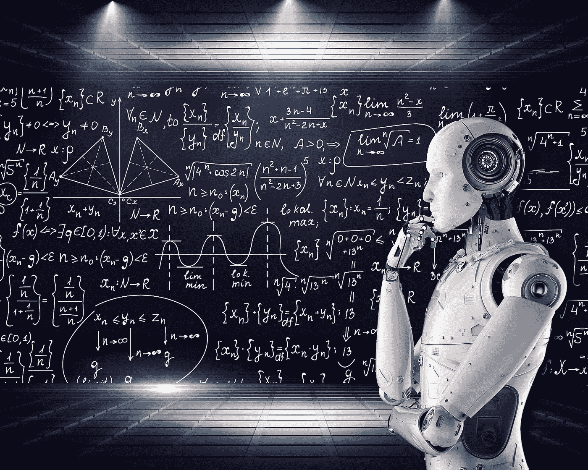

# 1.AI 是什么？

> 原文：<https://medium.datadriveninvestor.com/1-what-is-ai-6f8aff4e15d?source=collection_archive---------3----------------------->

我一直试图弄明白为什么那些未来主义的视频和人们谈论智能机器或机器接管人类的大惊小怪。AI 到底有多恐怖？这真的是我们今天需要担心的最大挑战吗？但是等等，AI 到底是什么？它是如何工作的？为什么它会让最懂技术的人也感到害怕。人类是注定的吗？

**免责声明:**许多内容都是从 Tim Urban、Pedro Domingas 和 Chamath Palihapatiya 撰写的演讲和文章中借用和改写的。

在这里，我试图构建人工智能意味着什么，它拥有什么力量，是好是坏。它为人类的未来准备了什么？

**什么是人工智能(AI)？**
简单来说，人工智能不过是一种软件，旨在对某个问题领域做出智能决策或准确预测。

人工智能今天无处不在，通常被认为是连接现实世界和虚拟世界的来源。除了人工智能在未来所有令人恐惧的应用之外，一个简单的事实是，人工智能背后的代码或核心技术几十年来都没有改变。还没有根本性的突破，唯一改变或者说进化的是设备的计算能力，这有助于更快地处理数据。有一些流行词汇在流传，未来人工智能确实存在一些风险(我们将在后面探讨)，但目前的情况是半个世纪或更久以前开发的技术的微调版本。

**为什么叫 AI？动物，包括人类在内的一个超集，具有解决问题的天性，我们将其归因于智能。这包括从自然传感器获取输入，并使用我们的大脑来计算潜在输出的概率并采取行动。这正是人工智能要模仿的。AI 是机器或计算机程序思考和学习的能力。人工智能的概念是基于制造能够像人类一样思考、行动和学习的机器的想法。**

人工智能可以分为三个部分。

**1。人工狭义智能(ANI)**
ANI 是我们今天在我们周围看到的东西——在亚马逊、Spotify、脸书、Go 用例中——所有这些都涉及执行特定的任务，而没有明确的编程如何执行。换句话说，给 ANI 一组输入，并要求它在给定的约束条件下计算不同的可能解，以获得最有效的输出。在某一特定领域的某一特定事情上，ANI 比人类做得更好。

随着更多的数据集和实时数据流变得可用，以及算法被微调以处理这些数据，我们一定会在未来几年看到各种领域中的大量新应用。无人驾驶汽车、智能助理手机、互联网搜索算法、票价分析、个性化广告、游戏，甚至军事、制造、医药和金融等领域。例如:帮助放射科医生在 X 射线上检测潜在的肿瘤，通过聊天机器人回复简单的客户服务查询，在给定的时间和地点以最优惠的价格预订酒店。

**2。人工通用智能(AGI)**
【AGI】表示全面的人工智能和跨不同地区的智能，或者换句话说，AGI 将能够像我们人类一样理解世界，拥有学习如何执行广泛任务的能力。这包括推理和从经验中学习，就像人类在智力水平上所做的那样，包括社交技能、创造力、智慧、科学、工程、文学。目前还没有，但可能会随着时间的推移而发展。

理论上，人工智能可以完成任何人类可以完成的任务，也可能完成许多人类无法完成的任务。AGI 将能够把类似人类的灵活思维和推理与计算优势结合起来，例如近乎即时的回忆和瞬间的数字处理。虽然你不能向阿尼询问约会或职业建议，但有一天向 AGI 人询问将是难以理解的。也许吧。

我们将在第三篇文章中讨论如何从阿尼到 AGI。

**3。人工超级智能**
ASI 可以超越人类的智能和人类能做的一切，以及计算机目前能做的一切。它可以思考人类无法思考的抽象概念。人类的大脑是由神经元组成的，因此受到数十亿个神经元的限制。也许一个 AGI 可以建立一个 ASI。如果你在等着我给你一个人工智能可以做什么的例子，我很抱歉，我，甚至爱因斯坦，将无法理解这些可能性，除了讲述世界末日的场景或乌托邦世界。更多信息即将发布。

[2。AI 是如何创造价值的？](https://medium.com/datadriveninvestor/2-how-does-ai-create-value-a0f352167c83)

[3。AI vs 人类进化](https://medium.com/datadriveninvestor/3-ai-vs-human-evolution-a778c49896ac)

[4。人类无法理解的人工智能](https://medium.com/datadriveninvestor/4-ai-beyond-human-comprehension-1ec7125b71b)

[5。人工智能的未来——电子人？乔布斯？](https://medium.com/@arvindvairavan/5-future-of-ai-cyborgs-jobs-1b67eeb7400d)

*image credits*:[future flife](https://futureoflife.org/background/benefits-risks-of-artificial-intelligence/)， [Work-it-Software](http://www.workit-software.com/2018/06/02/machine-vs-human-artificial-yes-intelligence-no/) ， [BecomingHuman.ai](https://becominghuman.ai/what-is-artificial-intelligence-ai-4bde325e5462) ， [HackerNoon](https://hackernoon.com/blockchain-artificial-general-intelligence-benefit-humanity-230e213cae12)