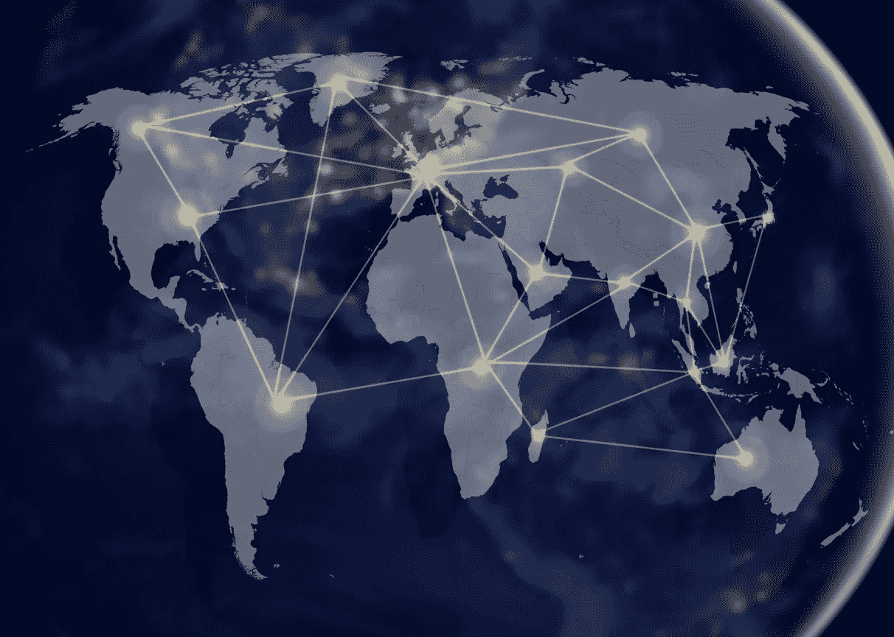
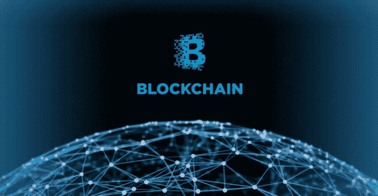

# 1.为什么是区块链？

> 原文：<https://medium.datadriveninvestor.com/1-why-blockchain-a00012d328a7?source=collection_archive---------32----------------------->

两年前，我开始听说比特币，我所有的朋友都告诉我，“如果他们在 2000 年代末的早期阶段投资比特币，他们现在会是百万富翁”。我不可能不注意它。最终，炒作抓住了我，我很好奇比特币是什么。一种数字货币？那是什么意思？为什么值这么多钱？

我听说了比特币白皮书，我下意识地决定不读它，因为害怕我什么也看不懂。一年后，好奇心战胜了我，我无法理解大多数技术术语。我让它思考“也许”，这不是我的那杯茶。

两年后，我在这里试图从根本上解释为什么我们需要区块链，它是什么？我写这篇文章不是为了教任何人，而是为了帮助我理解它的确切含义。

**免责声明**:大部分内容都是从 [Naval Ravikant 那里借用并重新编排的。](https://twitter.com/naval)(如果你还不认识他，那就跟着他，向他学习。)

所以。**为什么是区块链？**

区块链有潜力用市场取代网络。

**什么是网络？**
为了传输数据/信息/知识而连接在一起的一组人/计算机/事物。

**什么是市场？**
市场是多种多样的系统、机构、程序、社会关系和基础设施中的一种，通过这些系统、机构、程序、社会关系和基础设施，各方进行有价值的交换(货币、物物交换等)。)

人类天生就是网络物种。我们已经进化到基于虚拟现实、共享经济、共同利益或血缘关系的跨界联系。

**我们创建了哪些不同类型的网络？**
我们选择相信的任何类型的**虚构现实**:
金钱是一个网络。宗教是一个网络。
国家是一个网络，公司是一个网络。
任何种类的**物理、精神或数字连接**使我们能够转移:
道路是一个网络。电是一个网络。大学是一个网络互联网是一个网络。

从狩猎采集社会到大家庭，从宗教到企业，从国家到社会网络，这些网络帮助我们合作并分享利益。网络是由一套规则管理的，从历史上看，这些规则是由自上而下的统治者制定的。

农业社会——地主
帝国——国王和君主
宗教——牧师
国家——暴民、政客和独裁者
公司——资本家和精英
互联网——科技巨头

统治者有多重目标 :
1。个人成长和/或网络成长
2。安全和保护免受入侵者，小偷和骗子。

每个网络都有它的优点和缺点。

基于资本主义的公司创造了财富，但扩大了社会的经济差距。
建立在社会主义基础上的民主是机会均等的，但不是任人唯贤或高效的。
大学有时候是，开放不开放。有时候，不管是否精英化。一个在线网络提供了获取信息的途径，但却充斥着骗局，缺乏可信度。

金钱在网络中扮演什么角色？
“20 世纪创造了一种新的网络——市场网络。开放和任人唯贤。
市场的价值取决于资源的投入。资源就是金钱，一种冻结的、可以交易的时间。
市场网络是巨人。信贷市场。
股市。商品市场。货币市场。
他们破坏国家。

市场网络在有资金承诺的地方发挥作用。否则，他们只是暴民网络。应用是有限的。"

因此，下一个合乎逻辑的需求是——**一个没有统治者的开放的精英网络，价值的应用可以建立在这个网络上。这正是区块链试图解决的问题。**

区块链将民主和互联网的开放性与市场的优点结合在一起。

**开放**——任何人都可以成为其中的一部分。
**任人唯贤**——任何推进网络发展的人都会得到相应的报酬。价值可以指安全性、计算、预测、关注度、带宽、功率、存储、分发、内容。
区块链用自己的硬币进行补偿，**加密货币**。

[2。什么是区块链？](https://medium.com/@arvindvairavan/2-what-is-blockchain-87e7a8932394)

[3。钱是什么？](https://medium.com/@arvindvairavan/3-what-is-mone-923ade1f41e8)

[4。区块链是如何运作的？](https://medium.com/@arvindvairavan/4-how-blockchain-works-947dc8124e35)

[5。区块链面临的挑战是什么？](https://medium.com/@arvindvairavan/5-what-are-the-challenges-with-blockchain-6b9e51cec4a4)

原贴[此处](https://deltavlabs.wordpress.com/2019/01/14/1-why-blockchain/)。

[earn.com/dnivrav](http://earn.com/dnivrav)

*image credits:*[*阿格德尔大学，*](https://www.uia.no/en/news/student-entrepreneurs-using-blockchain-technology-to-develop-a-new-exciting-app-deegram)*[*CABEM*](https://www.cabem.com/2012-olympics-inspired-iso-20121/network-and-world-mapnetworking-concept/)*，*[*hacker noon*](https://hackernoon.com/blockchain-for-authentication-benefits-and-challenges-94a93f034f40)*