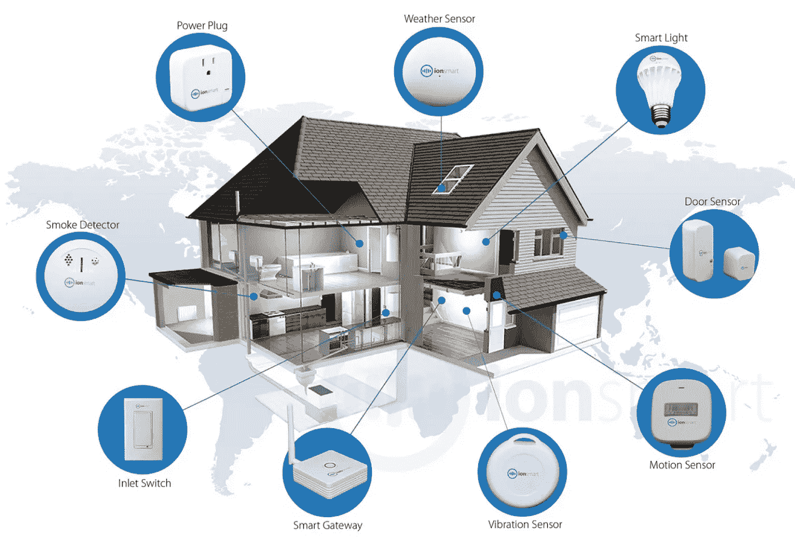
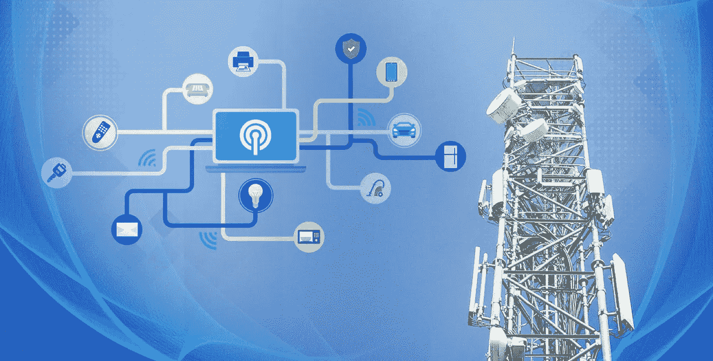
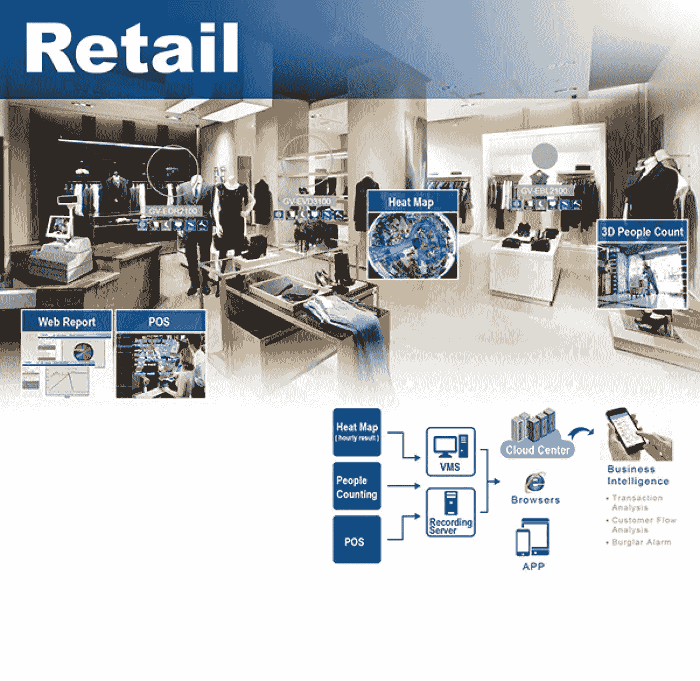
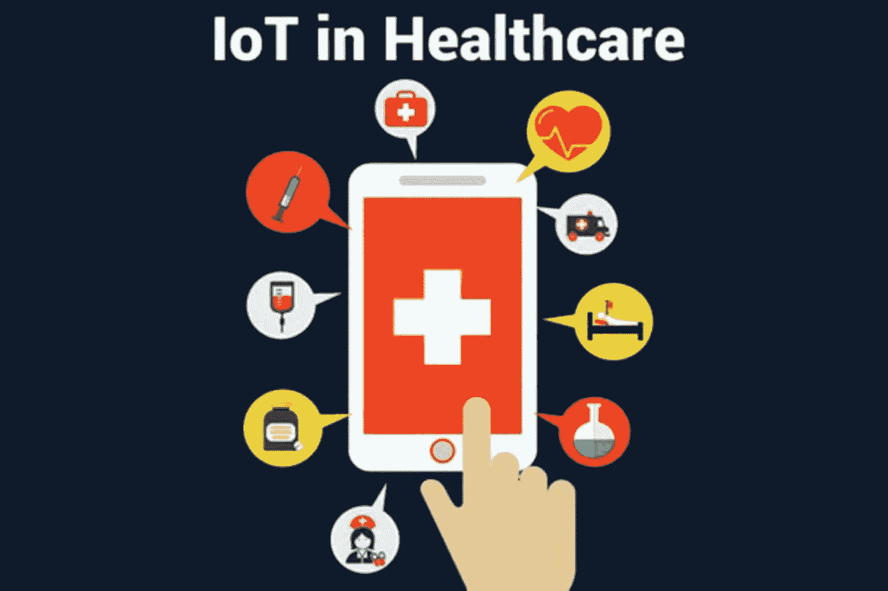
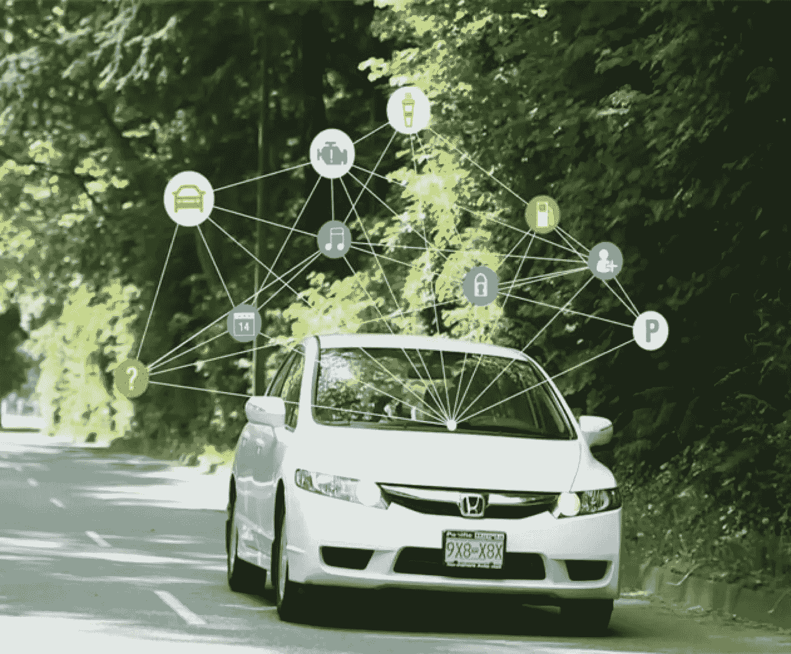
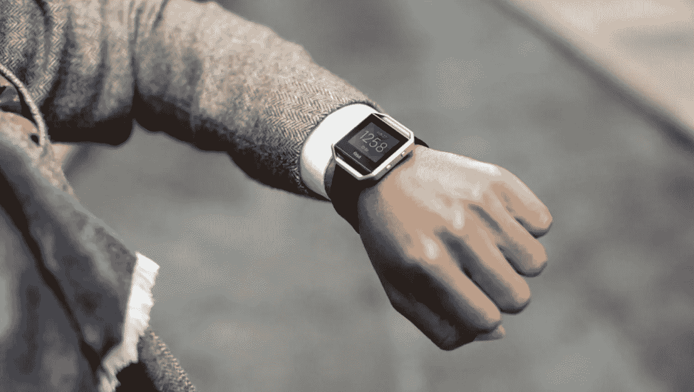
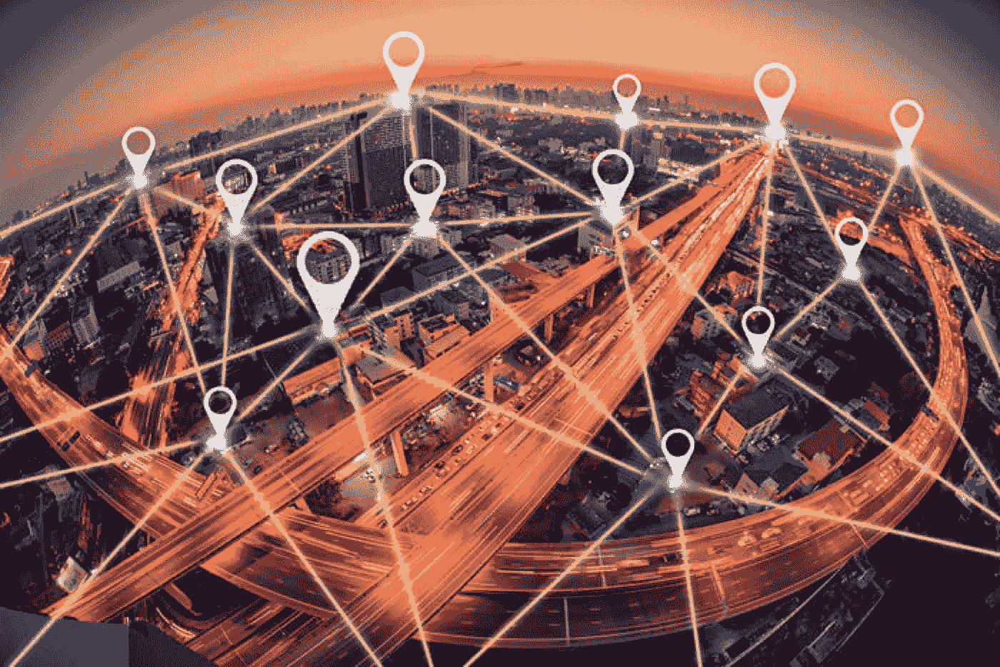
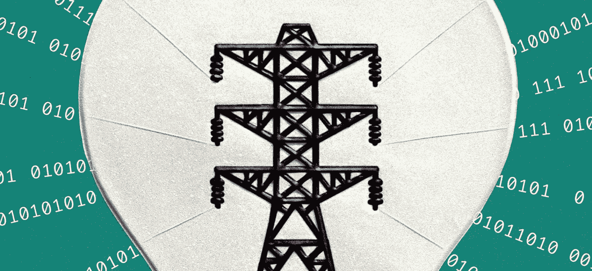

# 取自现实生活的 10 个物联网应用惊人案例

> 原文：<https://medium.datadriveninvestor.com/10-amazing-cases-of-iot-applications-taken-from-the-real-life-a8682cdb48d0?source=collection_archive---------0----------------------->

**物联网的 10 个应用——真的有这么多案例吗？**

大概，你听过一句话，这几天物联网(IoT)占领了世界。你很有可能会质疑这种说法——因为它太响亮、太雄心勃勃了。但如果是真的呢？这个怎么查？事实上，让你相信物联网应用程序数量众多，种类繁多，足以适应人们的多样化需求是这篇文章的主要任务。为了实现这一目标，我们展示了构成我们日常生活基础的十个不同领域的物联网应用示例。

这就是已经占据当代市场并出现在当前业务运营中的 10 大物联网应用。而且更重要的是:在这些维度上牢牢确立了自己的位置。

**#1 智能住宅**

物联网应用如何装备室内空间的解释值得单独发布——物联网在这里提供了如此多的产品。在我们这里可以勾勒出的最佳物联网应用想法中，您有机会通过智能恒温器、空调、扬声器、宠物喂食器和许多其他技术创新来改善您的空间，这些技术创新旨在方便和控制家中的日常操作。作为所展示的 10 大物联网应用中最受欢迎的领域，它也是近期最有前景的领域，因为它带来了广阔的成本效益前景。

**#2 物联网在农业中的应用**

农民非常依赖智能设备，并将其应用于农业和牲畜管理。就性能和有效性而言，该地区最佳的物联网应用包括无人机、各种检查土壤成分和预测气候变化的工具，以及检测畜群成员疾病并跟踪其位置的物联网应用。在这种情况下，物联网在该领域非常有用，它使以前需要人类付出巨大努力的工作自动化。这种重要的便利性使这个例子在物联网的 10 个应用列表中名列前茅。

**#3 工业物联网**

物联网在行业中的应用非常广泛，甚至需要创建一个专门的物联网术语。说真的，工业物联网应用理念的清单令人印象深刻。这里要提到最好的物联网应用，有传感器、程序、软件系统，以及用于未来设计和适当计算的大数据分析。此外，这些机器提高了生产率，纠正了人类经常犯的错误，尤其是在质量控制和可持续发展方面。因此，物联网的工业应用完全有机会继续占领该领域并提升市场。

**#4 零售和物联网应用创意**

在零售领域的物联网应用示例中，有大量使用智能设备来增强店内体验的案例。具体来说，这里物联网的各种应用意味着智能手机使用的能力(由 Beacon 技术支持)促进了零售商和买家之间的沟通——最想要的商品和服务在正确的地方和正确的时间出现在客户的眼前。此外，智能零售在精准广告、改善供应链周期和需求模型的实际分析方面为物联网应用创造了机会。最后，物联网的应用已经包括 NFC 支付和智能购物应用，您可以在购物时使用这些应用。

**#5 最佳医疗保健物联网应用**

在物联网的十大应用列表中，健康领域值得占据特殊的位置。它直接影响人类生活，说明了互联医疗作为一个领域的重要性。在物联网应用的主要成就中，与此相关的是通过互联网提供医疗援助、使用无人机和改善遗传医学的能力。此外，物联网的应用有助于创建更个性化的健康分析方法和更一致的疾病防治策略。与此同时，物联网应用的发展在现阶段仍会遇到障碍和争论，特别是当物联网应用与传统医学发生冲突时。尽管如此，这个领域的发展已经不可阻挡。

**#6 智能汽车**

大多数尝试驾驶智能汽车的人都支持一个想法，即它应该被列为当前可用的最佳物联网应用之一。此外，无人驾驶汽车(目前作为原型存在)提升了想象力——有了它，出租车基于人工智能工作并安全准确地将乘客带到目的地的世界似乎很快就会成为现实。我们已经可以享受的是联网汽车——一种配备了大量传感器和互联网连接的物联网应用，以保证驾驶体验的最大舒适度。在这种情况下，汽车的具体物联网应用包括特斯拉远程车库门打开和内部温度控制的实验，以及管理车辆速度、位置和电池存储的应用框架。

**#7 可穿戴设备**

物联网的这种应用将一组设计用于佩戴在身上的技术设备结合在一起，并通过智能手机上的应用程序来实现。事实上，球体的发展与互联医疗保健中的各种物联网应用密切相关-因为可穿戴设备适合检查基本的健康指标和改善治疗。在这个市场的主要参与者中，物联网应用程序主要由苹果、三星和摩托罗拉设计，这意味着健身手环、GPS 跟踪带、可植入小工具和许多其他物联网应用程序。

**#8 智慧城市**

对于整个城市，基本的物联网应用包括智能停车、结构健康、噪声地图、智能照明和智能道路。尽管这组物联网应用程序还处于开发阶段，而不是现实，但安全增加的前景以及更智能的交通和污染控制的承诺使其在现实生活中的出现不可避免。只是时间问题。

**#9 供应链和物联网**

特别是，供应链的最佳物联网应用大多是指准确跟踪货物、更好的装运操作外观以及与关键利益相关方的透明信息交换。此外，物联网的应用在最大限度地减少对人力的需求方面有很大的好处，这在逻辑上导致了优化的成本效益和增强的自动化。

**#10 能源行业物联网应用实例**

能源领域技术革命的成就非常突出，值得在十大物联网应用中提及。确切地说，电网的设计通过自动收集数据和提供电力流通的即时分析来改变消费规则。由于物联网的这些应用，客户和供应商都更好地理解了如何优化资源的使用。

所以，就这样了。正如所提交的物联网十大应用清单所示，该技术已经在人类生活的主要领域展现出卓越的成果。所以，基本上，这篇评论开头的问题的答案是，“哦，是的。”

对这种答复的信心只会随着时间的推移而增长。