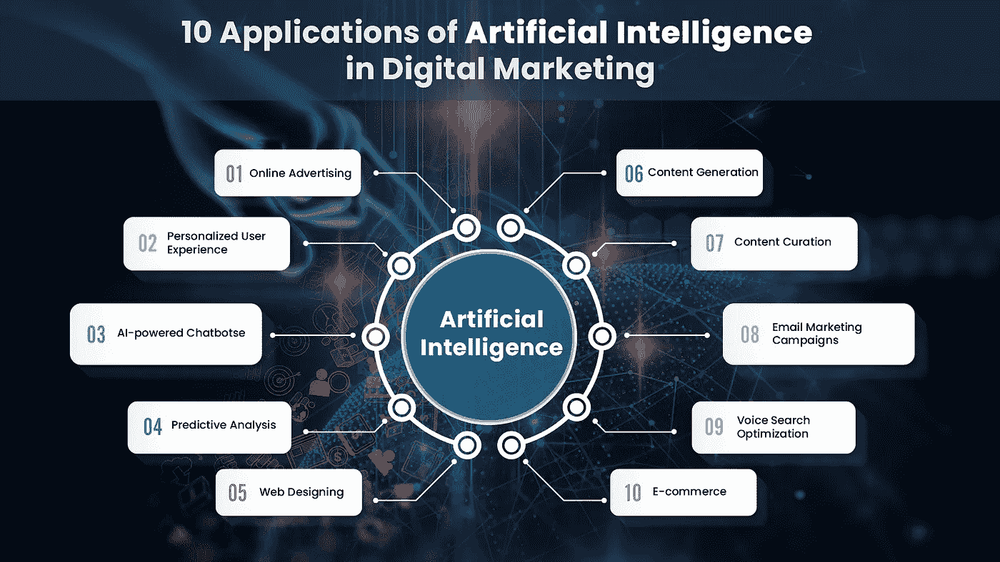

# 人工智能在数字营销中的 10 个应用

> 原文：<https://medium.datadriveninvestor.com/10-applications-of-artificial-intelligence-in-digital-marketing-a562a37db2bd?source=collection_archive---------3----------------------->

人工智能已经标志着它在几乎每个行业和各行各业的存在。它不仅减少了各种操作中的人工干预，还帮助人类更好地完成工作。

社交媒体、消费电子、机器人、旅游和交通、金融、医疗保健、安全、监控、电子商务等领域。已经从人工智能中受益。

 [## 今年值得关注的 5 大人工智能趋势|数据驱动的投资者

### 预计 2019 年人工智能将取得广泛的重大进展。从谷歌搜索到处理复杂的工作，如…

www.datadriveninvestor.com](https://www.datadriveninvestor.com/2019/02/19/artificial-intelligence-trends-to-watch-this-year/) 

数字营销和人工智能齐头并进。在数字营销中，需要处理大量数据。人工智能有助于数字营销人员更快地处理数据，从而更高效地制定数字战略。

人工智能在数字营销方面的能力是巨大的。以下是人工智能革新数字营销的十种方式。

# 排名第一的在线广告

在线广告是数字营销最重要的元素之一。它有助于企业快速接触到目标受众。

我们今天看到的大多数在线广告都是由人工智能驱动的非常复杂的交付系统运行的，这被称为“程序化广告”

该计划促进了广告空间的买卖。它进行拍卖，这些广告空间在几毫秒内被买卖。

在人工智能出现之前，市场营销人员需要进行深入的研究，以找出合适的平台来营销他们的业务。如今，这项研究由人工智能完成，它减少了营销人员的负担，让他们专注于数字战略的其他重要方面。

# #2 个性化用户体验

"个性化是新的时尚。"根据 Evergage 的调查，96%的营销人员认为个性化是提供出色客户体验的关键。

人工智能已经使每天弄清楚数百万人的好恶、行为模式、兴趣和活动成为可能。它通过收集和分析用户数据，同时考虑地理、人口统计、设备、地理等因素来做到这一点。

个性化程度越高，转化的机会就越大。此外，人工智能还有助于与客户建立更好的关系。

# #3 人工智能聊天机器人

人们经常混淆标准聊天机器人和人工智能聊天机器人。人工智能聊天机器人是标准聊天机器人的高级版本。

与标准聊天机器人不同，人工智能聊天机器人可以人性化地与用户交谈。这些聊天机器人的另一个优点是，当用户问任何问题时，它们都不会发脾气。

人工智能聊天机器人可以同时回应多个客户的查询。自动回复是如此个性化，它可以追求任何用户购买你的产品或服务。

# #4 预测分析

我们知道人工智能擅长处理数字和分析数据。人工智能使用统计模型和软件，通过研究客户过去的行为和特征来预测他们未来的行动。

通过这种方式，人工智能有助于营销人员更多地了解他们的客户，例如他们对特定产品的预期价格。基于这些数据，AI 还可以预测客户在产品升级中期望什么样的功能。

营销人员可以利用这些数据来创建标语和开展活动，从而吸引更多的客户并增加转化的机会。

# #5 网页设计

在没有 HTML、CSS 和 JavaScript 知识的情况下开发一个网站似乎是一件不可能的事情。但是，人工智能使这成为可能。像 Wix 这样受欢迎的网站构建者使用 AI 来构建网站。

我们需要输入的只是内容、行动号召、图片和页面布局。好了，你的专业网站已经准备好了。 [Wit.ai](https://wit.ai/) 和 [Dialogflow](https://dialogflow.com/) 分别是脸书和谷歌提供的免费人工智能服务，开发者可以用它们来建立网站。

# #6 内容生成

你可能想知道这怎么可能？然而，这是真的。AI 还可以为你的网站、产品、服务等生成内容。而且，它还可以为某新闻网站写影评的内容。

通过处理几 TB 的数据和分析成千上万的内容，它可以生成类似人类的内容，帮助您吸引用户。像美联社和 Forbs 这样的流行出版物已经在使用内容生成工具，如 [Wordsmith](https://automatedinsights.com/wordsmith) 、 [Quill](https://www.quillcontent.com/) 和 [Articoolo](https://articoolo.com/?lang=en) 。

# #7 内容监管

事实证明，在所有营销策略中，内容营销的投资回报率最高。内容营销的两个主要方面是内容生成和内容监管。

内容通常是从其他类似的内容中获得灵感而产生的。人工智能还可以用来搜索与我们感兴趣的话题相关的内容。

像 [Concured](https://www.concured.com/) 和 [BuzzSumo](https://buzzsumo.com/) 这样的工具是人工智能支持的。它们帮助您搜索当前流行的内容，并相应地规划未来的内容，重建现有的内容，对其进行安排，然后进行分发。

网飞的电影/电视节目推荐和亚马逊的产品推荐是基于人工智能的内容监管的很好的例子。它通过根据客户的兴趣显示相关内容，为客户提供个性化的用户体验。

内容生成是艰难的。据 [Adobe](https://www.adobe.com/insights/the-magic-of-AI-in-a-content-driven-world.html) 称，47%的营销人员认为大规模产生内容很困难。人工智能支持的内容监管可以帮助他们更快地大规模生产内容。

# #8 电子邮件营销活动

在这个自动生成电子邮件的时代，人们期待与他们相关的个性化/量身定制的电子邮件。AI 可以通过分析用户行为和偏好，帮助你为你的电子邮件营销活动发送定制的电子邮件。

AI 分析数千 GB 的数据，以获得抓住客户注意力的正确标题和主题行。它还可以找到合适的时间、日期和频率来拍摄电子邮件，这进一步增加了转换的机会。

# #9 语音搜索优化

根据 Gary Vaynerchuck 的说法，通过移动设备完成的每 4 个谷歌搜索中就有 1 个是语音搜索，这标志着语音搜索优化的重要性和必要性。

营销人员必须时刻意识到这些革命性的变化。谷歌的 RankBrain 等工具可以帮助你优化网站的语音搜索。这也会帮助你增加常规搜索带来的有机流量。

# #10 电子商务

人工智能如果使用得当，可以给电商企业主带来海量的冲击。从建立网站和网站内容开始，到提供产品建议，再到管理库存和提供客户支持，AI 可以做任何事情。

人工智能在电子商务销售预测、竞争对手市场研究、寻找客户搜索趋势等方面也发挥着至关重要的作用。

# 最后的想法

营销人员需要了解人工智能在营销中的重要性，因为它将成为数字营销甚至销售的下一件大事。

人工智能开发公司的迅速崛起证明，它们将在软件行业发挥巨大作用，就像十年前移动应用开发服务公司发挥的作用一样。

数字营销中的人工智能正处于成长阶段。这意味着它的有效性和效率将随着时间的推移而提高。如果说有什么合适的时机让人工智能应用于创造有效的营销策略，那就是现在。