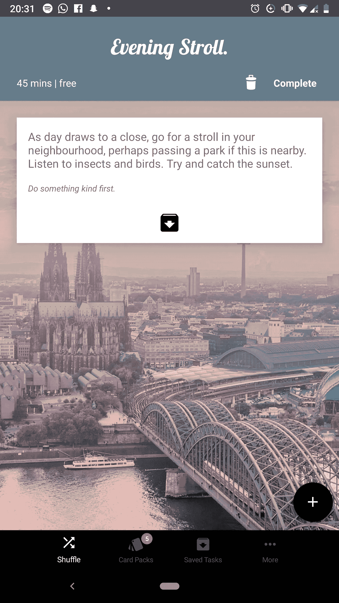
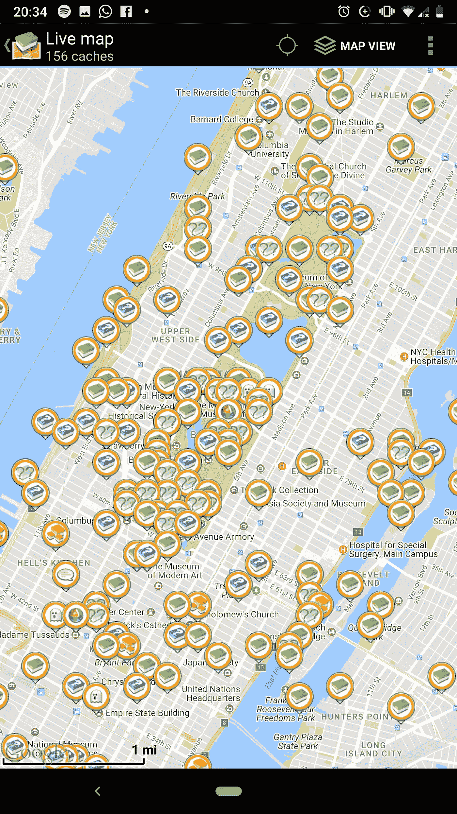
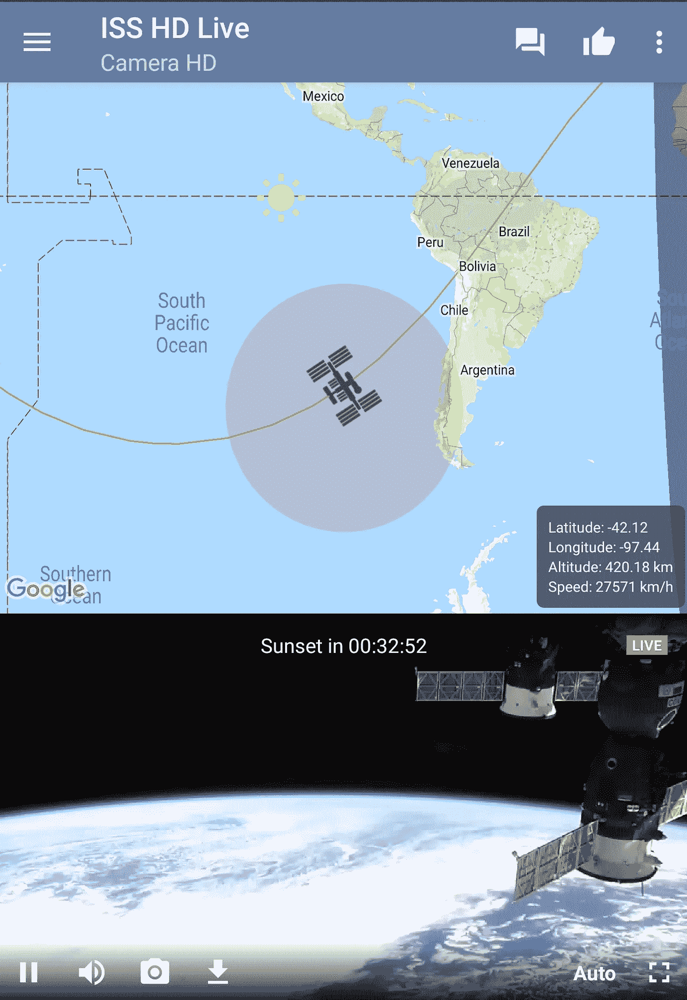
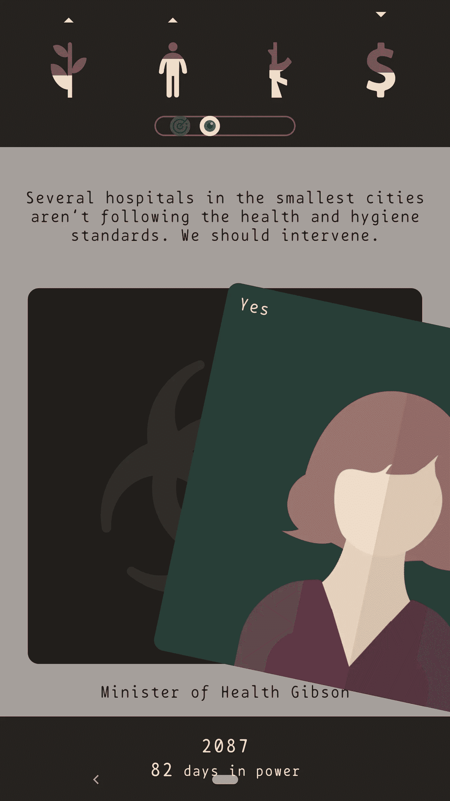
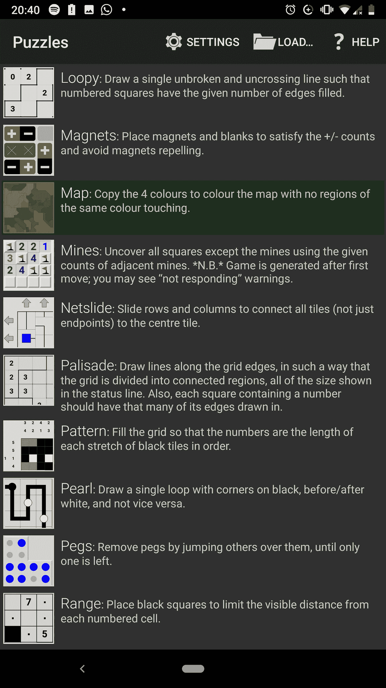
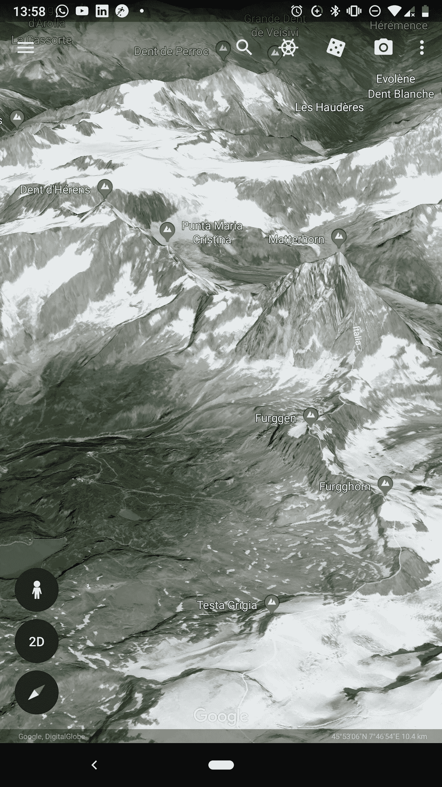

# 10 款简单有趣的应用

> 原文：<https://medium.datadriveninvestor.com/10-apps-that-are-just-plain-fun-c3a6e7ad360e?source=collection_archive---------12----------------------->

## 如何应对无聊

## 1.打乱我的生活

这个应用程序是你解决无聊所需的一切。它帮助你发现新的爱好或联系旧的爱好，以非传统的方式认识新的人，或参观和了解你一直想去的地方。Shuffle My Life 的明确目的是消除无聊，它有一个光滑的界面，你可以根据天气情况、你有多少空闲时间、花费多少(去公园和看云是完全免费的)、你是想出去还是想在室内放松等等来完成数百项任务。它看起来很舒服，并试图拥有一个极简的设计界面。这个应用程序通过其创造性的想法和任务的游戏化，让我的生活越来越有趣。

[ [安卓](https://play.google.com/store/apps/details?id=com.gadsby.shufflemylife) ] [ [iOS](https://itunes.apple.com/us/app/shuffle-my-life/id1143675104?ls=1&mt=8)

## 2.纪念碑谷 2

在这个美丽的游戏中，巧妙的、令人费解的、美学上令人愉悦的图形设计的魔力汇集在一起。其前身的巨大成功意味着纪念碑谷 2 的开发者有了*的不朽*任务，制作一个更宏大、更好的游戏和男孩，他们做到了。游戏的关卡设计，看起来不可能的结构(想想彭罗斯三角形，现在增加了维度的数量)和充满活力的调色板，加上舒缓的音乐，有一种平静的效果，同时让你感觉聪明。这个视觉杰作值得你付给开发商的每一分钱。

[ [安卓](https://play.google.com/store/apps/details?id=com.ustwo.monumentvalley2) ] [ [iOS](https://itunes.apple.com/us/app/monument-valley-2/id1187265767?mt=8) ]

Impeccable graphics, right?

## 3.c .地理

地理藏宝最近越来越火了。这是一个很酷的想法，可以让你走出家门，帮助很多人享受锻炼的乐趣，也是结交新朋友的好方法。c.geo 允许你发现你附近的物理“缓存”,找到它们并跟踪你的进展。该应用程序维护良好，不需要特殊的可疑权限，离线工作，完全免费使用。这是 OG 口袋妖怪 GO。这个真的不会错。去跑步，探索你的(或任何)邻居！

[ [安卓](https://play.google.com/store/apps/details?id=cgeo.geocaching)

## 4.ISS 高清直播

你是否有时会觉得自己是一块潮湿岩石上的一粒微不足道的星尘，漂浮在不可逾越的浩瀚太空中？人类确实有能力做这么多不可思议的事情，你还需要这种证明吗？这是给你的应用程序。国际空间站高清直播向你展示国际空间站高清摄像机拍摄的地球实况视频。它还可以帮助你确定国际空间站的确切位置，以防你想瞥见它以超过 17，000 英里/小时的速度从头顶飞过。在我看来，这是羞辱自己的绝佳方式。

[ [安卓](https://play.google.com/store/apps/details?id=com.nicedayapps.iss_free)

## 5.艺术和文化

有时候，你需要看艺术。它可能令人困惑，令人惊奇，甚至有治疗作用。谷歌的艺术和文化计划与世界各地的博物馆和美术馆合作，推出了这款应用程序，允许您查看历史和艺术作品，无论是标志性的还是模糊的，并了解更多有关它们的信息。在大都会博物馆进行一次虚拟旅行，或者去那里，近距离拍一张艺术品的照片并阅读相关资料。管理你个人收藏的怪异色情艺术品，或者找到最近的美食博物馆。了解现代艺术到底是怎么回事，这样下次你在纽约现代艺术博物馆和别人交谈时，你就不会喋喋不休地说“一个幼儿园的孩子怎么能做出这样的东西！”(是的，这就是重点，他们想让每个人都更容易接触到艺术，这个想法是把它变成一个更少的视觉媒体，更多的智力媒体，上帝！)额外收获:[艺术与文化 VR](https://play.google.com/store/apps/details?id=com.google.vr.museums) 只是最棒的白日梦应用程序。

[ [安卓](https://play.google.com/store/apps/details?id=com.google.android.apps.cultural&hl=en_US) ] [ [iOS](https://itunes.apple.com/us/app/google-arts-culture/id1050970557?mt=8) ]

## 6.非常糟糕的象棋

你擅长下棋吗？你还好吗，还在努力学习吗？还是你就是不擅长这个？好吧，真正糟糕的象棋对你来说是一个很好的象棋练习者。这种怪异的策略游戏以随机的一组棋子开始每一个棋盘，相信我，无论是谁想出这个主意，要么是困惑，要么是一个普通的天才(或困惑的天才)，因为它有效！对于专家来说，这是一个新的挑战，而新手玩家可以即兴发挥，享受玩智能/不那么智能的人工智能的乐趣。

[ [安卓](https://play.google.com/store/apps/details?id=com.noodlecake.reallybadchess&hl=en_US) ] [ [iOS](https://itunes.apple.com/us/app/really-bad-chess/id1109751921?mt=8) ]

Too many horses

## 7.失效

你想把整个人类的命运掌握在你的手中吗…事实上？《消失》是一款聪明、有趣的战略游戏，背景设定在 2075 年，你可以控制这个世界是变成反乌托邦还是乌托邦。刷卡的“是/否”游戏意味着它非常容易互动(你可以轻轻一刷就决定制裁窃取你的发明和专利的国家，但很难决定你是否应该与你的管家喝茶:他们可能是外国间谍或盟友！)，而是因为你做的每一个决定都有独特的后果，让那些选择变得艰难，让游戏变得有趣，让人上瘾。

[ [安卓](https://play.google.com/store/apps/details?id=com.cornago.stefano.lapse&hl=en_US)

Intervention!

## 8.西蒙·塔瑟姆的谜题

也许有一个应用程序摆弄只是不削减它。这就是谜题应用程序，它有 39 个独特有趣的游戏。它是开源的，完全免费，完全无广告。它也是高度可定制的，所以你可以玩到觉得自己聪明或者出丑。不管怎样，这都是解决无聊的完美游戏。

[ [安卓](https://play.google.com/store/apps/details?id=name.boyle.chris.sgtpuzzles) ] [ [iOS](https://itunes.apple.com/us/app/simon-tathams-portable-puzzle-collection/id622220631?mt=8) ]

Puzzles main screen

## 9.唐纳德画画

这个应用程序是我个人最喜欢的。当你想在群聊上向一个朋友发出一个明确的信息，告诉他他们只是“额外的 af”或他们最近说的任何话，但你不想被太认真对待时，你会怎么做？搜索奇怪的特定 gif 是一个很好的答案，但是你需要一些更个性化的东西。进入唐纳德绘图(Donald Draws)应用程序，它允许你创建一个唐纳德特朗普(Donald Trump)手持并炫耀行政命令的 GIF，上面写着你写的任何内容。我发誓，这比听起来有趣多了！这是它的全部荣耀:

[ [安卓](https://play.google.com/store/apps/details?id=com.donalddraws.app&hl=en_US) ] [ [iOS](https://itunes.apple.com/us/app/donald-draws-executive-doodle/id1203154992) ]

## 10.谷歌地球

无论你是想看看凡尔赛宫的外部，还是你父母的屋顶，谷歌地球都不会不好玩。经过时尚的重新设计，这款手机应用可以带你去遥远的地方，所以你可以虚拟地打包行李，去体验地球上奇妙的地方，无论是自然的还是人造的。3D 模型现在更加详细和漂亮。新的航海家部分是我最喜欢的，有来自英国广播公司和美国国家航空航天局的导游。

[ [安卓](https://play.google.com/store/apps/details?id=com.google.earth) ] [ [iOS](https://itunes.apple.com/us/app/google-earth/id293622097?mt=8)

这是我手机上有趣的应用列表。我希望它们能帮助你解决无聊或其他可能更严重的问题。

如果他们这样做了，分享一些爱和喜欢这个帖子，这将使我对分享感到很高兴。:)