# 2019 年 10 大表现最佳的加密货币不是比特币

> 原文：<https://medium.datadriveninvestor.com/10-best-performing-cryptos-of-2019-not-named-bitcoin-d3a72cb5bf74?source=collection_archive---------8----------------------->

自 2019 年初以来，加密市场一直处于金融波动疯狂的接收端。

1 月份，总市值在 1300 亿美元左右。7 月，加密空间的总市值增长了近 300%(3730 亿美元)。现在它徘徊在 2000 亿美元的门槛之下。

 [## 总部位于瑞士的 ETP 进入加密交易市场|数据驱动的投资者

### 虽然金融市场几乎没有沉闷的时刻，特别是在引入…

www.datadriveninvestor.com](https://www.datadriveninvestor.com/2019/03/10/swiss-based-etp-enters-the-crypto-trading-market/) 

一些加密货币全年保持着强劲的财务状况，并能够避开 2019 年全年观察到的各种经济衰退。我们来看看这些加密货币是什么。

## 1.链环

链环(Link)网络是一个不同于比特币和以太坊等主流货币代币所提供的区块链。这是一项 oracle 服务，旨在收集经过验证的真实世界数据，并将其带到区块链上。

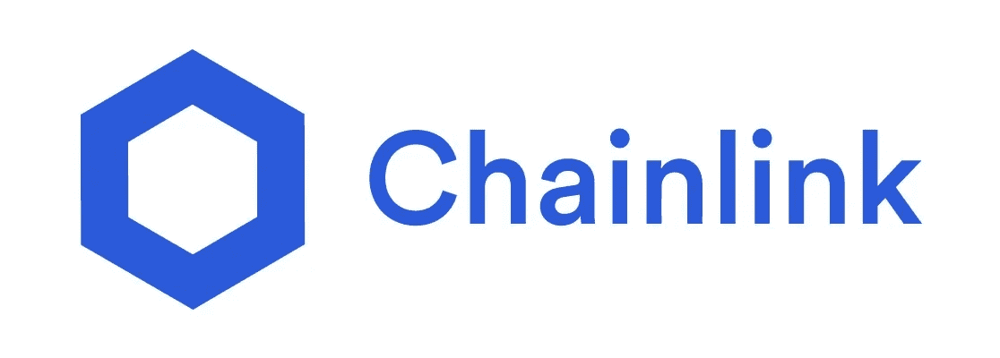

目标是提供一种通过智能合约将区块链连接到链外结构的方法。这将意味着区块链将能够与各种强大的基础设施建立连接，如 API、银行和零售支付、不断更新的市场数据，甚至其他区块链。

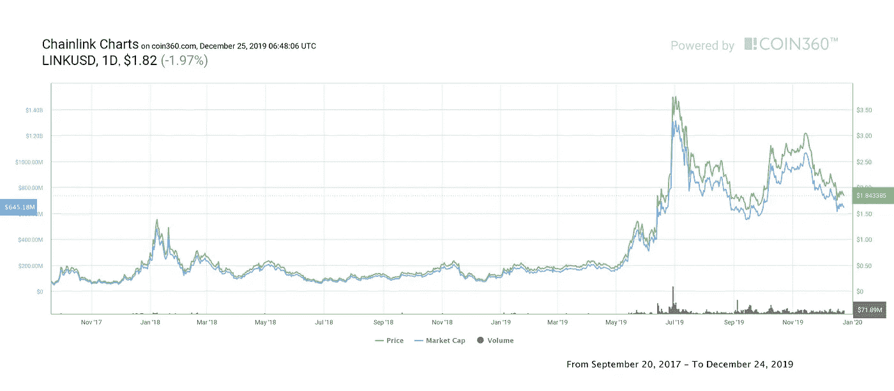

目前的供应量为 3.5 亿个链接令牌，其中所有都在流通。最大供应量为 10 亿个链接令牌，但尚未宣布何时将全部发布。

## 2.币安硬币

币安硬币(BNB)是由币安在 2017 年创建的，作为其折扣交易费的公用事业令牌。币安硬币最初是作为一种 ERC20 代币发行的，后来成为币安主要连锁店区块链的本地代币。

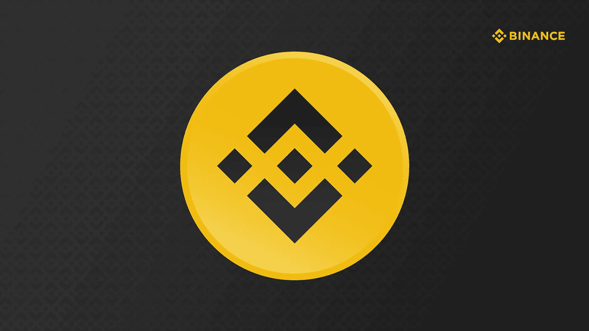

币安硬币也可以用来支付旅行费用(如酒店和机票预订)，购买虚拟礼物，使用信用卡购物，等等。

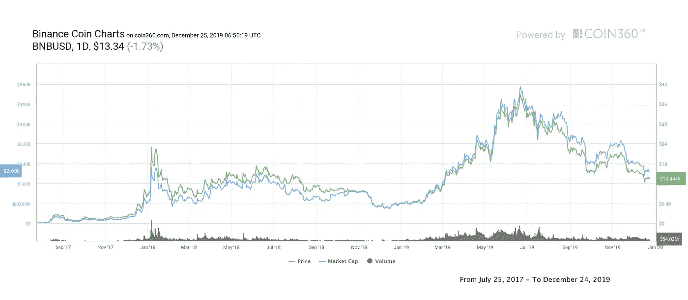

BNB 最初的总供应量被定义为 200，000，000 枚硬币，但由于定期的硬币焚烧事件，供应量正在逐渐减少。

## 3.泰佐斯

Tezos (XTZ)是一个分散式计算平台，它利用正式的验证协议以及利益相关共识模块来处理内部治理相关事宜。关于系统如何工作，下注其代币的 XTZ 持有者有资格接收额外的代币作为创建和验证区块的奖励。

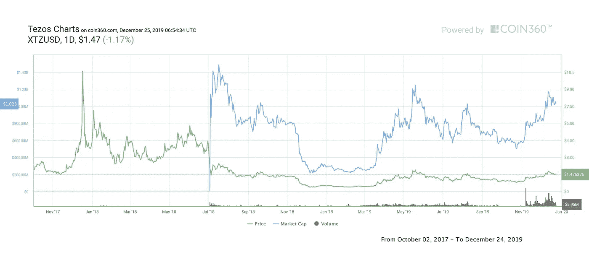

## 4.合成网络令牌

SNX 是建立在以太坊平台上的令牌。SNX 是合成交易所的公用事业标志。Synthetix 网络令牌支持所有合成器。SNX 有 P2C(点对点)交易。

SNX 合成资产跟踪基础资产的价格。这些资产由 SNX 担保，当固定在合同中时，可以发行合成债券。

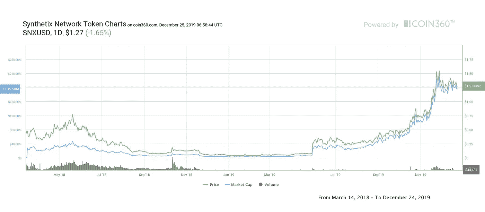

随着通货膨胀率的逐年下降，Synthetix 网络令牌的总供应量将从 100，000，000 个增加到 245，312，500 个。

## 5.比特币现金

比特币现金(BCH)是比特币的一个硬分支，旨在解决比特币的可扩展性问题。比特币现金挖掘与其前身非常相似，fork 的代码库也没有重大变化。然而，比特币现金比中本聪的硬币快得多，并具有额外的功能。

尽管有一些反弹，比特币现金很快获得了公众的赞赏，今天比特币现金交易所几乎由每一个加密交易平台提供。直到今天，硬币还是加密货币行业的主要参与者之一。

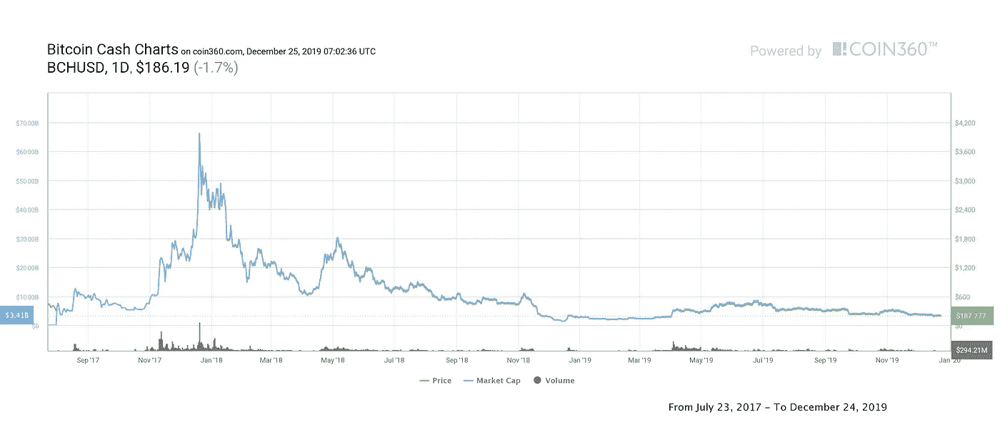

在下一轮比特币减半中，矿工每区块开采的比特币现金总数将从 12.5 BTC 降至 6.25。每块发现的比特币现金数量将变得更加稀缺，这一减半奖励确保比特币现金的总供应量将达到 2100 万。

## 6.宇宙

Cosmos (ATOM)是一个分散的网络，由独立、可扩展和可互操作的各种区块链组成。该平台在 2019 年期间获得了很多关注，特别是因为与网络相关的加密货币 ATOM 在 5 月份大幅飙升。

客观来看，值得一提的是，1 月 1 日，ATOM 的交易价格为 0.001 美元。就目前情况来看，美元兑人民币汇率远高于 4.20 美元。

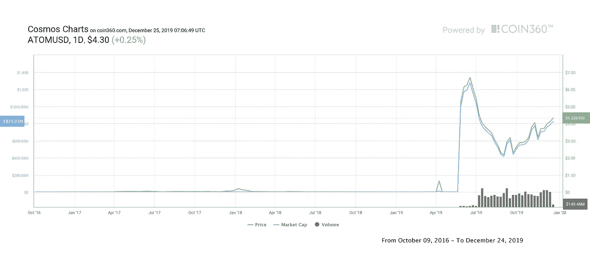

## 7.莱特币

莱特币(LTC)是一种加密货币，由查理·李设计，作为原始加密货币比特币的替代品。莱特币的价值也完全由市场决定，这种硬币没有中央发行人或管理机构。莱特币挖掘是通过 scrypt 算法而不是比特币的 sha-256 来执行的。作为比特币的“轻量级版本”，莱特币比它的前身有几个优势。

莱特币挖矿在齿轮上更容易，交易更快，区块生成时间更短。莱特币价格的第一次显著增长发生在 2013 年深秋，当时莱特币价格在一天之内上涨了两倍。莱特币对美元的比率是目前市场的主要指标之一。Litecoin 新闻对整个行业仍然非常重要。

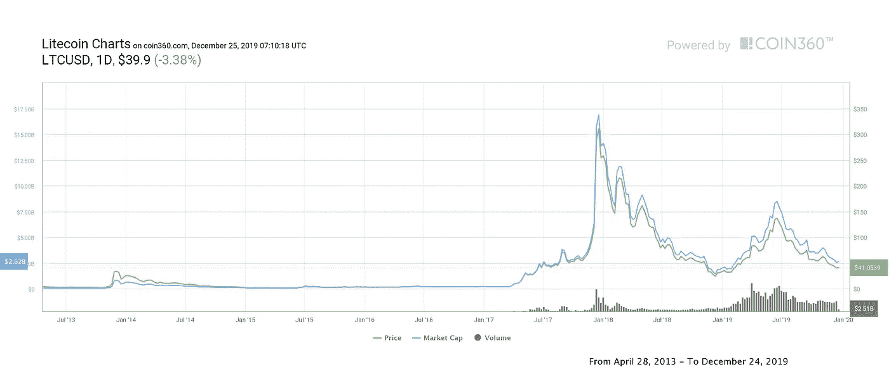

## 8.基本注意力标志

基本注意力令牌(BAT)是一种加密货币，旨在为勇敢的互联网浏览器提供动力。Brave 是一款位于区块链的浏览器，提供付费冲浪支付系统。该浏览器基于 Chromium，由 Brendan Eich 创建，他是 JavaScript 的创始人和 Mozilla 项目的联合创始人。

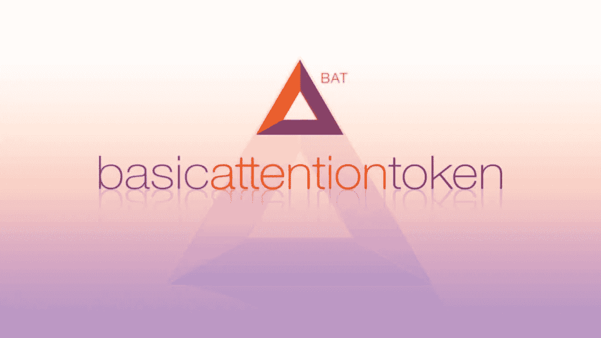

勇敢的浏览器是由基本的注意力令牌驱动的，它被用来在 web 资源和它的用户之间建立互利的关系。浏览器在各种加密货币中的资金被转移到其本地加密货币——蝙蝠币。这些广告随后被分发给没有广告的网站，并被浏览器用户访问。

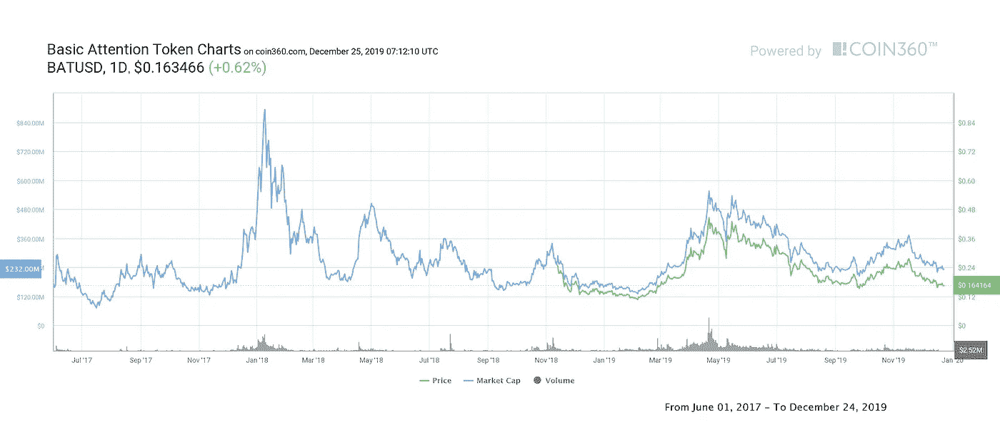

截至发稿时，基本注意力标志的市值超过 1.75 亿美元。该硬币目前的价格记录是每枚 0.86 美分。

## 9.以太坊

以太坊被定义为一种加密货币，是维塔利克·布特林开发的区块链平台。以太坊智能合约技术迅速使硬币成为该行业的主要参与者之一。随着加密货币市场的繁荣，以太坊的价格快速上涨。然而，以太坊矿商不仅是繁荣的受益者，也是其驱动者。该平台通过其令牌发行系统为许多其他重要项目提供支持。

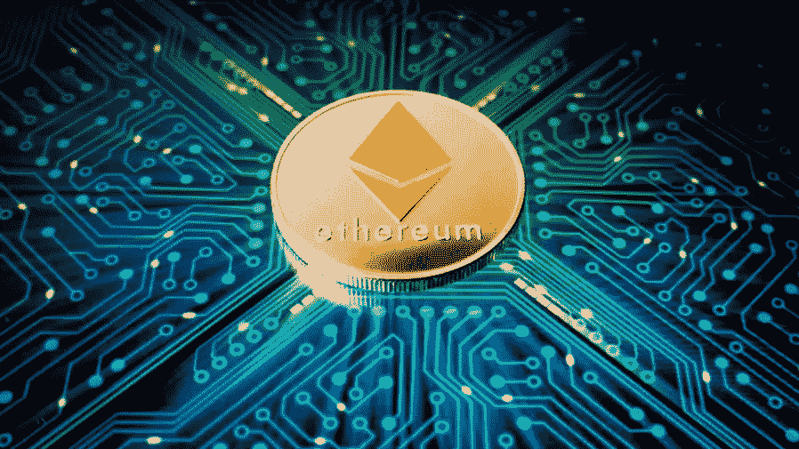

以太坊钱包通常不仅用于存储以太坊硬币，还用于存储通过平台发行的多种代币。以太坊的价格为硬币提供了稳定的市场地位，并使其成为业内最大的加密货币之一。

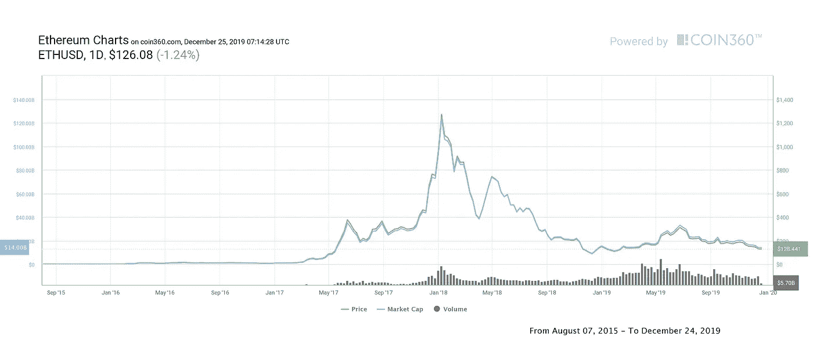

## 10.黎明的女神

EOS 是一个加密货币平台，由其开发团队作为 dapp 构建的操作系统提供。EOS coin 是平台的内部货币，用于交换价值，支付平台的服务，以及支付之前部署的 dapps 所产生的成本。

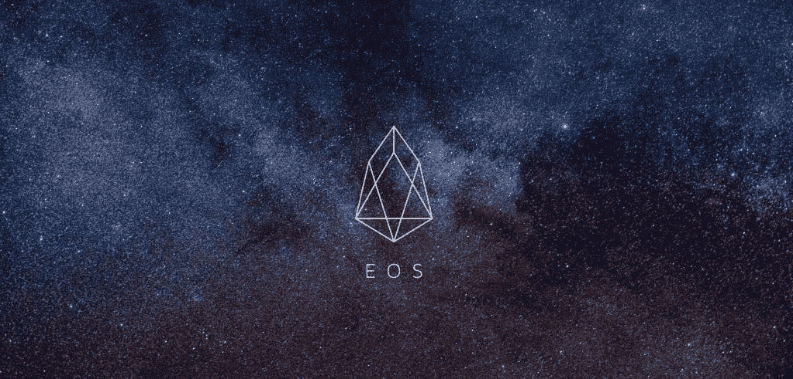

EOS 区块链提供了先进的可扩展性和巨大的定制空间。EOS ICO 是在以太公司的 ERC-20 标准下进行的。然而，目前的 EOS 令牌是基于 EOS 平台的源代码。自开发以来，EOS 的价格增长相当快，就市值而言，该硬币是前五大密码中的一个强劲成员。

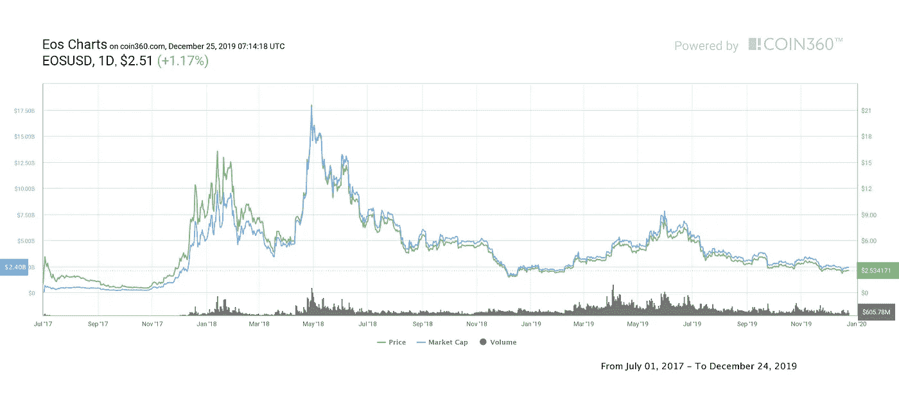

2020 年以太坊会值多少钱？迈克菲 100 万美元的比特币价格赌注会成为现实吗？Ripple 的未来如何？2020 年 Tron 会是一个好的投资吗？让我们拭目以待新的一年会带来什么样的事情和事件:)

***如果您想了解更多，请访问 BIDITEX 页面并提出您的问题，关注我们的*** [***推特***](https://twitter.com/biditex_com) ***，*** [***脸书***](https://www.facebook.com/biditex/) ***，*** [***中型***](https://medium.com/@biditex) ***，*** 用[***bidi tex***](http://www.biditex.com/)***投标你的空格。***