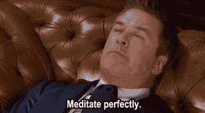

# 初创公司创始人的 10 个最佳生产率秘诀

> 原文：<https://medium.datadriveninvestor.com/10-best-productivity-hacks-for-startup-founders-7845b04847d3?source=collection_archive---------32----------------------->

时间是每个创始人最好的朋友，同时也是最坏的敌人。总是试图充分利用它，但仍然觉得不够。

生产率不仅是企业家的时髦词，也是一句口头禅。

作为一名初创公司的创始人，有时你的员工和同事会认为你已经把所有事情都解决了，你知道所有事情的答案，而实际上，你可能正淹没在一大堆坏习惯中。

我们想分享一些窍门，希望能帮助你减轻负担，最重要的是，帮助你快速有效地完成你的待办事项。

遵循这些提高效率的技巧，你会很快发现在你的创业中你可以完成更多的事情！

# 1.早上第一件事就是从最困难的任务开始

> *如果你的工作是吃一只活青蛙，那最好是在早上做的第一件事。如果你的工作是吃两只青蛙，最好先吃最大的那只。*
> 
> *马克·吐温*

我总是在想:我应该晚上还是早上去健身房？事实证明没有通用的答案。

问问自己，一天中你需要做的最难的任务是什么？然后，从那个开始。

就这么简单。一旦繁重的工作结束，剩下的日子就像在公园散步一样轻松。

# 2.有效地使用番茄工作法

你可能在高中或大学使用过这种技巧。这个著名的工具被广泛用于有效学习，原因如下:

我们的最大注意力持续时间[在开始衰退之前从 20 到 45 分钟](https://facilethings.com/blog/en/science-behind-pomodoro-technique)不等。在那之后，我们只需要一个短暂的休息来理清思绪，然后精神饱满地重新投入其中。

一定要看看托马斯·弗兰克的番茄研究指南。基本上就是他学习 25 分钟的视频。奇怪的是，它起作用了。

## 想试试吗？方法如下:

1.  选择一个你需要完成的任务
2.  设置 25 分钟的计时器
3.  工作！—避免偷看秒表
4.  当时间到了，在工作区外休息 5 分钟。呼吸、伸展、小睡或任何看起来最能投资你的 5 分钟的事情。
5.  每完成 4 个工作周期，休息 20 分钟。
6.  重复

# 3.每周留出一天完全空闲的时间开会

> 通过每周给自己一天不用开会的时间，你减少了会减缓项目工作进度的环境切换。
> 
> [*伊丽莎白桑德斯*](https://hbr.org/2017/02/how-to-establish-a-meeting-free-day-each-week)

在创业世界里，会议狂热是一件很常见的事情，尤其是当你作为一名创始人，你需要知道你的环境中正在发生的一切。

总有一些主题需要解决，一些细节需要微调，还有一些报告需要展示或阅读。

会议会大大降低团队的生产力。

准备一次会议需要 10 到 15 分钟，恢复你的活动也需要同样的时间。

每周留出一天不开会，你会惊讶地发现你的一天变得如此有效和富有成效。

# 4.利用音乐的优势

将音乐添加到您的工作流程中是一个好主意。但是就像任何好主意一样，你必须知道如何正确地执行它，以获得最大的效果。

关于哪种类型的音乐最有利于集中注意力，总是有这样的争论。以下是一些有科学依据的建议:

1.  平静和谐的音乐(即。经典音乐)。
2.  冥想和环境音乐(雨、海、森林)也是很好的选择。
3.  工作永远是第一位的，不要干扰 NSYNC，所以记得把音量调低，作为背景音乐。
4.  避免带歌词的歌曲。
5.  提前选择你的播放列表，避免每 4 分钟就分心。记住一切都是为了提高你的工作表现。
6.  创建长播放列表——至少 2 小时。用番茄工作法补充这一点，让歌曲模式来决定你的休息时间。

这是科学理论上的说法，但最终还是要看什么对你最有效。都是试错。

查看播放列表，我们 Contxto 的一些人正在收听您正在阅读的精彩内容。

# 5.代表

我们明白，如果你想把事情做好，你必须自己去做。

给你的下属分配工作听起来很容易，但最常见的错误之一是试图微观管理你的团队做的每一件事。

记住你们都是一个团队，每个人都在朝着同一个方向划船，所以试着放松一下，把一些工作委派给你的下属。这样你就有更多的时间去做只有你能做的事情。

你的下属会注意到他们在团队中的重要性，在你不在的情况下，会有人承担这些责任，你会加强团队合作，最重要的是，你们会一起成长。

# 6.正念和冥想

你知道，我们也知道，你的一天不会在办公时间开始或结束。你有这么多事情要做，一天 24 小时似乎并不多。这会造成焦虑和担心，从而减少生产时间。

这就是正念出现的地方，它基本上意味着活在当下。

不要分心去想你需要做的事情或者那些你已经处理好的事情。全神贯注于

你现在正在做的事情。

当试图变得更加专注时，冥想真的很有帮助。这需要将想法从概念转化为实践。

试着每天至少冥想 10 分钟，无论是在醒来后还是睡觉前。使用 [Headspace](https://www.headspace.com/) 等工具开始。

# 7.上下班途中听听播客

还是那句话，时间宝贵。如果你已经在交通堵塞或通勤上浪费了大量时间，那么最好利用这段时间学习一些新东西。

听播客是在上下班途中更好地利用时间的好方法。

不管是一般的商业播客还是专门解决你在创业过程中遇到的问题的
,在一天结束时，这都比一遍又一遍地听同一首歌要好得多。

以下是一些我们喜爱的播客:

1.雷德·霍夫曼的音阶大师

2.TechCrunch 的股权

3.奇妙的商战

# 8.健康饮食

这是一个显而易见的问题，但是很多人忽略它或者跳过它。

我不会陷入“你吃什么就是什么”或“食物是燃料，你是法拉利”这样的陈词滥调。

但从某种程度上来说，这是真的，如果你吃得最差，你就不会发挥出最佳水平。

无论是旧石器，酮，素食，纯素，或任何你喜欢的饮食，尽量保持平衡。

和你的营养师谈谈，多喝水，请避免苏打和快餐。我有必要向你提及这些事情吗？

# 9.写下分散注意力的想法

把它写下来，然后让它过去。

一旦你把分散注意力的想法写下来，忘记它们就容易多了。如果你有一个巨大的待办事项清单，你试图把它都记在脑子里，同时专注于你的优先事项，这几乎是不可能的。

一旦你完成了当前的活动，你就可以回到他们身边，花时间确定他们是否真的值得。

# 10.养成黑仔的习惯

与许多人的想法相反，有一个常规并不是一个问题。

有一个*坏的*套路就是。

以一个合适的早晨仪式开始你的一天，为一天的剩余时间建立积极的情绪，这肯定会让你比你的竞争对手更有优势。

不仅仅是在早上，而是在一整天中，保持你的健康习惯，以便保持在你的游戏中。保持水分，睡好觉，吃好，运动。

回到那些陈词滥调，把它想象成照顾一辆汽车。如果你不好好对待它，它最终会停止工作。

# 加分点:前一天晚上选择你的服装

每天晚上睡觉前——顺便说一句，你需要上床睡觉——确保你选择了第二天的全套服装。这节省了大量的时间和精力。

是的，马克·扎克伯格和史蒂夫·乔布斯每天穿同一套衣服的方法节省了时间，但除非你愿意每天都穿黑色 t 恤、蓝色牛仔裤和白色新百伦运动鞋，否则我们建议你听从我们的建议，只在前一天晚上选择它。

# 结论

生产率是可以达到的。

一个小的坏习惯真的会影响生产力和时间管理。如果你不能——或者不愿意——做到所有这些，那么一个一个地尝试，看看它们是如何为你工作的。

最终，你会开始增加更多的这些习惯，甚至没有意识到突然的改变，你会开始注意到你有多少更多的精力，以及你能在几个小时内完成多少事情。

你知道任何我们可能忽略的生产力黑客吗？请在评论中告诉我们！

记住，分享是关爱。

*原载于 2019 年 1 月 22 日*[*【www.contxto.com】*](https://www.contxto.com/en/2019/01/22/10-best-productivity-hacks-for-startup-founders/)*。*