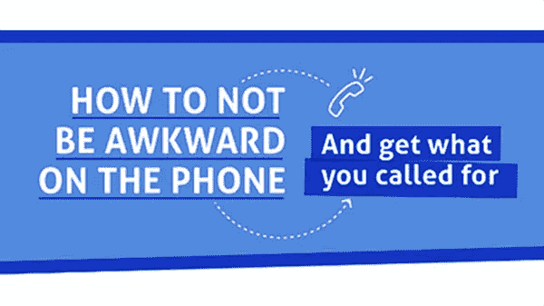
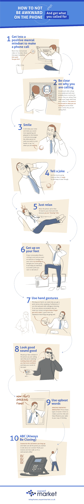

# 有助于达成交易的 10 个电话推销技巧

> 原文：<https://medium.datadriveninvestor.com/10-cold-calling-tips-that-help-close-the-sale-24b1a5359c55?source=collection_archive---------35----------------------->

在教练博客——世界领先的领导和教练博客之一，我们经常发布主要作者和权威的文章——今天我们很高兴发布来自 [*布兰登·盖尔*](http://brandongaille.com/10-cold-calling-tips-that-help-close-the-sale/) *的文章。*

对一些人来说，打电话会带来很多焦虑，尤其是如果你是那种喜欢通过互联网交流的人。考虑以下 5 个建议，帮助你打一个舒适的电话，并且仍然得到你想要的结果，没有任何尴尬的紧张。

提示 1:向自己保证你要做的第一件事是确保你可以告诉自己不必担心电话，因为它真的只是电话。你还需要确保你首先清楚为什么要打电话。这将帮助你直奔主题，避免任何尴尬的东拉西扯。

**提示 2:表露情绪**
这听起来可能很奇怪，但重要的是你在打电话时仍然要表现出积极的面部情绪，因为电话那头的人肯定能看出你是否在笑。当你有意识地努力微笑时，它有助于减少你声音中的紧张，让你听起来更有趣。

**小贴士 3:处于放松状态**
你会发现，如果你能把自己和周围的人分开，找到一个放松的地方打电话，你会更自然地打电话。当你让自己的身体处于放松状态时，你就能确信自己会充分利用电话，你也不必担心其他人在电话中如何看待你。

技巧 4:使用手势就像面对面交谈一样，使用手势是帮助你解释观点的一种可靠方式。打电话很像和某人进行面对面的交谈，所以你会想尽可能多地使用谈话技巧。当你使用手势时，你的注意力将主要集中在打电话上，你可以很容易地想象你想对对方说什么。

提示 5:看起来自信
当我们看起来感觉最好的时候，我们听起来总是最好的，所以你会想在一个重要电话之前花时间准备好。即使另一条线上的人可能看不到你的穿着，你也会知道你看起来很时髦，你已经准备好接受他们扔给你的任何东西。

点击此处阅读更多内容，不要忘记订阅我的教练博客网站获得免费教练报告:[https://www . coaching-blog . com/10-cold-calling-tips-that-help-close-the-sale/](https://www.coaching-blog.com/10-cold-calling-tips-that-help-close-the-sale/)

请访问我们的网站，订阅免费的教练杂志:【http://www.international-coaching-news.net/ 

