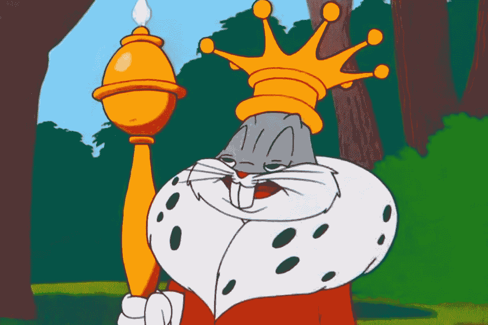

# 漫画教授的 10 堂创业课

> 原文：<https://medium.datadriveninvestor.com/10-entrepreneurship-lessons-taught-by-cartoons-b033fa1e2516?source=collection_archive---------43----------------------->

*你绝不会想到像* ***巴哥、巴特、斯图、卡特曼或小飞象这样的人会担任办公室座右铭*** *。让开，听好了，因为这些家伙知道他们在说什么！*

## 1.**不要把生活看得太重。兔子先生的《你永远不会活着出去》**

众所周知，一个微笑可以缓解办公室的紧张情绪。**众所周知，如果你想让事情变得更简单一点，你也会影响你的团队，从而影响整体生产力**。我们知道有任务要完成。**但如果你能偶尔打败这些家伙，那就全力以赴，稍后再感谢兔子**。

## 2.兔子先生的《好了，现在是 5 点了》

当我们似乎都要去绞肉机的时候，这是对那些虚无和绝望的电梯时刻的额外提示。对于所有那些悲伤而安静的面孔，bug 有完美的解决方案。它很短。很有冲击力。这会让你分心 5 秒。你会需要这个的。**周一牛逼**。

## **3。“吃我的短裤**”，小辛普森。

巴特·辛普森有一套口头禅。他今年 10 岁(**他过去 24 年都是如此** ) **所以人们可以遵循他的智慧关键词*没问题*** 。

*吃我的短裤*是一个典型的 f **或者那个就是不闭嘴的同事。那个极度活跃的电子邮件。“故事终结者”。挑战每个人做没人真正感兴趣的办公室外事情的家伙。**

 [## 在创业之旅中，拥抱学习|数据驱动的投资者

### 好像建立一个数百万美元的公司还不够困难，企业家必须额外照顾他们的…

www.datadriveninvestor.com](https://www.datadriveninvestor.com/2018/10/16/on-the-entrepreneurial-trek-embrace-the-learning/) 

把这张当成'**出狱卡**'。很清楚，切中要害，如果你没有多余的短裤，就…不要把它穿破。

## 4.“我相信孩子是我们的未来。除非我们现在就阻止他们”，作者荷马·J·辛普森

巴特的态度来源于。来源不得而知，因为如果你在寻找更多的“出狱卡”的话，荷马·辛普森**不是你要找的人。**

**荷马可能很笨，但他有时也说到点子上了:孩子是我们的未来，听起来就像是一个人只想偷懒，去网飞放松一下，而生活就在你眼前旅行。是的，荷马说了一些不懒惰的话…“接线员，给我 911 的号码！”**

如果你想最大限度地利用你的一天，无论你是一个和孩子们一起玩 cray-cray 的父亲，还是有一个新的“金童”年轻同事，这个人都会支持你。呃，不是为了爸爸的事。**那只是盘子里的生活，吃点然后闭嘴**。

但对于后者，请从荷马的名言中摘取精华。

**破坏他/她。让他/她的工作蒙羞**！

## 5.“我很想留下来聊天，但你是个十足的混蛋”，作者小格里芬先生。

(unlocked after 5–6 months of Eat My Shorts deployment)

Stewie Griffin 是一个精明的人。

聪明、老练、能说会道、彬彬有礼**并且有点反社会**，当你需要**表明观点、召集军队，简而言之，成为领导者**时，他就是你要找的人。

你不需要成为人人讨厌的老板。你需要成为每个人都尊重的人。

进入 **Stewie 建立你的自尊，并以身作则。还是害怕**！

## 6.“去你们的，我要回家了……”，作者:卡特曼先生

你再也找不到更好的“放下话筒”(**或关闭电脑**)的引用了。每个人都懂。它有所有的信息。自由使用。

通宵感觉**特别隆重。**

没有什么要补充的，除了…这个社区没有任何抱怨。

## 7.“哦，不。如果我瞎了怎么办？我瞎了就没法面对生活了！哦耶！我会依靠我的其他感官！我就靠我的幽默感了！我会说 s$喜欢，“我瞎了又怎么样？至少我不用看你的丑脸了！泰森先生

直接从迈克·泰森系列中我们发现了“刻薄的讨厌鬼”这句话，用来形容那些渴望接替办公室里最讨厌的人的人… **但是，正如你所读到的，“刻薄的讨厌鬼”也可以解决一些问题**！

尽管你站在残疾人群体问题的立场上，他的引语在黑色背景上用白色粗体字写着:既可恶又有用。

为了你自己的利益扭转乾坤。盯着解。问题本身会让你一事无成！

## 8.“不要只是飞，要翱翔！”，Dumbo 先生

(*earned after 1 work year of using the Bugs Bunny quote*)

小飞象不爱说话。作为一只大象，这是可以理解的。但是小飞象是一个你真的应该听他说话的人。他知道自己在做什么，他正在拍第二部电影……你的第一部电影什么时候上映？！)。

善良的厚皮动物想让我们知道的是，一件“做得很好”的工作总有其他地方需要打磨。适可而止。

无论你是经营一家金融科技公司还是做一些汉堡，当公司只要求 90%的时候，你都必须付出 120%的努力。

*#dumboknowsbest*

## 9.《Hakuna Matata》，由 Timon 先生(没有姓)主演，Pumba 先生(也没有姓)

一只猫鼬和一只疣猪能给我们的生活带来什么？

嗯……很多。***可以成为不良事件****完美风暴中的一线光芒。*

*如果使用得当，它可以帮你赢得客户、买家和合作伙伴。所以请谨慎地分享它，并且总是事先掌握最好的知识。*

## *10.“改变是好事。”，作者拉飞奇先生(无姓氏)*

*一个在华特·迪士尼代表作*狮子王*背景中静静站立的人物(华特说“追寻你的梦想”；好莱坞回答说“不，我们只是重复它们”)，**拉飞奇用一句有见地的话拯救了你，这句话会让你的一天变得明亮起来**。*

*改变是*确实是*好。没人愿意 40 多岁还做同样的事情(除非你姓扎克伯格或布林:)*

*拥抱新的可能性。不要被你失去的东西所影响。为你所能获得的感到骄傲！*