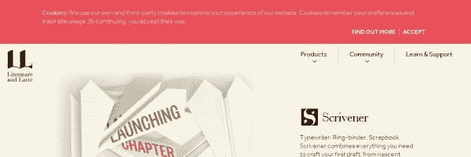
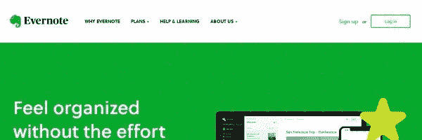
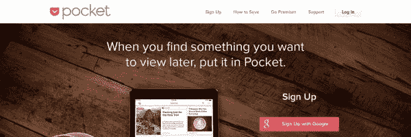
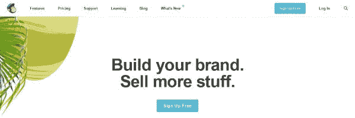
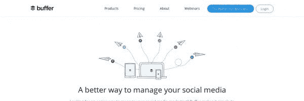
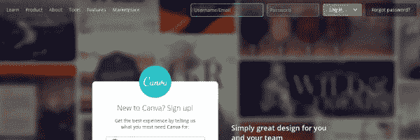

# 兼职企业家必备的 10 款云应用

> 原文：<https://medium.datadriveninvestor.com/10-essential-cloud-apps-for-the-part-time-entrepreneur-e1af68fbb5f?source=collection_archive---------19----------------------->

*2021 年 8 月 22 日更新*

了解为兼职企业主或初露头角的企业家提供随时随地访问的基本云应用。这篇博客文章是*平衡兼职工作和日常工作系列*的一部分。

当我告诉人们我在管理我的生意的同时还维持着一份日常工作时，他们总是问我怎么样，或者看着我，好像我是某个女超人。远非如此！说到平衡，我得实话实说。在很多情况下，我都无法跟上我的业务工作量。好的一面是，这些年来我学会了什么样的系统让我保持联系。

如果你还没有，为你的企业投资一部智能手机、平板电脑和/或笔记本电脑。这些设备对于使用基于云的应用程序至关重要，因此您可以在旅途中访问文件。可能会有这样的时候，你需要发送一个文件给客户，因为他们找不到它。在某些情况下，如果你需要编辑一个文档，你可以通过许多类型的云应用来完成。

以下是我经常使用的十款基本云应用，有些情况下我每天都会使用。

# 1 |收存箱

参观:【http://www.dropbox.com 

只要有可能，我都会把客户的文件保存在 Dropbox 里，这样我就可以很容易地分享，如果他们需要的话，也可以再次访问这些文件。Dropbox 起步免费，2GB，但如果你用它来备份和共享文件，投资每月 9.99 美元是值得的。1Tb 的空间无与伦比。这通常是绰绰有余的空间，除非您存储大量媒体文件，如视频，这很容易耗尽存储空间。

# 2 |谷歌应用套件

参观:[https://www.google.com/drive/](https://www.google.com/drive/)

我最近投资了一个 Chromebook，主要是因为我是谷歌多年的粉丝。我使用他们的许多产品，包括 Gmail、Google Drive、Google Calendar 和 YouTube。和 Dropbox 一样，谷歌也提供价格低廉的云存储服务，100 GB 的最低价格为 1.99 美元。如果你也经常使用 Google Drive 编辑和存储文件，我强烈建议投资存储。如果你想要一个更加定制化的服务，你也可以投资 Google Apps for Work。随着业务的持续增长，你可能会发现存储容量的增加和免费的 Google Drive 工作得很好。

# 3 |代书人

访问:[https://www.literatureandlatte.com/](https://www.literatureandlatte.com/)

当我不做生意的时候，我会写一本书。我大约一年前购买了 Scrivener，但从未真正弄清楚如何使用。今年春天，在参加了[快速学习代写本](http://learnscrivenerfast.com/)课程后，我发现这个工具不仅非常适合写书，也非常适合策划博客文章。2016 年 8 月，Scrivener 通过最终发布 iOS 版本来加强他们的游戏。这款应用售价 19.95 美元，但在我的 iPad 或 iPhone 上使用 Scrivener 是非常值得的。Scrivener 文件可以很好地与 Dropbox 同步。你看所有这些工具是如何一起工作的！

# 4 |特雷罗

参观:【https://trello.com 

我用过不少项目管理工具，但 Trello 的可视化界面和简单的拖放卡赢得了我的心。您可以为单独的项目创建电路板。在每块板上，您可以创建一个列表。在每个列表上，我可以添加卡片，为项目提供细节或任务。卡片上有很多额外的内容，包括添加截止日期、附件和清单。如果你想将 Trello 与你的日历连接，或者与 Dropbox、Google Drive 等其他应用程序配合使用，你可以使用 Power-Ups。Trello 商务舱包含无限制的电源。我是 Trello Gold 用户，允许每块板加一次电。

# 5 | Evernote

访问:[https://evernote.com](https://evernote.com/)

自从我开始写小说，我就一直是 Evernote 的用户。Evernote 就像一个电子活页夹或笔记本，你可以保存网页。过去，我主要用这个工具收集研究资料。现在我也用它来收集博客帖子的想法。我甚至有一个笔记本，用来保存在线课程或网络研讨会的内容，因为有时这些下载会在你的电子邮件中丢失。

# 6 |口袋

参观:[https://getpocket.com](https://getpocket.com/)

当我有一个在线资源想要保存一段时间时，我会使用 Evernote。对我来说，Pocket 更像是一个“以后阅读”或“以后分享”类型的工具。如果我找到了以后想消费的文章或博文，我会把它们添加到 Pocket。这个应用程序是我存储内容的临时地方，我也想在我的社交媒体平台上安排和分享这些内容。

# 7 | Mailchimp

参观:[http://mailchimp.com](http://mailchimp.com/)

电子邮件营销非常重要。Mailchimp 的“永远免费”是一个很好的启动计划，每月允许多达 2000 名订户和 12000 封电子邮件。创建列表和安排活动非常简单。如果您的业务需要自动回复，那么您将需要升级以使用自动化工作流。为了确保你的邮件列表的增长，自动化的使用将被要求建立甚至是最简单的销售漏斗。目前，我喜欢 Mailchimp 的设置。对我来说，这很简单也很直观。

# 8 |缓冲器

参观:[http://buffer.com](http://buffer.com/)

作为我的中央社交媒体管理工具，Buffer 允许我通过设定的队列或预定的日期/时间来分享博客帖子和其他有价值的内容。在我的手机上，我经常阅读我保存在 Pocket 中的文章(见上文)。如果我读到一篇值得分享的文章，我会把这篇文章添加到我的缓冲队列计划中。唯一的缺点是，如果你想为几个社交媒体档案安排内容，你将需要至少投资于[牛逼计划](https://buffer.com/pricing)，我已经有几年了。

注意，我也使用其他工具，比如 Hootsuite(管理我的脸书群)和 Social Jukebox(持续分享常青树内容的好工具)。

# 9 |坎瓦

参观:【http://canva.com 

这已经成为我最喜欢的在线工具之一。我发现，在过去的一年里，当涉及到为我的博客和社交媒体制作图形时，与打开 Adobe Photoshop 等桌面软件相比，在浏览器中打开 Canva 是值得的。事实上，我非常喜欢 Canva，所以我花钱买了 Canva for Work 版本。能够(1)从一个设计中即时制作各种社交媒体大小,( 2)在一个地方轻松保持你的品牌颜色使得这个云应用值得投资。此外，Canva 也在 iPad 和 iPhone 上提供很酷的应用程序。你当然可以用免费版本做得很好。

# 10 | WordPress

参观:[http://www.wordpress.org](http://www.wordpress.org/)

不知道这是否被认为是一个应用程序，但这个内容管理工具是我在上面使用的所有工具最终以某种最终形式出现的核心，如博客帖子、播客、内容升级或电子书。在 2004 年之前，我通过学习如何用 HTML 编码来建立网站。后来，我开始学习 CSS，以及如何添加我在网上找到的 Javascript 片段和代码。一旦我发现了 WordPress 和添加内容是多么容易，我就不会回头了。我喜欢通过各种设备撰写博客文章、发布/安排日程，然后在社交媒体上分享。

# 你最喜欢的应用有哪些？

当我开始写这篇文章时，我打算分享我的前五个应用程序，但后来我无法选择前五个。我确定还有更多我没有提到的应用，但这十个绝对是我必不可少的应用。

如果您使用这些应用程序，或者您最喜欢哪些应用程序，请告诉我！

# 关于作者

[Tyora Moody](https://www.tyoramoody.com) 是自省推理小说的作者。她还是非小说类书籍《文学企业家工具包*的作者，也是她公司 [Tymm Publishing LLC](https://www.tymmpublishing.com) 旗下《步入胜利汇编》的编辑。*

*作为一名专注于文学的企业家，自 1999 年以来，她通过自己的公司 [Tywebbin Creations LLC](https://www.tywebbincreations.com) 帮助无数作家发展了在线业务。受欢迎的服务包括书籍封面、书籍格式和其他作者服务，如社交媒体品牌。*