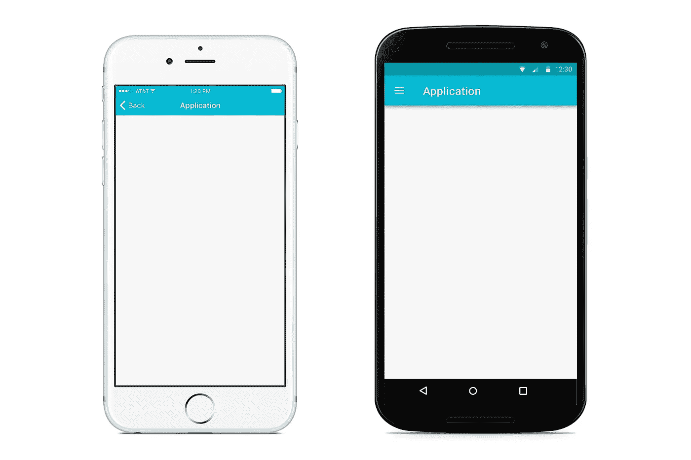
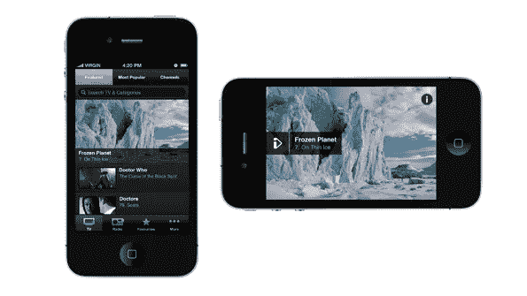
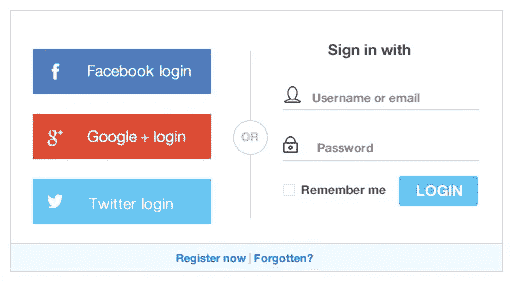
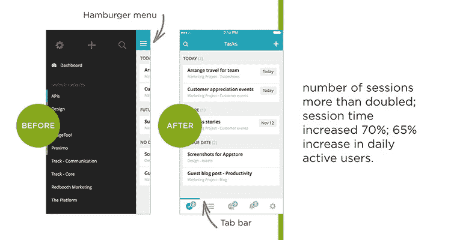
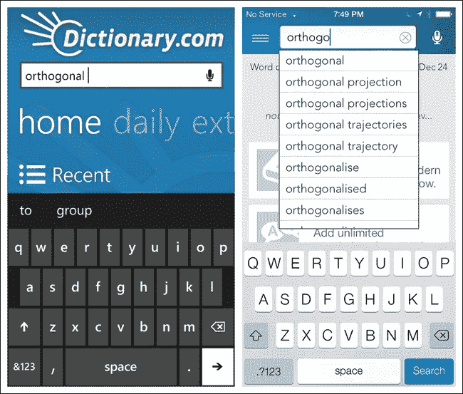
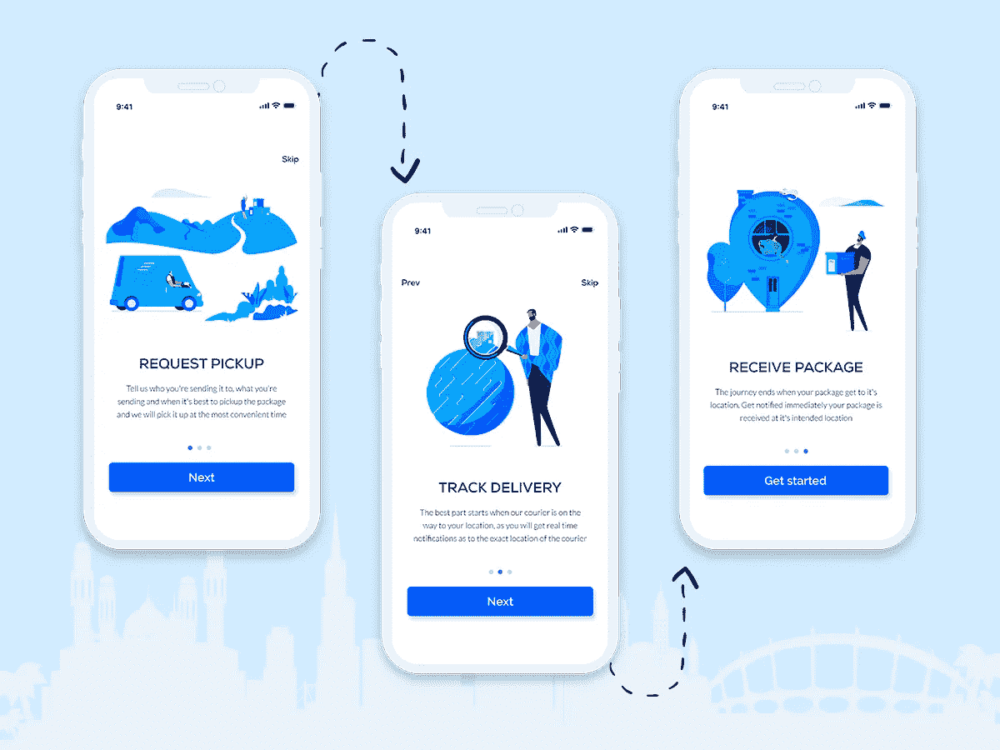
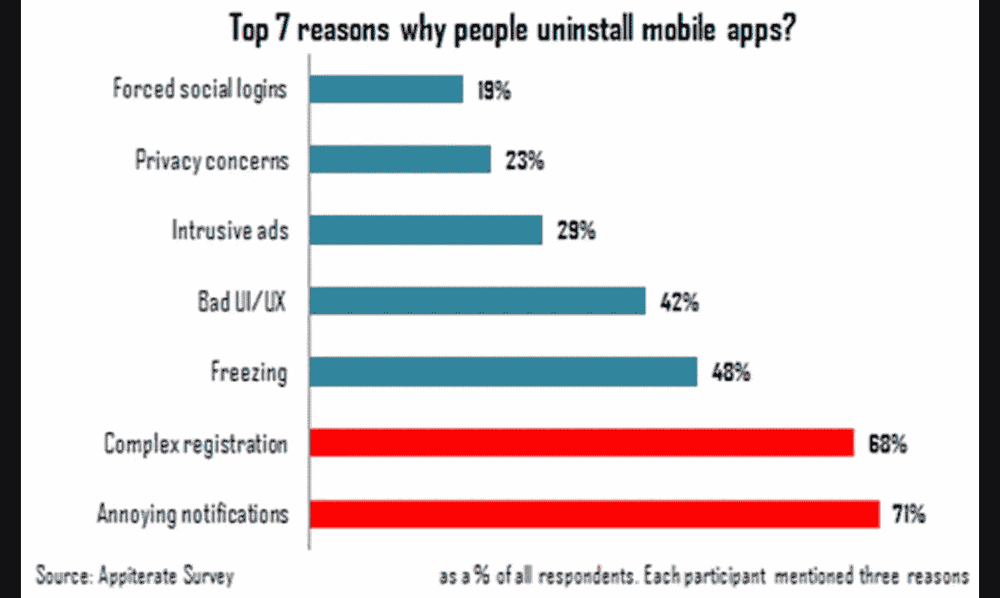
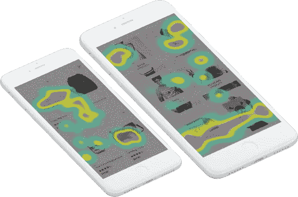
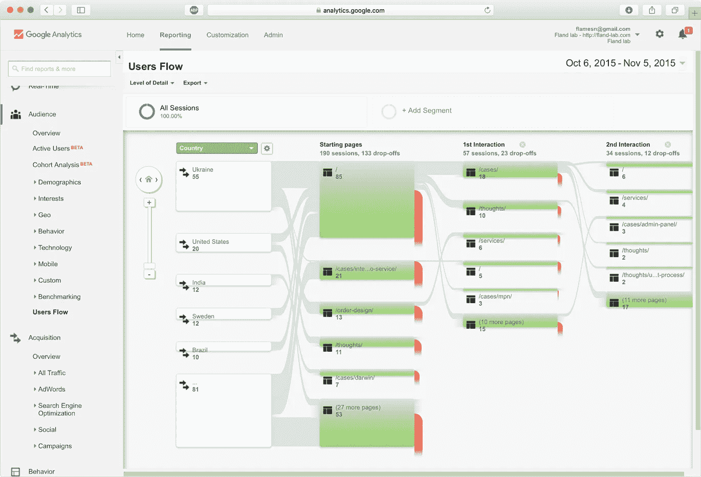

# 移动应用中的 10 个重要可用性问题

> 原文：<https://medium.datadriveninvestor.com/10-important-usability-issues-in-mobile-apps-fa67c4c37976?source=collection_archive---------0----------------------->

Source: flickr.com

我们生活在一个由智能手机主导的世界，发现与客户互动和互动的方式已经成为一个重要的问题。虽然用户界面是用户体验的重要组成部分，但是可用性才是最重要的,*。*

*如果你的手机应用程序很难使用，无论它的现代设计如何，总体感觉都是负面的。*

* [## 2019 年移动应用开发之路|数据驱动的投资者

### 任何在移动应用程序开发行业工作的人，无论他们是专注于在伦敦开发 iOS 应用程序还是…

www.datadriveninvestor.com](https://www.datadriveninvestor.com/2019/01/15/the-path-of-mobile-app-development-in-2019/) 

> 让我们面对现实吧——一个移动应用的成功只取决于一件事:**用户如何看待它**。

Source: lesmills.com

首先，不要混淆 UX 和可用性。

可用性是 UX 的一个方面，涵盖了用户和应用程序之间的整体关系。移动应用程序的可用性与在应用程序中实现目标的效率和简单性有关。

在我的上一篇文章[中，我写道，一个成功的移动应用必须是直观的，这意味着用户应该很快就能熟悉界面。所以用户需要了解界面的时间越短，它就越有用。](http://zesium.com/how-to-improve-ux-for-your-mobile-app/)

你应该让你的应用程序尽可能简单易用——即使用户遇到问题，解决方案也应该很容易找到。使用 [onboarding](https://clearbridgemobile.com/how-to-increase-user-retention-mobile-onboarding/) 引导用户使用你的应用程序，因为它提高了可用性。

同样的可用性直接影响用户对你的应用的感受，并帮助他们转化为忠诚的长期客户。

有哪些你应该注意的可用性问题？

# **不同的平台、操作系统和分辨率**

Android 和 iOS 是两个完全不同的平台，各自坚持不同的发展方向。因此，你不能将 iOS 应用程序复制到 Android 平台，反之亦然。

例如，Android **“后退”**按钮与 iOS 按钮完全不同，所以你应该创建一个遵循平台自然流程的应用程序，用户可以直观地与之交互。

Source: maxsnitser.com

每个操作系统(OS)也是如此，模拟 OS 外观和感觉的应用程序是必不可少的，它可以帮助用户更快地适应应用程序，并防止 UX 中的任何差异。[安卓 8.0 奥利奥](https://www.youtube.com/watch?v=8drCJKa0sGw)推出了“*画中画*”，允许用户同时做两件事。

如果您正在观看 Youtube 并收到短信，您可以在回复短信的同时继续观看。这是为你的用户做额外努力的一个很好的方式，这将把他们转化为你的忠实客户。

你必须包括的另一件事是[不同的移动屏幕分辨率](https://mediag.com/blog/popular-screen-resolutions-designing-for-all/)——相同的内容在一台设备上看起来很棒，但在另一台设备上却完全错误，尽管这是相同的操作系统和相同的版本。

Source: maxsnitser.com

# **风景模式远眺**

手机可以在两个方向上操作——[纵向](https://www.digitaltrends.com/photography/what-is-portrait-mode/)，被描述为单手使用并在移动中使用；以及[横向模式](https://www.techopedia.com/definition/7998/landscape)，被描述为在静止时使用并使用双手。

在开发移动应用程序时，人们通常会因为没有必要而放弃横向模式。

如果你想有一个好的移动应用程序，你应该同时考虑纵向和横向模式，以获得最佳的可用性和 UX，特别是如果你的应用程序包含视频内容。

Source: bbc.co.uk

# **步骤太多**

我们都不想为一项任务没完没了地打字而烦恼，尤其是如果这些步骤并不像看起来那么必要的话。一个应用程序需要的每一个动作都被视为用户前进道路上的另一个障碍，所以一定要检查这个动作，看看是否有一个替代方案可以让他们更容易。

你为用户做得越简单，他们使用你的应用的时间就越长。

比如在脸书、推特、谷歌等社交网络上注册。不是让用户键入他们的电子邮件地址，[一键支付](https://en.wikipedia.org/wiki/1-Click)而不是键入信用卡号码和其他信息，等等。

**提示**:减少用户的步骤数，他们会用他们的忠诚度来回应你。

Source: sitepoint.com

# **永不停止的滚动**

对最重要的信息进行优先排序可以提高可用性——在某些情况下向下滚动是不可避免的，但大多数时候你应该尽可能减少向下滚动。

用户应该能够在屏幕的限制范围内获得所需的大部分信息。还有[侧滚](https://www.techopedia.com/definition/27153/side-scroller)，据说应该避免使用，因为它通常会隐藏有价值的内容。

# **导航不良**

应用程序开发人员可以创建伟大的功能，但有时相同的功能不能以一种有组织的方式组合在一起。

当用户进入你的应用程序时，他们需要了解如何[导航](https://www.smashingmagazine.com/2017/05/basic-patterns-mobile-navigation/)并快速做他们想做的事情:玩游戏、购物、查看余额等。

不要添加一堆不必要的按钮或链接，因为这可能会导致用户感到困惑，并试图记住如何到达应用程序中的某个地方。

如果发生这种情况，他们极有可能不会回来弄清楚——相反，他们只会离开，不会回来。

Source: smashingmagazine.com

# **没有自动填写的用户数据**

自动建议是减少数据输入和帮助用户获得即时搜索结果的有效方法。[谷歌支持](https://support.google.com/websearch/answer/106230?hl=en)表明自动建议应该考虑:用户搜索词、趋势搜索和过去执行的相关搜索。

如今，没有自动填充数据的应用程序在可用性方面被认为很差。

通常，[自动建议](https://blog.algolia.com/search-autocomplete-on-mobile/)应该出现在一定数量的输入字符之后(*通常出现在 3 个字符*之后)，但重要的是保持“编辑”按钮可见，以便用户可以在建议不正确的情况下修改建议。

Source: [www.oreilly.com](http://www.oreilly.com)

# **未完成入职**

众所周知，[超过 20%的用户在使用一次后就放弃了这个应用](http://info.localytics.com/blog/23-of-users-abandon-an-app-after-one-use)。向用户展示你的应用真正价值的最好方式是通过入门。

入职是一个让新用户理解并充分参与你的应用程序的过程，以便继续使用它，而不是放弃它。重要的是设计一个有趣的入职流程，鼓励用户再次回到你的应用。

您可以使用多种应用入职流程来吸引用户。一种方式是在新客户使用该应用的第一周内向他们发送单条推送通知，还有其他方式，如[利益方式、功能方式、互动或组合方式](https://medium.com/@the_manifest/6-user-onboarding-flows-for-mobile-apps-ef974a330ac1)等。

这也是一个很好的方法来检查[类似应用程序的 onboarding 示例](https://uxplanet.org/5-classic-mobile-onboarding-examples-from-top-apps-of-2018-cdbeebcb2a38)以获得更多关于如何创建自己的应用程序的想法。

Source: dribble.com

# **内容不明**

当制作移动内容时，不要直接从网上复制粘贴，因为这是不一样的。您应该调整移动内容，以免在移动屏幕上显示太多信息。

如果做得好，弹出内容可以为移动应用创造奇迹——它可以提供额外的信息，并帮助用户获得即时反馈。

如果你想做好这件事，为你的[弹出窗口](https://usabilitygeek.com/mobile-app-pop-up-guidelines/)选择正确的内容，并选择正确的时间——只有当它与用户相关时。添加太多的信息会导致较差的 UX，并且可能会让用户在寻找特定内容时感到沮丧。

最好的方法是让用户尽可能容易地利用你的内容，这些内容必须以清晰简洁的方式展示。

Source: appiterate.com

# **无反应的手势**

没有什么比点击应用程序中的一个按钮却没有任何反应更让人恼火的了。

*如果按钮不起作用，它为什么会在那里？*

可能是一个应用程序真的“坏了”或者只是在那个时候没有反应，或者可能是用户以他/她自己符合逻辑的方式导航一个应用程序，但结果仍然是一样的— *沮丧*。

有时应用程序没有用户认为应该有的导航，所以最佳做法是包含“[触摸热图](https://usabilitygeek.com/touch-heatmaps-mobile-app-usability-testing/)”——一个[定性分析工具](https://uxplanet.org/mobile-heatmap-one-of-the-best-tools-to-visualize-user-behavior-f0c056d4c196)，它可以显示用户在特定屏幕上的交互位置，大多数用户在每个屏幕上点击的位置，什么被忽略，以及轻松发现无响应的手势。

一旦你找到了弱点，你就可以提高可用性。

Source: dzone.com

# **缺乏用户反馈**

测试可用性的最重要的事情是 [A/B 测试](https://www.optimizely.com/optimization-glossary/mobile-app-ab-testing/)——它允许你测试两种不同的布局或设计，例如，你可以测试按钮的有效性，或者它们在推动转换或保持方面有何不同。有许多用于 A/B 测试的工具[,测试总是比假设用户在应用中更喜欢什么更好。](https://thetool.io/2018/top-mobile-ab-testing-tools)

您需要从公司测试人员之外获得反馈，并通过调查等方法确定需求和可用性障碍。

此外，你应该检查一下[眼球追踪和点击追踪研究](https://www.clicktale.com/resources/blog/eye-tracking-vs-mouse-tracking-analytics/)，它们可以提供关于用户[如何在应用](https://www.lynda.com/User-Experience-tutorials/Eye-tracking-click-testing/439418/485617-4.html)中浏览和点击的见解，从而找出困惑的地方。

Source: maxsnitser.com

# **最终想法**

根据[国际标准 ISO 9241–11](https://www.iso.org/obp/ui/#iso:std:iso:9241:-11:ed-2:v1:en)，可用性是产品被理解、学习和操作的能力。产品的可用性必须考虑三个方面:效率、易学和用户满意度。

可用性意味着关注那些决定你的移动应用成功与否的小事情，并确保用户能够在特定的环境中实现指定的目标。

所有这些都可以帮助你的应用在饱和的应用市场中取得突破——你应该加大投资，以确保你朝着正确的方向前进，也就是成功。*