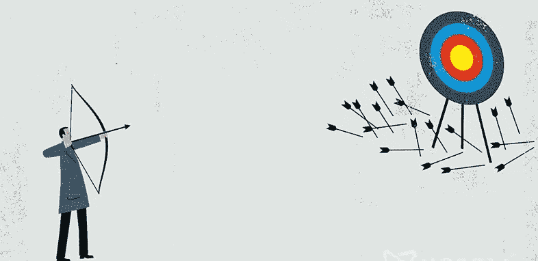

# 我从不太成功的创业中学到的 10 个教训&为什么我从不关闭它

> 原文：<https://medium.datadriveninvestor.com/10-lessons-i-learned-from-my-not-so-successful-startup-why-i-never-shut-it-down-f2e1365cc5b7?source=collection_archive---------25----------------------->

你好！我是 Yashpreet，一个崭露头角的设计企业家。我专门用印度本土纺织品制作[女性融合服装](https://thesvaya.com/?utm_source=social&utm_medium=medium)。

这一切开始于 2014 年，当时我和我的一个朋友出于好奇，决定用几乎在印度所有其他裁缝店都能找到的废料设计女装。我们挑选了一些有趣的面料，将它们与其他补丁混合，添加装饰和细节以及紫罗兰，我们的第一个系列 [*可持续女装产品*](https://www.facebook.com/thepinkorangeco) 就这样诞生了！入行几个月后，我意识到我们缺乏做大的必要条件。我们决定分道扬镳，积累更多的经验。我决定以初级水平加入一家即将成立的初创公司，了解他们如何处理我所缺乏的细微差别，利用我所拥有的技能在公司内部建立一些东西，并在 6 个月内晋升到高级职位。工作是惊人的，团队是伟大的，创业公司在短短几个月内成倍增长，我看到了我的努力是如何收获成果的。在看到一个只有 42 名员工的小公司如何在短短一年内发展成为拥有 500 名员工的大公司后，我觉得我知道如何才能成功。带着极度的自信和毫无准备的计划，我辞职开始了自己的事业——这次是单枪匹马。我建立了 Svaya(T9)，一个设计女装融合服装的品牌。

一切似乎都很容易，事情开始有条不紊地进行。我在开始的 4 个月内准备了我的第一次线下活动，结果惨败。几个星期的内疚，几个月的为什么我不能成功，最后，重新振作的动力帮助我犯了更多的金钱密集型错误。我的积蓄快用完了，没有全职员工帮我脱困，为了避免不必要的开支，我和父母住在一起，直到运营一年后，我才真正知道公司的发展方向。

# 下面是我那年贴的内容，以及我如何应用我学到的每一课让它发挥作用:

1.  **我制定了** —与之前不同，今年我写下了我的目标。不，我不知道如何实现它们。我一路学习，但知道我的目标是什么，让事情变得更顺利，更符合我想要实现的目标。
2.  我雇佣了— 我知道自己一个人做事浪费了很多时间。这一次，我雇佣了。我雇了很多人，而且雇得很快。我有一个全职员工，他们会为我创建新的样本，4 个全职实习生，他们负责管理其他各个部门，即社交、运营、后端和设计；还有许多其他自由职业者和基于项目的工作者，他们带来了他们的专业知识。
3.  **我与—** 我几乎与我圈子里的任何人和所有在我的行业工作的人都有联系。当我这么说的时候，我不仅仅指管理层的员工，也包括工人。我与他们互动，了解隐藏的运营挑战和削减成本的技巧，这些几乎没有人向我透露过。
4.  **我应用—** 我将过去一年的经验应用到所有团队中，以获得更好的结果。
5.  **我研究了—** 这一次，我不仅研究了我所在的行业以及如何让事情运转起来，还研究了其他创业公司。从所有其他领域。我想明白了市场上什么是有效的，它如何成为我商业策略的一部分。
6.  **我定义了自己的界限——**保持专注和目标导向的最重要的方面是把它写下来并朝着它计划。然而，这样做的前提是能够准确地想象你梦想创造的东西。我在日记中记下了我希望我的品牌如何发展，它的核心价值是什么，它如何与众不同，等等。这不仅帮助我更好地树立了公司的品牌，也帮助我理清了自己的思路。
7.  **我选择了我的优先事项—** 长期以来，我们一直被要求制造一种自我销售的产品，并建立一个以消费者为中心的企业。我决定把它们混合起来。首先，我们坚持最小浪费、公平贸易和来自印度基层的纺织品的核心价值观来生产产品。然后，我们通过提供从 XS 到 XXXL 的尺码，使品牌尺码具有包容性。接下来，我们特别设计了身材娇小的女性和曲线优美的女性的轮廓。
8.  在我的创业之旅中，我第一次给自己留出了几个特别的小时来放松和探索。几周前，当我浏览几篇关于 Medium 的文章时，我发现了一个重要的观点。*“好主意不是你坐着思考的时候想出来的。他们通常会在你忙得无所事事的时候狠狠地打你！”*相信我，我在看电影、听广播或在公园漫步时，获得了很多关于分销、库存管理和设计的想法。
9.  我学到了这样一个教训:钱只有在花出去的时候才能赚到。更重要的是，当你不是来自常春藤联盟的商学院，或者没有一个可以轻易让你获得资金的网络，或者没有打造下一个大东西，或者填补市场上的巨大黑洞。从对在特定部门花多少钱来获得结果的超级挑剔，我变得松散，在不必要的事情上花更多的钱。这样我很快失败了。我很快评估了什么对我的品牌有效，什么产生了结果——销售或吸引力，以及什么导致了浪费。在这里和那里花了一大笔钱后，我现在确切地知道什么需要花在哪里以及如何花。
10.  **我了解到每天醒来并到达你的工作场所并不容易，不像我们一开始想象的那样**——我是一个超级热情的工作狂。如果我喜欢，我可以疯狂地工作，永远不吃饭，不上厕所。然而，在我创业的前 14 个月，我讨厌起床去办公室。我从来没有准时过。我从来不知道我的一天会怎样，我从来不知道我对我的品牌有什么影响。但我继续前进。我会去计划。我会在看的时候偷懒，但还是会回来看。我会无数次地把过去一笔勾销，但我会纠缠不休，直到有一天我终于想从床上跳起来去工作。我继续前进。

**注:**我了解到所有的创始人都会经历可怕的阶段。一些人在公共场合感到尴尬，一些人破产进入下一级，一些人甚至因为尝试而受到羞辱，一些人带着破碎的心回到家里。但是，他们每个人都有一个共同点，那就是他们坚持不懈的力量。

我已经有所作为了吗？不完全是。我中头彩了吗？我知道我要去哪里吗？嗯，有一次我真的这么做了，这帮助我选择了下一步行动。但是，还有很长的路要走。我会成功吗？是的。即使我失败了，我知道我会从这个不太成功但很快会成功的创业公司近两年的旅程中收获很多。