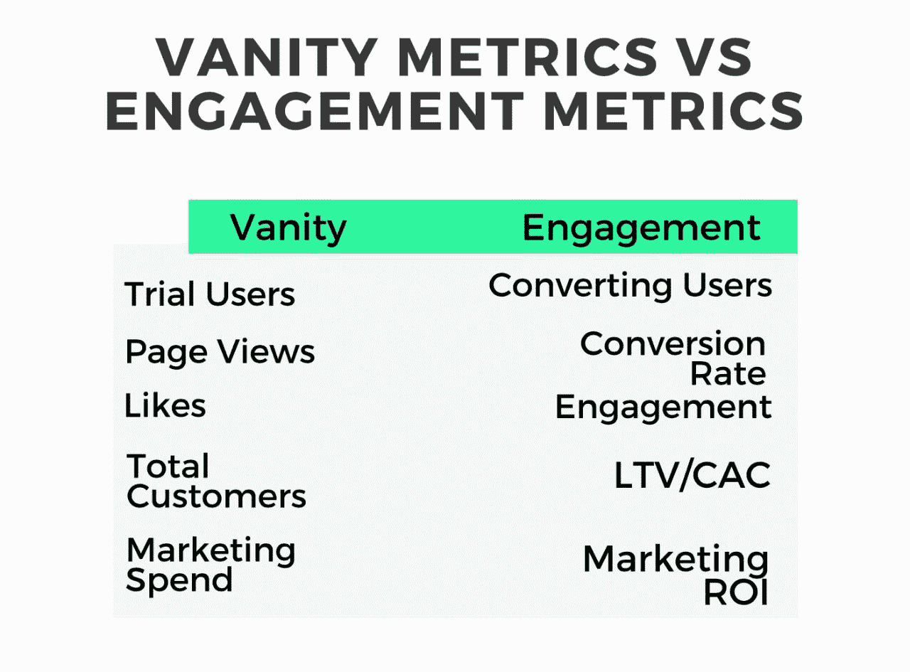
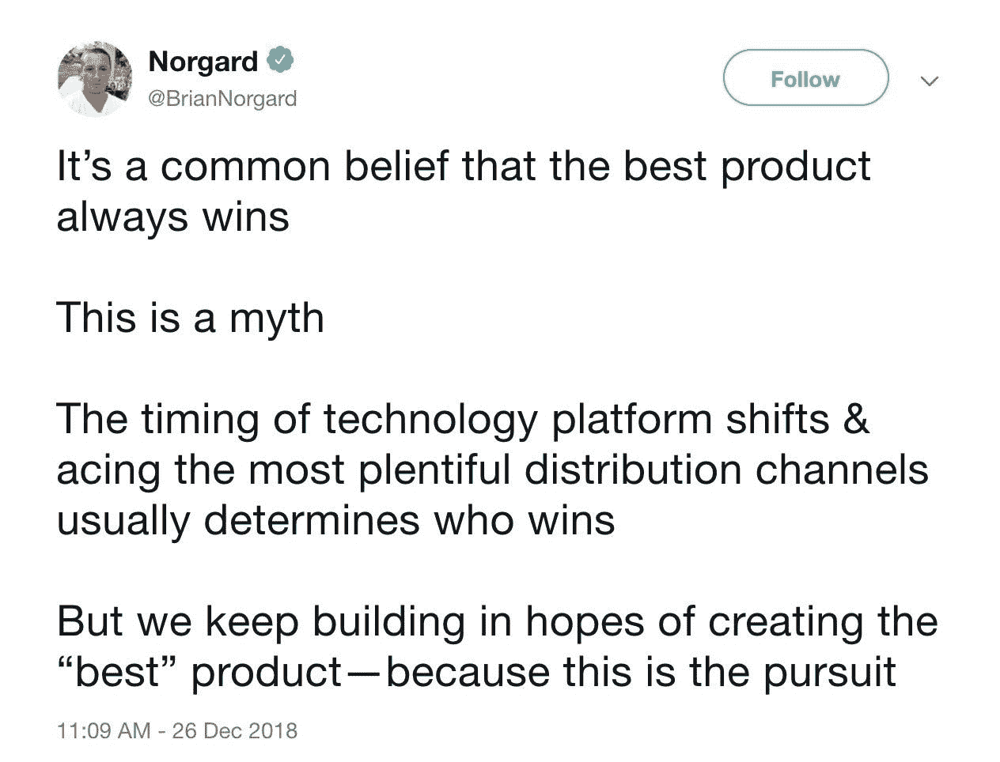
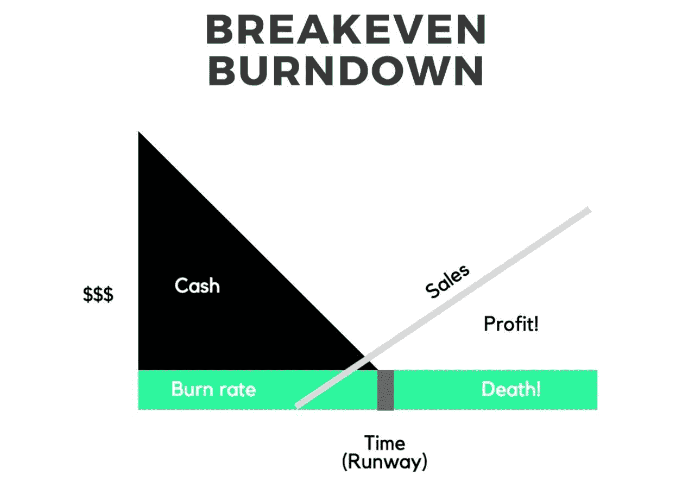

# 科技创业失败的 10 个最常见原因

> 原文：<https://medium.datadriveninvestor.com/10-most-common-reasons-why-tech-startups-fail-contxto-d13b59a8bd35?source=collection_archive---------22----------------------->

对我们大多数人来说，2019 年是一个新的开始。

我们有动力。我们渴望成功，尤其是在我们的商业生活中。然而，正如我们已经知道的那样，从零开始创办和发展一家公司并不是一件容易的事情，我们可能会在很多方面搞砸和失败。

是的，失败。

不管大多数励志演说家和商业大师告诉你失败的好处是什么，到头来还是很糟糕！

今天，我向你展示了科技初创公司失败的 10 个最常见的原因，这样你就能意识到这一点，并在为时已晚之前采取措施。

# 10.关注虚荣指标

> *虚荣心指标对你的实际网站目标没有任何作用，但让你的营销努力看起来不错。*
> 
> *杰森·阿蒙瓦*

有时候，创始人发现他们自己跟踪和衡量的基准对公司来说不一定重要，这意味着他们与公司的成功没有直接关系(不管他们对成功的具体定义是什么)。

这些被称为虚荣心指标，尽管它们让你对自己的业务感觉良好，但对于采取行动来说却很糟糕。

例如，跟踪喜欢，追随者和用户的数量，而不是下载，购买，流失率和保留率等。更多的是感觉良好，而不是有效地计划。

虚荣心指标是一种自我破坏，之所以这样命名，是因为许多创始人对基于这些指标的繁荣业务的错觉感觉良好，而不是面对冷酷的事实。

这里有一个虚荣指标和真正有用的工程指标的快速对比列表。

# 9.试图同时解决所有问题

> 专注是决定哪些事情你不会去做。
> 
> *约翰·卡马克*

有一家名为 Burbn 的小公司，它是一个查看地点、回顾景点以及不时上传图片的平台。长话短说，他们最初的模型没有按计划进行，他们决定专注于一件事:上传图片。

因此，Burbn 发展得更快，现在它或多或少是一个名为 Instagram 的应用程序。

这个故事的寓意？不要用一种精神来命名你的创业。

开个玩笑，寓意是专注于一件事并在这件事上做到最好，很可能会提升你，而不是降低你。

番茄酱公司亨氏也可以证实。

# 8.弱队

> *在 YC 的案例中，初创公司早逝的头号原因是联合创始人的破产。*
> 
> *山姆·奥特曼*

团队是关键，伙计们。一个优秀的产品和一个糟糕的团队很可能会失败。而一个拥有劣质产品的伟大团队可能会找到出路。他们转向，他们测试，最重要的是**他们不断尝试**。

一个弱队可能会出很多问题。主要是，太容易放弃，联合创始人矛盾，领导能力差。

当事情变得糟糕时(他们会)，联合创始人通常会有冲突。如果你和你的团队不能承受这些问题并坚持到底，它很可能会失败。

当事情变得糟糕时，大多数人没有勇气和勇气继续下去，他们太容易放弃。

最后，作为创始人和领导者，你必须向你的合作者和员工证明，事情会变得更好。如果你表现出软弱和缺乏自信，他们也不会感到安全。一个不相信他们领袖的团队总是会导致混乱。

# 7.产品时间不当

> 在错误的时间做正确的事就是错误的事。
> 
> *约书亚·哈里斯*

时机不好也是众所周知的创业杀手。一些现实生活中的例子包括 Myspace 和 Friendster。

大多数人认为，在市场中为时已晚是一家公司可能面临的唯一时机问题。然而，时机不对意味着对市场来说要么太早，要么太晚。

以下是一些过早的公司:1。web van:Today coner shop/insta cart 2。pets . com:Today pet flow . com 3 . lets buyit . com:Today group 4。Beenz.com:今天的加密货币 5。贾斯汀:今天是潜望镜

好的时机很难预测，为了成功启动一家初创公司，需要有许多变量。

使能技术的预先存在、最佳经济条件、趋势和文化接受度是创始人需要考虑的关键因素。

在他的 Ted 演讲中，比尔·格罗斯解释了为什么糟糕的时机是创业失败的最重要的原因。

我可能不认为这是首要原因，但肯定是最重要的原因之一。

# 6.营销不善

> 如果你建立了它，你可能仍然需要 Google AdWords。
> 
> 詹妮弗·梅森布里克

直奔主题。糟糕的营销和糟糕的产品一样糟糕，甚至更糟糕。

我见过营销做得很好的坏产品产生了吸引力，但很少有人注意到营销做得不好的好产品。

此外，仅仅为了营销而投入大量资金，而没有真正具体的战略和可衡量的目标，可能会扼杀公司本身。这与第 2 点(下文)密切相关。

# 5.没有商业模式

> *要么发财，要么拼命。*
> 
> *50 美分*

好吧，我没有找到任何特别的报价，但我喜欢 50。

很多时候，产品不错，营销很棒，团队很厉害。但很多时候，产品本身并不能找到一个合适的方法来将其服务货币化。

这是很多免费增值服务和媒体公司面临的问题。人们使用他们的产品，但是他们不愿意为此付费。

此外，有些公司的货币化战略开始得太晚，后来没有实施。

Napster 就是一个明显的例子。尽管有 8000 万用户使用音乐分享平台。在版权诉讼开始淹没公司后，他们未能实施 SaaS 的商业模式。

# 4.单位经济学和单位价格/成本问题

> *单元经济学竞赛的获胜者更有可能创建成功的公司。*
> 
> *布拉德·哈格里夫斯*

就像烧钱率一样，如果创始人有点自知之明的话，这个问题可以大大改善。

如果你的业务在单位方面没有意义，从长远来看，它将无法扩展。

你需要知道你的利润，你的成本结构，你的 LTV/CAC 比率和你的收入来源。

如果你以“每单位”为基础进行计算，而这仍然没有意义，它们似乎不现实，或者结果没有利润，那么无论你接触到多少客户，获得多少下载，这都不是一项业务，而是一项非常昂贵的爱好。

点击阅读更多关于单位经济学[！](https://www.contxto.com/2018/12/unit-economics-for-dummies/)

# 3.竞争

> 所有失败的公司都是一样的:他们没能逃脱竞争。
> 
> *彼得·泰尔*

彼得·泰尔对竞争有一种非常宿命的看法。他认为，从长远来看，只有取得“垄断”地位的公司才会成功。

我不同意。完全是。

对我来说，竞争是健康的，但它也要对数百万公司的死亡负责。

资本主义是一种野生动物，除了供求关系，它并不真正关心任何事情。只有适者生存，最终，消费者才是决定者。

明确你的愿景，并确保将它展示为一种无形的竞争优势。

诚实而有意识地问自己:为什么有人会买我的产品而不是其他产品？

# 2.现金快用完了

> 金钱就像公路旅行中的汽油。你不想在旅途中耗尽汽油，但你不是在参观加油站。
> 
> 蒂姆·奥莱利

是的，钱不是最终目的。不应该。

但这并不意味着你不需要钱。这是达到目的的一种手段，它不仅是有益的，而且是必要的。大部分创始人都很清楚这一点，但这也是值得放心的。

烧钱速度不理想的公司，没有足够的销售额来支撑他们的运营，在他们的初始投资被消耗后，他们经常会发现自己在下沉。

这就是为什么总是知道你每月的支出是多少，并在用完银行里的现金之前开始计划筹款是至关重要的。

点击阅读更多关于如何提高燃烧率的信息[！](https://www.contxto.com/2018/12/burn-rates-a-scary-balance/)

# 1.没有市场需求

> *任何创业公司的生命都可以分为两部分——产品/市场契合之前和产品/市场契合之后。*
> 
> *马克·安德森*

痛苦。痛苦的事情。爱上一个女生，给她买礼物买花，定约会，努力让那个人爱你，结果却发现她对你没兴趣，还有什么比这更糟糕的？是啊，糟透了。

但这并不像爱上一个想法、开发产品、投资营销并最终发现人们不在乎它那么糟糕。哎哟！

很多时候，人们基于一个想法的性感而放任自己，而不是真正意识到人们有需求。有趣的是，有时候最不性感的创业公司却拥有最大的市场机会。或许是因为很少有人愿意冒险进入那个市场？

从好的方面来看，我几乎可以保证，经历过这个问题的企业家不会再犯同样的错误。

确定市场是否有需求，并找到解决方案。而不是相反。

失败被高估了。不要以失败为目标，而是尝试第一次成功，如果你碰巧失败了，从中吸取教训。

无论如何，这 10 个理由一定会让你思考你的新年计划。

去吧！

–VC

*原载于 2019 年 1 月 2 日*[*www.contxto.com*](https://www.contxto.com/2019/01/10-most-common-reasons-why-tech-startups-fail/)*。*