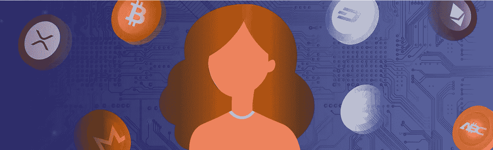

# 加密和区块链让 10 件不太明显的事情变得更好

> 原文：<https://medium.datadriveninvestor.com/10-not-so-obvious-things-crypto-and-blockchain-have-made-better-ad845dc7bcf1?source=collection_archive---------34----------------------->

在比特币诞生之初，加密货币被鹦鹉学舌般地认为是一项变革性技术，可以让世界变得更好。然而，近年来，围绕加密和区块链的对话已经从激进的新应用转向硬币的投资特性。这意味着许多在加密领域推出的有趣项目和应用可能会被排除在你的新闻提要之外。在本文中，我们回答以下问题:**加密货币和区块链在哪些领域做得更好？**

# 1.增强现实

由于口袋妖怪 Go 热潮和像[糖果实验室](http://candylab.com/)这样的公司为基于位置的 AR 铺平了道路，一种全新的创业公司已经出现。越来越明显的是，基于位置的增强现实体验将是体验式营销的未来。

# 2.数字出版项目

出版商努力跟上在线广告并不是新鲜事。这个问题在最近几年变得无处不在，甚至大型新闻公司也在反思他们陈旧的广告模式。为了解决这个问题，SolidOpinion 引入了一种新型的按文章付费广告。广告商可以为目标受众成员从发布网站获得的相关文章上方的有价值的广告资产付费。

> 这项技术利用一种专有形式的加密货币，[订婚令牌](http://engagementtoken.com/)，来促进订婚。发布者和受众都可以通过评论和发布原创内容获得代币。广告商购买代币来在相关文章中选择他们的广告位置。在这种情况下，令牌用于激励发布者继续创建高质量的内容，并激励读者继续参与其中。

# 3.道德商业实践

跟踪大量信息同时保持信息透明的能力是区块链网络的一个重要特征。这可以用来跟踪交易的细节，有助于控制腐败行业的侵犯人权行为。例如，可以利用区块链对渔业进行监管，防止非法行为。

> 正如《卫报》报道的那样，“[区块链]技术可以用来区分可持续捕捞的鱼和非法捕捞的鱼，或者与侵犯人权有关的鱼。”最终，区块链的这一方面可以超越捕鱼，可以帮助规范我们餐桌上所有产品的道德性质。

# 4.财富管理

金融科技是新的黑色。这是一个蓬勃发展的空间，像 Wealthsimple 这样的巨头不断壮大。尽管大数据浪潮正让被动投资策略变得更有吸引力，但这些公司的集中化本质与旧的学校银行结构有着相似之处。这种中央银行框架的一些问题包括高费用、高交易时间、缺乏对每个人的可及性以及没有透明度。

> 这就是为什么像瑞士堡这样的公司，已经为投资解决方案创造了他们自己的代币，给投资者一些很好的机会来管理他们的财富，没有边界或限制。根据瑞士堡网站的说法，“无论你是个人、DAO [ [分权自治组织](https://getsmart.coinsmart.com/articles/decentralized-applications-dapps/?type=smart)还是金融专家，瑞士堡都是一个民主的生态系统，在这里你可以管理加密资产的投资组合。”

# 5.卫生保健

世界期待已久的区块链的另一个应用是在医疗保健领域。具体来说，区块链可用于维护和定期更新电子病历，因此患者档案有一个统一的版本。更不用说，无论患者在世界的哪个角落，医疗保健从业者都可以访问患者的数据并查看他们的病史。这将减少错误的诊断和治疗，患者将通过决定谁可以访问数据和遏制数据盗窃来完全控制他们的数据。

# 6.反腐慈善机构

国际慈善机构关心的一个主要问题是向有需要的人发放资金。利用传统渠道，这些基金中的许多可能会迷失在发展中国家政府官僚机构的腐败阴霾中。幸运的是，由于有能力让链条上的各方承担责任，区块链可以消除慈善机构出现的许多问题，如资金泄露。这就是为什么越来越多的慈善机构慢慢转向区块链平台进行资金支付。例如，世界粮食计划署(WFP)正在利用区块链安全地向饥饿者分发现金援助。

# 7.活力

迫在眉睫的气候变化可能是一个可怕的想法。近年来，将利润与可持续能源挂钩的公司越来越受欢迎。然而，在个人层面上，直接选择你的能源来源以确保它来自可持续的来源可能是困难的。

> 直到现在。区块链的出现帮助启动了像布鲁克林微电网这样的项目。通过这个系统，已经拥有太阳能电池板的人可以通过一个手机应用程序向没有直接接入的居民出售环境信用，这意味着使用更少的碳基电力和更多的太阳能。

# 8.教育

加密货币在改革教育行业方面有着巨大的潜力。事实证明，越来越多的学校接受加密货币作为课程支付的一种形式。据 Futurism.com[报道，瑞士、德国、塞浦路斯和美国的大学已经开始接受比特币作为支付方式。这种支付方式必将增长，因为这种货币的费用更低，而且越来越受欢迎。](https://futurism.com/schools-accepting-bitcoin-tuition/)

> *想象一下，一个部署在区块链的学生钱包可以自动支付学费和贷款，接受奖学金和助学金，可以跟踪助学金的发放，甚至可以在你到达之前将教科书送到你的住所。随着大学开始接受加密支付，这是一个非常现实的可能性。*

# 9.物流

随着区块链技术的真正潜力得到实现，其透明跟踪每一笔交易的能力被证明对国际贸易非常宝贵。使用区块链技术，从制造商到消费者，供应链的每一步都可以被数字化监控。智能合同甚至可以用于自动支付，减少通常与供应链相关的低效率。IBM 启动了 TradeLens 项目，该项目跟踪全球贸易路线上的商业交易。

> IBM 网站称，“通过 TradeLens 这样的解决方案——一个新的、开放的、中立的区块链平台，旨在支持全球贸易——主要的航运和物流公司受益于一个共享的分类账，该分类账可与每个网络参与者即时更新和验证。结果是更好的协作、简化的库存管理、提高的资产利用率等等。”

# 10.筹资

如果您熟悉加密货币，那么您可能会熟悉“ICO”或“初始硬币发行”这两个术语。本质上，许多初创公司现在都在使用加密货币为他们的想法、服务和产品提供资金。创业公司的领导者不再使用传统的风险投资基金，或者使用像 IndieGoGo 或 T2 Kickstarter 这样的融资平台，而是将加密货币作为一种为实现他们的想法筹集资金的方式。基本上，新兴企业可以向感兴趣的投资者提供一个代币，这个代币可以在未来兑换成商品/服务，也可以直接代表公司的股权。这反过来有助于公司产生投资资本，为项目的后续步骤提供资金。因为这种方式很容易跟踪和获得资金，所以它彻底改变了初创企业的整个融资过程。

总而言之，很明显，加密领域非常繁忙。新兴的项目和公司确实激起了公众对这项新技术的兴趣，区块链的边界正在继续扩大。凭借其透明和安全的主要特征，许多行业都可以变得更高效、更易接近、更合乎道德。这篇文章仅仅触及了 crypto 能做的令人兴奋的事情的表面，所以我们敦促你继续探索这个令人兴奋的新世界！

来自 [GetSmart Hub](https://getsmart.coinsmart.com/10-not-so-obvious-things-crypto-and-blockchain-have-made-better/) 。