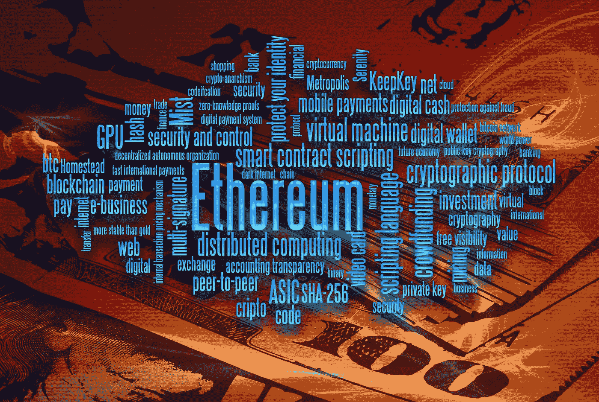
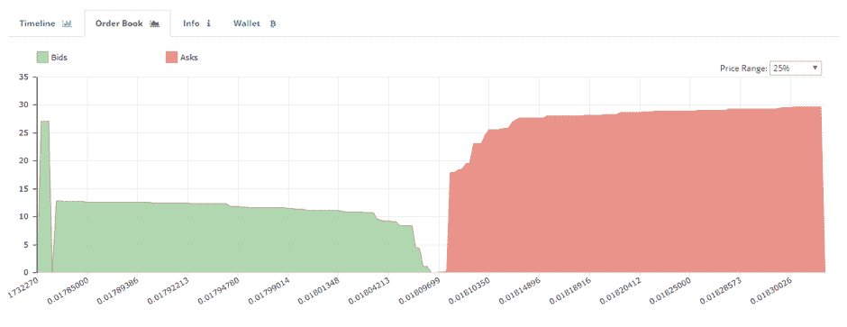

# 你必须知道的 10 个流行的加密俚语

> 原文：<https://medium.datadriveninvestor.com/10-popular-crypto-slang-terms-you-must-know-dac0e58c6ca1?source=collection_archive---------2----------------------->

除了快速致富的机会之外，秘密世界还有许多令人愉快的原因。其中之一是参与在线社区的机会，既包括一般的加密货币，也包括每种特定硬币的加密货币。

Bitcointalk 论坛、脸书集团、Reddit 和 Telegram 都为加密爱好者提供了讨论最新新闻事件、交流投资策略以及在加密货币交易的一些更实际的方面相互帮助的机会。

但是如果你想充分利用网上社区的资源，大量的 crypto(而且经常是 *cryptic* ！)行话现在已经司空见惯。所以，理解这些术语的含义是有意义的。

我们在这里列出了 10 个最常用的加密术语:

**1。HODL**

也许加密投资者能收到的最常见的建议就是这个简单的、拼错的 4 个字母的单词。

HODL 最早来自于 2013 年比特币大崩盘期间发表的这篇现在已经成为传奇的文章。当价格暴跌，减少损失和卖出的诱惑增加时，记住继续 HODL！

**2。月亮**

当一枚硬币预计会大幅反弹时，就说它是在“奔向月球”。正如你可能想象的那样，它可能会被许多刚刚买入“下一件大事”的兴奋的投资者过度使用。

当一枚硬币的价格经历这样一个高峰时，它就被称为“mooning”。

在社区中，这也是一个支持的词语，比如“月亮上见！”经常见到。

**3。蓝宝**

一旦一个或多个硬币最终到达月球，加密投资者的首选工具。论坛上充满了满怀希望的投资者，他们询问某某硬币是否能让他们在未来买一辆蓝宝。他们中的一些人已经这样做了。

**4。FUD**

恐惧，不确定和怀疑。这是一种用来诱使投资者卖出硬币的策略。通过贬低某种硬币，或许称之为骗局，FUD 就诞生了。一些实力较弱的人可能会选择卖出手中的股票，从而压低价格。因此，硬币可以以更便宜的价格买到。

FUD 可以对整个加密市场产生影响。事实上，许多人认为，金融行业的一些最大的名字战略性地介入 FUD，以引发市场恐慌。类似地，FUDster 是传播 FUD 教的人。

**5。DYOR**

“嘿，伙计们，我是这个硬币的新手。我刚刚以 5 美元买入……你们觉得怎么样？”

必然的反应？《DYOR》。

它代表做你自己的研究。这是个好建议。虽然社区可以给你一个硬币的增长潜力的体面的观点，最终，如果你是认真的投资，你会想进行自己的调查。

在回顾未来的 ico 时，这个术语也经常出现——这是理所当然的。投资一个新项目通常会有风险，所以不要相信别人的话，认为一切都是光明正大的。相反，DYOR！

**6。鲸鱼**

鲸鱼是海洋中最大的哺乳动物，这通常意味着它比周围所有其他生物都更强大。同样，在加密的“海洋”中，鲸鱼拥有硬币流通供应量的很大一部分，然后可以利用这一持有量来影响价格，使其对自己有利。

鲸鱼可以通过快速卖出大量股票来操纵市场，导致价格暴跌。价格下跌时触及交易者的止损点，这进一步加剧了崩溃，鲸鱼可以再次低价买入。

他们通常也是你在密码交易所可能遇到的巨大买卖墙的负责人:

**7。BTFD**

买该死的蘸酱。一般来说，当市场处于低迷时期，一枚硬币看起来很便宜时，这是给投资者的建议。

但是说真的，只有 BTFD！

**8。FOMO**

拥有 FOMO 意味着害怕错过。这个术语出现在 crypto 出现之前，但仍然被在线社区热情地采用。

当一枚硬币开始强劲反弹时，由于拥有 FOMO，最初错过的投资者开始买入。如果他们买入得太晚，完全错过了反弹，那么对他们来说，结局可能不会特别好。

**9。包夹**

一个投资者，他持有的密码正在贬值，而且没有多少恢复的希望。

**10。泵和倾卸**

一种协调的方案，通常通过 Telegram 等消息应用程序安排，集体购买选定的硬币，以迅速提高其价格(“泵”)。参与者然后在硬币被抽的时候卖出硬币，以锁定利润。随着抛售的继续，价格崩溃(“倾销”)。

但如果你不设法及时出售，你可能最终成为一个袋持有人。

*原载于 2018 年 3 月 18 日*[*www.datadriveninvestor.com*](http://www.datadriveninvestor.com/2018/03/18/10-popular-crypto-slang-terms-you-must-know/)*。*