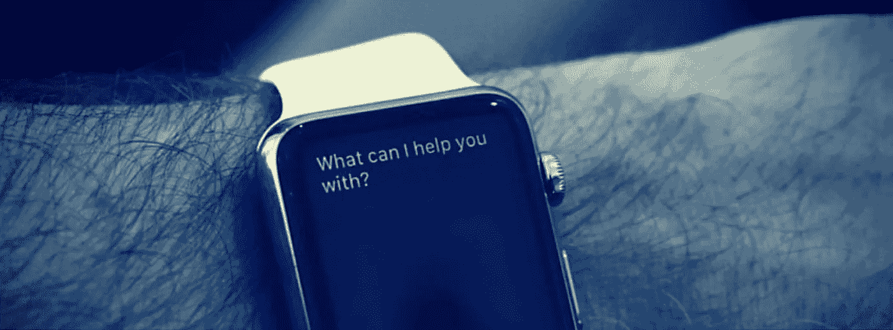
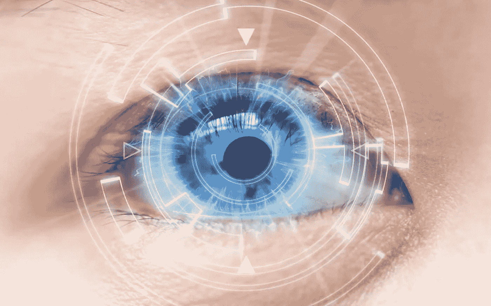
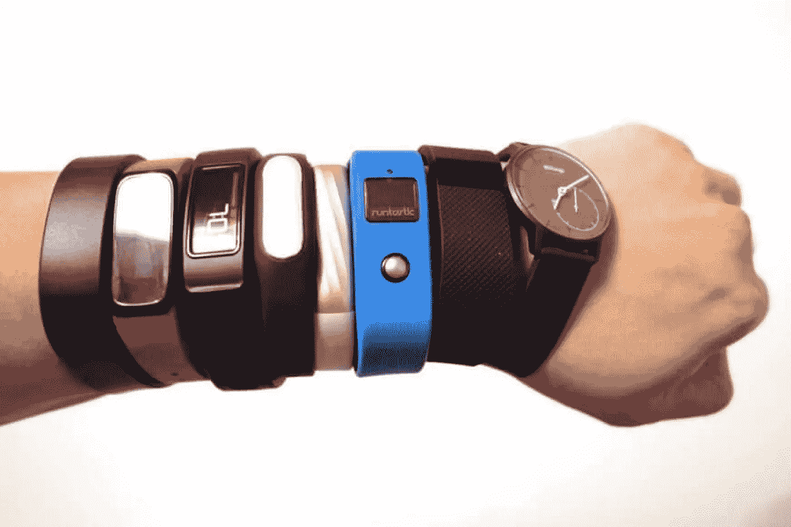
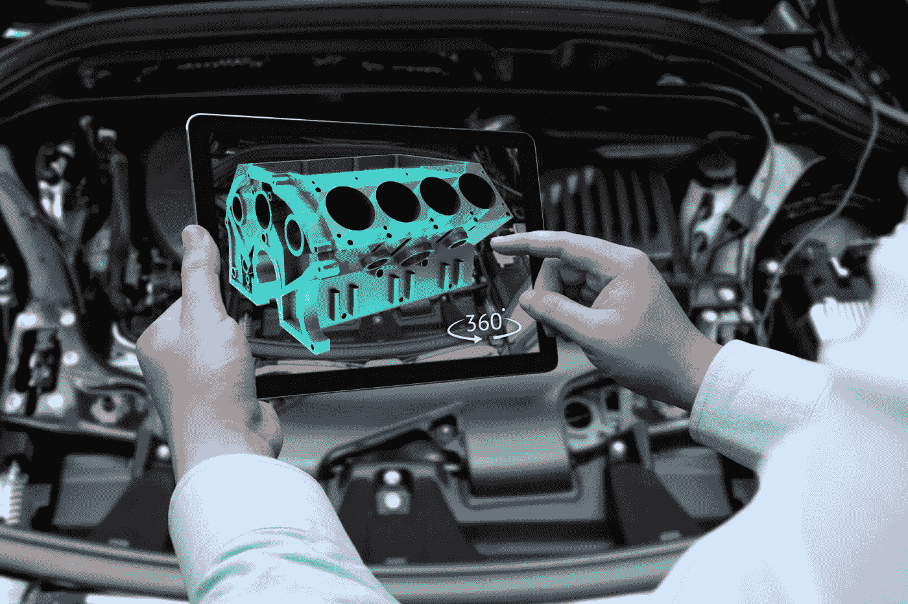
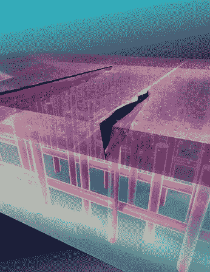
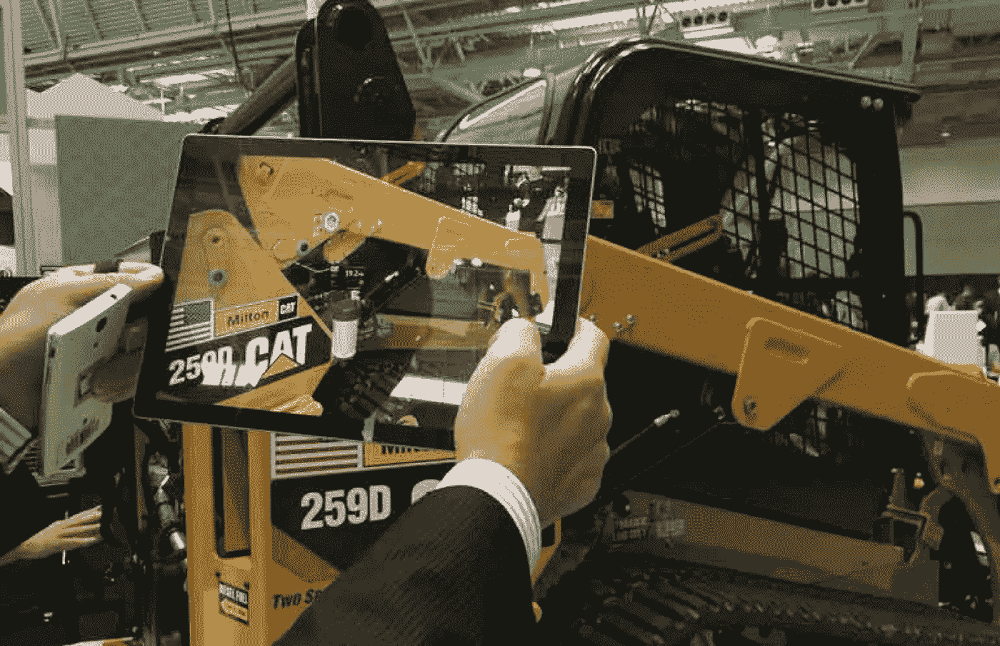
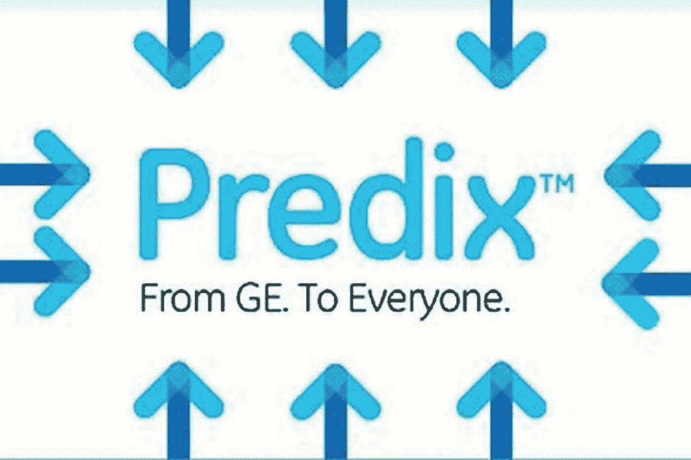
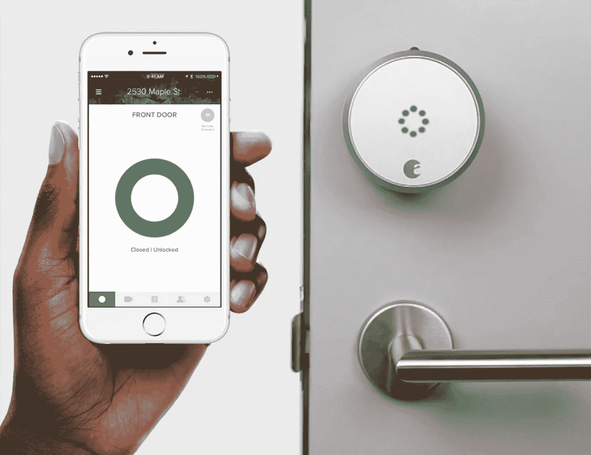
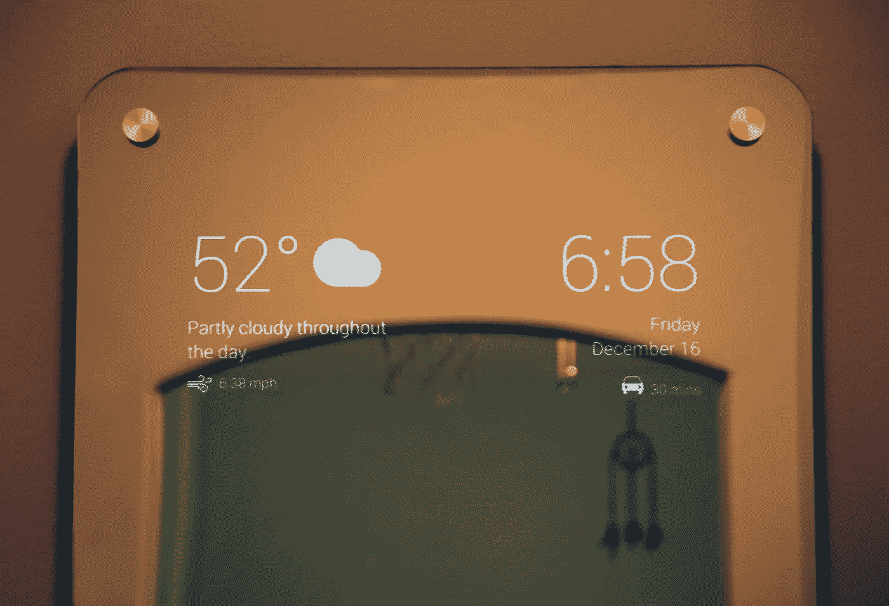
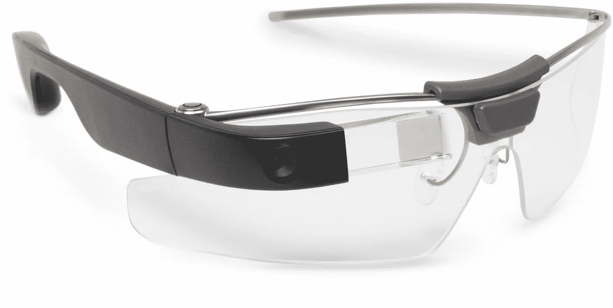

# 值得您关注的 10 个强大物联网示例

> 原文：<https://medium.datadriveninvestor.com/10-powerful-iot-examples-worth-your-attention-1c06276a2e54?source=collection_archive---------0----------------------->

**物联网实例 2018:当代成功的主要领域**

今年，物联网(IoT)在市场上展示了各种令世界印象深刻的技术。随着每一项新的创新，对控制、安全、舒适和娱乐的理解不断加深。在这种情况下，有必要区分对以前的思维方式影响最大的最强大的物联网示例。

在当今市场上呈现的不同物联网示例中，大多数观察者注意到医疗保健、制造、工业、设备和现实生活案例领域的重大成就。在给定的情况下，本文在每个领域选择了两个物联网示例来展示这一创新的力量及其当前趋势。

**物联网医疗保健示例:联网隐形眼镜和活动追踪器**

在医疗领域，物联网的例子改变了服务交付的质量和准确性。具体来说，今天可以使用不同的工具来促进治疗和改善全世界人民的健康状况。在这里，联网隐形眼镜和活动追踪器是最有趣和最强大的物联网医疗保健例子。

尽管《黑镜》(Black Mirror)一集中的情节(存储在镜头上的记忆)仍然是未来主义的，但智能技术对视力的入侵已经令人印象深刻。作为医疗保健领域最有趣的物联网例子之一，**内置传感器的联网隐形眼镜**可以分析眼泪，并向医生提供患者健康状况的信息。准确地说，谷歌授权的技术可以检查糖尿病患者的葡萄糖水平，并在老花眼的情况下研究眼睛的焦点。在这个 IT 巨头的团队中，诺华是该领域的另一家先锋公司。然而，这个项目的风险分析不允许他们实际开始测试产品——正因为如此，苹果和 EPGLMed 目前的研究集中在创新的娱乐可能性上。但是这个想法的出现意味着隐形眼镜将很快成为现实。

在肿瘤学领域，Medidata(云解决方案提供商)和纪念斯隆-凯特琳癌症中心的合作开启了众多**活动追踪器**的漫长采用过程。在用于治疗时，各种传感器和可穿戴设备进入了这一过程，以跟踪患者身体的主要变化。通过即时访问关于疲劳、食欲和血压的数据，医生可以获得准确的信息来进行适当的分析，患者也了解了改善生活质量所需的调整。在给定的情况下，长期治疗的效果显著改善，既准确又个性化。

**物联网制造范例:数字双胞胎和自主自愈系统**

从本质上讲，物联网在制造业中的应用使在该领域工作的人们能够获得准确的数据进行分析，享受机器学习的好处，并提高发布的产品质量。在这种背景下，数字双胞胎和自主自愈系统的可能性，最有趣的物联网制造例子，真正扩大了视野，增强了领域内的关键流程。

一方面，**数字双胞胎**是实物的复制品，其精确度足以让它们的主人实验和预测它们资产的运作。换句话说，物联网这一示例的应用能够模拟物理机器的寿命、测试更新以及预测与每个物理对象及其网络相关的可能问题和益处。这意味着制造业的一场革命——以前，建造错误的唯一理由是允许失败或损害在现实中发生。但有了这种物联网应用，各种类型的设备可以在进入人类世界之前，在安全的虚拟环境中存储和控制它们的副本。

另一方面，**自主自愈系统**是制造业中物联网的例子之一，也成功地显著改善了这个行业。确切地说，该技术意味着实物资产最终获得了一个无需人工干预就能解决问题的机会。与 digital twins 应用的主要效果类似，自我修复系统使得在设备问题在物理现实中暴露出来之前就预测它们成为可能。就制造商的商业战略而言，这些物联网成就意味着有机会解决与任务相关的问题，而不是在运营任务上浪费大量的时间和精力。

**IIoT(工业物联网)示例:卡特彼勒和 Predix**

在物联网的各种应用中，工业维度是最有趣的应用之一。在这种背景下，IIoT 一词出现了，意思是在自动化、网络和增强分析方面取得当代成就的行业现代化。在这里，卡特彼勒和 Predix 作为说明性的工业物联网示例，为这些结果做出了贡献。

作为第一家在业务流程中采用 IIoT 的公司，**卡特彼勒**成功合并了物联网和增强现实创新。具体来说，该公司采用这些技术为机器操作员提供重型设备所有关键指标的即时视图，包括燃油油位和需要更换的细节。在后一方面，维修说明通过 AR 应用程序发送，这大大减少了澄清和修复问题所花费的时间。

作为公司内部 IIoT 应用的另一个方面，具有传感器辅助分析的海洋资产智能展示了令人印象深刻的结果。在这种情况下，卡特彼勒使用船载传感器来确保最佳操作参数和优化船体清洁，这有助于管理公司开支和实现更好的绩效。

另一个有趣的 IIoT 例子是第一个工业互联网平台 **Predix** 。受通用电气数字公司的控制，Predix 是推动其增长的企业集团的重要组成部分。在它的功能中，扩展和扩展数字工业解决方案的能力是最突出的。此外，该平台满足了连通性的需求，并提供了机器学习、边缘技术和数字双胞胎来处理物理资产。最后，Predix 能够管理大数据集，这使它成为任何规模的公司的出色优化工具。

**物联网设备示例:智能锁和智能镜子**

物联网最吸引人和最受欢迎的应用之一无疑是为智能房屋设计的一系列设备。特别是，它们包括安全系统、插头、恒温器和许多其他方便生活的工具。同时，在物联网设备的各种例子中，智能锁和智能镜子的案例值得特别关注。

一方面，物联网可以通过引入**智能锁**来提高家庭的安全和控制水平。在物联网示例的世界中，这个工具是最有效的工具之一——基本上，它可以在不久的将来完全取代钥匙和锁。例如，使用 August 智能锁，您可以为特殊的人提供进入您房子的权限，只需一次触摸即可立即限制。除了智能手机控制，键盘上的密码也可以用来进门。最后，远程控制选项通过查看活动日志来提高安全性。

作为物联网例子的另一个代表，**智能镜子**是一个非常有趣的案例。即使它不会每天重复你是他们中最公平的(如果你不这样做的话！)，它还是能告诉你很多有趣的事情。特别是，它可以在显示屏上显示天气状况、时间、日期和来自智能手机的各种通知。此外，还可以连接语音搜索功能(所以你不会碰玻璃——只是对着它说话)。换句话说，童话好像成真了！

**物联网现实生活中的例子:谷歌眼镜和智能农业**

在区分物联网范例中的最佳案例时，关键标准是它们在现实生活中的成功应用。在这里，谷歌眼镜和智能农业技术的成就值得特别关注。

谷歌眼镜是进入并改变世界的最受欢迎的技术之一。作为一款带有光学头显的耳机，它改变了人们对眼镜功能限制的理解。特别是，谷歌眼镜使使用语音在互联网上搜索、选择图片以及以不同方式与数字世界互动成为可能。就像用智能手机一样——但不需要用手。在现实生活中运用创新的机会是巨大的。例如，您可以在进入机场的那一刻看到您的航班信息。或者扫描条形码查看产品的完整信息。或者在一个新城市找到去最好的咖啡店的方向——表现得像个当地人。

反过来，**智能农业**是改变目前植物培育和生长方式的创新。在促进和改善农业主要流程的工具中，无人机、云平台、各种监控解决方案和增强的分析极大地帮助了当代农民。智能农业不依赖于老式的预测和各种来源的数据收集，而是意味着能够即时跟踪气候变化、天气状况、土壤成分以及作物的状态和生长进度。作为创新的一个特殊方面，温室自动化解决方案能够对植物进行全面控制和全面护理。特别是在适当的照明和灌溉方面。最后，牛的监控和管理能力包括检查健康状况和动物的位置。