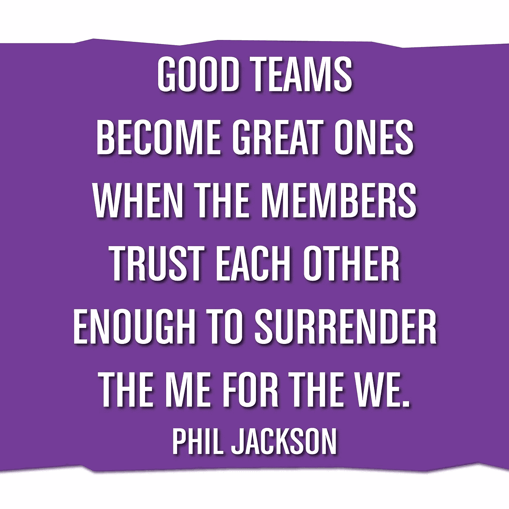

# 建立更好的全球协同或远程团队的 10 个实用想法

> 原文：<https://medium.datadriveninvestor.com/10-practical-ideas-to-build-a-better-global-team-which-is-colocated-or-remote-d33c961d6588?source=collection_archive---------14----------------------->

source- [https://quotesofme.com](https://quotesofme.com)

## 为什么我们更喜欢商业中的“团队”文化

商业总是从体育中汲取灵感。在体育运动中，你要么有团队比赛，要么有个人比赛。虽然这两种游戏都提高了个人的能力，但团队游戏在更大程度上塑造了个人的整体个性。

问题是，是什么让一个人拥有伟大的人格？

技能，如:

*   **技术和功能专长**
*   **解决问题**作为一个小组，通过定义*正确的*问题，然后提出*正确的*解决方案。
*   **决策技巧**尊重他人
*   **人际交往技能**如沟通、协作以及如何处理冲突

在个人游戏中，提高这些技能的机会很少，因为你的问题是你的，你必须处理它。这可能会提高决策技能，但当你做出一个可能影响一群人的决定时(当风险很高时)，你会学会如何做出最好的决定，并对自己有更多的了解。是的，你很少有机会交流你的想法，也不会有任何冲突。

**这是成为团队一员的第一步。**

***由于这些因素，企业一直在推动团队文化，因为它不仅有助于个人，而且通过改善个人，他们正在获得对企业最重要的更好的结果。***

> 虽然个人运动促进了更高程度的纪律性，但研究表明，人们觉得团队运动更令人愉快。有趣的是，[研究表明团队竞争会提高表现水平](http://psycnet.apa.org/journals/psp/86/6/849/)。

(来源—[https://g4athlete.com/team-vs-individual-sport/](https://g4athlete.com/team-vs-individual-sport/))

## 现在让我们明白什么叫做团队，什么不是！

如果你在网上搜索，你可能会找到很多关于什么是团队的文章。但是我的尝试是帮助我的读者了解如果你的团队真的是一个团队，需要注意的实际想法。

> “团队合作是朝着共同愿景共同努力的能力。将个人成就导向组织目标的能力。它是让普通人获得非凡成就的燃料。” *—安德鲁·卡内基*

当企业把一群人放在一起完成一项任务/项目/任务时，人们通常认为是一个团队。虽然这可能是部分正确的，但这并不一定使这群人成为一个“团队”。

***#2 想法—*** *我想建议了解一下那群人在一起工作了多久。持续时间很重要。这个群体需要在很长一段时间内保持稳定。可能至少 6 个月以上。*

如果人们在一起呆的时间更长，他们将会有机会学到更多的东西，并且逐渐地他们可以提高成为一个更好的团队。

*如果团队中不断发生人事变动，那么这就是组织领导人需要努力解决的问题。*

**假设你注意到一群人一起工作了很长时间，我们现在可以称之为团队了吗？**

**不**！仅仅因为他们一起工作了很长时间，并不能让他们成为一个团队。

***#3 想法* —** *作为一个领导者，如果他们有共同的愿景和目标，你需要注意什么。他们知道他们团队的目标是什么吗？*

在体育运动中，一个团队的愿景是赢得比赛。这个愿景应该由一个目标来支持，这个目标就是团队将重视共同的价值观，这将使他们朝着实现这个愿景的方向前进。

现在，假设你看到一群人在一起很长时间了，并且有共同的愿景，我们现在可以称之为团队吗？

**不！要成为一个团队，每个人都需要互相信任，互相关心，互相支持。最后，他们必须走出自我，像我们而不是我一样思考**

> 把事情做好的方法是不要在意谁因为做了而得到荣誉。
> 
> 本杰明·乔伊特

***#4 想法——在你的团队中，注意交流的流程，看看人们是否在互相帮助和支持。你看到任何自我了吗？***

## 现在让我们来谈谈谁组建团队以及如何组建团队？

组建团队不会自动发生。我的意思是，你不能离开一群人，期望他们自己开始作为一个团队运作。需要有人负责确保这个团队的形成和文化的建立。

> 在敏捷世界中，我们听到像 Scrum Master、XP 蔻驰、敏捷教练、精益教练这样的角色，他们的主要职责之一就是按照这些思路思考。而在一些组织中，你会注意到人事经理将承担这一角色，确保团队得到指导，他们正在成为一个更好的团队。

这应该是教练的衡量标准，以确保业务知道团队是否正在变得更好！企业确实需要一个专注的角色，一个会为之努力的人。

**根据我的经验，我认为建立一个更好的团队确实需要一些想法:**

***#5 创意:*** *作为一个团队，必须集思广益，想出价值体系。* ***团队同意严格遵循的价值观。*** *团队中的任何新进入者都应该认同价值体系。*

**首先，你可以从敏捷宣言中获得灵感:**

> 敏捷宣言中提到的[敏捷软件开发](https://searchsoftwarequality.techtarget.com/definition/agile-software-development)的四个核心价值是:
> 
> 过程和工具之上的个人和交互；
> 
> 综合文档之上的工作软件；
> 
> 合同谈判中的客户协作；和
> 
> 响应变化而不是遵循计划。

**或者你可以看看 Scrum 或者 XP 的数值(**[【http://www.extremeprogramming.org/values.html】](http://www.extremeprogramming.org/values.html)**):**

*   沟通——从需求到代码，我们将一起工作。我们将共同创造解决问题的最佳方案。
*   简单——我们会做需要和要求的事情，但仅此而已。这将使迄今为止的投资创造的价值最大化。
*   **反馈** —我们在早期展示我们的软件，然后经常仔细聆听并做出任何必要的修改。
*   **勇气** —我们会说出进度和预估的真相。我们不记录失败的借口，因为我们计划成功。我们什么都不怕，因为没有人会独自工作。无论何时发生变化，我们都会适应。
*   **尊重** —每个人都给予并感受到作为一名有价值的团队成员应得的尊重。每个人都贡献价值，即使仅仅是热情。开发人员尊重客户的专业知识，反之亦然。

**#6 理念:*通过与团队合作建立衡量标准。与团队一起集思广益，就标准达成一致。***

> 衡量一个人的最终标准不是看他在舒适和方便的时候站在哪里，而是看他在面临挑战和争议的时候站在哪里。——小马丁·路德·金

**团队测量的一些例子可以是:**

*   团队的职能专长——客户对团队有什么感觉。他们不断分享改进产品的新想法吗？他们能分享任何证据吗？**衡量团队对业务的理解。**
*   团队的技术专长——技术涉众对团队的技术解决方案有何看法。他们是否提供了可扩展、简单且成本更低的解决方案？**在这里衡量创造力。**
*   团队解决问题的能力——团队如何交付期望的结果？他们花的时间总是比他们承诺的多还是少？团队是否允许每个人都参与解决问题的练习？
*   决策技能——团队是总是依赖团队中的一个人来确认决策，还是团队可以在不依赖任何特定人员的情况下做出决策？**衡量团队的决策方法**
*   最后，最重要的人际交往技巧——根据团队认同的价值体系来衡量团队。他们与它一致吗？获得 360 度反馈，看看团队是否在这方面做得更好。**衡量团队如何应对冲突。**

## 与远程或分布式团队打交道困难吗？我们可以将这个团队视为同地团队吗？

是的，如果这是由一个不称职的领导指导的话，会很困难。这需要组织的支持来保留一个以前处理过分布式团队结构并成功运行过的领导者。

为了能够成功地运行一个分布式团队，作为领导者，你需要做到以下几点:

***#7 理念:* —** 教练必须致力于确保团队成员定期相互交流，尤其是在团队组建之初，提供一些在不同时区都很方便的平台。

**#8 理念:——**允许分散团队中的每个人提出自己的观点，让他们感觉到自己受到了 ***的重视******对*** 的每一个人都一视同仁。

***【9 号想法:——***最后，与每一个人单独交谈，看看还能做些什么来提高整体团队的凝聚力。 ***在一个分布式团队中，很有可能有人比其他人更偏向于客户/管理层/利益相关者(由于接近)，作为领导者，你需要提供平等的机会来证明，尽管他们处理问题的专业知识可能不同，但他们都在相同的价值体系下工作。蔻驰/经理在这里有更大的作用。***

## 结论

在体育比赛中，我们可以立即看到结果，观察到团队的凝聚力，但在商业中却不是这样。您可能不会立即看到有效团队的结果，因此需要组织的支持，但同时，持续衡量并遵循故事中提到的准则以确保团队变得越来越好也很重要。

***#10 创意****——这是企业唯一的希望，一旦团队变得更好，企业教练或领导者就可以专注于许多其他事情，因为团队可以自己管理自己！！* ***企业领导者应该继续给团队授权。***

