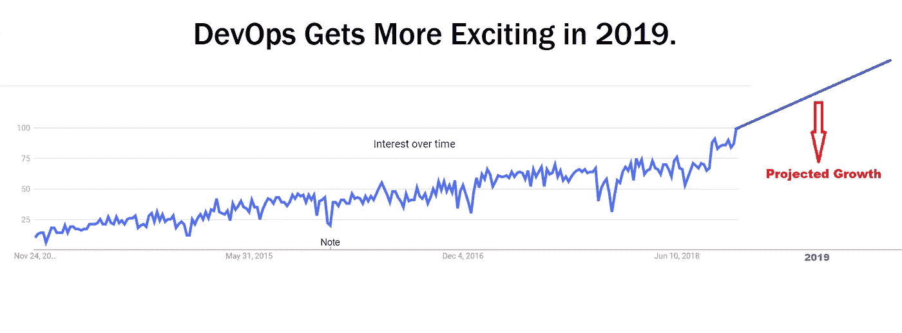
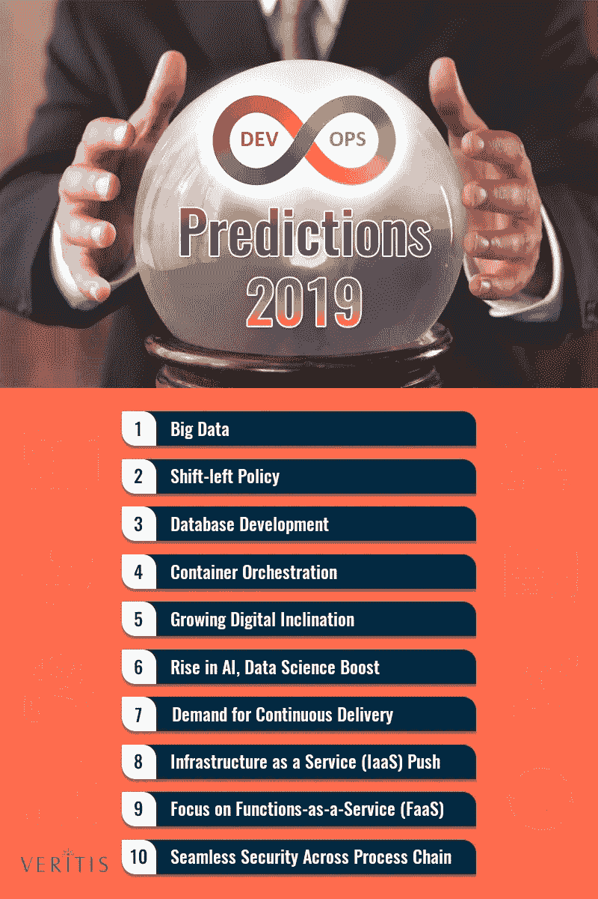

# 2019 年需要注意的 10 大发展趋势

> 原文：<https://medium.datadriveninvestor.com/10-promising-devops-trends-to-be-aware-of-in-2019-5c2923ebee89?source=collection_archive---------4----------------------->

DevOps 概念在软件开发行业中越来越为人所知，并且正在整个技术社区中传播。像任何其他新概念一样，你可能会感到困惑，有时会听到关于 DevOps 是什么的矛盾观点。

那么 DevOps 到底是什么意思呢？我们讨论了不同的定义，一致认为从实用的角度来看，最常用的是:

" [**DevOps**](https://theagileadmin.com/what-is-devops/) **是运营和开发工程师共同参与整个服务生命周期的实践，从设计到开发流程再到生产支持。**

[https://aws.amazon.com/es/devops/what-is-devops/](https://aws.amazon.com/es/devops/what-is-devops/)

因此，我们可以同意 DevOps 是两个主要相关概念的组合。第一个是“敏捷基础设施或运营”，第二个是在创建服务时将协作作为软件开发过程中的优先事项。

DevOps 是为创新项目定义系统和技术过程的一种需求。大约在 2000 年，来自 Zenoss 的 Mark Hinkle 开始改进运行复杂系统的方法。首先，HP、IBM 和 CA 开始实现它们，后来，较小的供应商也开始出现，如 Spiceworks、Hyperic、Zenoss 和许多其他供应商。

几年后，我们逐渐意识到开发运维并不只有一种方式，这些计划从公司内部开始，从开发和运营团队开始。这些倡议一旦实施，就会导致成功的项目。

开发运营结合了文化理念、实践和工具，提高了组织以更高速度交付应用和其他软件开发服务的能力。当务之急是能够更快地开发和改进产品，以领先于使用传统软件开发过程的竞争对手。

开发运营趋势正在增加，为了证明这一点，我们已经看到了谷歌的趋势结果，这无疑提供了更广泛的可能性。

[https://hackernoon.com/8-devops-trends-to-be-aware-of-in-2019-b4232ac8f351](https://hackernoon.com/8-devops-trends-to-be-aware-of-in-2019-b4232ac8f351)

所以，假设你想跟上最新的趋势，让我们看看有什么新的。

[https://www.veritis.com/blog/devops-trends-top-10-predictions-for-devops-in-2019/](https://www.veritis.com/blog/devops-trends-top-10-predictions-for-devops-in-2019/)

1.  人工智能应用程序正在让他们的数据科学团队在其工作流中照看 DevOps 实践。这是一项有助于提高开发、部署和维护应用程序的效率以满足组织需求的措施。
2.  转向基础架构即服务模式和基于云的解决方案，这将节省成本并允许服务之间更好的集成。
3.  对功能即服务的关注将会增加，因为技术专业人员发现在生产阶段使用容器很舒服。在这种情况下，DevOps 专业人员必须确定在其环境中涉及 Faas 和无服务器计算的用例。
4.  持续交货的需求。多重云架构将会在大型组织中产生持续交付方法和容器相关技术的使用。
5.  安全漏洞给专业人员留下了如何改进他们应对威胁的方式的大问题。因此 DevSecOps 负责从最初的开发阶段就集成安全措施。
6.  数据库开发是改善项目开发的一个关键因素，DevOps 专业人员必须确保其性能是适当的。
7.  容器的概念和容器编排技术目前在公司中有很高的需求，以成功实现 CI/CD 循环。
8.  DevOps 和大数据是一种全新级别的协作，有助于流程及其配置的自动化。
9.  数字竞赛恰好是 IT 公司的头等大事之一。调查显示，企业的数字投资从 2012 年的 2.1%大幅增长到 2018 年的 13.4%。
10.  在最后发现问题是老趋势。DevOps 趋势改变了这种方式，在初始阶段就致力于关键原则的集成。通过提供端到端自动化， [DevOps 流程编排工具](https://www.veritis.com/solutions/devops/made-easier-with-devops-tools/)在整个流程链中实现了问题的适时可追溯性。

可以采用这种和更多的方法，但是现在我们让您来决定哪种方法适合您的项目和服务。