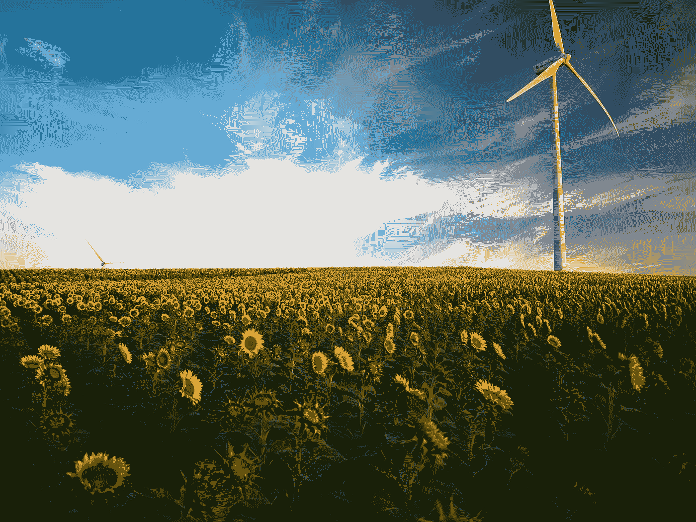
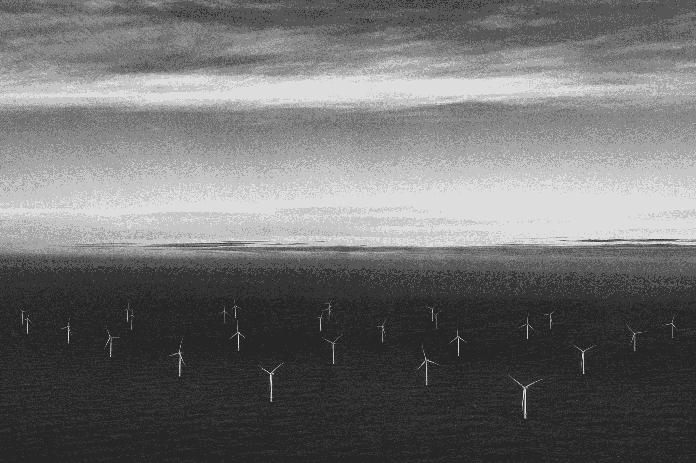
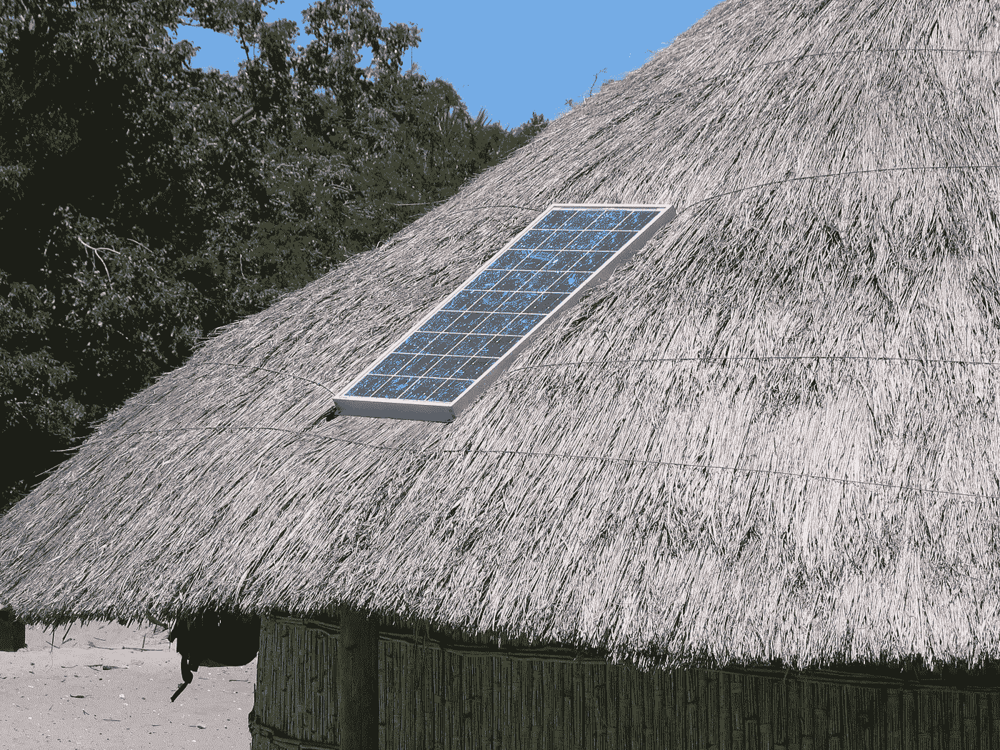
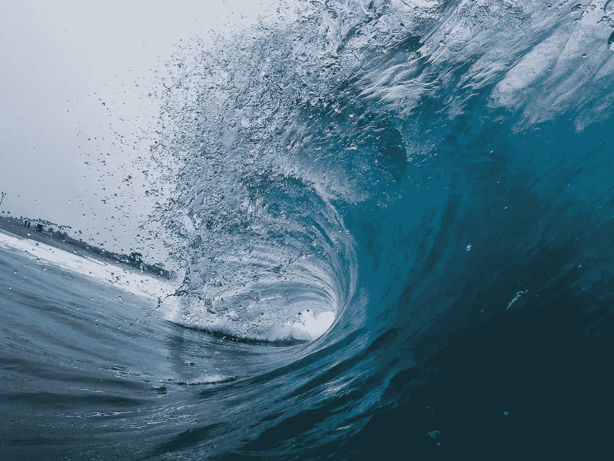

# 看好可再生能源的 10 个理由

> 原文：<https://medium.datadriveninvestor.com/10-reasons-to-be-cheerful-renewable-energy-wins-in-2018-19-3f641d601c5?source=collection_archive---------6----------------------->

对于去碳化的速度，有很多悲观的看法。但是 T2 正在发生，我们应该庆祝胜利。以下是我对可再生能源取代化石燃料感到高兴的 10 大理由。

在我发射之前，我想避开[*行星地球*悖论](https://www.theguardian.com/commentisfree/2017/jan/01/bbc-planet-earth-not-help-natural-world)(即。自然历史节目只关注荒野和野生动物，这给我们一种错误的印象，以为两者都很丰富，而事实上我们正在经历第六次大灭绝。这些胜利是值得高兴的，但不是自满的。鉴于将全球变暖控制在 1.5 摄氏度以下的时间已经不多了，我们现在都是气候活动家。这始于并止于向可再生能源的快速过渡:

# **1。中国**

根据中国官方的国家电力统计数据，[于 2019 年 1 月发布](http://www.nea.gov.cn/2019-01/18/c_137754977.htm)，中国在 2018 年共安装了 44.3 吉瓦(GW)的太阳能光伏发电能力，以及 20.59 吉瓦的风力发电能力。一年之内。客观地说，这是澳大利亚的总发电量(约 65 吉瓦)。[据 CleanTechnica.com](https://cleantechnica.com/2019/01/23/china-installs-44-3-gigawatts-of-solar-in-2018/)称，这将使中国累计太阳能发电量达到 174.63 吉瓦，总风能发电量达到 184.26 吉瓦。是的，中国仍在挖煤，而且是大量的煤，但它正在迅速去碳化。彭博 NEF 预计 2025 年后，中国不会再有新的燃煤电站投入使用。

# **2。印度**

这个亚洲(也是世界上)第二人口大国也在引领可再生能源革命。2018 年，中国超过美国，成为全球第二大太阳能光伏市场。在 2018 年该县增加的所有发电容量中，74%是可再生能源。印度计划到 2028 年安装惊人的 500 吉瓦可再生能源发电能力。该国能源部长 Anand Kumar 在 2019 年初的一次商业峰会上表示，其中 350 GW 将来自太阳能，140 GW 来自风能，其余来自小型水电和生物质能。[《金融时报》报道](https://www.ft.com/content/b8d24c94-fde7-11e8-aebf-99e208d3e521),印度“对煤电的私人投资已经接近停顿……因为印度加入了通过转向绿色能源来应对气候变化的全球努力。”

# 3.化石燃料图标正在转变立场

世界上曾经是化石燃料代名词的地区现在正在(通常是悄悄地)转变。20 世纪 80 年代的电视连续剧《T4》讲述的是石油之州得克萨斯的故事；但是快进到 2019 年，德克萨斯州的能源市场是 30%无碳的，风能占 2019 年发电量的近四分之一(23.4%)(今天的 [J.R. Ewing](https://en.wikipedia.org/wiki/J._R._Ewing) 更有可能经营一个风力发电厂)。甚至一些石油和天然气公司也开始看到了曙光。最近更名的 rsted 过去被称为 DONG，代表“丹麦石油和天然气”。它现在已经剥离了石油和天然气业务，停止了煤炭生产，并且是开发和建设海上风力发电场的全球领导者。

Offshore wind. Photo by [Nicholas Doherty](https://unsplash.com/photos/I40IxW_BUjU?utm_source=unsplash&utm_medium=referral&utm_content=creditCopyText) on [Unsplash](https://unsplash.com/search/photos/offshore-wind?utm_source=unsplash&utm_medium=referral&utm_content=creditCopyText)

# 4.狂风命令密集而快速地袭来

2007 年，风力涡轮机的成本为每瓦特 1.32 欧元。但是到 2018 年，这个数字仅为每瓦特 0.86 欧元(来自 BNEF 的数字)。中国每年部署约 20 GW 的风力发电，预计将持续到 2025 年。但这不仅仅是中国的故事。2018 年，世界上最大的海上风电场在坎布里亚海岸外的小老英格兰(由 rsted 建造)上线，容量为 659 兆瓦。两个更大的英国风力发电场(分别为 714 兆瓦和 1200 兆瓦)将于明年 2020 年上线。根据美国能源部的数据，美国的海上风力项目管道现在[在 13 个州](https://www.windpowerengineering.com/business-news-projects/offshore-wind-is-finally-coming-to-america/)达到 25，464 兆瓦。仅一家风力涡轮机公司 Vestas 在 2018 年就收到了[总计 12，889 兆瓦的订单(是 2014 年订单的两倍)，从美国的 359 兆瓦风力发电场(还是得克萨斯州)，到澳大利亚维多利亚州的 336 兆瓦项目，以及世界各地的项目，包括南非、希腊、约旦、巴西、俄罗斯、乌克兰和斯里兰卡(这还只是上个季度)。](https://www.vestas.com/en/investor/announcements#!orders2018)

# 5.人们这样做是为了自己

越来越多的家庭自己在屋顶和后院安装可再生能源发电设备。英国现在有一百万家庭拥有屋顶太阳能电池板。到 2017 年，全球离网太阳能行业为大约 7300 万个家庭提供电力，即超过 3 . 6 亿人。税收抵免、上网电价和要求新建筑安装可再生能源的立法(例如加州从 2020 年开始)等激励措施有助于启动市场。但是根据德勤的说法，即使没有补贴，国内发电通常比零售电费便宜。澳大利亚和欧洲的住宅和商业屋顶太阳能多于公用事业规模的太阳能农场。

# 6.可再生能源是最便宜的选择

不仅仅是屋顶太阳能越来越便宜。可再生能源全面变得比集中的煤、天然气和核能更便宜。[德勤](https://www2.deloitte.com/insights/us/en/industry/power-and-utilities/global-renewable-energy-trends.html)又来了:

> “风能和太阳能给电价带来了下行压力。理论上，由于太阳能和风能的边际发电成本为零，它们取代了更昂贵的发电机，降低了电价。在全球实践中，太阳能的部署已经拉平了中午的价格峰值，而风能降低了夜间的价格。**美国前 20 个太阳能和风能州中有四分之三的电价低于美国全国平均水平；四分之一的州是全美电力最便宜的 10 个州之一，包括风能领头羊德克萨斯州**。欧洲最大的太阳能和风能市场德国的批发价格已经下降了一半以上……”

Lawrence Berkeley 国家实验室甚至估计，一旦美国达到丹麦的渗透水平——40-50%的可再生能源——批发能源价格将下降[每兆瓦时](https://www.greentechmedia.com/articles/read/energy-prices-if-wind-and-solar-hit-50-percent-of-generation#gs.kuRQ2Lqw)16 美元。

# 7.用电量会下降

总的来说，全球电力消耗只朝着一个方向(上升)，但是有证据表明，成熟的经济体*可以*减少消耗。在英国，家庭用电量在 1970 年至 2004 年间增长了 32%，与大多数其他国家非常相似。但此后每年都有所下降——2017 年[下降 19%](https://www.ft.com/content/f4ebea20-88f1-11e8-affd-da9960227309)至 1995 年以来的最低水平。尽管人口在增长。2016 年至 2017 年，美国的用电量也连续两年下降。据《金融时报》报道，“大量研究表明，消费者正在做出更加环保的购买决定……监管浪潮意味着家用电器——从冰箱到灯泡——变得更加高效，有助于降低能耗。”知情的消费者+环境立法因此可以=减少能源需求。

# 8.发展中国家正在“跨越”发达国家

当成熟经济体不得不拆除旧的集中基础设施并重新开始时，发展中国家通常没有这种劣势。可再生能源的“重心”已经转移到新兴市场，德勤(Deloitte)表示:“2013 年，新兴市场在陆上风能增长方面超过了发达国家，2016 年，太阳能光伏增长也超过了发达国家；2017 年，它们占全球可再生能源新增投资的 63%，将与发达国家的投资差距扩大至历史新高。”2019 年可能是一个转折点，发展中国家的累计可再生能源总容量将超过发达国家(届时，可能是时候重新审视“发达国家”的定义了)。新兴市场已经能够“在可再生能源的部署方面超越发达国家，追求碳密集度较低的发展，并以有益于发达世界的方式进行创新”。可再生能源投资占国内生产总值比例最高的国家也都是新兴市场，包括马绍尔群岛、卢旺达、所罗门群岛、几内亚比绍和塞尔维亚。

# 9.电池存储

过去，可再生能源要么被输入电网，要么被浪费掉。但是电池储存很快就解决了这个问题，对房主和发电厂所有者都是如此。自 2010 年以来，由于特斯拉等公司彻底改变了市场，锂离子电池的成本下降了近 80%。美国房主在 2018 年第一季度部署的住宅电池存储系统数量相当于过去三个季度的总和，主要是在加利福尼亚州和夏威夷。[最近的一项研究表明](https://www2.deloitte.com/insights/us/en/industry/power-and-utilities/global-renewable-energy-trends.html)“可再生能源加存储可以与分布式资源和需求响应相结合，创造‘清洁能源组合’,以低于目前建设一个新的天然气发电厂的成本，以及低于最早在 2026 年运营一个现有发电厂的成本，提供相同的电网服务。”与此同时，rsted(是的，又是他们)最近在英国利物浦建成了第一个独立的 20 兆瓦电池储存厂，以储存附近风力发电场的间歇性能源。

Photo by [Jeremy Bishop](https://unsplash.com/photos/iftBhUFfecE?utm_source=unsplash&utm_medium=referral&utm_content=creditCopyText) on [Unsplash](https://unsplash.com/search/photos/ocean-waves?utm_source=unsplash&utm_medium=referral&utm_content=creditCopyText)

# 10.蓝色能源

这更像是一部“值得一看的电影”。但是仍有未开发的可再生能源，其中之一是“蓝色能源”，或盐度梯度发电。它利用河流与海洋交汇时产生的能量，淡水与盐水迅速混合。理论上，由此产生的潜在电力可以满足世界能源需求。在这篇文章中，我将更详细地介绍蓝色能源[。海洋在其他方面也是潜在的能源。波浪能和潮汐能已经为人所知一段时间了，但从未被积极追求过(尽管我在本文](https://medium.com/@tjsmedley/blue-energy-can-we-get-all-our-future-energy-from-salt-water-d1e4f910d763)中看到了一些有前途的技术[)。【2018 年可再生能源全球状况报告](https://medium.com/swlh/has-wave-energy-finally-come-of-age-b25151fa341f)认为“海洋能源仍然是一种很大程度上未开发的可再生能源。在 2017 年底约 529 兆瓦的运行容量中，超过 90%由两个潮汐拦水坝设施代表。”其中一个，法国的拉兰斯，从 1966 年就开始运行了。)，装机容量 240 MW。也许现在世界其他地方已经准备好重新审视潮汐能了。

如果你有更多的**理由对可再生能源感到高兴，**我很想听听它们:请在下面的回复中分享你的理由。