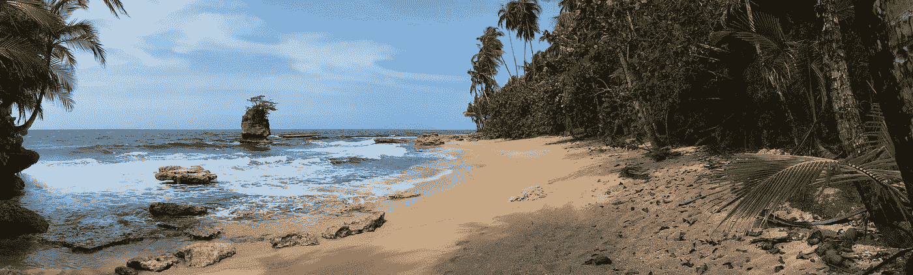
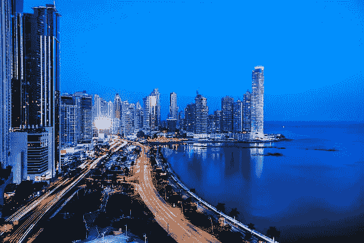

# 美国人选择移居哥斯达黎加和巴拿马的 10 个原因？

> 原文：<https://medium.datadriveninvestor.com/10-reasons-why-americans-are-choosing-to-relocate-to-costa-rica-and-panama-2446740d4a7?source=collection_archive---------2----------------------->

你是否厌倦了每天不断的压力和奔波？看起来你要么是跑着去工作，跑着去做杂事，要么是匆忙回家，这样你就可以把剩下的一点点时间用来放松了。

但是压力的副作用不仅仅是感到烦躁。它还会导致免疫系统减弱，增加心脏病和中风的风险。难怪这么多人想逃离这种忙乱的生活方式。

哥斯达黎加和巴拿马是来自美国和许多其他发达国家的外籍人士和退休人员的热门去处。这些中美洲国家提供了许多美国无法与之竞争的好处。

你想知道它们是什么吗？继续阅读，发现美国人选择移居哥斯达黎加和巴拿马的 10 个原因。

**1。价格实惠**

你有没有花几个月的时间加班，试图获得大幅加薪的晋升？由于美国许多城市的生活成本如此之高，许多人迫使自己更努力地工作，工作更长时间，只是为了有一点额外的零花钱。

在哥斯达黎加和巴拿马退休的最大好处之一就是你不用担心这个。生活成本低很多，所以你的退休基金会走得更远。还有一些很棒的[投资机会](https://www.bizlatinhub.com/latam-business-opportunities-2018-central-america/)不用工作就能增加你的银行账户！

**2。医疗保健不错**

当你考虑在哥斯达黎加退休的利弊时，你可能会害怕离开美国的医疗保健系统。让我们面对现实吧——年龄越大，高质量的医疗保健就越重要。

但是巴拿马和哥斯达黎加都有一流的医疗保健系统，可以和美国媲美。最大的区别是价格。好的保险每月只需 100 美元，医疗费用也低得多。

**3。他们太棒了**

你是否梦想生活在拥有美丽海滩和茂密雨林的热带天堂？虽然美国有几个城市拥有美丽的海滩，但你在这里找不到任何雨林。

哥斯达黎加和巴拿马都覆盖着茂密的雨林，充满了野生动物。您可以在家享受环绕在您周围的天籁之音，并在几分钟内到达海滩。

**4。天气很好**

铲雪铲腻了吗？当然，小时候这一切都很有趣，但是随着年龄的增长，你会越来越厌恶寒冷。

在巴拿马或哥斯达黎加退休意味着再也不用面对雪或冬天了！各国不同地区的天气各不相同，但无论你在哪里，全年都会有温暖的热带气候。

**5。有很多事情要做**

毫无疑问，美国有一些令人惊叹的景点。时代广场、金门大桥和大峡谷都登上了世界各地的遗愿清单。

但是在全国各地有许多住宅区没有什么事可做。当你搬到[哥斯大黎加](https://www.bizlatinhub.com/company-formation-costa-rica/)和[巴拿马](https://www.bizlatinhub.com/company-formation-panama/)时，就不会有这个问题了。

这两个国家都有很多事情可做，包括冲浪、徒步旅行和参观野生动物保护区。由于这些国家都很小，你永远不会离他们提供的顶级景点太远。

**6。他们有很大的外国人社区**

当你第一次考虑移居国外时，你可能会担心交不到朋友。我会融入当地人吗？他们会说英语吗？

许多美国人觉得搬到哥斯达黎加和巴拿马很舒服，因为那里有庞大的外籍人士社区。他们可以和像他们一样的人生活在一起，并在一个友好的支持团体中得到安慰。

**7。他们仍然离家很近**

你还想半定期去看你的孩子或孙子吗？即使只是过圣诞节或感恩节，轻松飞回家的能力也是生活在哥斯达黎加和巴拿马的一大优势。

不仅航程短，而且价格也便宜。你不必担心错过重要的假期，因为你买得起机票。

**8。他们很安全**

也许移居国外最需要考虑的是你的安全。一个国家有多美丽或负担得起并不重要——如果有很多犯罪、暴力或政治动荡，你不会想住在那里。

幸运的是，哥斯达黎加和巴拿马非常安全。犯罪率低，政治体系稳定。你可以无忧无虑地退休到这些国家中的任何一个。

**9。他们更放松**

让我们回到你当初决定离开美国的原因。如果你像大多数人一样，那是因为你厌倦了没有时间放松的匆忙生活。

巴拿马和哥斯达黎加的生活节奏要慢得多。人们并不急于度过他们的一天，每个人似乎都没有那么大的压力。你终于可以高枕无忧，享受生活了。

**10。他们更环保**

你意识到人们是如何对待环境的吗？看到地上的垃圾和天空中翻滚的黑烟会让你难以置信地愤怒吗？尽管美国正在转向更绿色的生活方式，但仍然有很多污染。

近年来，哥斯达黎加和巴拿马在保护环境方面取得了巨大进步。事实上，哥斯达黎加正在朝着只用可再生资源如水力发电来满足国家电力需求的方向大步前进。想象一下，如果没有燃烧多余的化石燃料，空气会有多新鲜。

**搬到哥斯大黎加和巴拿马**

如果你想搬到国外，逃离紧张的美国生活方式，看看哥斯达黎加[和巴拿马](https://www.bizlatinhub.com/register-onshore-company-panama/)就知道了。这两个国家都实现了许多美国人眼中的理想生活方式，低生活成本，良好的医疗保健，以及著名的 Pura Vida 生活方式。