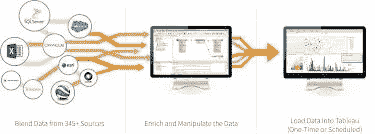
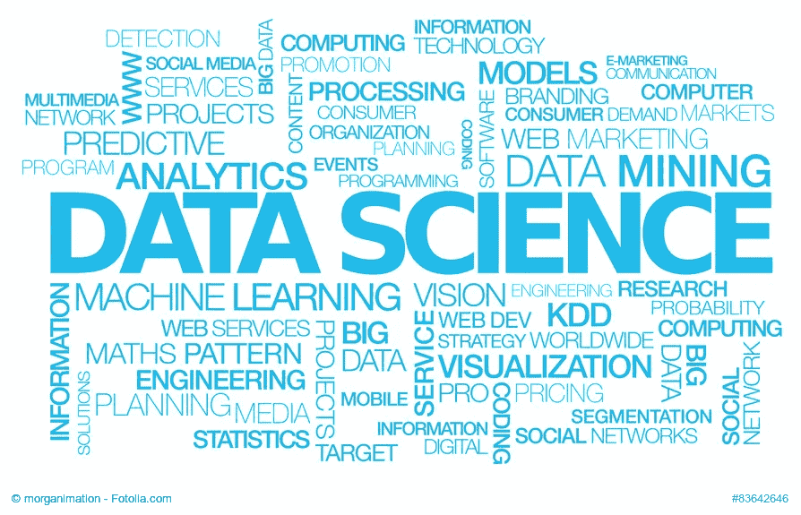
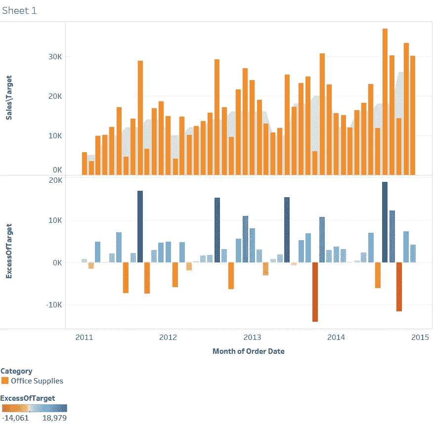
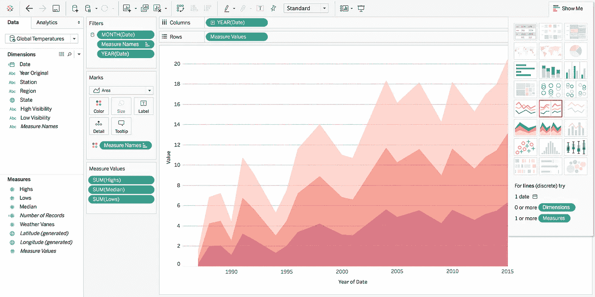
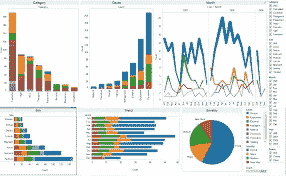
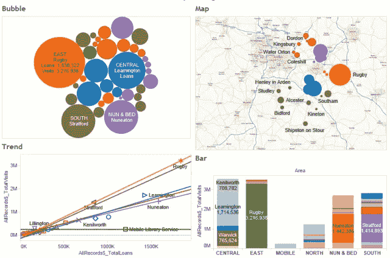
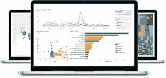
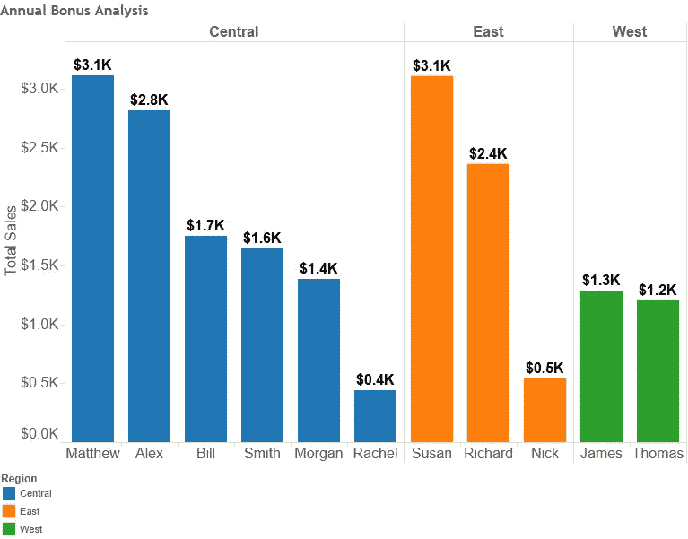

# TABLEAU 摇滚的 10 个理由！

> 原文：<https://medium.datadriveninvestor.com/10-reasons-why-tableau-rocks-797687ff0dd0?source=collection_archive---------0----------------------->

到 2020 年，全球将产生 50 倍于 2011 年的数据量和 75 倍于 2011 年的信息源(IDC，2011)。这些数据中蕴含着人类进步的巨大机遇。但要将机会变成现实，人们需要触手可及的数据的力量。Tableau 正在开发软件来实现这一点。

我问自己从哪里开始，我的导师告诉我 Tableau。什么是 Tableau？Tableau 就像一个数据科学职业黑客。当我在学院的时候，我学习了 IBM SPSS。我努力学习它，但后来我爱上了它。Tableau 和我=恋人。这既简单又快捷。对我来说，这是我喜欢的第一个统计软件。因此，我列出了你应该学习 Tableau 并投入时间的 10 个理由:

1.  数据科学的第一项终极技能

对于经验丰富的分析师来说，这不仅是一个超级强大的工具，而且它非常容易学习，是进入数据世界的一个很好的切入点。

2.方便用户的

它帮助人们看到和理解数据。Tableau 产品正在改变人们使用数据解决问题的方式。Tableau 使分析数据变得快速简单、美观实用。

3.适用于任何业务

由于不同类型的组织的需求不同，Tableau 提供了许多使用它的选项。未来就在这里。你可以作为学生、组织或数据分析师，甚至记者使用。数据可以从任何地方获取，并通过桌面或移动浏览器在组织内共享。

4.快速简单

这是创建可视化仪表板的最佳软件。Tableau 产品在不断开发的过程中始终牢记易用性。与其他自助 BI 工具相比，Tableau 的独特之处在于数据可视化和自助分析的质量。Tableau 为自助 BI 工具设定了黄金标准，为业务用户提供无需 IT 干预的数据分析。它既简单又快捷。

5.你仍然可以和 Excel 结婚，但是 TABLEAU 是你的情人

Tableau 很容易连接到不同的数据源。它可以连接到 40 多个不同的信号源。因此，您可以添加 Excel 电子表格，并使用令人惊叹的可视化仪表盘对其进行升级。

6.你不需要做任何编码。

从技术上讲，你不需要在 Tableau 中编码。几乎所有的功能都可以通过拖放来实现。Tableau 为您提供了内置的表格计算，只需点击鼠标即可添加复杂的分析。

另一方面，Tableau 集成了 R 或 Python 等编程语言，对于您的数据科学职业来说，这是最好的特性。

7.社区是巨大的

你并不孤单。你有一个庞大的社区。我在准备我的第一次 Tableau 会议，我很兴奋。你有很多学习资源。我更喜欢基里尔·叶列缅科的课程，因为他总是把一切解释得如此简单。这是其中一门课程的一些仪表盘。(我做到了伙计们！).

8.LEVEREGE 数据的力量

使用 Tableau，您可以轻松利用数据库的力量。您可以连接到数据库视图。Tableau 帮助您优化查询性能。此外，Tableau 有足够的内置提取、转换和加载特性。你可以改变数据类型，连接，分割，连接，混合数据等。您可以进一步创建集合、箱、组等。这意味着您不必投资于单独的 ETL 解决方案。

9.向你的老板解释你的数据报告会更容易

让每个人都能理解数据库和大礼包。Tableau 帮助人们看到和理解他们的数据。数据从未如此重要。

10.你还在等什么？去吧。立即安装 TABLEAU！

# 下次再见，伙计们，快乐分析。

曼雅

在 INSTAGRAM 和 [LINKEDIN](http://www.linkedin.com/in/manjabogicevic/) 上关注我