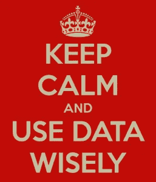

# 适用于任何大小(大/小)数据的 10 条规则

> 原文：<https://medium.datadriveninvestor.com/10-rules-for-data-of-any-size-big-small-263165976a68?source=collection_archive---------9----------------------->

我花了 30 年的时间盯着数据。当大数据以兆字节计量时，我在 SQL Server 4.x 上构建了我的第一个分析应用程序。如今，如果您拥有合适的工具和平台，大数据几乎是无穷无尽的。但是仅仅有工具还不足以制作一个好的数据程序。事实上，工具和平台是容易的部分！是人和过程使它具有挑战性。以下是我的十大数据规则。它们来自经验。

1.  **数据是您组织最宝贵的资产之一。**如果您的组织没有将数据视为核心资产，那么您将错失良机。问自己一个问题？什么更重要:你在银行里的钱还是关于你在银行里的钱的数据？数据是最好的原材料之一，也是你的业务或服务的副产品。
2.  **你知道你的数据保留政策的法律义务吗？**垂直行业必须将数据记录保留一段时间。一些数据如果保存的时间超过了需要的时间，可能会成为一种负担。我说的是监管责任，但肯定也是一种成本负担。保留太多数据，即冷数据，也会与其他更有用的数据竞争。
3.  **力争拥有单一来源的真实数据。**如果可以的话，请不要复制数据。人为什么要复印？因为原始的记录系统跟不上其他的处理。当然可以将数据从 OLTP 系统移动到 OLAP 系统进行分析。但是，如果你因为当前的分析系统跟不上而不必将它转移到 OLAP 立方体或内存解决方案中，那么是时候重新考虑这些解决方案了。
4.  **数据治理是每个人的责任。**首先不要称之为‘治理！’这个词使人厌烦。叫别的吧！一个好的“数据强大”活动的一部分是向组织中的其他人推销该活动。如果您认为数据是您组织的关键资产之一，那么拥有一套“数据强大”的系统和流程对您来说也应该是至关重要的！
5.  **数据质量和数据血统是必须具备的，而不是一个好东西。一旦数据被破坏，无论你对它做什么，它总是被破坏。数据是一种人工制品，永远无法修复。当然，你可以更新它，但如果你遵循一个好的数据血统程序，原始的就是原始的。数据质量应该是每个部门和每个公司的目标。**
6.  **数据安全和数据隐私也是必须具备的！**没有什么比暴露客户或公民数据的数据泄露更令人尴尬的了。安全性是所有组织的头等大事。如果你的组织中没有 CISO，那么你应该考虑雇佣一个。CISO-首席信息安全官。
7.  **首席数据官比首席信息官更重要！**计算中的一切都围绕着一件事，而且只有一件事:数据。没有数据，你就不需要网络、服务器、云或者我们今天购买和生产的任何软件。那么，为什么首席数据官在过去的 5-10 年里变得如此受欢迎呢？
8.  **数据是企业的脉搏。数据流就是现金流。有一句流行的话:现金流比利润更重要。可能是真的。当现金流发生时，您是否测量了现金流的实时比率？可以吗？你为什么不是？现金流可以通过电子交易来衡量，绝对是你组织的脉搏。医生给你做检查的第一件事是什么？他们给你把脉！**
9.  **你应该有数据目标来奖励好的数据行为。**您的组织有数据目标吗？你是否在财政上鼓励人们在部门里有良好的行为？您可以测量数据质量，这样您就可以设定目标来鼓励良好的实践。数据质量越好，您的组织就越健康。也可以游戏化。
10.  **实时是必须的。**如今，数据领域的大淘金热是奔向实时数据。为什么不呢？您衡量数据的时间价值吗？如果我必须等待 6 个小时才能将一批记录发送到我的报告系统，会有什么经济负担？如果我有几乎碰巧的数据，我能得到什么？实时真的很重要！

我相信你有你的清单，或者也许你认为这些是常识。不管你怎么想，我都想知道你的想法。尽情享受吧！