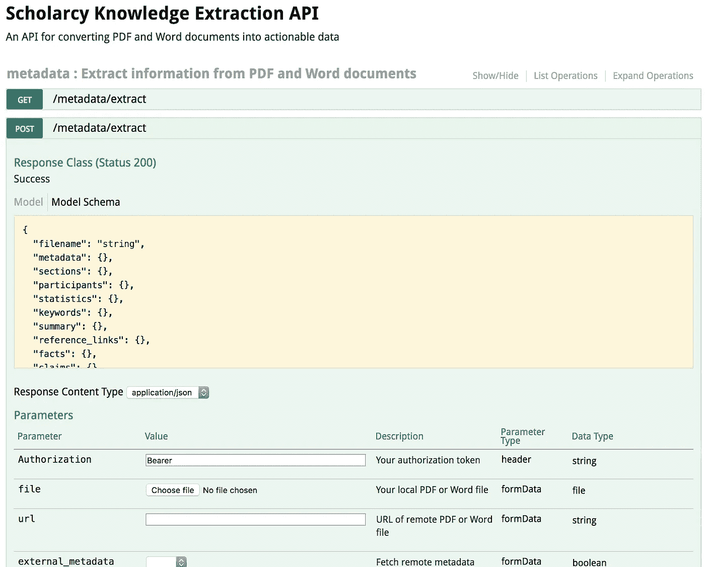
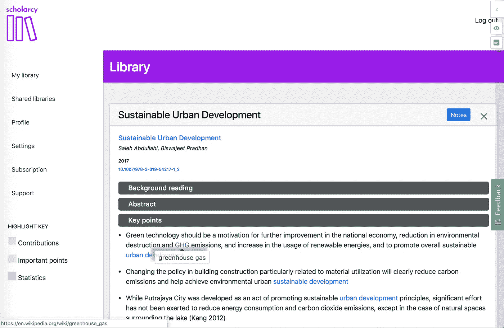

# 创业成功外包的 10 个步骤

> 原文：<https://medium.datadriveninvestor.com/10-steps-for-successful-outsourcing-for-your-startup-b026d902a60d?source=collection_archive---------9----------------------->

在其他地方，我写了如何用小额预算建立奖学金 MVP，并分享了 T2 从一次不成功的创新基金竞标中吸取的教训。在这篇文章中，我将分享我第一次与一家离岸公司合作外包 [Scholarcy web library](https://app.scholarcy.com/#/) 开发的一些重要经验。

The Scholarcy web library app

使用 [Scholarcy](https://www.scholarcy.com/) ，我采用了 [API 优先的方法](https://medium.com/adobetech/three-principles-of-api-first-design-fa6666d9f694)。事实证明，这是一个好策略，因为它将算法和数据处理与面向用户的功能相分离，同时允许在其上构建各种新的客户端应用程序。例如， [Chrome 扩展](https://chrome.google.com/webstore/detail/scholarcy-research-assist/oekgknkmgmaehhpegfeioenikocgbcib)几乎由一个 HTML 模板和一堆 API 调用组成。这也是出于需要:我有能力构建机器学习模型和后端，但没有能力开发前端的网络/移动应用。最后，它允许许可的可能性，以便其他人可以将 API 集成到他们自己的应用程序和服务中。现在，只有大约 20%的 API 功能在客户端应用程序中使用，所以至少在接下来的 12 个月中还有大量的工作要做。

Swagger interface to the Scholarcy API

我对外包的了解是偶然的结果。当我在构建 API 的时候，我在 LinkedIn 上收到了一个来自乌克兰的 web 开发人员和设计师的冷淡的推销。我在 LinkedIn 上收到了许多类似的信息，但这条信息非常友好、直接、清晰、文笔优美，但一点也不咄咄逼人，他的作品集看起来令人印象深刻。那时，我刚刚开始思考 web 应用程序可能需要什么，所以我们开始了一次对话。

web 开发人员签署了一份 NDA，我给他发了一些初始需求。值得称赞的是，在这一点上，他意识到我的要求超出了他的技能范围，并对此持开放态度，但可以给我介绍另一家能够提供帮助的乌克兰公司。经过介绍、讨论和 nd a 的进一步签约，我收到了新开发商的详细估价，以及一份服务协议。在这个阶段，我对起草构成我们合作基础的文件时所投入的细心和细节印象深刻。

当两个相距数千公里、彼此互不了解的团队参与服务交易时，存在一定的风险。客户担心工作是否能达到要求的标准。服务提供商担心客户是否会移动球门柱或拒绝付款。建立信任至关重要，正式商定双方的责任和期望也是如此。信任不是一次性的事情，而是一个不断发展的过程。简而言之，通过以下方式获得了相互信任，从而成功交付了项目:

*   我们同意公平的支付条款，其中包括开始开发的预付款
*   我们每天通过 Slack 与每周项目更新会议进行沟通
*   我们建立了一个共享的私有存储库，这样我们就可以跟踪功能和质量
*   为了测试端到端功能，我们设置了对暂存服务器、邮件和支付网关的共享访问

我将详细描述导致项目成功完成的最重要的因素，而不是详细描述开发是如何进行的。

AI-generated key points section of a paper in the Scholarcy web library

# 1.在提交之前，进行初步的 Skype 对话，就项目目标达成一致

这是建立相互信任和理解的好方法。找出外包商以前做过的项目，确保他们清楚你想要做什么。如果可能的话，向他们展示现有进展的演示——例如，这可能是你的 MVP、交互式模型或用户流程图。

对你能够和愿意花多少钱有一个上限是很重要的。现实一点，做一些研究。如果你的预算很少，限制项目的范围。在这种情况下，我的预算大约是 7K 美元。事先透露你的预算可能并不总是明智的，但是你应该对你预期的工作成本有一个现实的想法，这样你就不会浪费你或他们的时间。

# 2.在你参与之前，有一个清晰的需求和用户旅程

你需要详细说明你到底需要什么，用户的旅程应该是什么，从登陆页面，通过注册，确认，登录和入职。列出所有的互动和每个互动的预期结果。如果你不确定，一个好的外包商会帮你把这些放在一起。

# 3.预计外包商会问很多问题

这是上一点的继续。如果他们没有提问，我认为这是一个警告信号，表明对需求的理解或兴趣不够。

# 4.商定一个固定的价格，但要确保估算包括成本和工作天数

估计不应该只是说$X，它应该被分解成每个需求里程碑的工作天数。应该清楚成本估算是如何得出的。努力的日子应该考虑到在项目过程中可能发生的一些变化。

# 5.由以前交付过类似项目的人进行评估

在我的例子中，我有一个相当低的固定预算，我的开发人员能够适应，但我仍然运行了一个朋友的估计，他经营自己的软件公司，以确认它是现实的，努力的日子是合理的。

# 6.制定正式的工作说明书，包括商定的里程碑

确保您清楚何时交付什么，以及验收标准是什么。如果里程碑未达到或未被接受，将终止协议的流程正式化。安排里程碑以降低双方的风险。例如，第一个里程碑可能是一个小任务，您可以用它来评估代码质量和开发人员的总体专业知识。

# 7.良好的项目管理

建立一个将里程碑映射到需求中的任务的面板，并保持更新。在这种情况下，外包商和我都很高兴使用 Trello，在原始项目完成几个月后，我们仍然使用它来跟踪维护和 bug 修复。

# 8.日常交流

如果你选择一个在相似时区(比如 2 小时)的开发者，这就容易多了。对于这个项目，我们建立了一个私人的 Slack 频道，用于日常讨论和消息，并每周通过 Skype 电话进行里程碑式的更新。

# 9.保持对源代码的控制

您不希望处于这样一种情况:产品已经交付，但是您没有代码。确保为每个里程碑交付代码，或者更好的是，确保代码被签入到您控制的存储库中。

# 10.完成，接受并支付第一个里程碑，然后继续下一个

在承诺未来的里程碑之前，确保你对第一部分工作感到满意。此流程应在工作说明书中约定。

不言而喻，但是一旦你接受了这个里程碑，就要马上付款给供应商。大公司可能会因为官僚程序而迟迟不付款，但作为一家精简、快速发展的初创公司，你没有这个借口——所以要按时付款。按里程碑付款降低了双方的风险，并且当涉及到及时的错误修复和维护时，作为一个及时付款的客户将会得到供应商数倍的回报。

我希望这篇文章对你有用。给我写信，让我知道你外包的经历！