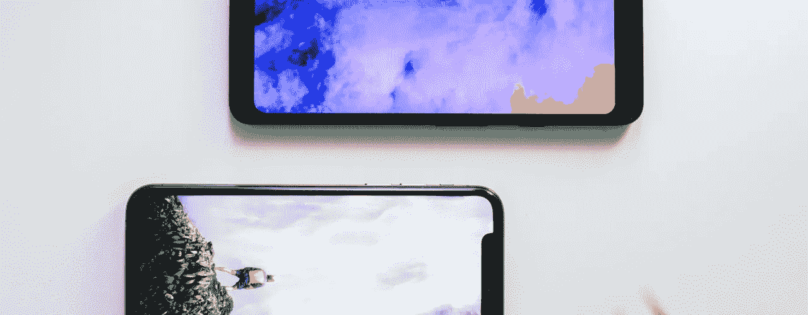
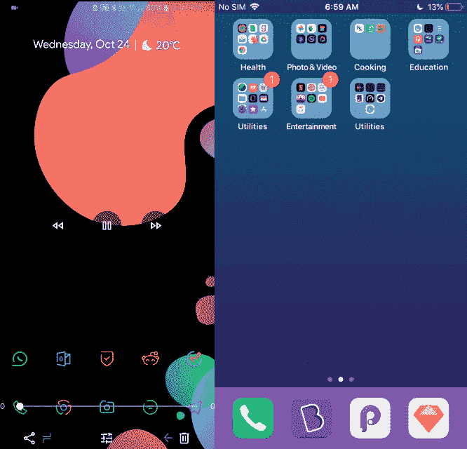
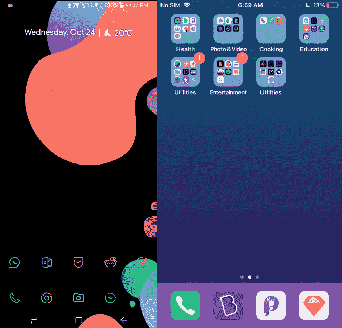
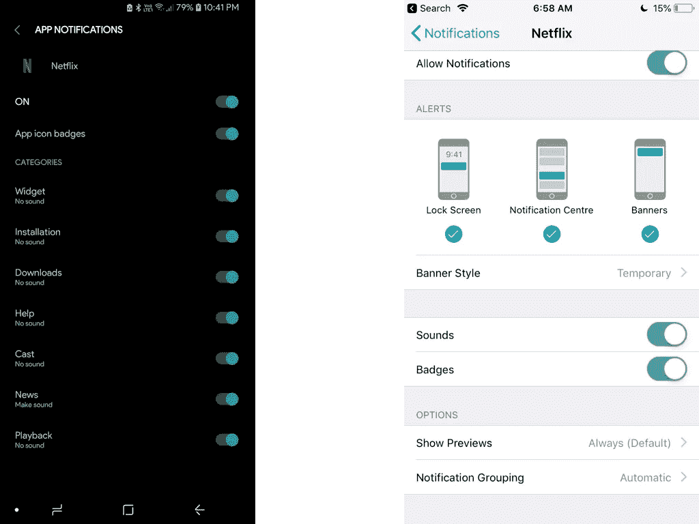
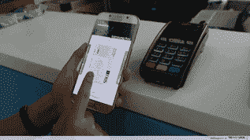

# 从 iPhone 转移到 Android 时人们不会提到的 10 件事。

> 原文：<https://medium.datadriveninvestor.com/10-things-people-dont-mention-when-shifting-from-an-iphone-to-android-2840613b9fc3?source=collection_archive---------12----------------------->

这篇不断增长的评论与其他评论有些不同。它谈到了 android 的另一面，而其他人通常不会强调这一面。它包含了所有重要的小事。

给你一点背景知识，我已经跳平台很长时间了，但从来没有真正把它们作为日常驱动程序。从我开始使用 iPhone 5s 的那一天到两年后升级到 iPhone 7，我一直断断续续地使用 Android。几周前，我终于带着一部三星 S9 跨过边界进入了 Android 的领地。有一些东西只是三星的东西，我会强调这些，但其余的是大多数 Android 设备的共性，所以这里有一些通常没有人谈论的东西。

# 手部姿势:

指纹扫描仪的位置非常重要。从第一代 iPhone 到 iPhone 8，指纹传感器一直位于手机的正面，因此利用拇指作为主要的接入点。

在 Android 上，指纹扫描仪的位置因不同制造商而异。在目前的一加手机和三星手机中，指纹扫描仪也在最前面。其余的通常放在后面。这改变了一切。

我花了好几个星期才习惯用食指使用指纹传感器。最初几周，我只是用面部解锁或图案解锁手机。

除了指纹传感器的放置，手机的尺寸也发生了根本性的变化。从 4.5 英寸的 iPhone 7 到 6 英尺 1 英寸的三星 S9，人们不得不重新调整手持设备的方式，而不用担心它会从口袋里掉出来。

# 面部解锁:

虽然听起来很奇特，但实际上并没有那么好。诚然，三星可能没有 FaceID，但从网上的评论来看，面部解锁似乎和指纹扫描仪一样受到认可。但实际上，并不一样。

它工作了 4/10 次，并没有真的那么快。也许这只是一个 S9 的事情，但只是偶尔盯着你的屏幕解锁手机感觉很奇怪。有 iPhone X 的朋友说，他们的情况也差不多。不知道是灯光的问题还是其他问题，但指纹扫描仪可能仍然是最好的选择。

# 快捷方式！

哦，我是多么高兴能够点击 WiFi 符号，并显示一个连接列表。无论是蓝牙、WiFi、定位还是在状态栏的快捷选项中找到的任何其他选项，能够跳过几个按钮来到达我想要的地方真是太好了。Android 真的让这些日常任务变得简单多了。

# 后退按钮

iPhone 上拇指附近没有后退按钮不是问题，因为手势的巧妙使用取代了它。我在屏幕和应用程序之间切换没有问题。有了 droid，在应用程序之间或应用程序内部移动屏幕上的按钮可能会更容易。

# 我想念聚光灯

真的。它是我做任何事情的首选。无论是应用程序、联系人、设置、网络搜索还是应用程序内的内容。它工作起来如此轻松，显示了我需要的一切。

让我震惊的是，droid 拥有如此多的自由，却没有一个搜索栏能像 spotlight 为 iPhone 所做的那样。Evie Search 可能是我见过的最接近手机搜索的应用了。但仅限于 chrome 搜索和手机内的基本搜索。有芝麻，但这感觉很不自然，因为打开它时会有痉挛和口吃。苹果流畅的内置动画和过渡真的把我宠坏了。

# 隔空投送:

使用 Airdrop 可以轻松地在手机上来回传输文件。虽然不是原生的，但 Android 确实有大量的应用程序，如 Shareit 和 PushBullet，它们相当不错地迎合了这一细分市场。

# 通知

Samsung on the left and the iPhone on the right.

智能手机存在的祸根。S9 上的通知是一个梦想。你可以精确地控制你想收到什么样的通知，这是一种美好的体验。收到关于销售和新优惠的垃圾邮件通知？关掉它。应用内通知？没人有时间做这个。保留与你相关的东西，就这么简单。

# 自动化

Android 上的自动化并不新鲜。它已经存在很长时间了，但是隐形设计的简单性。当我离开家的时候，无线网络就关闭了。当我开车时，屏幕的锁会自动关闭，以便于使用。我在办公室的时候，WiFi 又开了。这些小事情对用户来说非常重要。

# 三星支付

我把它放在这里是因为它让支付变得非常简单。它与 Paytm、你的借记卡和信用卡甚至 UPI 集成。它适用于任何，是的，任何卡片机，这使得整个过程更加容易。老实说，在过去的几周里，它失败了 1/10 次，这使得它非常好，但当它失败时，你看起来就像一个傻瓜，把你的手机放回去，拿出你总是方便的借记卡/信用卡。这只是你需要习惯的事情。

# 应用程序设计

众所周知，iOS 可能拥有最漂亮的移动应用。任何应用程序的 iOS 版本肯定是更好看的兄弟姐妹；手放下。有时我只是怀念使用漂亮的界面。有很多应用程序都有相同的功能，但是让它们与众不同的只是它们的外观。随着材料 2.0 的慢慢变化，让我们希望机器人世界能尽快赶上。

这总结了我迄今为止的大部分经历。

如果你有任何意见或事情想补充，请随意！