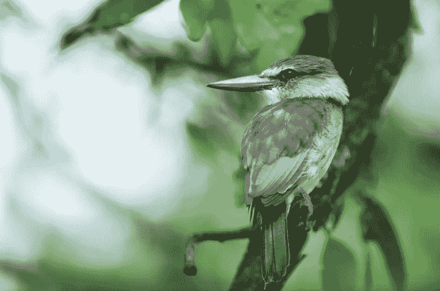
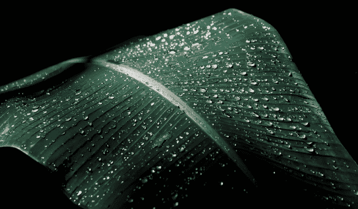

# 技术从自然过程中学到的 10 件事

> 原文：<https://medium.datadriveninvestor.com/10-things-technology-is-learning-from-natural-processes-f395177f568f?source=collection_archive---------6----------------------->

自然界的一切都是设计好的。鸟翼蝴蝶翅膀的深色阴影被设计成能够完全吸收光线并捕捉热量。牛蒡的种子覆盖着附着在动物和人类身上的毛刺，以帮助其扩散。甚至绿色植物通过吸收二氧化碳来产生能量的光合作用也不是错误。是的，大自然已经进行了数十亿年的研究并完善了它的设计，这已经成为人类创造性和可持续技术的灵感来源。

牛蒡籽启发了臭名昭著的 velcro 的设计。翠鸟的流线型喙是高速列车的完美空气动力学模型。大自然不可能出错——翠鸟的喙呈完美的流线型，有助于它跳入水中捕捉猎物时的速度。

正如史蒂夫·乔布斯准确预测的那样，*“21 世纪最大的创新将发生在技术和生物的交汇处”*。他不可能远离事实。科学家越来越关注创造可持续技术的自然过程，这刺激了仿生学和生物融合等领域的兴起。

*“仿生学是构建设计过程的一种美丽方式，让人们认识到大自然是如何运作的，”*华纳·巴布科克绿色化学研究所的约翰·华纳博士说。根据[仿生研究所](https://biomimicry.org/what-is-biomimicry/)、*“仿生是一种创新方法，旨在寻求应对人类挑战的可持续解决方案”*。

另一方面，生物融合是受自然启发的物理、生物和计算技术的融合。这两个新兴领域激发了约翰·华纳博士和其他科学家创造新的技术奇迹，在对生态系统几乎没有负面影响的情况下复制自然过程。

因此，让我们来看看设计来复制自然过程的技术奇迹的独特例子。

复制自然过程的技术的突破性例子

1)高能效风力涡轮机

让我们面对现实吧:当前的风力涡轮机在低风速下发电的效率通常很低。然而，[翼鳍](https://www.pterofin.com/)技术通过复制鱼类和鸟类利用能量在周围流体——水和空气中产生运动的效率，解决了这个难题。该产品由一个平衡系统控制，该系统将机翼的速度和位置与设备主体上的机械杠杆点相结合。这些独特的振荡翅膀可以从最小的电流中获取能量，甚至低至每小时 5 英里。面对高运动气流，机翼也会折叠起来或进入“冬眠”状态，以避免运动部件受到压力，同时也减少了噪音污染。

2)鲨鱼皮的生物模拟以防止细菌污染

海洋生态系统拥有大量可供科学家复制的生物模型，鲨鱼皮就是一个完美的例子。鲨鱼已经存在了 4 亿年，它们的皮肤随着时间的推移进化成了抵御微生物感染的天然屏障。[总部位于佛罗里达州的公司 Sharklet Technologies](https://sbir.nih.gov/sites/default/files/CAP_PDFs/Sharklet.pdf) 在一种粘性合成材料上复制了鲨鱼皮的独特纹理。这家公司创造了一种可以在学校、医院、餐馆和其他地方使用的无菌表面。由于这种材料不会杀死微生物，因此微生物很难对其产生抵抗力。

3)模仿昆虫的节能智能电网

我们一直在寻找更多节约能源和[减少我们在地球上的碳足迹](https://www.ncbi.nlm.nih.gov/m/pubmed/24689789)的方法。我们的目标是彻底改变全球能源模式。更重要的是，研究人员正在寻找通过设计智能电网来创造廉价能源的新方法。一家公司通过复制蚂蚁和蜜蜂的“群体逻辑”成功创建了智能电网。总部位于多伦多的 Regen Energy 公司开发了一种软件，它复制了昆虫群的原理，即:系统中的每个节点不需要来自中央节点的直接指令来以有益于系统的方式行动。通过复制群体智能，该公司成功降低了大型建筑中 HVAC 系统的峰值电力需求。

4)信息技术中的群体网络

swarm 网络的潜力不仅限于智能电网。昆虫在群体中的交流方式改变了公司设计分销路线的方式。除此之外，它还改变了我们通过互联网发送服务器数据包的方式。太平洋西北国家实验室的科学家们将这一复制过程推进了一步。他们复制了蚂蚁的防御性群体智能来建立一个计算机网络安全系统，通过在高需求时利用空闲的服务器来优化网络性能。

5)复制珊瑚礁以制造“绿色”水泥

由于工业产生的有毒废物流入环境，环境正在逐渐消亡。这产生了建造不以环境为食，而是维持环境的城市的愿望。通过技术创新，我们可以想象一个城市，离开城市的水比进来的水更干净。像 [Calera](http://www.calera.com/beneficial-reuse-of-co2/products.html) 这样的公司目前正在朝着这个目标努力。Calera 通过模仿海洋珊瑚成功地将二氧化碳隔离在混凝土中。由于世界对混凝土的需求约占全球碳排放的 5 %, Calera 的碳酸钙或“绿色水泥”可用于替代石灰石制成的水泥。

6)源自莲花的防水表面

莲花有非凡的能力从它的叶子排斥水。它的疏水作用很大程度上是由于表面上存在的纳米结构。表面布满了排斥水的蜡质微突起。因此， [CeNano](http://www.cenano.co.uk/nanotechnology-products/our-products/nanotol-the-universal-nano-product/developement-history/) 创造了 nanotol，一种疏脂(拒油)和疏水(拒水)密封剂，可以喷洒在物质上，使其具有与莲花植物相同的特性。

7)防鸟玻璃表面

研究表明，仅在美国，玻璃窗就导致了 10 亿只鸟的死亡，这还不算世界其他地方玻璃窗的数量。原因是显而易见的，因为玻璃窗反射天空和树叶，经常吸引鸟儿。为了解决这个问题，一家公司开发了 [Ornilux 防鸟玻璃](http://ornilux.com/development---testing.html)。这项创新的灵感来自蜘蛛网上的紫外线反射线，鸟类可以看到并避开它。

8)非洲纳米荨麻的集水机制

非洲纳米布甲虫能够在长时间的干旱中存活，靠的是在它外壳的突起处将雾凝结成水。突起的防水脊将水引向甲虫的头部。受这种集水机制的启发，麻省理工学院的科学家[生产了一种可以捕捉和控制小水滴的材料](http://news.mit.edu/2006/beetles-0614)。这项突破性的研究还为科学家提供了制造冷却设备和清理有毒化学物质泄漏的工具。

9)从贻贝中产生增长性肌肉

拉胀材料是非常革命性的。这是一种违背弹性法则的材料，因为材料在拉伸时会变胖，而不是变瘦。贻贝肌肉表现出拉胀特性，它催生了用于运动护具的[拉胀材料](https://www.researchgate.net/profile/Asaad_Faramarzi/publication/235297847_Design_and_optimization_of_microstructure_of_auxetic_materials/links/0deec52fa753fd3942000000/Design-and-optimization-of-microstructure-of-auxetic-materials.pdf)的创新。除此之外，它还可能成为设计减轻慢性背痛的人工椎间盘的新原料。

10)从壁壁虎复制超级粘合剂

壁壁虎脚上有细小的毛发，这使得它们可以轻松地抓住和攀爬任何表面。他们不会失去抓地力，而且他们越用力把脚踩在地面上，地面就变得越粘。帕萨迪纳喷气推进实验室的研究人员开发了一种模仿壁虎脚上粘附毛发的材料。用力时，这种微小的人造毛发可以粘在任何表面上。斯坦福大学的研究人员也复制了这一机制，以制造能够承受巨大压力的微型机器人。

由于自然界取之不尽的财富，仿生和生物融合正在不断发展。今天，工程师和科学家有一个生物数据库来访问潜在的自然过程，这些过程可以被复制用于下一次创新。有了这个数据库，科学家和研究人员就不必键入生物体的名称。取而代之的是，他们搜索一个想要的属性，这个数据库将会在自然过程中得到应用。的确，人类已经发现了自然的不可犯错误，因此寻求理解并从中创造可持续的技术。