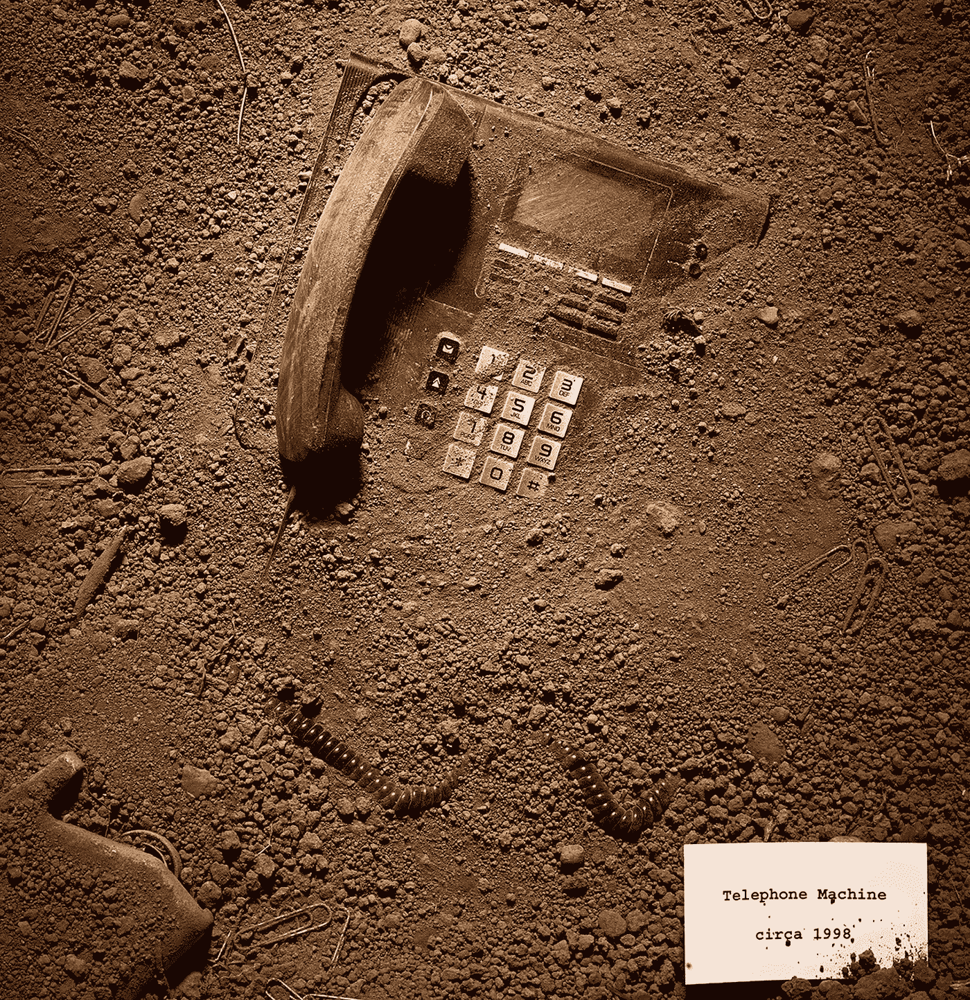

# 在破坏性环境中保持相关性的 10 件最佳事情

> 原文：<https://medium.datadriveninvestor.com/10-things-to-do-to-remain-relevant-in-a-disruptive-environment-bd6c8063c28c?source=collection_archive---------11----------------------->

Via Pinterest

根据世界经济论坛(WEF)发布的 2018 年*未来就业报告，预测到 2020 年的就业情景，商业模式的颠覆性变化将对未来几年的就业格局产生深远影响。它表示，鉴于变化的速度很快，商业模式的中断正在对各行业现有和新兴工作的技能组合产生几乎同时的影响。*技能升级的时滞正在减少，目前，稳定技能的稳定性只有 65%。**

根据这份报告，现有的工作类型不仅在数量上会减少，而且在所需技能方面也会同时发生变化。因此，在几乎所有行业中，*技术和其他变革的影响正在缩短员工现有技能组合的总体寿命*。然而，与此同时，未来劳动力规划变革管理的主要障碍是对跨行业破坏性变革的理解不足。

 [## 准备在 2019 年改变世界的技术-数据驱动的投资者

### 很难想象一项技术会像去年的区块链一样受到如此多的关注，但是……

www.datadriveninvestor.com](https://www.datadriveninvestor.com/2019/01/17/the-technologies-poised-to-change-the-world-in-2019/) 

> 简而言之，这种破坏性的技术、人口和社会经济变化对就业的影响预见了两种情况——要么是新兴工作类别中的无限机会(乐观观点)，要么是大规模的劳动力替代和置换(悲观观点)。这完全取决于员工或专业人士来评估和决定，他们发现自己在意见轨迹的哪一边。

在我看来，我预见到那些相信终身学习并不断更新自己技能的真正专业人士会有大量的机会。但是，为了拥有更长的保质期，并在组织不断变化的技能需求中保持自己的专业相关性，这里有 10 件事可以考虑做:

> **1。每天问自己——我今天学到了什么？**

试着每天至少学一件新东西。坚持不懈地学习是非常重要的，你要时刻保持信息灵通，并跟上你所在行业或职业的新趋势。WEF 报告建议将激励终身学习作为应对即将到来的技能短缺的战略性长期解决方案之一。首先，最简单的建议是阅读你所在公司的年度报告。年度报告包含有关贵组织的战略、行业趋势、关键计划和主要关注领域的大量信息。

> **2。不要把经验等同于你工作的年数**

体验应该基于内容，而不是时间表。认为经验是在一个角色/职能上花费的年数是最危险的错误。根据 2018 年的*未来工作报告，*这就是原因，65%的受访组织计划投资对现有员工进行再培训，作为学习战略的一部分。*永远不要吹嘘你在某个特定领域工作了多少年；它不再有任何意义。*更重要的是，在当今世界，人员、流程和技术的快速变化使得长期经验几乎过时。因此，以你的内容为基础，在工作中尽可能多地学习，并不断探索新的流程和技术。

> **3。养成每周至少阅读 5 小时的习惯**

WEF 在其关于 2018 年工作前景的报告中称，2020 年所需的关键技能是问题敏感性、批判性思维、说服力和主动学习，而不仅仅是狭隘的技术资格。阅读书籍会帮助你提高这些技能。阅读是一种很好的规范。养成每天或周末至少阅读 5 小时的习惯。阅读会帮助你变得更加成熟，会打开新的思维窗口，给你的思维过程带来新的维度。要成为一名优秀的领导者或专业人士，重要的是横向扩展你的思维过程，拓宽你的理解。

> **4。提升自己的技能，获得新的行业认证**

不幸的是，平均到 2020 年，*超过三分之一的理想核心技能组合(包括大多数职业)还没有被认为对今天的工作至关重要。不要停留在过去的荣誉和资格上。在你擅长或感兴趣的领域研究可用的培训或行业认证。报名参加贵组织的内部培训，或请求赞助外部培训计划或认证。你也可以成为相关专业协会、圆桌会议、俱乐部的成员，它们可以帮助你获得额外的信息、持续的专业教育和与行业的联系。*

> **5。接受一切都将改变的事实**

印度教的宗教书籍 ***博伽梵歌*** 说，生而有死。没有什么是永恒的，包括变化，即使变化也总是在变化。没有人是不可或缺的。不可或缺对员工和组织都没有好处。接受改变，痛苦就会少一些。不要忘记你今天的角色是由别人扮演的。此外，你可能会选择不再担任这个职位，或者公司会选择用更好的人来取代你。*不要如此情绪化地扎根于你目前的角色，否则搬家会变成一场灾难。*做好最好的准备，准备继续前进。

> **6。拥抱变化——做一只适应变化的早起鸟**

成为变革的一部分，而不是路障。*拥抱变化，避免抗拒。与其把时间浪费在无休止地质疑变化上，不如首先确定新技能的需求，并相应地提升自己的技能。通常，这种破坏性的变化会在组织内部造成迫切的技能差距，从而为早期采用者创造新的机会。*

> **7。不要陷入当监督经理的陷阱**

我们都努力在组织中成长，并成为领导者和管理者。仅仅满足于管理员工是一个职业死亡陷阱。你在组织中成长得越高，就越容易受到伤害。一旦你成为经理，你就会受到密切关注，你的一举一动都会受到下属和管理层的详细分析。因此，仅仅凭借管理资源、团队或与管理层协调的能力，你无法长久生存。持续关注以建立深度和专业知识。不断努力深入了解你所管理的业务的功能或技术部分的细节。详细了解您的运营领域、业务领域、现有和未来的技术以及最佳实践流程等。这将为你俩赢得团队的尊重和管理层的信任。

> **8。永远不要停止寻求反馈**

完美地完成你的工作并为此感到高兴是非常重要的，但更重要的是问问接受者，工作是否如最初预期的那样完美地完成了。*始终寻找真诚而有建设性的反馈，如果反馈不是自己提供的，就去寻找。*以开放的心态接受每一个反馈，分析它并努力改进。

> **9。不要总是寻找工作保障**

根据 WEF 发布的《2018 年工作前景报告》，工作安全感大幅下降，薪酬和工作生活平衡度上升。有一份稳定的工作总是让人放心。然而，这也是阻碍你探索新机会的最强有力的原因，它不允许你自由地挖掘你的全部潜力。幼虫呆在茧里总是安全的，但是为了成长，它必须出来飞翔。连接职业和社交网络，如 LinkedIn、Xing 等。并与志同道合的专业人士接触，寻找一波机会。有时候不冒任何风险更危险。做好冒险的准备，注意发现新的机遇，迎接新的挑战。

> **10。投资于你目前的职位，在你的下一个职位获得回报**

你现在的工作应该是一个组织阶梯，而不是一个平坦干燥的高原。*永远把你在当前职位上投入的时间、精力和精力当作一种投资。*把每一个角色都当成下一个职位的敲门砖。这样会让你有动力努力工作，为当前的职位做得更好。同时，像任何投资一样，总是要评估预期回报率。问问你自己，由于你目前的角色，你下一个可能得到的角色是什么？你对下一个可能的角色感兴趣吗？如果发展或未来的道路不清晰，或者是你不喜欢的，或者你因为某种原因碰壁了，那么继续目前的职位就没有意义了。开始寻找更好的或不同的、更有意义或让你感兴趣的东西。

*还有一个加分建议:*

> 如果你从明天起不用去上班，你最想做或追求的一件事是什么

什么是*让你开心的一件事*，真正让你感兴趣，让你充满激情的一件事？这可能是你一直想做的一件事，但由于各种原因，你从未给予足够的重视。*找到你的激情，*一份你爱做而不会厌倦的半职业。如果你已经有了一个，从今天开始努力吧。如果你没有，那就找到你的兴趣所在，并为之努力。相信我，这样做会彻底提升你的职业生涯。