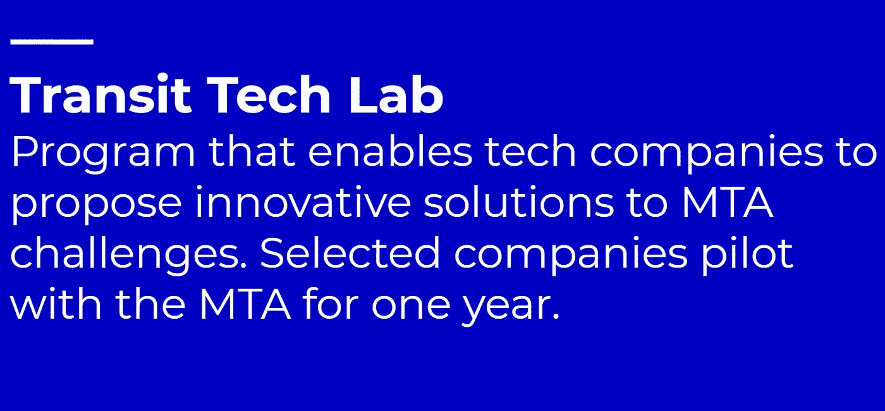
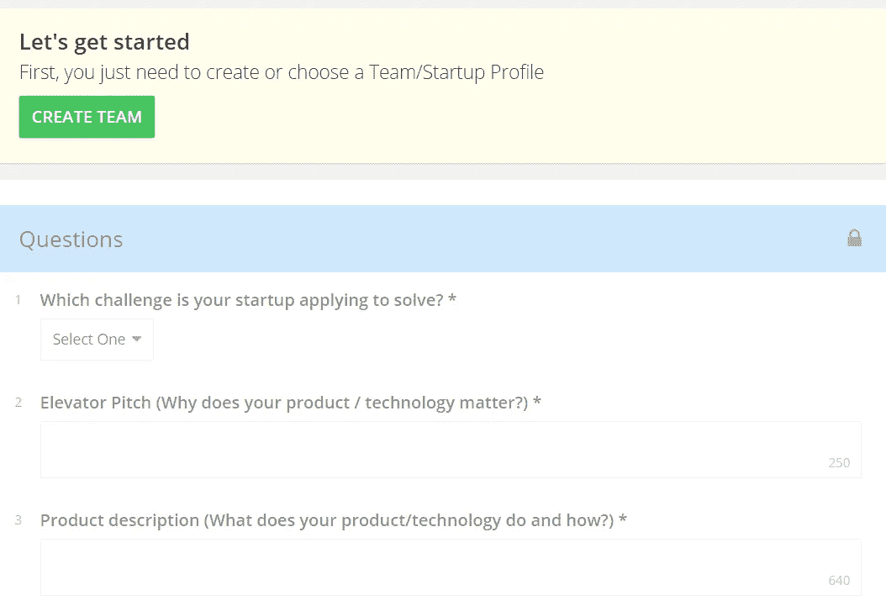
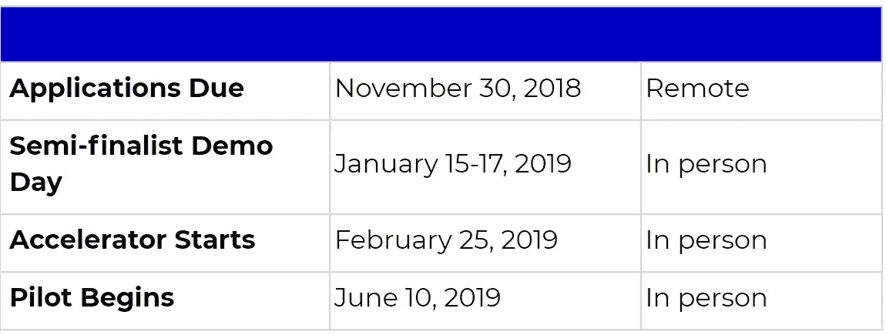
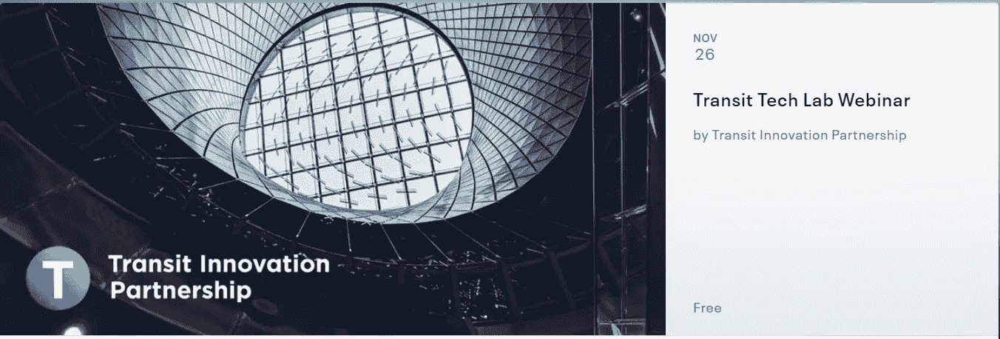

# 关于交通技术实验室你需要知道的 10 件事

> 原文：<https://medium.datadriveninvestor.com/10-things-you-need-to-know-about-the-transit-tech-lab-2aaa5dfbc621?source=collection_archive---------30----------------------->

我很高兴地告诉大家，我已经作为创始主任加入了交通技术实验室！

多年来，我一直关注技术和政府的交叉领域。当我了解到这个实验室时，我知道这是一个特殊的机会，可以接受一个巨大的挑战，尝试改变纽约市的交通。

有很多理由对交通技术实验室感到兴奋——这是第一个此类项目，这是一个在美国最大的交通系统中试验创新技术的不可思议的机会，等等。

我们在 11 月 30 日之前接受申请！为了让你的公司参与进来，这里有 10 件你应该知道的事情。

1.  交通技术实验室是更广泛的交通创新伙伴关系的一部分，该伙伴关系由大都会运输管理局(MTA)和纽约市伙伴关系发起，旨在使纽约成为公共交通的全球领导者。

2.该计划允许 **MTA 在没有初始成本的情况下采购、评估和试验新技术**，为组织挑战引入创新解决方案。该计划旨在建立一个可复制的流程，以扩大 MTA 的供应商群，降低成本，并利用新技术加快性能和客户服务的改善。

3.[一**申请截止 11 月 30 日**](https://transitinnovation.org/lab) **。如果你有兴趣参加，请务必在截止日期前申请。**

3.今年，处于早期成长期的公司有机会提交两项挑战的解决方案:

How can we better predict subway incident impacts & serve customers? | How can we make buses faster and more efficient?

4.**谁应该申请？拥有出色产品的公司利用杠杆解决了地铁或公共汽车的挑战。**解决方案不一定需要为公交系统设计，但需要解决挑战。这可能包括以下技术:

*   利用机器学习
*   分析社交媒体情绪
*   开发预测模型
*   改善实时客户沟通
*   使用计算机视觉识别公交车道障碍物
*   使用激光雷达和雷达等传感器，连接基础设施
*   提供路线分析、建模等功能！

**5。在 F6S 平台上应用快速简单。**您可以[点击此处](https://www.f6s.com/ttl2018/apply)立即开始申请。

**6。进入最后一轮的公司将获得:**

*   加速的、预先批准的流程，以促进协作
*   提交的每份申请都由 NYCT 的相关领域专家进行审核
*   直接联系相关决策者和主题专家
*   接触 MTA 领导人、私营部门投资者和行业专家
*   为决赛选手提供为期八周的编程，并定制评估技术集成的计划
*   参与为期一年的试点项目的机会

7.你可能应该知道一些关键日期。

8.这对**的创新公司来说是一个很好的机会，他们可以通过与整合和部署他们技术的团队**直接合作来改变纽约市的公交系统。**这是首次合作！**

9.您可以参加 11 月 26 日中午 12 点(美国东部时间)的在线网络研讨会，了解更多详情并提出问题。在这里注册。

RSVP here: [https://www.eventbrite.com/e/transit-tech-lab-webinar-tickets-52554571137](https://www.eventbrite.com/e/transit-tech-lab-webinar-tickets-52554571137)

10.如果您有任何问题或想推荐一家公司，请随时在 info@transitinnovation.org 给我们发电子邮件。我等不及收到你的来信了！