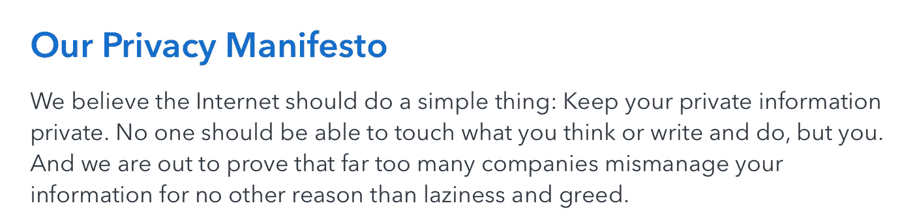
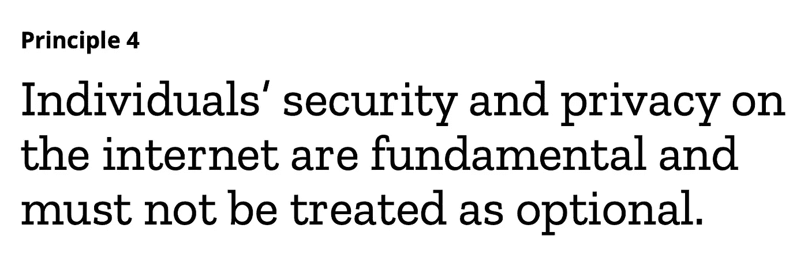
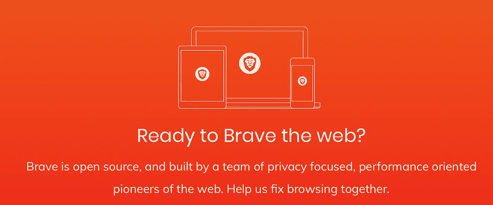
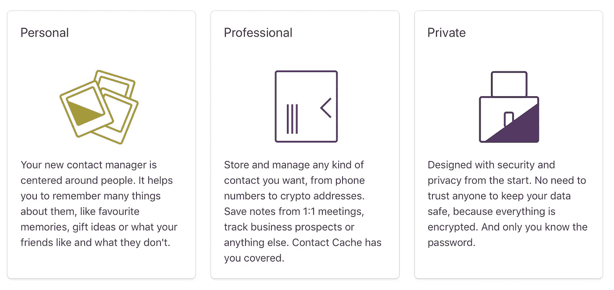
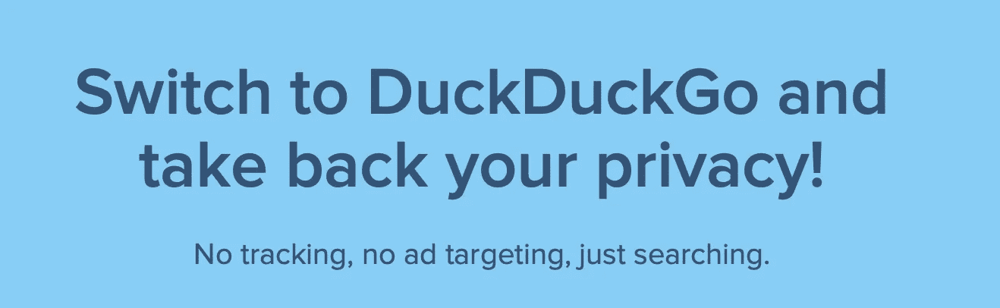
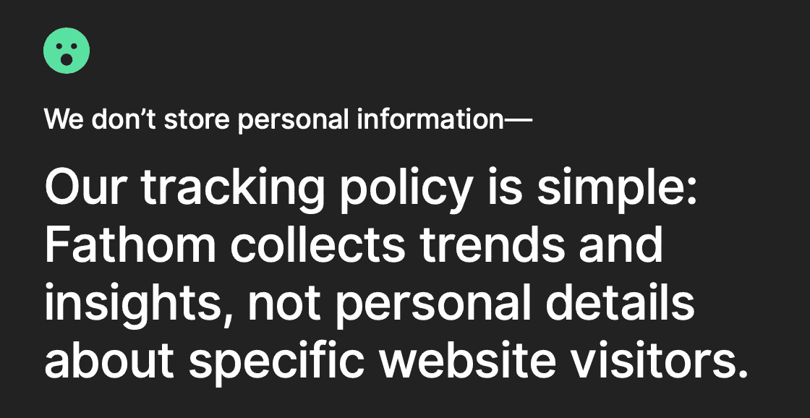
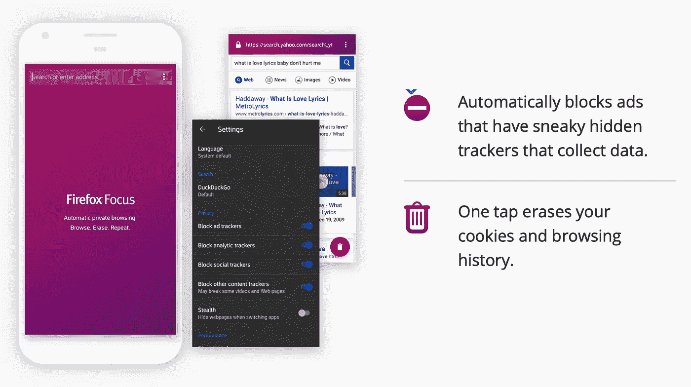
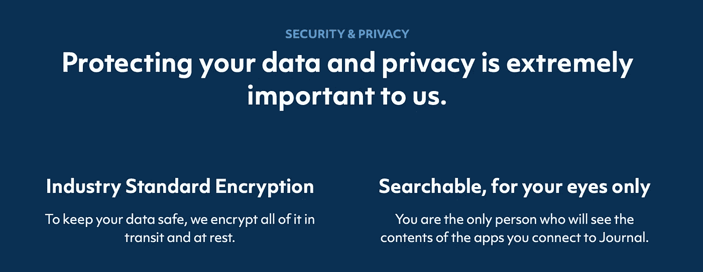
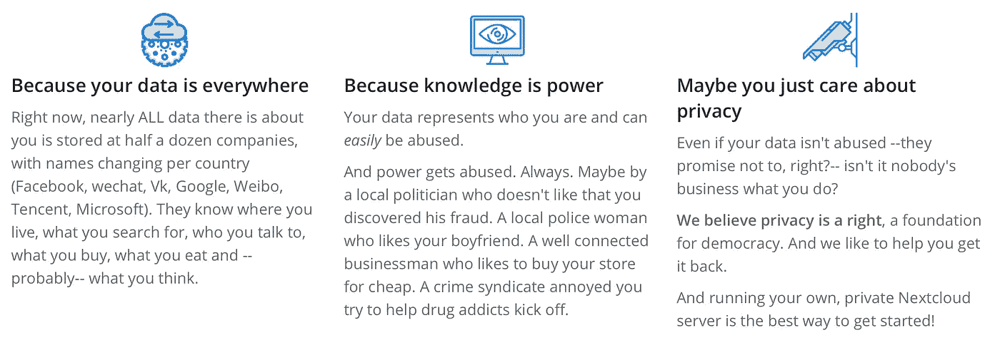

# 帮助你更有效率的 10 个工具(但不是产品)

> 原文：<https://medium.datadriveninvestor.com/10-tools-to-help-you-to-be-more-productive-but-not-the-product-563f5c3a3ae?source=collection_archive---------29----------------------->

via [DuckDuckGo](https://medium.com/u/9891ea48bb89?source=post_page-----563f5c3a3ae--------------------------------)

又是一天，又是一次侵犯隐私或关于数据收集和使用的披露。上个月，我们了解到:

*   [脸书利用用户出于安全目的提供的电话号码向他们投放广告](https://techcrunch.com/2018/09/27/yes-facebook-is-using-your-2fa-phone-number-to-target-you-with-ads/)。
*   [谷歌让用户在没有内容的情况下登录 Chrome](https://hackernoon.com/what-the-heck-google-part-4-cff837952d7)。
*   Twitter 面临隐私监管机构对用户跟踪的调查。
*   [谷歌曝光了数十万 Google+社交网络用户的隐私数据，然后选择不披露该问题](https://www.wsj.com/articles/google-exposed-user-data-feared-repercussions-of-disclosing-to-public-1539017194)。

看到对服务和工具的需求不断增长，将用户视为有价值的客户而不是有价值的商品，这一点都不奇怪。 [DuckDuckGo](https://medium.com/u/9891ea48bb89?source=post_page-----563f5c3a3ae--------------------------------) —“不跟踪你的搜索引擎”正在蓬勃发展，一年内每天有 3000 万次搜索，同比增长 50% 。

我们看到越来越多的公司开始阐述为什么他们认为隐私很重要，以及他们正在采取什么措施来保护你的隐私。

via Standard Notes

via [Mozilla](https://medium.com/u/95f4ec6ae6f6?source=post_page-----563f5c3a3ae--------------------------------)

从发信息和电子邮件，到浏览和记笔记，我已经整理了一份服务提供商的名单，他们希望帮助你在网上更有效率*和*尊重你的隐私。注意这个空间——这只是开始。

# 勇敢[浏览器]

> 你不是一个产品。为什么要用一个把你当浏览器的浏览器呢？使用 Brave 享受私密、安全和快速的浏览。

看看勇敢的人。

# 联系人缓存[联系人管理]

> 你的私人联络经理，重塑。

查看[联系人缓存](http://contactcache.com)(即将推出)。

# duck duck go[搜索]

> 不跟踪你的搜索引擎。

查看 [DuckDuckGo](https://duckduckgo.com) ，并查看 [Christian Stewart](https://medium.com/u/3ffe4274e771?source=post_page-----563f5c3a3ae--------------------------------) 的[替代谷歌](https://hackernoon.com/untraceable-search-engines-alternatives-to-google-811b09d5a873)。

# fast mail[电子邮件、日历和联系人]

> 电子邮件，日历和联系人做得很好。为您或您的企业获得私有、安全、无广告的电子邮件托管。

我已经使用了 [FastMail](https://medium.com/u/a8bf56c59aa6?source=post_page-----563f5c3a3ae--------------------------------) 作为一些二级电子邮件账户，我将很快转移我的一级账户。

查看[快速邮件](https://www.fastmail.com)。

# Fathom 分析[网站分析]

> " Fathom Analytics 提供简单、有用的网站统计数据，而不会跟踪或存储用户的个人数据."

查看 [Fathom Analytics](https://usefathom.com) 。

# 火狐焦点[移动浏览]

> 易于使用的私人浏览器上的自动广告拦截和跟踪保护。

查看[火狐焦点](https://www.mozilla.org/en-US/firefox/mobile/)。

# 杂志

> 在里面写笔记，保存有趣的链接，并放入重要的文档和信息以备后用。当你需要某样东西的时候，问 Journal，它会真的找到它。

检查[轴颈](https://usejournal.com)。

# 下一代云[数据存储]

> [Nextcloud](https://medium.com/u/8032aa79b1af?source=post_page-----563f5c3a3ae--------------------------------) 让您的数据触手可及，尽在掌控之中。将您的文档、日历、联系人和照片存储在家中的服务器、我们的提供商或您信任的数据中心。

查看 [Nextcloud](https://nextcloud.com/athome/) 。

# 标准注释[注释]

> Standard Notes 是一个安全的地方，可以存放您的笔记、想法和日常工作。免费，开源，完全加密。

查看[标准注释](https://standardnotes.org)。

# 电报[信息]

> Telegram 是一款基于云的移动和桌面消息应用，专注于安全性和速度。

检查[电报](https://telegram.org)。参见[电线](https://wire.com)和[信号](https://signal.org)。