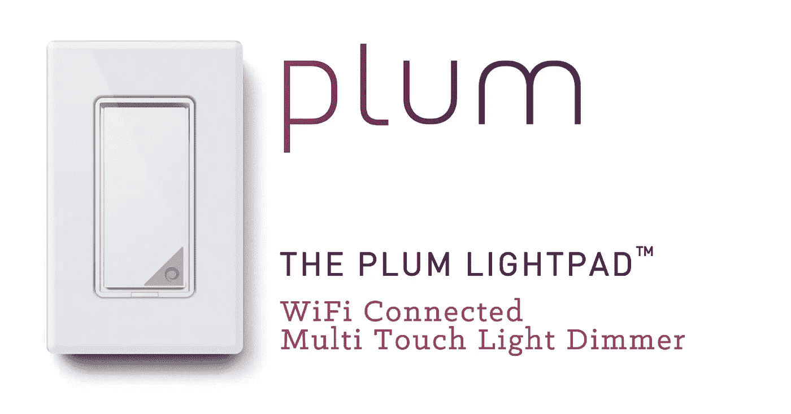
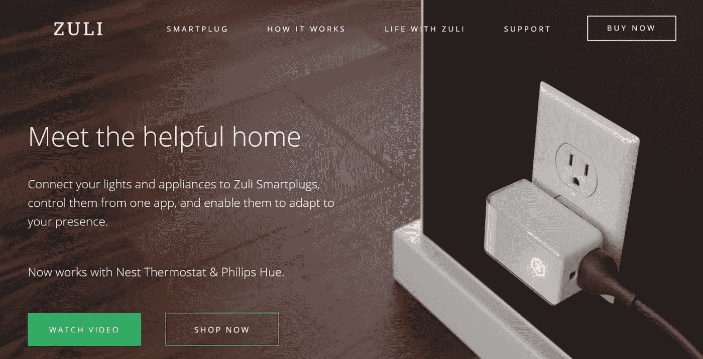
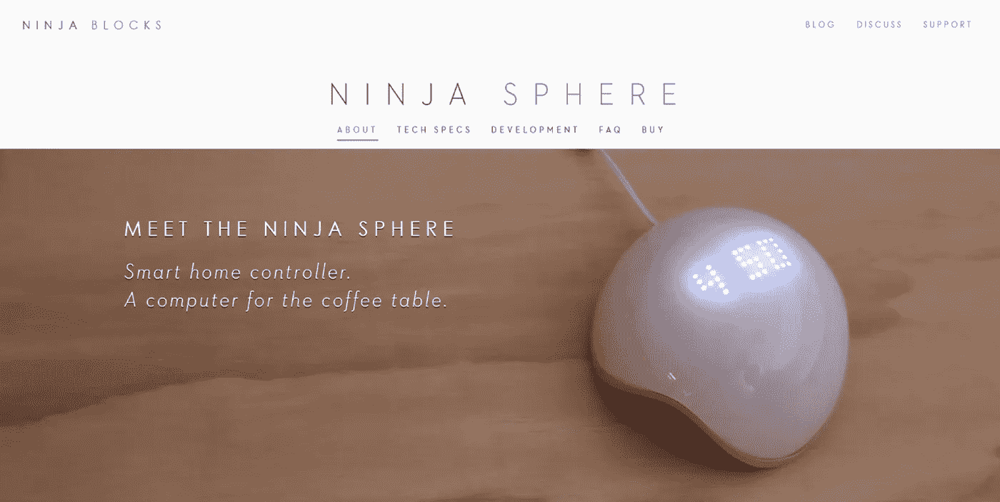
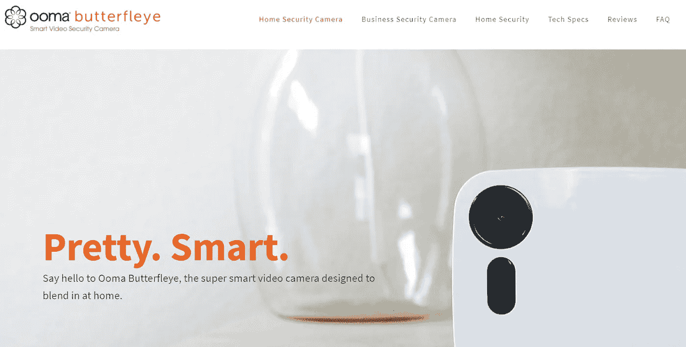
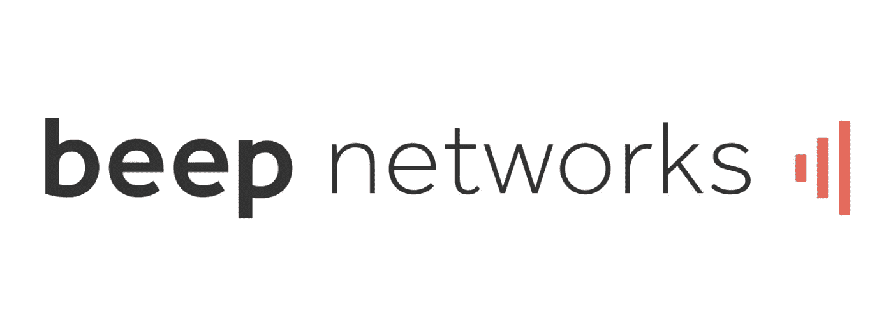
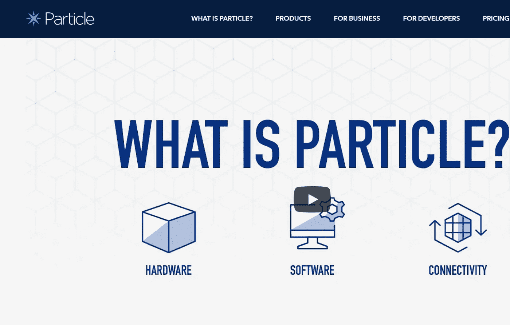

# 2018 年值得关注的 10 大物联网创业公司

> 原文：<https://medium.datadriveninvestor.com/10-top-iot-startups-to-watch-in-2018-63134037d901?source=collection_archive---------2----------------------->

物联网(IoT)作为一个视角领域，为众多开发者提供了展示其创造力和设计设备的空间，这些设备将极大地促进控制基本活动的能力。这项任务看起来如此诱人，以至于不仅是大公司品牌，就连 IT 领域的新来者也开始为各种目的创造智能设备。后一类参与者(或物联网初创公司)的成就是本次概述的关注焦点。

但是，是什么让创造智能设备的简单尝试变成了值得出现在最佳物联网初创公司中的成功开发呢？这个问题的答案取决于产品有效性、所选商业模式的成功以及满足客户需求的准确性。因此，本文对顶级物联网初创公司的综述在选择合适的候选公司时会考虑这些标准。通过解决不同的需求(从智能家居的保护到对创造性 IT 企业家的财务支持)，这里选择的所有 10 家物联网初创公司都拥有在市场上取得成功的杰出能力——在设计的解决方案的功能性、财务指标和客户满意度方面。

以下是我们列出的 10 家顶级物联网初创公司名单:

-李子

祖丽

忍者积木

- P. Relan YouWeb 培养箱

-高速公路 1

巴特弗雷伊

-哔哔声网络

-粒子

-猎户座

-斯科特

但是我们为什么选择他们呢？只要仔细看看下面几节中描述的细节，您就会找到答案！

**#1 梅子——电灯开关重新发明**

Plum 是一家出色的物联网初创公司，专门致力于增强智能房屋内的连接。它被称为“闪电之巢”，客户可以使用智能手机开关家中的灯，只需要一个要求——Wi-Fi 连接。

Plum 的另一个巨大优势是安装过程的优雅，这是 Plum 重新发明的电灯开关，使其成为顶级物联网初创公司之一。特别是，它包括在高度定制的移动应用程序中回答消息中的两个简单问题(具体来说，房间位置和你的 Lightpad 的名称)。在后一方面，为这家物联网初创公司设计的应用程序有一个直观的多功能触摸板，可以理解简单的手势。所有这一切使用户体验真正令人愉快，并使 Plum 进入了顶级物联网创业公司的名单。

事实上，这家物联网初创公司彻底改变了人们对智能家居设备的理解。Plum SwitchPad 没有依赖用户应该遵循的一些规定特征来实现所需的技术提升水平，而是为他们的客户提供定制需求，只从智能照明中获得想要的东西——不多也不少。换句话说，这家最佳物联网初创公司的设计和创新重点是保证令人满意的体验，鼓励客户在家中实际使用智能照明。

# 2**Zuli smart plug——插头设计方面最好的物联网初创公司之一**

Zuli 是一家物联网初创公司，致力于设计一个也是唯一一个小东西——但具有增强的功能和智能家居的广泛应用前景。确切地说，Zuli 是一个智能插头，包括 4 个功能:Zuli Presence(一组用于跟踪你在房子里的位置的算法)，蓝牙 smart(用于不依赖于 Wi-Fi 连接的设备之间的直接通信)，energy dashboard(这是一个用于优化能耗的计量处理器)，以及安全功能(意味着强调数据存储的隐私)。

此外，这家顶级物联网初创公司拥有美丽的简约设计，不会损害其使用的有效性。例如，Zuli Presence 的定制和精美设计同时保证了基于您当前位置的照明和温度的精确调节。这种性能和美感的结合使得所展示的物联网初创公司真正出色。

此外，通过特殊的调度功能，可以实现高级别的定制。在实践中，它允许在智能房屋内实施个性化的规则，并享受简单而有条理的设置过程。凭借顶级物联网初创公司代表提供的机会，智能家居业主可以完全控制基本设施，能够控制它们的舒适度和成本效益。

**#3**

**忍者积木——智能家居控制器**

本质上，Ninja Blocks 作为硬件和软件程序的组合，在智能家居设备之间提供必要的连接级别。特别是，这家物联网初创公司与各种品牌合作，以确保对不同智能解决方案的运营提供适当的支持。在这个列表中，你可以找到设计 Wi-Fi 灯泡、媒体中心和电源插座的顶级物联网初创公司和公司。

此外，Ninja Blocks 应用程序会发送优步到达的通知和天气概况，这将这家物联网初创公司的功能扩大到智能房屋墙壁的限制之外。具体来说，在一个 Sphere 应用程序(适用于 Android 4.4+和 iOS 8+)中，您可以收到各种建议来修复已注意到的问题。在这方面，Ninja Blocks 物联网启动在远程控制房屋功能方面非常有用，比如从办公室座位的距离开关加热器。此外，布局是高度可定制的，这意味着 Ninja Blocks 会从您的偏好中学习，并根据特定客户的需求更改建议。

最后，由于其有趣的手势操作，Ninja Blocks 理应在最佳物联网初创公司的评级中占据一席之地。在这方面，智能设备可以帮助你暂停电影，并通过简单的手部动作关闭灯光。它将它变成了一个优雅而实用的智能家居解决方案，值得购买，并被列入最佳物联网初创公司名单。

**#4 P. Relan YouWeb 孵化器——顶尖物联网创业公司投资的不二之选**

页（page 的缩写）Relan YouWeb 孵化器是一家物联网初创公司，致力于支持有才华的年轻人努力在游戏、消费品和服务以及物联网行业建立一家成功的公司。正如创始人 Peter Relan 所宣布的，共同开发产品和服务的模式能够产生可观的利润，并覆盖多个领域。在这家物联网初创公司的庇护下，必要的资金获得了 Epic！，不和谐，懂了！、Crowdstar、Agawi、Openfeint、CammeliaLabs、Fit-Any、Spaceport、Smart Commute 和 Raddius。

由于这种多元化的合作网络，这家顶级物联网初创公司成功吸引了进步的企业家，并通过最新的技术和复杂的商业模式满足了各种客户群体的需求。例如，该公司拥有可穿戴设备的消息系统、大数据集的移动数据分析、各种房地产基金，并支持不同的最佳物联网初创公司。此外，P. Relan YouWeb 孵化器是一家知名投资者，向 Twitter、Tumblr 和 Zynga 转移资金。

考虑到所有上述额外待遇，可以说这是物联网创业公司的代表，是投资领域最成功的公司，这无疑保证了它在 10 大最佳物联网创业公司名单中的位置。

**# 5 highway 1——作为硬件创业加速器的投资物联网创业公司代表**

在这份名单中，highway 1(PCH 的一个部门)在支持硬件公司建立最佳设计、体验和客户满意度方面名列前茅。在这种情况下，该公司提出了一个可行的商业模式，使这些梦想成真。确切地说，这家物联网初创公司通过增加筹资机会(组织与行业专业人士的会议，每个团队累计高达 10 万美元)和产品发布速度(提供工程师协助和支持开发的所有阶段)来加速远景想法的增长。此外，这个最佳物联网初创公司的代表提供教育(来自该领域的经验丰富的制造商和专家)和增强的设计(在世界一流的水平上)。最后，它开发业务(通过辅导和课程设计)和社区网络(指校友、导师和各种供应商)。

在实践中，Highway1 通过其帮助的令人印象深刻的公司组合来支持其在所选领域中作为顶级物联网初创公司的声誉，其中包括 Fast Co.Design、Tech Crunch、IEEE Spectrum、Fiercemedical Devices 和 Crowdfund Insider。因此，任何物联网初创公司都可以自信地参考 Highway1，并意识到获得所需的专业知识和业务实践水平，包括与用户进行持续测试，确保满足市场预期，以及接触顶级专家和利益相关者。简而言之，很明显，Highway1 是消除硬件公司在设计、生产、分销和销售阶段面临的所有典型障碍的专家。

**# 6 Butterfleye——设计智能安全摄像头的顶级物联网初创公司之一**

Butterfleye 是一家物联网初创公司，为智能家居安全提供了出色的解决方案。这家顶级物联网初创公司名为 Ooma Butterfleye，它可以跟踪家中的人和宠物，并提供屋主不在时发生的事情的全貌。此外，智能设备可以区分朋友和陌生人，如果只有未识别的人进入该区域，它会向您发送警报。为了保证最大程度的保护，开发商在电池存储方面投入了大量资金，即使互联网和/或电源连接受到干扰(持续两周甚至四周),买家也可以确保房子是安全的。).

Butterfleye 物联网初创公司在智能摄像机的包装中提供了 24/7 直播、定制的面部识别、在断电情况下运行的内置功能、5 秒视频捕捉、自动待命和解除待命以及通话和收听功能。此外，在银行级 AES 加密的帮助下，视频记录在云中存储一周，这一事实保证了它在顶级物联网初创公司中的地位。最后，一个帐户可以连接到六个摄像头，不限数量的人可以使用它们。凭借如此增强的功能和风险缓解，Ooma Butterfleye 自豪地获得了“世界上最智能的相机”的称号，并且别无选择，只能出现在最佳物联网初创公司名单中。

**#7 哔哔声网络——云连接无线传感器**

Beep Networks 可以被称为无线传感器领域最好的物联网初创公司，能够准确报告温度、湿度、压力、位置和其他有价值的数据。作为其最令人印象深刻的功能，这家物联网初创公司采用 LoRa 技术，这使其能够在远程无线网络内工作 10 年。至于另一个好处，物联网初创公司中的这种选择允许覆盖几英里的区域——这进一步扩大了典型的单屋焦点。换句话说，Beep Networks 能够满足企业建筑、大学校园和大型工厂的需求。

此外，这种智能设备的突出优势是其连接性。在这方面，它可以插入您选择的大多数传感器(包括麦克风和摄像头)。

简而言之，这家最佳物联网初创公司是那些在无线传感器领域寻求远程和长期解决方案的客户的正确选择。

**# 8 Particle——我们在物联网集成最佳物联网初创公司中的选择**

Particle 是一家物联网创业公司，专门维护整个物联网平台。详细来说，这个在顶级物联网初创公司中挑选的产品连接了硬件、软件、物联网设备云以及联合网络下的各种物联网应用。为了实现这一雄心勃勃的目标，开发人员为硬件提供了支持云的微控制器(通过 Wi-Fi、蜂窝或网状网络使设备在线)、开箱即用的连接性(意味着内置网络、协议、保护和 SIM 卡)、对设备云的依赖以及默认安全性(包括不间断监控、硬件密钥和访问控制)。

换句话说，Particle 在顶级物联网初创公司中的出现可以被证明是合理的，因为它能够简化物联网世界与你日常生活的结合。特别是，这家物联网初创公司在确保轻松启动硬件使用、建立可信网络(基于透明性和控制)以及集成各种现有应用(通过流式传输到用户选择的数据库)方面是专家。

因此，Particle 足够成熟，可以满足复杂的物联网需求——完全值得在这个名单中名列前茅的物联网初创公司。

**#9 猎户座实验室——一个实时交流的信息平台**

Orion 是一家物联网初创公司，专门保证各种参与者之间的适当通信质量，包括团队、个人、机器人和语音服务。正如该公司自己对其活动的描述，它“跨越一系列设备，在任何设备上，通过任何距离，通过任何网络，没有边界地工作。”具体来说，该服务是通过一种可穿戴设备提供的，该设备具有无限范围的一键通、补充机器人和人工智能助手的联网以及混合和匹配独立设备的突出特征。

此外，这家物联网初创公司基于最大限度简化的原则，这意味着在易于使用的应用和可穿戴设备(包括 iOS 和 Android 的 AppTalk 和 Onyx 智能对讲机)的基础上工作。此外，Orion 对其服务的安全性进行了大量投资，客户只有在需要时才有机会获得即时和安全的答案。

因此，在这个最佳物联网初创公司中，它似乎是物联网领域最可靠的语音助手。

**# 10 Scout——满足企业需求的无线传感器专家**

Scout 是一家物联网初创公司，它使得以适中的价格购买高质量的传感器成为可能。这些设备连接到椅子上，可以指示座位是空着还是有人坐，从而减少不确定性，并提供对工作环境的有效控制。此外，这项创新的功能包括跟踪照明和/或加热的状态(事实上，它可以显示是否有人忘记关闭它们)。

此外，这家物联网初创公司提供了关于周围正在发生的事情的实时图表和统计数据，并且消除了收集和等待每月报告以获得关键见解和预测的需要。正因为如此，工人的日常行为可以与企业环境联系起来，变得更加准确。

在该套餐中，Scout 提供 90 天传感器租赁套件(无线传感器数量不限)、每座位分析(包括运动、温度和光照水平数据)和白色标签(这意味着为客户提供具有特定公司徽标和品牌颜色的可定制仪表板)。由于这种全面的方法，它在这份值得关注的 10 家物联网初创公司概览中获得了一席之地。