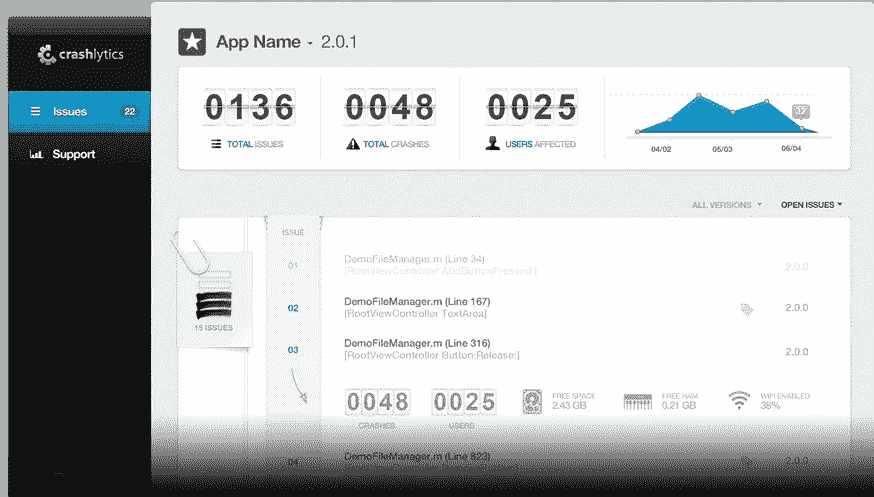
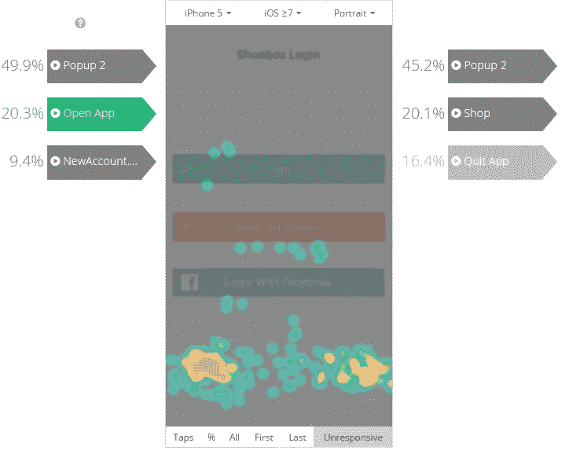
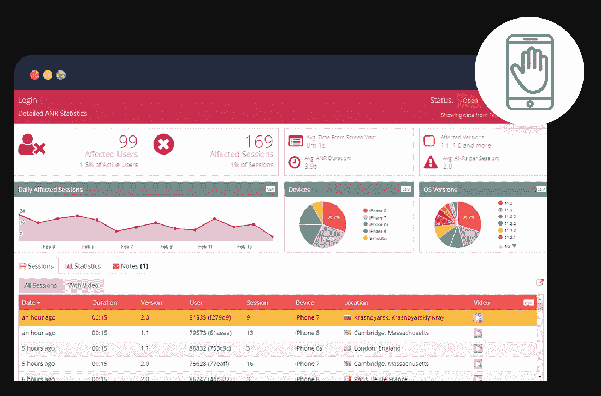
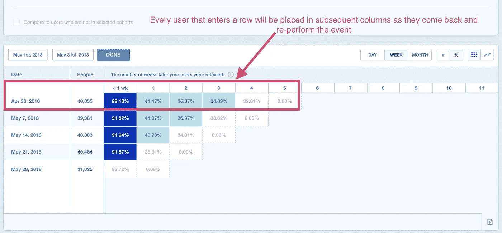
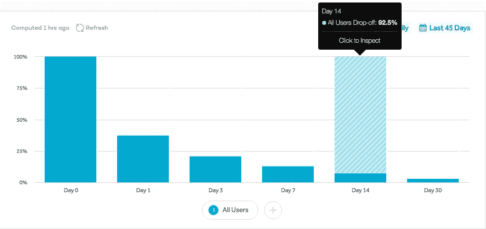

# 要跟踪的 10 个可靠的移动应用指标

> 原文：<https://medium.datadriveninvestor.com/10-tried-and-true-mobile-app-metrics-to-track-6a7d870bcdc9?source=collection_archive---------16----------------------->

这是一篇来自 Appsee 的莱斯利·乏色曼的客座报道。

正如他们所说，什么都有一个应用程序，每天都有新应用程序出现的想法不仅仅是一种感觉，而是现实。想要证据吗？嗯，App Store 刚刚庆祝了它的 10 岁生日，它的平台上有超过 200 万个应用程序。但是，是什么把胜利者和失败者、成功的故事和失败的故事区分开来呢？当然，每一个可靠的应用程序都需要植根于一个好的想法或产品，但旅程不会就此结束。例如，在产品方面，也许像 Gett Taxi 或 Starbucks 这样的应用程序是成功的敲门砖，但如果没有[惊艳的 UX](https://www.altexsoft.com/blog/mobile/mobile-app-ux-design-principles-15-rules-for-creating-apps-that-stick/?utm_source=MediumCom&utm_medium=referral) 和适当的监控，它们可能会注定失败。

移动应用专业人员知道跟踪 KPI 很重要，但这不仅仅是为了说“当然，我跟踪 KPI”而跟踪任何旧的指标如果没有一个精确的过程或方向，你的目标充其量是可疑的。

这就是为什么我们列出了十个关键 KPI，供您在跟踪您的移动应用程序时使用。每个指标都配有一个真实的案例研究，通过为您提供一种将指标应用到应用程序的切实方法，帮助您获得收益。

# 崩溃率最高的屏幕

哪些屏幕崩溃最多，导致用户退出应用的比例最高？

**如何着手:**你可以使用工具快速跟踪并修复这些问题，这些工具可以让你看到导致特定崩溃的事件顺序。其中一些工具包括由 [Bugsnap](https://www.bugsnag.com/) 、 [Appsee](https://www.appsee.com/features/crash-videos-and-symbolication?utm_source=guest_post&utm_medium=link&utm_campaign=altex_soft_mobile_metrics_guest_post&utm_content=crash_sequence_video_feature&cpnid=701b0000000WkDO) 或谷歌 [Firebase 崩溃报告](https://firebase.google.com/docs/crash/)开发的工具。

**例如:**如果一个应用程序允许用户在微观层面(从单个餐厅)或宏观层面(为提供来自多个餐厅的点餐/支付功能的美食应用程序)点餐，那么了解哪个屏幕出现更多崩溃并最终导致用户退出至关重要。是在浏览过程中发生的吗？就在下订单之前？无缝和成功的点餐对应用的成功至关重要，这就是为什么任何屏幕(无论是浏览还是购买屏幕)的崩溃都会让任何用户越来越“饥饿”。

# 崩溃会话的数量

大量崩溃的会话是任何应用程序专业人员最糟糕的噩梦。这可能会导致用户受挫和/或用户信任度下降，最终导致较低的保留率。

*How Crashlytics tracks crashed sessions*

**如何着手:**这个 KPI 可以用 [Crashlytics](http://try.crashlytics.com/) 来衡量，这个平台考虑了一系列因素，例如:设备、电池状态、充电进行中、接近传感器和 Wi-Fi 连接。

**比如:**某用户正在看一季最后一集，突然 app 崩溃。作为一名娱乐应用程序专业人员，问问自己这些问题:这种情况多长时间发生一次？有多少用户遇到了这种情况？崩溃是否发生在某种连接类型上(例如 Wi-Fi 与数据)？

# 无反应的手势

也许用户正在尝试与应用程序的元素进行交互，而该元素根本不是为交互而设计的(例如，一个令人困惑的图像，看起来像是一个可以点击的按钮，但实际上是不可点击的)。为什么用户倾向于点击？不止一个用户会出现这种情况吗？

*Tracking unresponsive gestures using touch heatmaps on Appsee*

**如何着手:**该 KPI 可以迅速衡量这些无响应手势的原因，例如，使用 [Appsee](https://blog.appsee.com/touch-heatmap-analytics-future-mobile-app-usability-testing/?utm_source=guest_post&utm_medium=link&utm_campaign=altex_soft_mobile_metrics_guest_post&utm_content=touch_heatmaps_feature&cpnid=701b0000000WkDO) 。

**例如:**用户准备好他们的每日新闻，当他们仔细阅读文章列表时，他们发现了一篇引起他们兴趣的文章。他们认为他们可以点击打开作品，但该应用程序是为用户向左滑动打开而设计的。沮丧的是，他们打不开这篇文章，他们又试了一次，结果还是一样令人失望。不幸的是，这会让新闻迷不知情，沮丧，并可能前往不同的新来源。如果许多用户遇到这个问题，触摸热图工具会在文章浏览屏幕上显示高密度的无响应手势。

# 应用程序没有响应

ANR，[应用未响应](https://android.jlelse.eu/app-not-responding-now-what-fc44732a53eb?utm_source=guest_post&utm_medium=link&utm_campaign=altex_soft_mobile_metrics_guest_post&utm_content=app_not_responding&cpnid=701b0000000WkDO)，是另一个需要跟踪的重要指标。应用程序是否冻结了你的用户，对任何手势都没有反应？你需要找出这种情况发生的频率，以及它如何影响你的保留率。

*ANR statistics on Appsee’s interface*

**如何着手:**通过具有用户记录功能的工具，可以毫不费力地跟踪这一 KPI，因此您可以立即了解用户的旅程中出现了什么问题。

**例如:**在一款游戏应用中，ANR 可能是一个严峻的现实。也许用户正在玩游戏，也许即将打破记录，而应用程序停止响应。这对用户来说将是一个巨大的挫折(甚至可能是愤怒)的来源，如果这成为一个持续的问题，用户很可能会永远退出你的应用程序。

# 被用户杀死

有时用户会关掉应用程序，因为他们认为这样可以节省电池寿命，甚至是出于习惯。其他时候，情况更严重，因为应用程序在用户的旅程中因沮丧或困惑而被扼杀。通过这一指标，您可以了解用户在聚合和单个用户级别上何时何地杀死应用程序。

**例如:**无论是每天上班还是度假，找出最佳路线是提高效率的关键。那么，为什么用户可能会关闭这个应用程序呢？重要的是要了解在他们的旅程中发生了什么——是在旅程的中途，在他们开始之前，还是在结束时？这些时刻中的每一个都可能预示着对你的用户界面和 UX 的重大洞察。

# 每日活跃用户(DAU)

这个指标的名字说明了一切:DAU 代表每天至少使用你的应用一次的用户数量。该指标有助于确定大多数用户更喜欢一周中的哪几天。同样，月活跃用户(MAU)是一个跟踪每月有多少人使用你的应用程序的指标，可以帮助你识别相关的季节性趋势。

**比如:**有些人喜欢经常查财务。其他人则不然。然而，了解用户的日常需求/兴趣是关键。用户是在应用程序上使用许多不同的功能，还是一遍又一遍地重复相同的操作——查看余额、汇款、存入支票等。？与其他日子相比，用户在某些日子会更频繁地访问应用程序吗？哪些功能在周一使用最多，为什么有些功能在周五会被忽略？

# 入职/注册下线

构建一个流畅而成功的注册界面是非常具有挑战性的，因为用户通常会认为这是一个他们不想跨越的障碍。您的用户在登录、注册或入职期间离开的比例是多少？你知道为什么吗？

**例如:**人们经常在寻找新的健身方式，任何提供令人兴奋的功能、拥有闪亮醒目的注册 UX 的应用都会吸引眼球。现在，他们为什么不完成入职流程？是什么阻止了他们完成注册过程？

# 保留率

密切监控你的应用程序的留存率是为你提供关于性能和用户体验的见解不可或缺的。有多少用户在下载 app，使用一次，然后就再也不回来了？仅仅一个动作就再也不回的用户比例是多少？

*Tracking retention on Mixpanel*

**如何着手:**跟踪留存率可以通过许多不同的分析平台来完成，其中之一是 [Mixpanel](https://mixpanel.com/) ，它测量留存粘性并回答用户如何参与产品的问题。

**例如:**用户前往旅游应用，以便轻松浏览、预订和方便购买。但是如果他们下载了应用程序，四处看了一眼，然后再也没有回来呢？是什么导致了这次伤亡？有必要跟踪他们遇到问题的地点、时间和原因，并希望根据他们的用户旅程了解他们为什么没有返回。

# 首次行动的平均时间

初次下载后，用户大概需要多长时间才能再次使用你的应用。有了分析群组的工具，很容易采取两个行动并理解它们之间的关系。

**例如:**利用商业应用程序来提高生产力的想法是一个很好的倡议，但有时这种兴奋在下载后会消退，用户永远不会回来。假设他们真的回来了，他们在应用程序中完成第一个动作需要多长时间？如果需要一段时间，趋势在哪里，为什么需要这么长时间？

# 采购流程 CR & Drop-off

正在购物或完成订单的用户比例是多少？在漏斗的每个阶段之间，有多少用户在减少？此外，他们放弃了哪些屏幕，为什么？

*Drop-offs data on Amplitude*

**如何着手:**分析漏斗时，使用正确的跟踪工具很重要。Appsee 和 [Amplitude](https://amplitude.com/) 是通过漏斗和转换监控用户活动的两个顶级竞争者。

**例如:**购物者已经下载了应用程序，完成了注册，但他们仍然没有购买。为了增加你的底线(并增加保留！)了解用户何时以及为何离开会很有帮助。他们是否会将商品添加到购物车中，而不结账付款？或者，他们可能一路走到收银台，却无法输入自己的地址，感到沮丧，没有完成旅程。这些是分析购物者优化的关键因素。

# 所有这些都是为了说…

你说，没有购物应用程序，你想知道为什么要跟踪购买流程？我要说的是，每个 KPI 都有它的位置和相关性，这取决于你的应用的类别。上面的例子是为了让你的轮子转动起来，并更精确地探索如何监控和评估这些指标。到处都有相关性。这只是操纵指标以适应你的应用的问题，而定性分析的应用是理解为什么的圣代上的樱桃。

*莱斯利·乏色曼是*[*Appsee*](https://www.appsee.com/?utm_source=guest_post&utm_medium=link&utm_campaign=altex_soft_mobile_metrics_guest_post&utm_content=appsee_homepage_link&cpnid=701b0000000WkDO)*的集客营销经理。她是 UX 和技术潮流的狂热追求者，喜欢寻找创新的方式让生活变得更美好！莱斯利更喜欢素食，虽然偶尔也想吃牛排，而且她一直在寻找新的方式来装饰她的家。你可以在 Twitter @wassles 上关注她。*

***想为我们的博客写篇文章？阅读我们的要求和指南*** [***成为***](https://www.altexsoft.com/become-a-contributor/?utm_source=MediumCom&utm_medium=referral) ***的投稿人。***

*原载于 AltexSoft 的博客**[***十大屡试不爽的手机 App 指标追踪***](https://www.altexsoft.com/blog/mobile/10-tried-and-true-mobile-app-metrics-to-track/?utm_source=MediumCom&utm_medium=referral)*