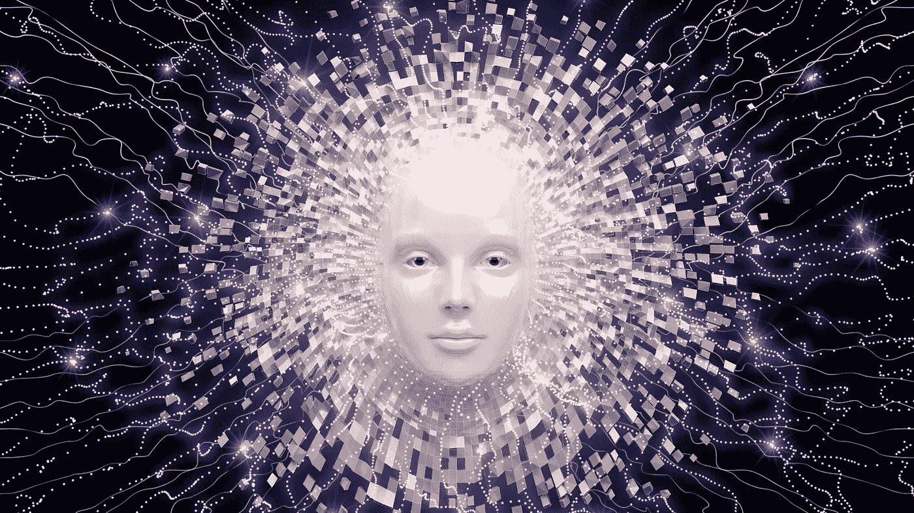
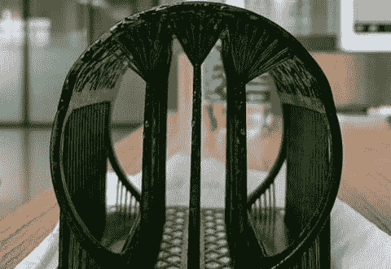
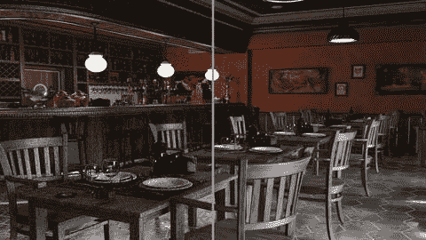
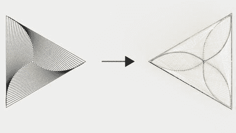
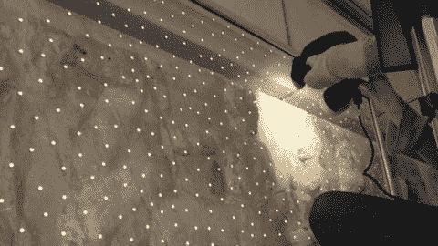
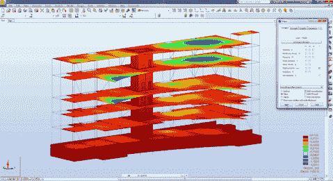
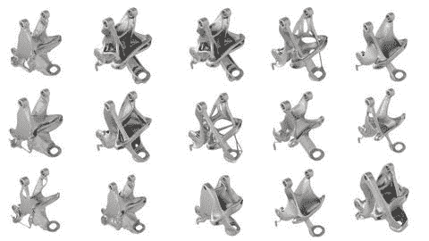
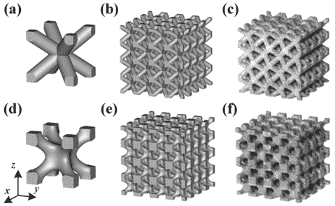
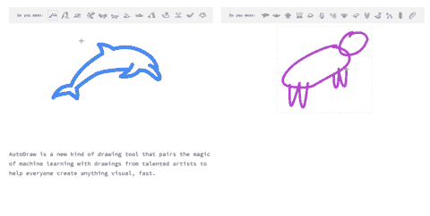

# 人工智能让艺术变得更好而不是更差的 10 种方式。

> 原文：<https://medium.datadriveninvestor.com/10-ways-artificial-intelligence-is-making-art-better-a59246b09d3f?source=collection_archive---------15----------------------->

如果我告诉你艺术和人工智能就像花生酱和果冻一样不可或缺，你会怎么想？你可能会对这样的声明嗤之以鼻，因为艺术和技术毫无关系，对吗？不对。事情的真相是:包括我们在内的艺术家经常使用人工智能来推进我们的艺术；有时甚至不知道。

这项技术及其产生的无数工具，在概念化、设计和制造生命周期中发挥着越来越有意义的作用。因此，许多艺术家&那些支持他们的人，并没有完全意识到人工智能工具对他们工作的深刻和实质性影响。以下是人工智能在艺术领域创造惊人事物的 10 种方式。

 [## 生活在算法社会|数据驱动的投资者

### 鉴于当今最新技术扩散到我们的日常生活中，毫不夸张地说…

www.datadriveninvestor.com](https://www.datadriveninvestor.com/2018/08/17/living-in-the-algorithmic-society/) 

1.  **确保 3D 打印不可怜:** Advanced Artifacts 使用 3D 打印机为我们在网站上制作和销售的[生殖珠宝](https://advancedartifacts.com/collections/frontpage)制作铸件。然而，在我们的设计印刷之前，我们使用人工智能工具来优化“支架”的结构，以确保我们的印刷达到尽可能高的精确度。一旦支架制作完成，我们的设计就可以印刷出来&随后在金属上实现。

**2。用创造性的机器人技术征服复杂性。**:使用我们的宠物绘图机器人*(我们称之为 Pablo)*——我们绘制出非常详细、非常精确的图纸。通过使用机器人技术提供的极端精度，我们能够提供手绘的感觉，而没有手工绘制超详细图案的任何不一致性(或关节炎)。

**3。通过照片级渲染展现我们的想象力:**我们许多人每天都在与计算机生成的图像进行交互，越来越多的时候，我们无法区分真实的照片和计算机生成的照片。这主要是由于不断进步的真实感渲染技术领域，该技术使用光照算法来计算&优化虚拟对象上的光线和阴影分布，以便它们以与物理对象相同的方式呈现。艺术家知道能够传达他们的愿景的重要性，并经常依赖这种技术来帮助他们在实际开始工作之前向利益相关者传达想法和概念。

**4。用人工智能生成珠宝&计算机图形学:**人工智能正在迅速超越数字世界，并使其存在于物理介质中。一种方式是通过珠宝设计。在 Advanced Artifacts，我们使用我们专有的人工智能工具来培养灵感和有趣的模式，这些模式是我们工作的基本灵感。

**5。通过摄影测量(3D 扫描)保存艺术史:**没有什么是永恒的，尤其是几千年前制作的实物艺术。这是激励数百万人去旅行的原因；希望在他们还可以的时候，用自己的眼睛去体验世界的奇迹。不幸的是，我们中的许多人没有机会去旅行，或者更糟糕的是，去旅行时已经太晚了。幸运的是，像照片般真实的 3D 扫描这样的成像技术让我们能够捕捉艺术历史的元素，以免为时过晚，具有惊人的细节和清晰度。这些数字资产可以在世界任何地方进行 3D 或 VR 体验，更好的是，可以用作修复我们熟悉和喜爱的历史遗迹的参考模型。

**6。通过模拟实现结构稳定性:**最近，建筑领域在建筑的理想美学方面发生了重大变化。从简单的功能性建筑到迷人的建筑，它们将艺术实用性无缝地融入共享空间。如今的建筑越来越艺术化，设计犀利，选择大胆。然而，一个美丽的设计如果不能发展成为一个可靠的&安全结构来承载人类的生命，那它就毫无意义。这就是为什么领先的建筑师越来越多地利用人工智能来分析他们的设计。像 Autodesk Robot 这样的工具可以计算各种条件下建筑物框架的结构稳定性，从而允许设计师和建筑商重新审视他们的计划&以适应风险增加的场景和领域。他们与他们的团队和技术合作，寻找更好的方法来支撑他们的结构，而不损害整体的美学目标。

**7。通过 G.A.N 增加可选性:**当艺术家、设计师&工程师在开发新产品或作品时，他们通常会重复……很喜欢。这种快速迭代导致他们的核心思想的许多粗略的近似，并且通过许多选择，他们变得更接近于找到理想的版本。生殖对抗网络最近被用来快速提高创意人员迭代设计的速度。通过给程序一系列的影响和约束，计算机将产生数百种略有不同的变体，让创意者选择最佳版本，并从那里着手改进它。

**8。通过网格结构制造更轻、更重的物体:**如今，保护资源对每个人都很重要，对艺术家和其他制造者来说尤其如此。如果一名雕塑家正在制作一件新作品，他们可能会考虑如何使用 3D 打印&内部网格结构来减少所需的材料量，而不牺牲强度或耐用性。这种技术已经在工程设计中得到应用，并取得了惊人的成果。

**9。通过机器智能的新音乐:**如果你是一个有抱负的音乐人，你可能没有机会接触到世界级的工作室或你钦佩的传奇制作人。你可能有一台笔记本电脑&一些(可能是盗版的)软件应用程序。然而，在未来，这些应用程序将能够与最先进的工作室的生产能力相媲美。据报道，著名音乐家&未来学家 will-I-Am 正在研究一种新技术，这种技术可以听用户的口头命令，并用音乐执行他们的愿望。例如:“播放 X 歌曲的前 10 秒钟的鼓声，并将其与 Y 歌曲的长笛部分混合，并循环播放 60 秒钟…并加入零星的低音。”。如果你和我一样对今天的创造性声音感到惊讶，那么你是幸运的，因为音乐的未来肯定是光明的……从声学角度来说是这样的。

**10。通过深度学习实现创意民主化:**人工智能在绘画&图像创作等艺术领域越来越受欢迎。谷歌的快速绘图技术就是一个例子。使用高级神经网络，系统试图猜测用户正在画什么，或者在 Autodraw 的情况下，将自动用该形状或对象的最佳版本填充它。虽然这项技术目前还处于起步阶段，但它的未来是光明的，并且很可能在未来人们如何快速表达概念方面发挥重要作用。想象一下在未来的白板上解释一些东西，画出一些东西，然后神奇地看着你的简笔画&不完美的圆圈就在你眼前变成艺术作品，让你更清楚地交流&通过让观众专注于你的想法，而不是试图弄清楚那组弯弯曲曲的线条应该代表什么，来保持观众的注意力。

**希望通过阅读这篇文章，你对人工智能技术&工具如何被部署来创造和促进艺术创造有了新的理解。如果你想拥有自己的人工智能艺术，请查看我们的商店，看看我们令人疯狂的再生珠宝收藏&人工智能艺术(人工智能绘画)。直到下一次，这是乔，结束。**

***本文最初由*** [***高级神器***](https://advancedartifacts.com) ***发布，在这里我们将艺术置于人工智能之中。***