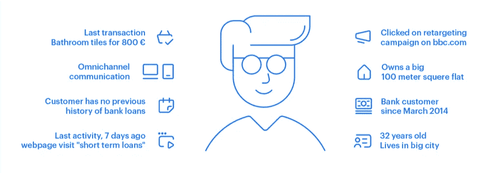
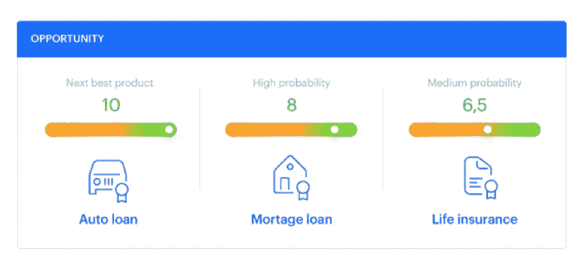
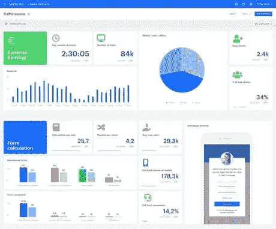

# 将人工智能融入金融的 10 种方式(举例)

> 原文：<https://medium.datadriveninvestor.com/10-ways-to-incorporate-ai-in-finance-with-examples-9f6bbb1a54d5?source=collection_archive---------17----------------------->

他们说“金钱万能”，但这在今天又意味着什么呢？现在说话的是大数据和人工智能。**来自** [Verndale](https://www.verndale.com/insights/solving-for-cx) 的一份报告显示，63%的受访者认为大数据/分析是提升客户体验的最重要技术。银行业也不例外。让我们来看看 10 个人工智能应用于金融机构各个方面的例子，从法律部门到市场营销。

# 基于客户行为的优惠

分析顾客与你的品牌互动的方式可以为吸引顾客的报价提供建议。从个人客户收集的数据可以通过人工智能算法进行细分和分析，以识别行为模式并建议优化的活动。

**举例**

经常使用信用卡的人可能对增加他们的信用额度感兴趣，这与那些更经常使用借记卡的人相反。发送根据平均支出和回报时间调整的信用额度更高的报价。

# 基于位置的通信

使用移动应用程序为公司提供地理位置数据，并创造许多机会。根据客户的位置，您可以显示与您的离线位置或客户周围环境相关的优惠。

**例子**

使用地理定位的方法之一是发送商业伙伴的特别优惠。为在特定地点使用您的信用卡付款的客户提供折扣，并在他们靠近合作伙伴的商店时向他们发送提醒。

# 深度个性化推荐的人工智能算法

尽管一些优惠可以基于客户细分手动创建，但通过在短得多的时间内处理大量数据，算法能够比人更有效地处理数据和发现见解。

**例子**

根据客户账户转账类别等深入见解提出建议。如果他们在燃料或汽车维修上花了一大笔钱，给汽车保险打折。

# 在线-离线数据集成

以客户为中心的方法需要客户服务、销售和营销部门之间的信息交流。由于可以从在线和离线联系点访问 CRM，客户服务可以避免根据过时的信息向客户提供不合适的服务。

**示例**

用从网上获得的最新客户数据支持银行分支机构的员工。这将有助于您避免出现这样的情况，例如，客户在获得汽车贷款几天后就获得了抵押贷款。相反，员工可以根据在线观察到的最新客户行为来调整报价。

# 欺诈检测

在反欺诈系统中，人工智能会观察所有客户的活动，以便调查那些存在潜在威胁的客户。这要归功于在交易历史、开户程序、信用卡设置等中发现的行为模式的分析和分段。

**例子**

使用行为空间和轨迹分析可以发现和评估客户生命周期中的重要事件，并将它们与正常的实体行为区分开来。​

银行可以利用人工智能的力量来观察个人客户账户上的意外行为和操作。这些模式可能与特定时间段内的转账频率、汇款金额或交易数量有关。这种系统大大降低了与欺诈活动相关的成本和风险。

# 收债

使用人工智能分析金融数据可以帮助跟踪对银行或其他贷款机构负有债务的客户。

**举例**

除了简单地检测债务之外，先进的系统可以对债务或债权人进行细分，并选择在特定案件中证明最有效的争议途径。通过在讨债中个性化最初的接触，你可以显著提高成功率。

# 比较搜索引擎

对于价格较高且决策过程相对较长的产品，如房地产或银行业，比较搜索引擎将帮助客户筛选选择数量，使他们更接近最终决策。

**举例**

信用计算器是吸引客户和开始销售线索培育周期的常用方法。基于可用的客户数据，该系统能够向客户提供现实的估计

# 风险建模

没有对潜在风险的评估，在银行业引入新的金融工具和做出高风险决策(如并购)是不可能的。人工智能通过分析所有必要的信息和开发有价值的见解，帮助银行做出基于数据的决策。

**例子**

以外币计价的账户受汇率波动的影响，而投资者债券或政府证券的价值取决于现行利率。建模在衡量市场风险中的作用是**预测经济因素的变化**并评估它们对资产价值的影响。

# 知识管理

知识管理的概念，尤其是在大型组织中，最终被认为是提高效率和业务绩效的有价值的策略。公司只能从使用算法分离和搜索公司资源中受益。

**示例**

人工智能驱动的知识共享系统对法律部门尤其有利。它们使律师和律师助理能够从不同的位置“挖掘”大量的文档和其他资源。

# 终生价值预测

CLV 是企业成功的关键指标之一，没有它，你将无法实施旨在保持或增加客户参与度的适当营销策略。

例证:CLV 的计算将使你能够识别在你的产品或服务上花费最多的客户群体。通过人工智能分析这些价值，你可以为花费最多的客户创造个性化的优惠，并奖励他们的忠诚度。

# 用人工智能分析和展示数据

你的营销传播越个性化，你需要的报告就越精确。得益于实时数据处理和基于人工智能的分析，创建定制报告和 KPI 并呈现完全最新的结果变得更加容易。

示例:使用连接到所有客户通信渠道的单一跟踪器，您可以通过在一个位置实时汇总数据来创建客户的单一配置文件视图。这提供了前所未有的机会来了解客户行为，并通过不同的渠道向客户传达不同的信息。它还允许你预测用户未来的行动。

# 数据集成

所有沟通渠道都提供具体的客户信息。一起分析和比较他们的表现是设计良好的全渠道体验和客户满意度的关键。在算法的帮助下，在一个地方收集和处理数据变得更快更容易。

**例子**

当员工查看数据库中收集的信息时，客户的详细信息是从不同的数据源中透明地获取的。实时数据集成的主要优势是数据更新的延迟几乎为零，从源系统传播到整合的 360 度客户视图，并且不需要在不同数据库中单独存储整合的数据。

# 包扎

“华尔街。由希亚·拉博夫和迈克尔·道格拉斯主演的大片《金钱永不眠》的片名完美地反映了金融世界的本质。观察到金融机构运营的数据呈指数级增长，我们需要找到有效的方法来管理这些数据并保证其安全。在技术发展的这个阶段，人工智能可以帮助金融和银行部门更顺利地运行，并交付预期的结果。

## 来自 DDI 的相关故事:

 [## 为什么数据会改变投资管理

### 有人称之为“新石油”虽然它与黑金没有什么相似之处，但它的不断商品化…

medium.com](https://medium.com/datadriveninvestor/why-data-will-transform-investment-management-4a60966c1c81)  [## 股票市场投资的机器学习

### 当你的一个朋友在脸书上传你的新海滩照，平台建议给你的脸加上标签，这是…

medium.com](https://medium.com/datadriveninvestor/machine-learning-for-stock-market-investing-f90ad3478b64)