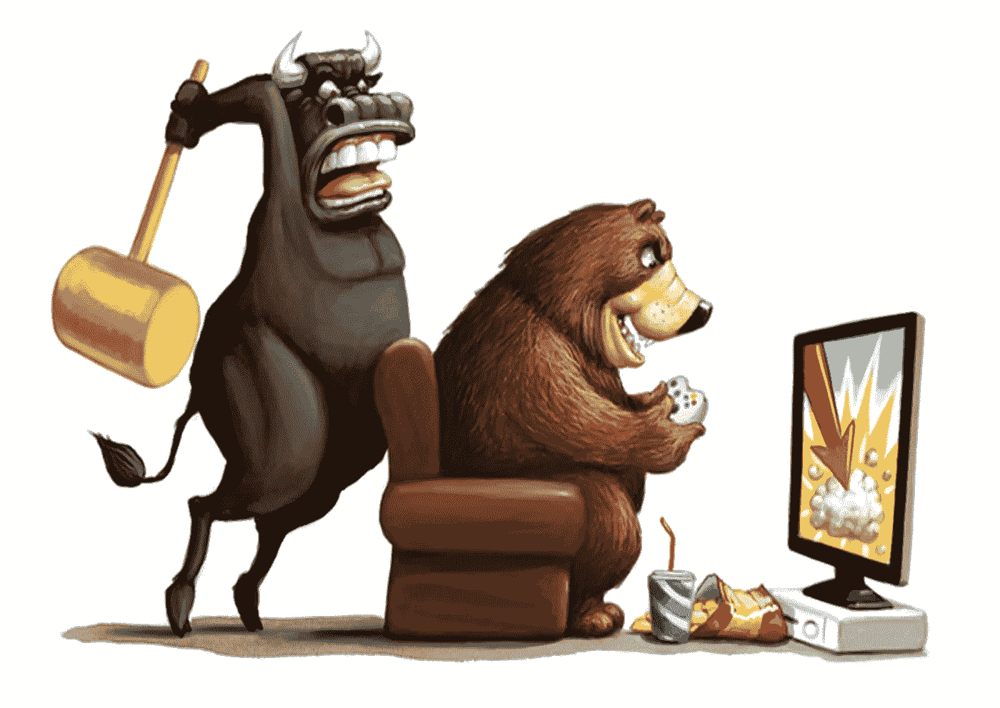

# 在股市赚 10 倍的 10 种方法

> 原文：<https://medium.datadriveninvestor.com/10-ways-to-make-10x-in-stock-market-3f17e524d8db?source=collection_archive---------18----------------------->

先来一点小告白——股市赚钱的方法不是 10 种，而是 n 种(还有 n++赔钱的)。你可以通过书籍、信件、博客或讲座来了解它们，但只有当你投资时，你才会掌握它们。如果你缺乏信心或信念，最好雇人来帮你做这件事，这就是共同基金的作用。如果你不想雇佣任何人，仍然参与市场，有指数基金。更多关于他们的信息——可能会在以后。

我学到的东西是通过我与股市的第一手互动教给我的——通过赢和输，通过非常不理性的牛市，然后是稍微长时间的熊市。

1.  省下的钱就是赚到的钱——除非你首先有钱投资，否则你不会赚钱。所以大力节约吧
2.  参与——永远做旁观者是没有意义的。没有人不跑步就能赢得比赛。
3.  信念——不要根据任何人的建议购买。如果你在借来的信念上工作，当情况变得艰难时，临阵退缩的可能性更大。记住，除非你抓住了确切的底部，否则你的股票一定会下跌。信念有帮助。
4.  耐心——10%(甚至更少)的交易日会给你 90%的收益。因此，坚定信念有助于你利用复利。
5.  增长很重要，估值也很重要——挑选股票的首要标准是看销售额和利润的增长。如果是战胜通货膨胀和无风险利率(GSec，FD 等。)在 5 到 6 年的时间内，它非常适合考虑。同样重要的是你付出的代价。一只昂贵的股票，看看市盈率、市盈率、EBTIDA 等估值参数，更有可能在熊市中考验你的耐心和信心。
6.  管理——说实话，现在很难预测管理质量，但应该不惜一切代价避免已知的犯罪公司。你可以通过与业内朋友的互动来了解企业管理，看看谁是董事会成员，谷歌一下名字，看看他们是哪个董事会的成员。一次负面打击，最好继续前进。
7.  P&L——一个人需要对 P&L 和商业模式有基本的了解，才能在决策中掌握基本的卫生知识。
8.  平均是愚蠢的——在不了解商业模式和未来增长的情况下平均一只股票是非常危险的。
9.  阻止分心——永远不要被你周围的新闻标题分心。新闻只有在耸人听闻的时候才有销路。所以，永远不要听信“股票回报/将在两年内回报 2000 %”这样的故事。没有人等待 20 倍的回报，大多数账面利润只有 2-3 倍。任何高于 GSec 利率的利率+你付出的时间的一点溢价——13/14%的 CAGR 是你应该达到的目标。

当你的技术和行为技能结合在一起时，你就赚钱了。不是非此即彼，是& &。

如果你还在等第 10 道，建议你再读一遍第 9 点！