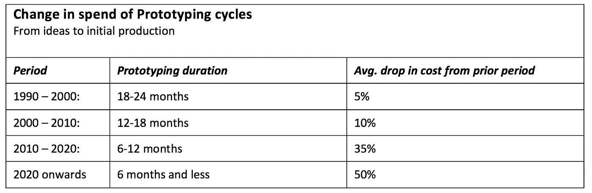
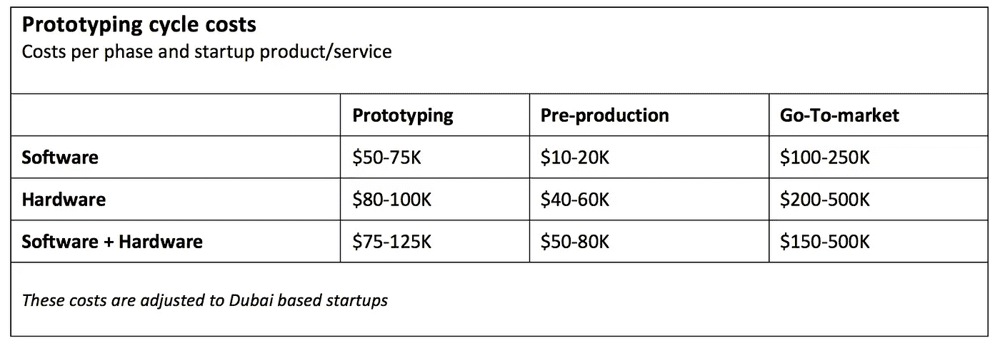

# 10 年期投资者签证和阿联酋 100%外资所有权

> 原文：<https://medium.datadriveninvestor.com/10-year-investor-visa-and-100-foreign-ownership-in-the-uae-21da99800e14?source=collection_archive---------1----------------------->

## 这到底意味着什么，需要考虑什么。

总的来说，这是一个极好的消息，而且时机恰当。这对推动阿联酋的创新议程和刺激创业至关重要。也就是说，这需要几个细节才能说得通:

1.  有什么要求和资格？
2.  这对现有投资者有何影响？
3.  需要多少钱，需要多长时间？
4.  有哪些隐性成本？

为了让一个健康的创新和创业生态系统有效运作，许多移动部分需要优化。最近，不断上升的经营成本、延长的服务处理等待时间以及疲软的消费需求令人窒息。

如果这项新政策解决了成本上升的问题，改善了政府服务的提供，初创公司就可以专注于创新而不是管理。这对于推动创新，让那些有冒险欲望和愿意努力工作的人才有机会获得成功至关重要。

在刺激创业公司增长和推动创新方面，阿联酋政府有三个战略选择。

1.  前期——在创业之初权衡所有成本
2.  后端—在业务生命周期结束时衡量所有费用
3.  免费增值——现在免费，以后付费

我们目前正在经历第一个战略选择，理想的方法是免费增值模式。要想通过政府收费实现这一目标，就需要进行重组，并建立一个更全面的基于绩效的税收制度。

加速创新首先要考虑的几个关键因素是原型制作的成本和速度。当管理成本降低时，这有利于创业；投资者和生态系统的其他成员承担更多风险。这使得生态系统向前发展。

Change in spend of prototyping cycle

具体来说，在迪拜，由于获得零件、系统、重型设备以及最重要的人才，原型制作比其他地方成本更高。

Prototyping Cycle costs

随着区块链、人工智能、分析学的兴起，创业公司不再局限于特定的地点。他们几乎可以在任何地方进行操作。潜在的因素是人才可以在哪里合作并获得资金来实现他们的想法。

最后，底线不是 10 年期签证或 100%所有权，也不是投资回报。想法、资金和冒险坚持投资回报以前发生过、现在正在发生和可能再次发生的地方。这项新政策是一个良好的开端，将为阿联酋成为世界顶级创新中心之一铺平道路。

