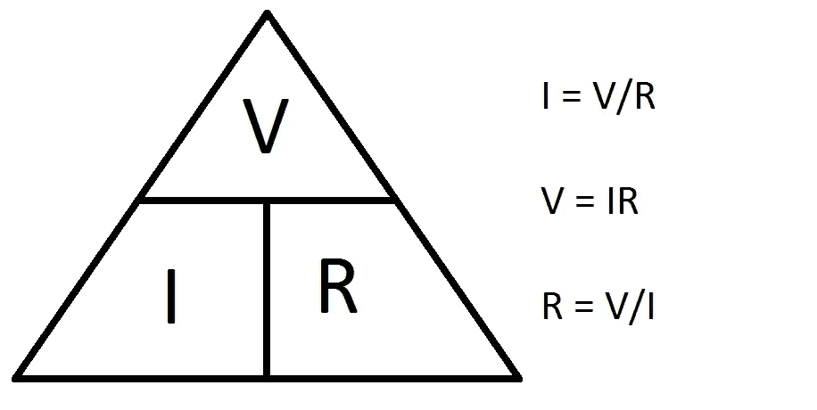

# # 100 机器人日——第一天。

> 原文：<https://medium.datadriveninvestor.com/100daysofrobotics-day-one-e425373f751c?source=collection_archive---------12----------------------->

2019 年夏天即将结束，今年只剩下 127 天了。所以我决定给自己一个挑战。我见过很多人做#100DaysOfCode(老实说，我可能应该这样做)，但我想选择一个让我获得更多实践机会的挑战，我一直像喜欢软件一样喜欢硬件，我已经和孩子们一起摆弄了一些机器人套件，并希望了解更多。所以我决定给自己设定一个为期 100 天的机器人挑战。

Challenge goals! Bidibidibidi.

## 规则。

通常“100 天”挑战是连续 100 天，我非常了解自己，知道生活会阻碍我实现连续 100 天的目标！所以我打算在今年年底(127 天)完成。实际上，12 月通常是一个注销的日子，所以我将不得不接近每天的目标，以便在 12 月留有余地。

为了让一天有意义，我需要完成一个小时的“与机器人有关的事情”

 [## 模式和机器人:复杂的现实|数据驱动的投资者

### 哈耶克的名著《复杂现象理论》(哈耶克，1964)深入探讨了复杂性的话题，并断言…

www.datadriveninvestor.com](https://www.datadriveninvestor.com/2019/03/04/patterns-and-robotics-a-complex-reality/) 

我会把我每天学到的东西写在博客上，但是把几天的时间集中在一篇博客上也是可以的，只要不超过一周。

## 开始使用。

我真的很惊讶#100DaysOfRobotics 和#100DaysOfRobots 在 twitter 上几乎是一片荒地。由于我的知识相当基础，我想我会从一个 Udemy 课程开始，至少打下基础。我选择了 Ian Juby 的[Electricity&electronics——Robotics，通过构建](https://www.udemy.com/analog-electronics-robotics-learn-by-building/)来学习，因为当我在机器人和遥控车辆上闲逛时，我的电子知识一直是我的弱项。主持人伊恩·朱比看起来也很开心地将课程组合在一起，最后它被出售了！！

## 第一天。电压、电流和电阻。

我是对的，朱比先生是一个伟大的演讲者，他的演讲风格可以被描述为“滑稽爸爸”,但它很吸引人。他首先确保你在相当多的细节(而不是可怕的细节)中意识到与电打交道的风险，例如，如果你将汽车电池短路，或者走进变电站，会发生什么。

接下来，他描述了两种材料，**导体**——允许电流通过的材料，和**绝缘体**——不允许电流通过的材料。此时，GCSE 科学倒叙开始出现，但我已经很久没有这样做了，所以不是坏事。

最后，我们转向术语:

**电流**是衡量电子流(电是什么)的尺度，以安培为单位，在等式中用字母 A(有时也叫 I，容易混淆)表示。

**电阻**是衡量电阻的标准，衡量电子在材料中流动的好坏。电阻以欧姆为单位测量，在等式中用希腊字母ω表示。

**电压**，我还在纠结它到底代表什么。伊恩·朱比用了一个花园软管的比喻。电流是水的流动，电压是水的压力，如果软管有扭结，那就是阻力。现在，对我来说已经足够了。电压以伏特为单位，在等式中用字母 v 表示。

**欧姆定律**定义了这三个属性之间的关系。它表明通过导体的电流与两点间的电压成正比，或者更简单地说。电流=电压除以电阻。

**I = V/R**

这意味着如果欧姆定律三角形的另外两个值:

**当电路中有多个电阻时，串联电路中的电阻**很容易计算。电阻会自行合成，因此你只需将每个电阻的欧姆值相加即可。

**并联电路中的电阻**稍微复杂一点。通过每个并联电路的电流是可分的。因此要计算总阻力(Rt)

1/Rt = 1/R₁ + 1/R₂ + 1/R₃ … + 1/R𝗑

其中，R₁、R₂、R₃、R𝗑是电路中电阻器的电阻值(无论可能有多少)。

最后，我们复习了**通过色带计算电阻值**。老实说，我需要再看一遍这一部分，但是现在，这里有一个来自互联网的颜色表！

