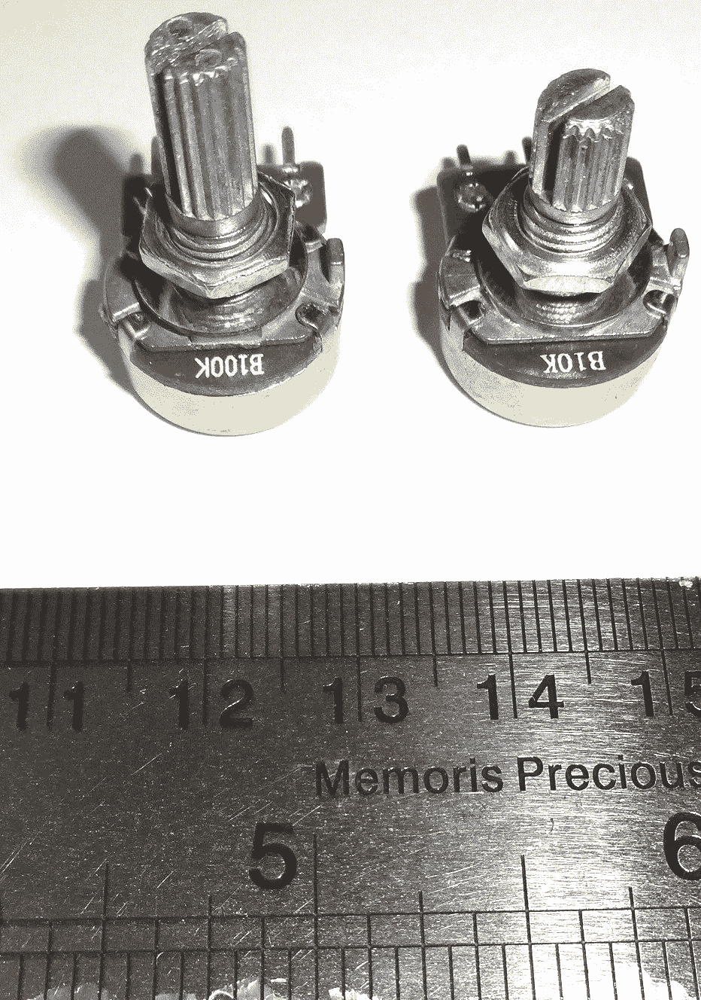
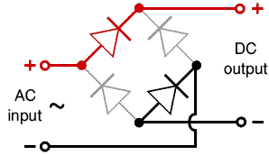
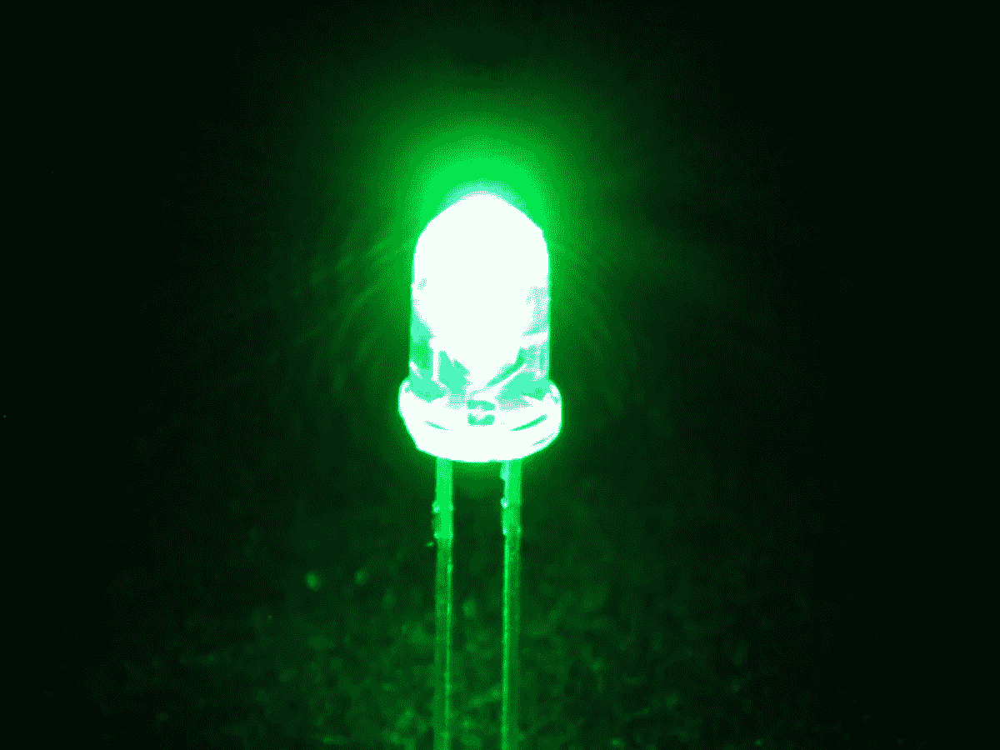

# #100DaysOfRobotics —第三和第四天。

> 原文：<https://medium.datadriveninvestor.com/100daysofrobotics-day-three-and-four-6f4b710fa161?source=collection_archive---------17----------------------->

第三天，不出所料，生活打乱了计划。一次去伦敦的工作旅行和 DIY 意味着在写下我所学到的东西方面有点落后，所以这是一个大丰收的版本！

## 可变电阻。

可变电阻器也称为电位计(或简称 Pots ),顾名思义，它是可以改变电路电阻的器件。它们看起来像一个表盘，这正是它们的用途。

100KΩ and 10KΩ Potentiometers

它们的工作原理是有一个碳“雨刷”,当你转动刻度盘时，它会或多或少地将碳引入电路。碳越多，电阻越高，反之亦然。

 [## 模式和机器人:复杂的现实|数据驱动的投资者

### 哈耶克的名著《复杂现象理论》(哈耶克，1964)深入探讨了复杂性的话题，并断言…

www.datadriveninvestor.com](https://www.datadriveninvestor.com/2019/03/04/patterns-and-robotics-a-complex-reality/) 

## 交流电和 DC 电。

电基本上是电子的流动。第一天我们学习了如何用安培来测量电子流。对于 DC 电来说,“流动”只是单向的，电流直接流动，因此 DC 代表直流电。

有了交流电，电流交替(你能猜出 AC 代表什么吗！)电流以波浪式有规律地从正变到负。

## 电容器。

冒着暴露年龄的风险，我忍不住听到电容器这个词，而不是想象马蒂·小飞侠和多克·布朗(《变形金刚》也有类似的效果)，但我跑题了。顾名思义，电容器储存电能(它们具有电容)。我们的朋友 Ian Juby 向我们展示了如何用两张锡纸和两张蜡纸包裹成一个圆柱体来制作电容器。这是一个很好的练习，因为它演示了什么是电容器。

电容器是两个大的金属表面，中间是一个电阻表面。如果将一个金属表面连接到正电源，另一个连接到负电源，电子会流到连接到负电源的金属表面上，但不能再前进了。这导致金属片被电子饱和。同样，在正极一侧的金属板上，电子被金属排斥到正电源。

如果将一个电容器连接到 DC 电源上，测量电流，当负极板上充满电子时，电流会出现一个大的尖峰，随后，由于正极金属板上的电子被排斥，电流会很快降至零。这意味着 DC 电流不能很快通过电容器。

如果将一个电容连接到交流电源，最初会发生同样的情况，负极板出现电流尖峰并开始下降，但是随着电流极性的切换，电流再次出现尖峰。

这意味着电容器允许交流电流，但阻止 DC 电流。

电容以法拉(F)为单位测量，但通常非常小，在微米或纳米级。

## 二极管和发光二极管

二极管和电容器没什么不同。它由两块掺杂了过量电子的硅片组成，一块是阴极，另一块是阳极。当这两个零件焊接在一起时，两者之间会有一个区域，在那里电子相互抵消。被称为耗尽区，它具有非常高的电阻(参见第 2 天)。

如果将电路的正极连接到二极管，负极连接到阳极，阴极的电子会被吸引到正极，导致电阻区变得更大，电阻更大，最终阻止电路中的所有电流。

然而，如果电路反过来，正极连接到阴极，负极连接到二极管，则正极电流排斥阴极中的电子，使电阻区更小，电阻更小。

这意味着二极管只允许电流单向流动。二极管也只能通过额定电压，如果施加更高的电压，二极管会发热并最终烧毁，因此用电阻保护二极管至关重要。

但是如果二极管只允许电流单向流动呢？交流电会发生什么？不出所料，它会阻挡正波长的水流，让负波长的水流通过。可以配置二极管将交流电转换成 DC 电。被称为桥式整流器。下面的 gif 展示了它的工作原理。

LED 就是*发光二极管*。电阻区以光而不是热的形式释放出多余的电子。

A green LED