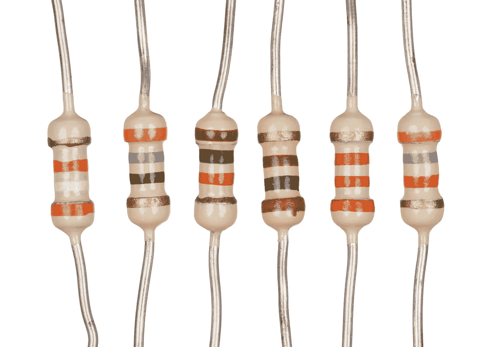
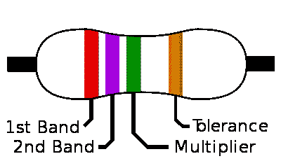
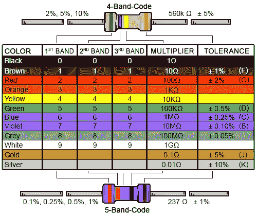

# # 100 机器人日-第二天。

> 原文：<https://medium.datadriveninvestor.com/100daysofrobotics-day-two-10f3a69c296b?source=collection_archive---------9----------------------->

所以我离开[的第一天](https://medium.com/@IanAmes/100daysofrobotics-day-one-e425373f751c)相当突然，带着一个电阻颜色表，没有很多解释。这有两个原因:

1.  我没有完全理解它。
2.  我花在写第一天学到的东西上的时间几乎和我花在学习上的时间一样多。

 [## 模式和机器人:复杂的现实|数据驱动的投资者

### 哈耶克的名著《复杂现象理论》(哈耶克，1964)深入探讨了复杂性的话题，并断言…

www.datadriveninvestor.com](https://www.datadriveninvestor.com/2019/03/04/patterns-and-robotics-a-complex-reality/) 

我知道这两点是矛盾的。如果我不能在博客中很好地解释一些事情，那么回顾一下这个主题来加强我自己的学习也无妨。我以前发现[写下我正在学习的东西](https://medium.com/software-engineering-roundup)对于让知识深入我的大脑非常有用，所以我不应该害怕走得慢一点，做得少一点。质量学习，而不是数量学习。

所以我们回到:

## 通过颜色带计算电阻值。

我以前也被电阻带搞糊涂过。几年前，我买了一个 Arduino 工具包，里面有很多很酷的组件和非常零碎的文档。我以前从未使用过电阻器，我不明白颜色代码如何告诉我任何有用的东西。幸运的是，它们被贴在一条上面印有阻力的胶带上，我在使用后特意将它们贴回纸上，否则我就完了。

如果你以前没见过这样的电阻:

Six resistors with 4 band colour coding. Later on, I will tell you their resistance.

颜色都代表电阻的阻值(因为写上去能有多难！)更令人困惑的是，有些电阻有 4 个频段，而有些有 5 个频段。让我们从 4 波段电阻开始。

理论上，电阻的左右方向应该很明显，因为第三和第四频带之间的间隙应该大于第一和第二频带之间的间隙。从上图可以看出，情况并不总是这样，但是跟我来。下图显示了一个 4 频段电阻以及每个频段的含义。

a 4 band resistor showing what each band represents.

第一个波段是初始值，所以在上图中是红色的，在下图中相当于“2”。

第二个带是紫色的，相当于‘7’。

第三段(在 4 段电阻上)是乘数，即在前两个数字后加多少个零。在上图的例子中，绿色代表数值“5”。

第四个波段是宽容。很少有电气元件是 100%精确的，容差告诉你电容器将在什么电阻范围内工作。金代表 5%，银代表 10%。没有一个波段等于 20%。

因此，示例电阻的电阻值为 2，700，000ω或 2.7MΩ

对于 5 频段电阻，额外的频段只会引入一个额外的值，乘法器会向左移动一个值。对于下图所示的电阻器:

5 band resistor

*   波段 a 是棕色的，所以等于 1。
*   波段 b 是绿色的，所以等于 5。
*   波段 c 是红色的，所以等于 2。
*   带 d 是黑色的，所以等于 0。
*   e 带是金色的，因此公差为 5%

因此，它是一个 152ω电阻，容差为 5%。

你可能会问，乘数为 0 有什么意义？为什么不直接展示价值观呢？在 5 频段电阻的情况下，如果没有乘法器，很容易与 4 频段电阻混淆。如果没有显示 d 波段，它会被误认为是一个 1500ω电阻。

希望这能更好地解释电阻带，这样你就不会烧坏电路，也不会因为害怕永远不知道电阻的未来值而害怕储存电阻。最后，看看我能否计算出第一张图中六个电阻的值。

从左到右:

*   电阻 1 的阻值为 39000ω或 39KΩ，容差为 5%。
*   电阻 2 的阻值为 47ω，容差为 5%。
*   电阻 3 的阻值为 1500ω或 1.5KΩ，容差为 5%。
*   电阻 4 的阻值为 100ω，容差为 5%
*   电阻 5 的阻值为 2200ω或 2.2KΩ，容差为 5%
*   电阻 6 的阻值为 47000ω或 47KΩ，容差为±5ω。

我没弄错吧？