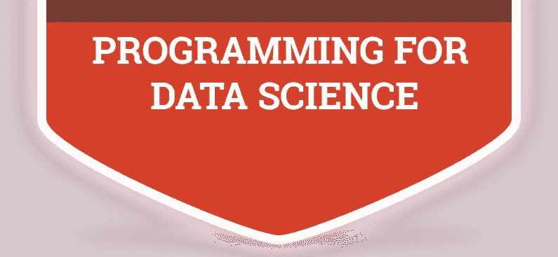

# 每个有抱负的数据科学家都应该知道的 11 项基本编程任务。

> 原文：<https://medium.datadriveninvestor.com/11-basic-programming-tasks-every-aspiring-data-scientist-should-know-7a9e690a75fb?source=collection_archive---------10----------------------->

1.  **将文件读入数据帧**

*   使用不同的分隔符阅读
*   读取部分数据行(作为处理大数据的一种变通方法)
*   预定义数据类型(小型系统的良好资源管理实践)

**2。组合来自多个来源的数据**

*   追加(对于具有相同模式的增量数据更新)
*   用公共列合并单独的数据集(左、右、内和外连接)

**3。数据检查技能(索引、子集化、报告最小-最大值)**

**4。理解每一列中表示的数据，并在需要时转换成适当的数据类型。**

**5。删除行或列**

*   包含冗余信息或没有有用信息的列(用于分析目的)
*   NA 超过 30%的行(删除一个数据点比逼近太多要好)

**6。检查汇总统计数据以了解数据情况，并可能发现异常的数据行为**

**7。检查 NA/缺失值并用**输入

*   中心倾向
*   更好的近似算法(KNN、RF 等)

**8。汇总数据**

*   转换交易数据(1 行/交易)以报告每个用户仅 1 行
*   选择适当的聚合函数，以最好地捕捉数据行为(总和、平均值、最小值-最大值、标准差)

**9。通过组合多个列生成附加功能(例如，avg _ value = total _ sales/no _ of _ items)**

**10。宁滨数据(将连续身体质量指数值转换为肥胖、健康和体重不足标签)**

*注意—这是一种有争议的方法，因为我们正在失去数据的精确性。它对箱的定义很敏感，因此很少有用。

11。数据标准化

*   最小-最大范围缩放
*   z 分数标准化

## 来自 DDI 的相关故事:

 [## 数据科学和软件工程哪个更有前途？

### 大约一个月前，当我坐在咖啡馆里为一个客户开发网站时，我发现了这个女人…

medium.com](https://medium.com/datadriveninvestor/which-is-more-promising-data-science-or-software-engineering-7e425e9ec4f4)  [## 用 7 个步骤解释深度学习

### 和猫一起

medium.com](https://medium.com/datadriveninvestor/deep-learning-explained-in-7-steps-9ae09471721a)