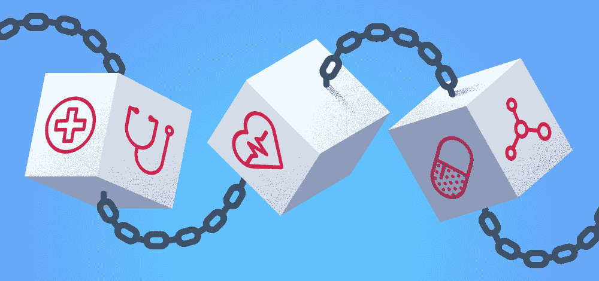
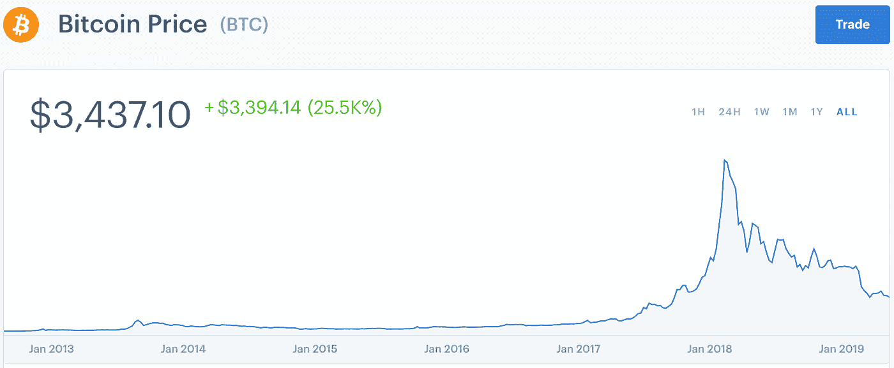

# 医疗保健领域排名第 11 的区块链

> 原文：<https://medium.datadriveninvestor.com/11-blockchain-in-healthcare-fdd7040c672c?source=collection_archive---------14----------------------->

# 什么是区块链？

近年来，区块链已经成为新闻和社交媒体上的热门词汇。在相对较短的时间内，它的理想和潜在能力吸引了许多人，甚至是那些对技术不感兴趣的人。由于技术的复杂性，我不会试图解释它是如何工作的。网上有很多很好的解释，会比我做得更好。

2017 年冬天，当各种“硬币”的价格达到顶峰时，区块链在公众中引发了大规模的歇斯底里。在此期间，区块链技术最受欢迎的实现方式比特币的单价为 1.7 万美元。每个人和他们的祖父母都试图投资于这项令人兴奋的新技术，将这项技术坚定地推向主流领域。然而，大约一年后，区块链的价格泡沫已经完全破灭。截至本文撰写之时，比特币的价格相对较低，约为 3400 美元，预计将进一步下跌。**【1】**

Rise and fall of the price of Bitcoin

那么区块链只是昙花一现吗？与加密货币价格下跌相反，各行各业的公司都在继续投资这项技术。除了支付系统，企业还在引导 R&D 研究如何利用区块链为自己的行业服务。看看企业以太坊联盟网站就证明了这一点。**【2】**

Some of the member companies of the Enterprise Ethereum Alliance

许多在区块链投资的公司都是以金融和技术为基础的。在本帖中，我们将探讨如何通过使用颠覆性技术，将其作为改善医疗保健行业战略的一部分。

# 区块链在医疗保健中的应用

虽然区块链可能无法解决医疗保健行业的所有问题和效率低下的问题，但它确实有潜力极大地改善组织的运营流程。与所有新技术一样，我们将不得不看看这项技术是否能够发挥其全部潜力。以下是一些潜在的使用案例:

## 确保供应链的完整性

销售假药是一个日益严重的问题。随着互联网的兴起，监管和控制药品供应来源变得更加困难。在美国，销售假药每年给企业造成超过 2000 亿美元的损失，并导致超过 75 万人失业。**【3】**除了造成收入和工作岗位的损失，它们还对公共健康构成威胁。

由于区块链的工作方式，它将为药品从生产到消费者手中的整个过程提供充分的透明度。因为所有的交易都在区块链记录，所以很容易发现任何不正当行为。DHL 和埃森哲一直致力于一个位于区块链的项目来解决这个问题。**【4】**

## 打击保险和账单欺诈

保险欺诈是医疗保健行业组织的一大担忧。这是由于过度收费、对未执行的服务收费或伪造病人的医疗条件以证明不必要的治疗是合理的。在美国，据估计医疗保险欺诈每年高达 600 亿美元。**【5】**这导致其他人的医疗费用更加昂贵。

区块链系统可以通过要求提供者和患者输入他们的信息和数据以在区块链上验证、记录和存储来帮助对抗这些类型的欺诈。区块链系统可以通过自动化大多数索赔和支付处理，减少供应商和消费者的管理成本和时间，帮助消除对中间人的需求。

最近，Capital One 宣布与企业区块链应用平台提供商 Gem Health 合作，为此开发一个基于区块链的系统。**【第六期】**

## 管理医疗数据

可以利用区块链系统来确保非常敏感的医疗数据的安全存储和传输。Medicalchain 是一家试图实现这一想法的公司。**【7】**

它是一个平台，医生、医院、实验室、药剂师和保险公司可以请求访问患者记录的许可，以访问病历并与之交互。然而，患者将能够完全控制谁可以查看他们的记录，他们知道多少以及多长时间。由于这项技术的运作方式，每一次互动都是透明的、可审计的和安全的，并且将作为交易记录在区块链上。

这些记录也将比在普通服务器上更安全，因为数据只能通过患者的私钥访问，只有他们拥有私钥。该行业面临的最大挑战之一是如何与各种利益相关者共享适当的数据。区块链允许这样。Medicalchain 的平台将促进数据的即时传输，因为同一个分布式网络的每个成员都可以访问相同的数据，只要他们被授予这样做的权限。

上面的例子只是公司到目前为止在医疗保健行业应用区块链技术的一些用例。由于这项技术仍处于起步阶段，未来肯定会有更多的用例。

但是，如果该行业的相关参与者正确应用，区块链可以作为一种策略来优化当前存在的许多繁重任务和流程，并增强电子健康记录系统的互操作性、安全性和不变性。

伊品，

团队将死

# 参考

1.  Coindesk (2019)。*比特币价格图(BTC) |比特币基地*。[在线]Coinbase.com。地点:【https://www.coinbase.com/price/bitcoin 
2.  j .罗斯(2019)。*成员——企业以太坊联盟*。[在线]企业以太坊联盟。上市地点:[https://entethalliance.org/members/](https://entethalliance.org/members/)
3.  欧文·布莱克斯通(2014 年)。*假药的健康和经济影响*。[在线]公共医学中心(PMC)。可在:[https://www.ncbi.nlm.nih.gov/pmc/articles/PMC4105729/](https://www.ncbi.nlm.nih.gov/pmc/articles/PMC4105729/)
4.  亨德森，J. (2018)。 *DHL 和埃森哲合作区块链制药供应链项目*。[在线]Supplychaindigital.com。可从以下网址获得:[https://www . supplychaindidigital . com/technology/DHL-and-Accenture-working-based-pharma-supply-chain-project](https://www.supplychaindigital.com/technology/dhl-and-accenture-working-blockchain-based-pharma-supply-chain-project)
5.  哥伦比亚广播公司(2009 年)。医疗保险欺诈:600 亿美元的犯罪。[在线]Cbsnews.com。请访问:[https://www . CBS news . com/news/medicare-fraud-a-600 亿-crime-23-10-2009/](https://www.cbsnews.com/news/medicare-fraud-a-60-billion-crime-23-10-2009/)
6.  穆克吉，S. (2016 年)。 *Capital One 试图将区块链引入医疗保健*。[在线]财富。请访问:[http://fortune . com/2016/10/25/capital-one-区块链-医疗保健/](http://fortune.com/2016/10/25/capital-one-blockchain-healthcare/)
7.  Medicalchain (2018)。白皮书|医疗链。[在线]医疗链。可在:[https://medicalchain.com/en/whitepaper/](https://medicalchain.com/en/whitepaper/)